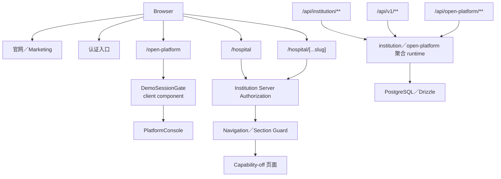
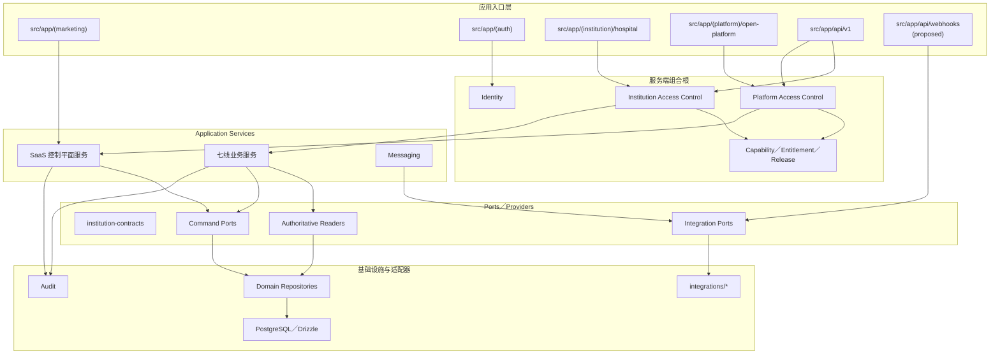

# 智美天工应用架构

- 任务：`V2-ARCH-DOCS-01`
- 日期：`2026-07-28 CST +0800`
- 审计基线：`9bfd7c5889832bd9c364b76338f614b120db9d5a`
- 状态：`current + target`
- 总体架构入口：[`architecture-v2.md`](./architecture-v2.md)
- 本文性质：同一套 V2 架构的应用视图，不构成 Route、API、权限或 runtime 修改授权

## 1. 文档定位

本文定义官网、认证、机构端、平台端、API 和 Webhook 的应用边界，说明页面、服务端授权、Application Service、Repository、Provider 和 Adapter 的依赖方向。

本文不定义数据库表结构，也不授权 Route Group 搬迁、API 版本迁移、平台认证实现或 Capability 开放。

## 2. 事实依据

### 应用入口

- `src/app/hospital/page.tsx`
- `src/app/hospital/[...slug]/page.tsx`
- `src/app/open-platform/page.tsx`
- `src/app/(auth)/**`
- `src/app/(marketing)/**`
- `src/app/api/institution/**`
- `src/app/api/v1/**`
- `src/app/api/open-platform/**`

### 公共契约和授权

- `src/modules/auth/domain/session.ts`
- `src/modules/auth/components/DemoSessionGate.tsx`
- `src/modules/institution-contracts/v1/institution-navigation.ts`
- `src/modules/institution-contracts/v1/institution-routes.ts`
- `src/modules/institution-contracts/v1/institution-capability.ts`
- `src/modules/institution-contracts/v1/institution-capability-registry.ts`
- `src/modules/institution-contracts/v1/institution-source.ts`
- `src/modules/security/server/institution-request-authorization.ts`
- `src/modules/institution/server/institution-server-runtime.ts`

### 架构资料

- [`architecture-v2.md`](./architecture-v2.md)
- [`architecture-v2-module-map.md`](./architecture-v2-module-map.md)
- [`institution-seven-stream-restart-baseline.md`](./institution-seven-stream-restart-baseline.md)
- [`business-architecture.md`](./business-architecture.md)
- `docs/refactor/phase-18-api-route-caller-compatibility.csv`
- `docs/decisions/architecture-v2-decisions.md`

## 3. 当前应用结构



### 3.1 机构端当前状态

`/hospital` 和 `/hospital/[...slug]` 是服务端页面。它们调用 `resolveInstitutionServerAuthorizationV1()`，再执行当前机构导航授权；异常、未知或不可信结果保持 fail-closed。

当前业务页面仍以 Workbench Capability-off 和通用 `InstitutionCapabilityOffPage` 为主。栏目允许访问不代表该栏目已发布真实业务能力。

### 3.2 平台端当前状态

`/open-platform` 当前是一个页面，使用客户端 `DemoSessionGate` 请求 `/api/auth/session`，只检查允许角色后渲染 `PlatformConsole`。

这不是与机构端同等级的服务端平台授权根。正式平台应用仍缺：

- 正式服务端平台 Session 解析；
- 平台角色和 Action Policy；
- 服务端页面／Route Guard；
- 平台对象级授权；
- 与 Entitlement、租户和审计的组合根。

在该缺口关闭前，平台控制台只能视为 Demo／受控预览。

### 3.3 API 当前状态

版本化与非版本化 Route 并存。当前治理证据表明：

- 已有单个 v1 兼容试点；
- 大量旧路由仍需调用方迁移、观测后退役、保持当前或人工决策；
- 不能一次性把全部旧机构 API 搬迁或代理；
- 旧路径仍有未知仓库外调用方风险。

## 4. 目标应用结构



目标仍是一个模块化单体。Route Group 只改变内部组织，不改变公开 URL：

```text
src/app/hospital
→ src/app/(institution)/hospital
→ 公开 URL 仍为 /hospital

src/app/open-platform
→ src/app/(platform)/open-platform
→ 公开 URL 仍为 /open-platform
```

## 5. 应用入口边界

| 应用入口 | 当前路径 | 目标路径 | 访问模型 | 业务边界 |
|---|---|---|---|---|
| 官网 | `src/app/(marketing)` | 保持 | Public | 品牌和产品介绍，不读取机构业务事实 |
| 认证 | `src/app/(auth)`、登录 Route | 保持／归 `identity` | Public → Session | 只负责认证和 Session，不承担七线业务 |
| 机构端 | `src/app/hospital` | `src/app/(institution)/hospital` | 正式服务端机构授权 | 七线页面和机构壳 |
| 平台端 | `src/app/open-platform` | `src/app/(platform)/open-platform` | 目标为正式服务端平台授权 | SaaS 控制平面 |
| 机构 API | `src/app/api/institution/**` 与 v1 并存 | `src/app/api/v1/institution/**` | 机构／对象／动作授权 | 新实现默认 v1 |
| 平台 API | `src/app/api/open-platform/**` | `src/app/api/v1/open-platform/**` | 平台角色／Action Policy | 不能依赖客户端 Gate |
| Webhook | 当前分散或尚未正式落位 | `src/app/api/webhooks/**`（`proposed`） | 签名、重放、事件版本 | 只进入 Adapter／Orchestration，不直写业务事实 |

## 6. 机构端 canonical 应用地图

### 6.1 七个栏目根路径

| 栏目 | Section ID | canonical 根路径 | 产品 Audience |
|---|---|---|---|
| 工作台 | `workbench` | `/hospital` | 四类机构角色 |
| 客户中心 | `customers` | `/hospital/customers` | 四类机构角色 |
| 会话工作台 | `conversations` | `/hospital/conversations` | 四类机构角色 |
| 预约与随访 | `care` | `/hospital/care` | 四类机构角色 |
| 知识库 | `knowledge` | `/hospital/knowledge` | `tenant_admin`、`tenant_operator` |
| 经营分析 | `analytics` | `/hospital/analytics` | `tenant_admin`、`tenant_operator` |
| 管理中心 | `system` | `/hospital/system` | `tenant_admin`、`tenant_operator` |

Audience 只表示产品候选。页面仍必须使用当前 AccessContext、Capability、对象和动作授权。

### 6.2 canonical 路由族

公共 Route Contract 已声明：

- Customers：列表、治疗记录、客户详情；
- Conversations：队列、自动触达、会话详情；
- Care：今日队列、预约、随访、路径及对象详情；
- Knowledge：资料库、检索、问答、任务和对象详情；
- Analytics：总览、消费、项目、机会、报告及对象详情；
- System：概览、机构成员、渠道、映射、数据、AI 使用、隐私、审计及对象详情。

`/hospital/dashboard` 被明确列为不支持路径，不应重新建立第二套首页。

## 7. 页面、授权和业务服务的依赖方向

### 7.1 只读页面

```text
Server Page／Route Handler
→ 正式 Session／Provenance
→ Fresh Active Membership
→ Tenant + Institution Scope
→ Section／Object Authorization
→ Application Service
→ Authoritative Reader／Provider
→ Source Envelope
→ View Model
→ Page State
```

页面不得：

- 从 URL、Query、Header 或 Local Storage 推导机构授权；
- 直接读取其他领域 Repository；
- 直接调用 Provider Adapter；
- 将失败降级为 Mock 成功；
- 根据客户端角色自行计算最终 Capability。

### 7.2 写操作

```text
Route Handler
→ 精确 Payload Parser
→ 正式 Scope／Role／Object／Action Authorization
→ Application Service
→ Business Preconditions／Concurrency
→ Repository Command
→ Audit／Evidence
→ Safe DTO／Stable Error
```

Route Handler 只负责 HTTP 边界、解析、授权入口、服务调用和响应映射，不保存第二套业务逻辑或 Repository 实现。

### 7.3 外部事件

```text
Webhook Route
→ Signature／Replay／Event Version
→ Adapter Parser
→ Connector Orchestration
→ Identity／Object Matching
→ Human Review 或 Domain Command
→ Audit
```

外部 Payload 不能直接成为客户、会话、治疗、任务或消费事实。

## 8. 授权、Audience、Entitlement 和 Capability

应用层必须分别处理以下维度：

| 维度 | 回答的问题 | 不能替代 |
|---|---|---|
| Role Audience | 该角色是否是栏目目标用户 | 服务端授权 |
| Session／Provenance | 当前请求者是谁，来源是否正式 | 成员资格 |
| Membership／Scope | 当前用户是否是当前机构 Fresh Active Member | 对象权限 |
| Section／Object／Action Guard | 是否可访问具体栏目、对象或动作 | 产品发布 |
| Entitlement | 套餐是否包含该能力 | 当前对象授权 |
| Connection Availability | 必需渠道／数据源是否可用 | 数据就绪 |
| Data Readiness | 权威数据是否 ready／empty／stale 等 | 生产放行 |
| Production Release | 是否已 Pilot／Released／Suspended | 动作授权 |
| Capability Decision | 当前上下文显示 `hidden/read_only/operational` | 目标动作重新授权 |

### 8.1 Capability 规则

Capability Registry 只是声明清单，不证明页面、数据或动作已经可用。

Capability Status 的解释维度包括：

- Code Maturity；
- Institution Authorization；
- Connection Availability；
- Data Readiness；
- Production Release。

即使 Decision 为 `operational`，目标 API 或页面仍必须重新授权当前 Scope、Role、Capability、Object 和业务前置条件。

### 8.2 Source Envelope

机构 Reader 的统一状态词为：

```text
ready
empty
partial
stale
unavailable
denied
disabled
```

目标应用处理规则：

- `ready`：按授权展示；
- `empty`：展示真实空态；
- `partial`：分区展示并标明缺口；
- `stale`：最多只读，不触发依赖新鲜数据的写操作；
- `unavailable`：显示低敏不可用状态；
- `denied`：不携带业务数据；
- `disabled`：表示未发布，不降级到 Mock。

## 9. 机构端正式授权链

当前机构端组合根已具备以下方向：

```text
Formal Server Session Cookie
→ Formal Provenance
→ Authoritative Membership Fact Reader
→ Active Institution Anchor
→ Institution Scope Guard
→ Section／Navigation Guard
→ Page
```

关键规则：

1. 客户端没有传入机构授权参数的入口；
2. `demo_session` 不得进入正式机构导航和 Reader；
3. Session 有效不等于成员资格仍有效；
4. 缺运行配置、Cookie、Membership、Anchor、Reference Codec 或策略时 fail-closed；
5. 原始账户、Scope、Role、Evidence 和密钥材料不暴露给页面；
6. 对象和动作授权仍需在具体业务入口完成。

目标物理边界是 `identity + access-control`，但当前实现仍分布在 `auth`、`security` 和 `institution/server`；后续按职责迁移，不整体改名。

## 10. 平台端正式授权缺口

当前 `/open-platform` 的 `DemoSessionGate`：

- 是 Client Component；
- 调用 `/api/auth/session`；
- 检查 `authenticated` 和角色；
- 不符合时客户端跳转；
- 通过后渲染 `PlatformConsole`。

正式平台应用必须新增独立设计，至少覆盖：

- 服务端正式 Session 和 Provenance；
- `platform_admin`、`platform_operator`、`security_auditor` 角色矩阵；
- 租户／机构对象授权；
- 平台 Action Policy；
- Entitlement、审计和低敏错误；
- 页面、API 和深链接的一致 Guard；
- Demo 与正式入口隔离。

该任务属于后续 `V2-02C-PLATFORM-AUTH-ROUTE-PREFLIGHT`，不得混入 MIG-01 数据变更。

## 11. API 版本和兼容策略

### 11.1 目标政策

```text
新机构 API
→ 默认 src/app/api/v1/institution/**

新平台 API
→ 默认 src/app/api/v1/open-platform/**
```

### 11.2 旧路径薄兼容

旧非版本化 Route 只有逐路由进入白名单后才能保留兼容入口。兼容 Route 只允许：

- Re-export 或服务端转发；
- 输入兼容；
- 安全响应映射；
- 兼容观测；
- 明确回退。

兼容 Route 不允许：

- 第二套业务逻辑；
- 独立 Repository；
- 长期 DTO；
- 新业务状态；
- 扩大权限或数据范围；
- 隐式回退到 Mock。

每个例外必须记录：

```text
旧端点
v1 Owner
调用方
兼容原因
测试
观测
回退
删除门禁
```

### 11.3 迁移顺序

1. 逐路由盘点调用方；
2. 分类为保持、薄兼容、客户端迁移、观测后退役或人工阻断；
3. 单路由族试点；
4. 新旧函数引用和响应契约验证；
5. 观测真实调用；
6. 调用方归零后单独授权退役。

## 12. 外部 Adapter 边界

页面和业务 Route 不得直接拥有 HIS、WeCom、AI 或 Webhook Provider 实现。

目标关系：

```text
Page／Route
→ Domain Application Service
→ Application Port
→ Connector Orchestration
→ integrations/* Adapter
→ External Provider
```

- HIS Adapter：协议、鉴权 Lease、超时、重试、映射和 Raw Payload 隔离；
- WeCom Adapter：Token、Recipient、API 和 Webhook 协议；
- AI Adapter：Provider 调用、响应解析和低敏化；
- Messaging：消息审批、Delivery 和结果；
- 业务模块：业务规则、人工确认和事实所有权。

## 13. 当前与目标差距

| 领域 | 当前 | 目标 | 风险 | 后续任务 |
|---|---|---|---|---|
| 机构 Route | `/hospital` + Catch-all | `(institution)/hospital`，URL 不变 | 搬迁时改变行为或授权 | V2-02C 预检后小切片 |
| 平台 Route | 单页 + Client Demo Gate | `(platform)/open-platform` + Server Guard | 客户端检查被误当正式权限 | 平台授权独立切片 |
| 机构页面 | Capability-off 为主 | 每线 canonical 页面接正式 Provider | 空壳被误报上线 | 按 MIG 队列垂直实施 |
| 平台页面 | `PlatformConsole` 聚合 | 控制平面模块化页面 | 巨型页面继续扩张 | 按平台领域垂直拆分 |
| API | v1／非 v1 并存 | 新实现默认 v1 | 长期两套业务逻辑 | 逐路由白名单 |
| Capability | 声明和候选 Reader 较多 | 权威服务端评估和发布证据 | Registry 被误当授权 | Capability Runtime 独立验收 |
| External | 旧聚合模块内实现 | Port-first + `integrations/*` | 直接搬迁旧语义 | 各业务线后置迁移 |
| Page State | 已有统一契约基础 | 全部 Reader 使用统一 Envelope | 局部自定义错误导致泄露 | Reader／Parser 契约收口 |

## 14. 实施顺序

```text
业务／应用架构文档
→ 数据／软件／部署架构
→ 开发架构与根 README
→ MIG-01 完整关闭预检
→ 平台正式授权／Route Group／API 白名单预检
→ 最小 Architecture CI
→ MIG-01 数据链
→ 七线 Reader／API／页面垂直切片
→ 外部 Adapter
→ Capability 发布
→ 旧入口观测和退出
```

Route Group、平台授权、API 兼容和 MIG-01 数据变更必须拆为不同 PR。

## 15. 已确认决策

- 公开 URL `/hospital` 和 `/open-platform` 保持；
- 机构端使用服务端正式授权根；
- 平台客户端 Demo Gate 不等于正式授权；
- canonical Route 和 Capability Registry 由公共契约声明；
- Role Audience 不等于授权；
- Capability 不等于对象／动作权限；
- 新机构 API 默认 v1；
- 旧路径按逐路由薄兼容；
- Route Handler 不拥有 Repository 具体实现；
- 外部 Provider 通过 Port／Adapter 隔离；
- Workbench 最后消费已发布 Provider。

## 16. 待确认决策

| 决策 | 当前建议 | 影响 |
|---|---|---|
| 平台正式授权是否为平台页面和 API 的统一硬门禁 | 是 | 完成前平台仅为 Demo／受控预览 |
| Route Group 实施切片与回退方式 | 先完成独立预检，按入口小切片迁移并保留可验证回退 | 防止 URL、授权链和 API 行为同时变化 |
| 旧 API 的最长兼容期 | 按路由族决定 | 需要调用观测，不设置全局强退日期 |
| Webhook 是否统一进入一个 Route Group | 是，但按 Provider 分签名和事件版本 | 待首个获批 runtime 再创建 |
| Capability 权威 Reader 的首次 Runtime 范围 | 先管理中心诊断目标 | 需独立白名单和测试 |
| 平台角色是否在首版同时开放三类 | 建议先冻结矩阵，不默认全部开放 | 避免客户端角色存在被误认为已授权 |

## 17. 禁止范围

本文不授权：

- 移动 `src/app/hospital` 或 `src/app/open-platform`；
- 新增、删除或迁移 API Route；
- 修改 Session、Guard、Capability 或 Entitlement 行为；
- 修改 Runtime、Schema、Migration、UI 或配置；
- 开放七线 Capability；
- 创建 `src/integrations/*` 空目录；
- 连接数据库或外部系统；
- 把目标 Route Group 写成已实施；
- 把平台 Demo Gate 写成正式授权；
- 一次性代理或搬迁全部旧 API。
