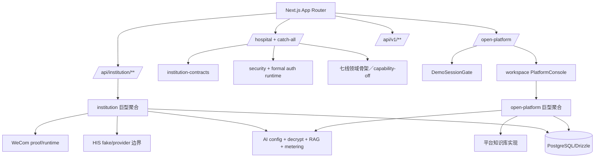

# 智美天工架构 V2 代码证据审计

- 日期：`2026-07-28 CST +0800`
- 审计基线：`9fa85dd1d85ddd3cc81292f8f9d29bde176b1e15`
- 对应基线 PR：`#781`
- 状态：`proposed_for_review`
- 执行性质：`docs-only`
- runtime、Schema、Migration、Seed、package、lock 修改：`0`

## 1. 本文定位

本文是 `docs/architecture/architecture-v2.md` 的**代码证据伴随审计**，不是第二套竞争性架构源。

权威关系固定为：

1. 当前 `main` 的代码、测试、Schema、Migration 和配置；
2. `docs/architecture/architecture-v2.md`、已接受 ADR 和模块映射；
3. 本文对前两者的一致性核验、缺口记录和修订建议；
4. 七线技术计划、已合并 PR 和历史开发记录。

本文中标记为“已确认”的内容可直接作为后续预检约束；标记为“建议决策”的内容在用户确认并形成 ADR 前，不构成 runtime、Schema、Migration 或目录迁移授权。

## 2. 审计方法与范围

本次实际检查了：

- 应用入口：`src/app/**`；
- 机构正式授权链：`src/modules/auth/**`、`src/modules/security/**`；
- 七线公共契约：`src/modules/institution-contracts/v1/**`；
- 七条新业务线及旧 `institution` 聚合模块；
- 平台控制台、`open-platform` 和 `workspace`；
- `src/server/db/schema.ts` 与 `drizzle/**` 的职责边界；
- HIS、企业微信、AI、知识库、消息和审计的现有实现；
- `package.json`、`scripts/**`、生产 Migration runbook；
- PR `#732`—`#742` 的认证／授权底座记录；
- PR `#743`—`#780` 的目录、API、模块和安全治理记录；
- PR `#781` 的架构 V2 基线、模块映射和 20 条 ADR。

没有连接数据库、HIS、企业微信、模型厂商、测试服务器或生产环境；没有读取 `.env.local`、`DATABASE_URL` 或任何凭证。

## 3. 总体结论

### 3.1 当前真正采用的架构

智美天工当前是一个基于 Next.js App Router、React、TypeScript、PostgreSQL 和 Drizzle 的**模块化单体**，但处于“新领域边界与旧聚合实现并存”的过渡期。

当前可分为三类应用表面：

1. 官网与认证入口；
2. 机构端 `/hospital/**`；
3. 平台端 `/open-platform`。

当前可分为四类内部代码：

1. 已形成明确边界的公共认证、Security、Audit、Contracts；
2. 七条新业务线的领域模型、投影、测试和 capability-off 壳；
3. 仍承载大量真实业务、API、Repository 和外部接入的旧 `institution`／`open-platform` 聚合模块；
4. 尚未落位的 `src/integrations/*` 目标边界。

因此，当前不是“无架构”，也不是“目标架构已落地”，而是：

```text
安全与契约底座较成熟
+ 七线领域骨架已建立
+ 旧聚合 runtime 仍占主体
+ 数据迁移与正式发布尚未完成
```

### 3.2 建议目标架构

继续采用模块化单体，不拆微服务。目标应明确为“两平面、四层、一个数据库治理序列”：

- **SaaS 控制平面**：身份、租户、机构开通、套餐权益、平台安全、品牌、AI／连接器配置；
- **机构业务数据平面**：Customers、Care、Conversations、Knowledge、Analytics、Workbench、Institution System；
- **应用层**：营销、认证、机构 Route Group、平台 Route Group、版本化 API、Webhook；
- **基础设施层**：DB、Jobs、Storage、Audit、Security、Messaging、Observability、Integrations；
- **数据库治理序列**：MIG-01 完整关闭后，MIG-02 → MIG-03 → MIG-04 → MIG-05 → MIG-06。

### 3.3 当前最重要的架构缺口

最重要的缺口不是目录名称，而是以下五项：

1. MIG-01 尚未完成，真实机构级数据归属仍未达到统一 enforce；
2. 平台端仍由客户端 `DemoSessionGate` 保护，尚无与机构端同等级的正式平台服务端授权根；
3. 七条新业务线多数没有形成“Repository／API／页面／真实数据／发布”的垂直闭环；
4. HIS、WeCom、AI 和知识库适配逻辑仍大量位于旧聚合模块，`src/integrations` 当前为空；
5. 仓库内尚缺自动执行的架构边界、CI、部署和可观测性门禁证据。

## 4. 产品角色与核心业务闭环

### 4.1 当前角色

机构端已冻结四类角色：

- `tenant_admin`；
- `tenant_operator`；
- `consultant`；
- `customer_service`。

平台与安全侧还存在：

- `platform_admin`；
- `platform_operator`；
- `security_auditor`。

当前七个机构栏目是：

```text
工作台
客户中心
会话工作台
预约与随访
知识库
经营分析
管理中心
```

其中知识库、经营分析和管理中心仅面向机构管理员／运营角色候选；静态 audience 不是授权，最终仍依赖服务端 capability、机构和对象授权。

### 4.2 目标业务闭环

目标闭环应固定为：

```text
平台创建租户／机构并配置权益
→ 机构成员通过正式会话进入当前机构
→ 接入 HIS／机构数据形成受控客户事实
→ 客户档案、治疗／消费／预约事实归一
→ Care 生成并管理人工任务／路径
→ Conversations 承载会话、分配、身份复核和处置
→ AI 仅基于受控事实／摘要生成建议或草稿
→ 人工确认客户可见内容和业务动作
→ Messaging 经渠道 adapter 执行
→ 结果、证据、审计和时间线回流
→ Analytics 形成统一 snapshot 和报告
→ Workbench 聚合正式 provider
```

该闭环的事实源、AI 建议、人工确认和渠道执行必须分层，不能由一个页面、一个 Route 或一个巨型 Service 同时拥有。

## 5. 当前与目标架构图

### 5.1 当前结构



### 5.2 目标结构

```mermaid
flowchart TB
  subgraph Experience[应用入口]
    MKT[(marketing)]
    AUTH[(auth)]
    INSTAPP[(institution)/hospital]
    PLATAPP[(platform)/open-platform]
    APIV1[api/v1]
    WEBHOOKS[api/webhooks]
  end

  subgraph Control[SaaS 控制平面]
    IDENTITY[identity]
    TENANCY[tenancy]
    ACCESS[access-control]
    ENT[entitlements]
    PLATSYS[platform-system]
    BRAND[branding]
  end

  subgraph Institution[机构业务数据平面]
    CUSTOMERS[customers]
    CARE[care]
    CONV[conversations]
    KNOWLEDGE[knowledge]
    ANALYTICS[analytics]
    SYSTEM[institution-system]
    WB[workbench]
  end

  subgraph Foundation[公共基础设施]
    SECURITY[security]
    AUDIT[audit]
    CONTRACTS[institution-contracts]
    MSG[messaging]
    JOBS[jobs]
    OBS[observability]
    DB[(PostgreSQL/Drizzle)]
  end

  subgraph Adapters[外部适配器]
    HISADP[integrations/his]
    WECOMADP[integrations/wecom]
    AIADP[integrations/ai]
    EXCELADP[integrations/excel]
    WHADP[integrations/webhooks]
  end

  INSTAPP --> Institution
  PLATAPP --> Control
  APIV1 --> Control
  APIV1 --> Institution
  WEBHOOKS --> Adapters

  Control --> Foundation
  Institution --> Foundation
  Institution --> Adapters
  MSG --> WECOMADP
  KNOWLEDGE --> AIADP
  ANALYTICS --> AIADP
  Adapters --> Foundation

  CUSTOMERS --> CARE
  CUSTOMERS --> CONV
  CUSTOMERS --> ANALYTICS
  CARE --> WB
  CONV --> WB
  KNOWLEDGE --> WB
  ANALYTICS --> WB
  SYSTEM --> WB
```

“Evidence”当前不建议立即创建空模块。先在 `institution-contracts` 定义证据引用契约，由各业务域保存自身 evidence reference，并由 `audit` 保存关键动作审计；达到多个独立运行时实现后再决定是否升级为独立模块。

## 6. 重要架构问题逐项审计

| 问题 | 当前实际状态 | 建议目标状态 | 差距／风险 | 后续改造 | 顺序 |
|---|---|---|---|---|---:|
| 架构风格 | Next.js 模块化单体；新旧边界并存 | 继续模块化单体，先清晰边界，后按负载拆服务 | 过早微服务会放大事务、权限和运维复杂度 | 不拆微服务 | 保持 |
| 机构正式认证 | 正式 cookie、provenance、membership、anchor、navigation guard 已有较强实现 | 统一为 `identity + access-control` 服务端 composition root | 代码仍分布在 auth、security、institution runtime | 按职责垂直迁移，保持行为不变 | MIG-01 前后并行预检 |
| 平台正式认证 | `/open-platform` 使用客户端 `DemoSessionGate`，只允许 `platform_admin` | 平台端使用独立的正式服务端 session、平台角色和 action policy | 平台控制面可见性与正式授权强度不对称；`platform_operator/security_auditor` 未形成页面授权矩阵 | 独立安全设计与 runtime 切片 | 立即设计，独立实施 |
| 多租户／机构归属 | AccessContext 与 membership provider 已存在；Schema 中仍有 nullable `institutionId` 和混合历史表 | 所有机构事实都可由 `tenantId + institutionId` 强制归属，并由当前成员上下文获取 | MIG-01 未关闭时，真实 reader 可能读取 tenant-only、默认机构或未回填事实 | A2、双写、B、C；逐表 reader/writer 清单 | 最高优先级 |
| 七线业务 | 领域、契约和测试较多；正式发布 0/7；canonical 页面大多 capability-off | 每线独立完成领域→Repository→API→页面→真实数据→审计→发布 | “代码存在／测试通过”容易被误认为上线 | 垂直切片；按 MIG 队列开放 | MIG-01 后 |
| Customers／Care | MIG-02 为共享数据单元 | Migration 共享，但 Customers 和 Care 各自拥有表语义、Repository 和 Application Service | 共享 Migration 可能被误用为共享 Repository | 精确 schema ownership 与版本化公共引用 | MIG-02 |
| Knowledge | 当前已有旧 runtime 表、mock/seed/demo source、可覆盖索引和新领域模型 | MIG-03 提供不可变版本、publication、job/lease、正式 current reader | 旧表看似“已有数据”但不能自动视为 MIG-03 完成；mock embedding 默认值存在 | 对账旧表、明确保留／迁移／隔离；MIG-03 后才开 Reader | MIG-03 |
| Conversations | 状态机和契约较完整，无正式持久化/API/UI | MIG-04 后形成会话根、消息、分配、风险、身份复核和处置 | 不能直接从 WeCom payload 构造业务真相 | MIG-04 + CONV-03/04 | MIG-04 |
| Analytics | 领域计算存在；无正式 snapshot provider 与五页闭环 | MIG-05 事实／有效链／聚合；MIG-06 snapshot/API/provider/五页/报告 | 页面若绕过 snapshot 读事实，会产生跨页口径漂移 | 严格双门禁 | MIG-05/06 |
| Workbench | 已有投影和 capability-off 入口 | 只聚合已发布 provider，允许局部 stale/unavailable | 过早接线会复制业务事实或重新引入 mock | 最后接线 | 最后 |
| API 版本 | 版本化与非版本化并存；仅一个严格兼容试点；历史审计显示大部分需要调用方迁移或人工判断 | 新实现默认 v1；旧入口按 route family 分为保留、薄兼容、调用方迁移、观测后退役、人工阻断 | 不能把 82 个机构 API 文件一次性代理或搬迁 | V2-02 逐路由白名单 | MIG-01 前可审计 |
| HIS | Repository、凭证、测试服务和 fake provider 位于旧 institution 模块；部分 API 仍以 tenant 命名 | 业务域只消费结构化事实 port；provider、凭证 lease 和网络 adapter 进入 `integrations/his` | 直接搬文件会把旧 tenant-only 语义带入新目录 | 先定义 port，再替换 adapter；复核机构 scope | Customers 前 |
| WeCom／消息 | 已有 fail-closed、opaque handle、lease、proof、频控和人工确认边界；实现仍在 institution | `messaging` 拥有 delivery；`integrations/wecom` 只负责 provider adapter | 安全设计较好，但目录和所有权仍混合 | 保留安全协议，port-first 迁移 | Conversations/Care 后 |
| AI | 单个 institution service 同时做配置读取、解密、敏感检查、知识检索、Prompt、provider 调用、计量和记录 | 业务域拥有使用场景；AI adapter 拥有 provider；平台控制面拥有配置；metering/audit 独立 | 高耦合且跨越 institution/open-platform/knowledge/security | 分解端口和投影，不先移动文件 | MIG-03/06 后 |
| Migration 运维 | 有 guarded `pnpm db:migrate`、allowlist、双人复核、备份／停止条件 runbook | 继续 forward-only、可审查 SQL、升级和恢复演练 | 规则完善，但 MIG-01 大链尚缺逐表执行包 | V2-02B 形成可执行矩阵 | 立即 |
| CI／部署／监控 | 有本地 typecheck/lint/test/build 和测试服部署脚本；当前仓库搜索未找到 `.github/workflows` | CI 自动执行质量、架构、Migration 和安全门禁；部署具备 health、rollback、metrics、trace | 可能存在仓库外 CI，但当前 repo 内无可审计证据 | 先确认现状，再补最小 CI 与 observability contract | MIG-01 实施前 |

## 7. 数据、版本、证据与审计目标

### 7.1 权威事实目录

每类事实必须只有一个领域所有者：

| 事实 | 所有者 | 其他模块允许方式 |
|---|---|---|
| 用户、正式会话 | `identity` | opaque session/provenance |
| 租户、机构、成员关系 | `tenancy` + `access-control` | 当前成员双键上下文 |
| 客户稳定引用、客户主档 | `customers` | `CustomerReferenceV1` 等版本化契约 |
| 预约、随访任务、路径、结果 | `care` | provider／timeline contribution |
| 会话、消息、分配、身份复核 | `conversations` | provider／disposition contract |
| 知识 item/version/publication/job | `knowledge` | current reader／citation reference |
| 消费事实、有效链、聚合 | `analytics`（MIG-05） | facts provider |
| snapshot、报告版本 | `analytics`（MIG-06） | immutable snapshot/report provider |
| 渠道安全状态 | `institution-system`（MIG-06） | control-plane status provider |
| 投递和渠道结果 | `messaging` | delivery outcome contract |
| 审计事件 | `audit` | append-only record/query |

共享 Migration 只表示数据库变更必须原子编排，不表示共享 Repository、共享 DTO 或跨域内部表读取。

### 7.2 Reader 统一契约

`InstitutionSourceEnvelopeV1` 已具备 `ready/empty/partial/stale/unavailable/denied/disabled`、scope、freshness、partition 和 failure code，是正确基础。

仍需补齐：

- 对不可信 payload 的统一 parser；
- readiness 与 `data/failureCode/freshness` 的交叉不变量；
- `sourceSystem`、`sourceObjectRef`、`sourceVersion`；
- evidence reference；
- source timestamp 与 ingest timestamp 区分；
- stale 数据是否允许展示、是否允许触发写操作；
- 每个 provider 的权限和字段白名单。

建议先建立 `InstitutionAuthorityReferenceV1`／`InstitutionEvidenceReferenceV1` 契约族，不立即创建新的顶层 Evidence 模块。

### 7.3 审计与证据

审计记录和证据引用必须区分：

- **审计**：谁在何时对什么对象执行何动作，结果和低敏原因；
- **证据**：某个事实、AI 输出或人工决策依据的来源对象、版本和摘要；
- **业务事实**：客户、任务、会话、消费等当前权威状态；
- **技术日志**：用于故障排查，不等于业务审计。

禁止把完整病历、完整会话、Provider 原始响应、凭证、URL 或自由 Prompt 复制到通用审计表。

## 8. AI 架构与人工确认

### 8.1 AI 可读取内容

默认允许：

- 已授权机构范围内的结构化客户事实；
- 字段白名单后的治疗、消费、预约和随访摘要；
- Knowledge 正式 publication/current reader 返回的受控片段；
- source/version/evidence reference；
- 低敏聚合指标和已冻结 Analytics snapshot。

默认禁止：

- 完整病历、处方、检查／影像／病理原文；
- 未脱敏咨询或会话全文；
- 身份证、银行卡、合同、凭证；
- `.env`、API key、数据库连接串；
- 未完成 MIG/Reader 门禁的 mock、seed、demo 或 tenant-only 数据；
- 未经允许跨机构、跨租户拼接的数据。

### 8.2 AI 可输出内容

AI 输出只能是：

- 建议；
- 草稿；
- 推断标签候选；
- 检索回答和引用；
- 运营机会提案；
- 基于冻结 snapshot 的报告草稿。

AI 不得直接成为客户、治疗、消费、权限、任务终态或投递结果的事实来源。

### 8.3 必须人工确认

以下结果必须人工确认：

- AI 推断标签；
- 客户可见消息；
- 随访／营销路径创建或变更；
- 客户身份匹配；
- 责任归属变更；
- 渠道真实发送；
- 基于 AI 的经营建议归档为正式报告；
- 任何可能影响客户权益、医疗决策或外部系统状态的动作。

### 8.4 当前实现差距

现有 `institution-ai-call-service` 已包含敏感输入拒绝、低敏 metadata、知识来源摘要和计量，但仍同时依赖：

- institution 业务领域；
- open-platform knowledge repository；
- security secret decryption；
- provider config；
- RAG prompt 构造；
- usage/metering persistence。

目标调用关系应改为：

```text
业务 application service
→ 场景级 AI port
→ redaction／policy
→ integrations/ai adapter
→ usage／metering／audit
→ evidence-bound result
→ 人工确认
```

该改造应先拆端口和职责，再移动目录，不能先把现有大 Service 原样搬入 `integrations/ai`。

## 9. 外部系统隔离目标

统一外部接入模型：

```text
业务事实 owner
→ application port
→ connector orchestration
→ provider adapter
→ 外部系统
```

### HIS

- `customers/care/analytics` 只读取结构化权威事实；
- `integrations/his` 负责协议、鉴权 lease、超时、重试、映射和原始 payload 隔离；
- `institution-system` 管理连接配置和健康状态；
- 完整病历和原始医疗文书不进入通用 AI 上下文。

### 企业微信

- `messaging` 拥有消息草稿、审批、Delivery 和结果；
- `conversations` 拥有会话业务事实；
- `institution-system` 拥有连接状态和安全开关；
- `integrations/wecom` 拥有 token、recipient、API 和 webhook adapter；
- 现有 opaque handle、lease、fail-closed、proof 和频控设计应保留。

### AI 厂商

- 平台端拥有模型目录、租户可用性、额度和 provider 配置；
- 业务模块不能读取 API key 或 baseUrl；
- adapter 不拥有客户画像、随访、报告等业务规则；
- provider 原始响应必须在 adapter 边界解析、校验和低敏化。

### Excel／Webhook

仅在出现首个获批 runtime 时创建目录；Excel 负责导入批次、字段映射、错误行和幂等，Webhook 负责签名、重放防护、事件版本和投递审计。

## 10. PR #781 独立核验

### 10.1 已确认一致的结论

以下结论与当前代码、Schema、测试和历史 PR 一致：

1. 继续采用模块化单体；
2. 禁止一次性大搬迁；
3. `institution` 和 `open-platform` 应停止继续聚合新业务；
4. Security 与 Access Control 必须按职责拆分；
5. Route Group 迁移不得改变公开 URL；
6. 新机构 API 默认 v1，旧路径按逐路由薄兼容处理；
7. MIG-01 必须完整完成 A1/A2/双写/B/C；
8. MIG-02 是 Customers／Care 共享迁移；
9. Knowledge Reader 等待 MIG-03；
10. MIG-04 属于 Conversations；
11. MIG-05 只交付 Analytics 事实／有效链／确定性聚合；
12. MIG-06 承载 Analytics snapshot/report 和 System 渠道安全状态；
13. Workbench 最后接线；
14. 外部适配器最终进入 `src/integrations/*`；
15. capability 状态不能替代服务端授权。

### 10.2 不完整但不构成推翻的部分

PR #781 仍需后续补充：

1. 平台端正式服务端认证／授权目标未被列为独立阻断；
2. “两平面”职责没有明确展开，平台控制面与机构数据平面仍可能继续交叉；
3. 共享 Migration 与各域 Repository 所有权需要逐表落地；
4. API 兼容政策需要当前调用方的逐路由清单，而不是仅有目录级规则；
5. `InstitutionSourceEnvelopeV1` 只有 wire shape，缺统一 parser 和交叉不变量；
6. AI 的场景、provider、metering、evidence 和人工确认职责需要显式拆分；
7. Integration 的 port-first 迁移顺序未具体化；
8. CI、Architecture Test、Observability 和正式部署授权模型尚未成为 V2 的明确门禁；
9. 目录目标与物理完成度没有单独量化。

### 10.3 未发现需要立即推翻的核心结论

本次没有发现应当推翻模块化单体、七线业务边界或 MIG 主序列的证据。修订应采用新增 ADR 或后续预检文档，不应在未确认时重写 PR #781 的已接受结论。

## 11. 目录重构评价

### 11.1 是否符合目标架构

**治理方式符合，物理落位尚未完成。**

符合之处：

- 已建立文件清单、依赖图、风险分级和写入冻结规则；
- 已采用小步、单一所有者、可回退的迁移；
- 保留稳定脚本和 API 兼容入口；
- 没有为外观一致而批量搬运高风险 runtime。

尚未完成之处：

- 机构端旧聚合模块仍有 323 个文件；
- 开放平台旧聚合模块仍有 186 个文件；
- 七条新线多数仍是领域／契约／测试骨架；
- `src/integrations` 当前为 0 文件；
- `workspace` 仍承载平台巨型控制台；
- `auth/security` 尚未物理落位到 identity/access-control；
- API 版本化仍处于单试点和治理阶段；
- 正式业务源码累计只完成 3 个低风险移动试点。

### 11.2 目录迁移规则

后续每次目录迁移必须同时满足：

1. 唯一目标所有者已冻结；
2. 对应垂直业务切片正在实施；
3. import、export、API 和行为可证明不变，或有明确契约版本；
4. 数据／权限／外部调用不因移动而扩张；
5. 调用方和测试白名单完整；
6. 有单独回退；
7. 旧路径退出条件可观测。

禁止创建大量空目录，禁止把旧巨型模块原样改名，禁止在同一 PR 同时执行目录移动、Schema 变更和 capability-on。

## 12. 开发、测试、部署和运维目标

### 12.1 开发门禁

建议新增自动化 Architecture Tests：

- `institution`、`open-platform` 不得新增未授权业务文件；
- 业务模块不得直接 import `src/integrations/*` 的实现，只能依赖 port；
- 业务模块不得直接读取 provider secret／baseUrl；
- API Route 不得包含 Repository 具体实现；
- 跨业务域只能依赖 `institution-contracts` 或显式 provider；
- 新非版本化 Route 默认失败；
- capability-on 必须绑定发布证据。

### 12.2 测试分层

- 模块内：领域、Application Service、Repository contract；
- 根 `tests/contract`：跨线契约和 API 兼容；
- 根 `tests/security`：租户／机构／对象／角色矩阵；
- 根 `tests/integration`：数据库升级、Repository 和多模块读取；
- 根 `tests/e2e`：七条正式业务闭环；
- 外部 adapter：使用 contract test 和受控 fake，不以 mock 成功代表真实接入完成。

### 12.3 Migration 与回滚

保留当前生产 runbook 的原则：

- guarded `pnpm db:migrate`；
- allowlist；
- 双人复核；
- 备份／恢复点；
- lock/statement timeout；
- forward-fix 优先；
- 禁止原地修改已执行 SQL；
- Migration 成功不等于 capability 可发布。

每个 MIG 还必须提供：空库、升级库、回填、追赶、冲突、回退／恢复、性能和 postcheck 证据。

### 12.4 CI／CD 与监控

当前仓库内未检索到 `.github/workflows`；这只说明仓库内缺可审计工作流证据，不排除外部 CI。

建议在执行 MIG-01 前确认并补齐：

- PR：typecheck、lint、目标测试、build、diff-check、架构边界检查；
- Schema PR：journal/SQL 对账、升级／回退测试、锁风险报告；
- 部署：artifact SHA、Migration 状态、health/readiness、smoke、rollback；
- 监控：结构化日志、request/trace ID、错误率、DB latency、job backlog、provider latency、delivery outcome；
- 安全：secret 扫描、依赖风险、权限矩阵回归、真实发送开关检查。

## 13. 风险分层与实施顺序

### 13.1 低风险阶段

- docs／ADR／所有权清单；
- Route Group URL 等价证明；
- API route-family 调用方清单；
- port／contract 定义；
- import boundary 和 architecture test；
- 纯重命名且行为不变的小试点。

### 13.2 数据风险阶段

- MIG-01A2；
- 全部 writer 双写；
- MIG-01B 回填和追赶；
- MIG-01C enforce；
- MIG-02～MIG-06；
- 旧表与新表对账、唯一键、外键、数据版本和回滚。

### 13.3 运行时风险阶段

- 平台正式认证；
- Access Control composition root；
- 真实 Reader/API 页面接线；
- 外部 adapter 和 worker；
- AI provider 调用；
- 真实消息渠道；
- capability-on；
- 旧 API／旧模块退出。

### 13.4 推荐顺序

```text
本次代码证据审计
→ V2-02B MIG-01 完整关闭预检
→ V2-02C 平台正式认证／Route Group／API 路由族预检
→ 最小 Architecture CI 门禁
→ MIG-01A2／双写／B／C 独立数据 PR
→ Customers 真实只读垂直切片
→ MIG-02 + Care
→ MIG-03 + Knowledge
→ MIG-04 + Conversations
→ MIG-05／MIG-06 + Analytics／System
→ Workbench
→ 外部接入正式发布和旧实现退出
```

## 14. 立即修正与后置事项

### 14.1 立即处理

1. 形成 MIG-01 逐表 Reader／Writer／约束／回填清单；
2. 将平台正式认证列为平台控制面发布硬门禁；
3. 对 82 个机构 API 区域文件建立逐路由兼容分类；
4. 建立 Authority／Evidence reference 契约提案；
5. 确认仓库内外 CI 现状并引入最小 Architecture Tests；
6. 冻结每个 MIG 的表级领域所有者，特别是 MIG-02 和 MIG-06。

### 14.2 可以后置

- 全仓物理目录统一；
- 大规模 API 退役；
- 独立 Evidence 模块；
- 微服务拆分；
- 真实 HIS／WeCom／AI provider；
- 完整 E2E 和生产观测平台；
- Workbench 全量聚合；
- 历史 mock／demo 的最终删除。

## 15. 建议下一阶段

下一阶段建议为：

```text
V2-02B-MIG01-CLOSURE-PREFLIGHT
MIG-01 完整关闭与真实 Reader 解锁前预检
```

原因：

- MIG-01 是 Customers、System 及其他机构真实 Reader 的共同前置；
- 它阻断后续 MIG-02～MIG-06 的可信数据范围；
- 当前 Schema 已显示 nullable institution 和历史混合形态；
- 先做 Route Group 或目录搬迁不会解决真实业务无法发布的问题；
- 该任务可先 docs-only 完成，不需要连接数据库。

该阶段应输出：

- 全部机构事实表清单；
- A1/A2/BASE-02/B/C 状态；
- 所有 writer 和 reader；
- 双写、回填、追赶、冲突和 enforce 规则；
- 空库／升级库／回退测试计划；
- 每条七线 Reader 的解锁矩阵；
- 后续独立 runtime／Migration PR 白名单。

随后执行 `V2-02C-PLATFORM-AUTH-ROUTE-PREFLIGHT`，处理平台正式认证、Route Group 和 API 路由族，不与 MIG-01 数据变更混在同一 PR。

## 16. 尚待用户决策

| 决策 | 建议 | 影响 |
|---|---|---|
| 平台正式认证是否作为所有平台 runtime 发布硬门禁 | 是 | 在完成前平台只保留 demo／受控预览，不声明正式上线 |
| `/open-platform` 是否保留为公开 URL | 保留，内部改 Route Group | 降低客户端、文档和回退成本 |
| Evidence 是否立即建独立模块 | 否，先建 contracts + audit 引用 | 避免空模块和第二套事实库 |
| 新机构 API 是否强制 v1 | 是；旧端点仅逐路由薄兼容 | 避免继续扩大双路径 |
| 是否在 MIG-01 前引入仓库内 CI | 是，至少引入 Architecture／quality 门禁 | 降低高风险数据变更失控概率 |
| 是否允许七线在 MIG-01 前继续做纯领域／契约 | 允许；禁止真实 Reader 和 capability-on | 保持开发并行但不伪装完成度 |

## 17. 本轮边界与验证

本轮只新增本文并更新下一任务入口：

- 未修改 `src/**`；
- 未修改 `drizzle/**`；
- 未修改 API、UI、Schema、Migration、Seed；
- 未修改 `package.json`、lock 或构建配置；
- 未执行数据库、部署或外部调用；
- 未读取环境变量或凭证；
- 不自动 Ready；
- 不自动合并。

本轮结论来自静态代码、Schema、测试、文档和 Git／PR 历史证据；远端测试服、生产环境和外部 CI 的实际状态仍需单独授权核验。
