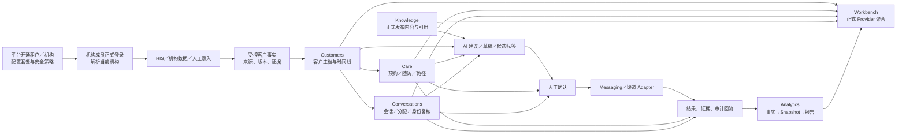
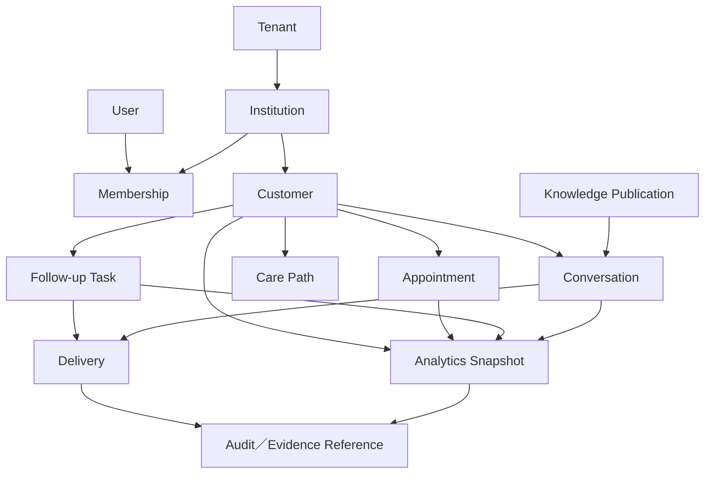

# 智美天工业务架构

- 任务：`V2-ARCH-DOCS-01`
- 日期：`2026-07-28 CST +0800`
- 审计基线：`9bfd7c5889832bd9c364b76338f614b120db9d5a`
- 状态：`current + target`
- 总体架构入口：[`architecture-v2.md`](./architecture-v2.md)
- 本文性质：同一套 V2 架构的业务视图，不构成 runtime 或数据变更授权

## 1. 文档定位

本文回答智美天工服务谁、解决什么问题、平台端与机构端如何分工、七条业务线如何组成完整价值流，以及什么条件才算正式发布。

本文不重新定义软件目录、表结构或 API 细节。模块所有权、Migration 顺序和写入政策继续以总体架构、模块映射和已接受 ADR 为准。

## 2. 事实依据

### 当前代码与契约

- `src/modules/auth/domain/session.ts`
- `src/modules/institution-contracts/v1/institution-navigation.ts`
- `src/modules/institution-contracts/v1/institution-routes.ts`
- `src/modules/institution-contracts/v1/institution-capability.ts`
- `src/modules/institution-contracts/v1/institution-capability-registry.ts`
- `src/app/hospital/page.tsx`
- `src/app/hospital/[...slug]/page.tsx`
- `src/app/open-platform/page.tsx`
- `src/modules/security/server/institution-request-authorization.ts`

### 已接受架构和计划

- [`architecture-v2.md`](./architecture-v2.md)
- [`architecture-v2-module-map.md`](./architecture-v2-module-map.md)
- [`institution-seven-stream-restart-baseline.md`](./institution-seven-stream-restart-baseline.md)
- [`architecture-v2-evidence-audit-20260728.md`](./architecture-v2-evidence-audit-20260728.md)
- `docs/superpowers/plans/2026-07-17-institution-seven-stream-development-plan.md`
- `docs/decisions/architecture-v2-decisions.md`

## 3. 产品定位

### 3.1 当前定位

智美天工是面向医美／美业机构的 AI 客户运营中台，同时包含 SaaS 平台控制面。它把租户、机构、成员、客户、预约、治疗摘要、随访、会话、知识、经营分析、渠道和审计放入同一套受控运营闭环。

当前项目仍处于架构迁移和业务重启阶段：

```text
安全与公共契约底座较成熟
+ 七线领域骨架已建立
+ 旧 institution／open-platform runtime 仍占主体
+ 正式发布 0/7
```

### 3.2 目标定位

目标不是自动医疗决策系统，也不是自动营销机器人。目标是：

1. 将外部系统和人工录入转换为受控、可追溯的客户事实；
2. 用统一客户引用连接预约、治疗、消费、随访、会话和经营结果；
3. 让 AI 基于白名单事实生成建议、草稿和候选标签；
4. 由机构人员确认客户可见内容和业务动作；
5. 通过受控消息渠道执行；
6. 将结果、证据、审计和经营指标回流；
7. 由工作台聚合已发布业务能力，而不是复制事实。

## 4. 参与者与角色

### 4.1 人员角色

| 范围 | 角色 | 当前含义 | 目标职责 |
|---|---|---|---|
| 机构端 | `tenant_admin` | 机构管理员角色 | 机构设置、成员、渠道、数据、AI 配额和业务监督 |
| 机构端 | `tenant_operator` | 机构运营角色 | 客户运营、任务、会话、知识和分析管理 |
| 机构端 | `consultant` | 咨询师角色 | 客户跟进、咨询、任务和经授权的客户视图 |
| 机构端 | `customer_service` | 客服角色 | 会话处理、客户服务、随访协同 |
| 平台端 | `platform_admin` | 当前平台页面允许角色 | 租户、机构、套餐、平台配置和平台运营治理 |
| 平台端 | `platform_operator` | Auth 角色已存在 | 目标权限矩阵待独立平台授权设计 |
| 安全侧 | `security_auditor` | Auth 角色已存在 | 目标只读安全／审计职责待独立平台授权设计 |

机构角色和七栏目 Audience 已写入公共契约；Audience 只表示产品候选，不替代服务端 Capability、机构、对象和动作授权。

### 4.2 非人员参与者

| 参与者 | 业务身份 | 边界 |
|---|---|---|
| 客户 | 机构运营对象 | 不因出现在来源系统中自动成为可信内部客户事实 |
| HIS／机构系统 | 外部权威事实来源候选 | 只通过受控 Adapter、映射、版本和证据引用进入 |
| 企业微信／消息渠道 | 外部会话和投递渠道 | 不拥有客户、会话处置或随访业务规则 |
| AI 模型厂商 | 建议生成能力 | 不拥有业务终态、权限、客户身份或投递结果 |
| Worker／Scheduler | 系统执行者 | 只能执行已授权 Job，不绕过人工确认和安全开关 |

## 5. 两个业务平面

“两平面”是同一个模块化单体内的职责划分，不是两个服务、两个仓库或两套数据库。

### 5.1 SaaS 控制平面

控制平面负责“谁可以使用系统、可以使用什么、如何安全运行”：

| 业务域 | 目标职责 | 不拥有 |
|---|---|---|
| Identity | 用户、正式会话、身份来源 | 客户业务事实 |
| Tenancy | 租户、机构开通和生命周期 | 七线内部状态 |
| Access Control | 成员资格、机构 Scope、角色和动作策略 | Secret 加密或业务数据 |
| Entitlements | 套餐、配额和能力资格 | 页面对象权限 |
| Platform System | 平台配置、运营和治理 | 机构客户运营事实 |
| Branding | 官网和品牌配置 | 业务授权 |
| AI／Connector 配置治理 | Provider 配置、机构可用性、额度和安全策略 | 业务 Prompt 规则和客户事实 |

### 5.2 机构业务数据平面

数据平面负责“机构如何围绕客户开展服务和运营”：

| 业务线 | 核心业务价值 | 事实所有权 |
|---|---|---|
| Workbench | 汇总当前优先事项、风险和运行状态 | 不拥有原始业务事实 |
| Customers | 统一客户引用、主档、分层和时间线入口 | 客户稳定引用与客户主档 |
| Conversations | 管理会话、消息、分配、身份复核和处置 | 会话业务事实 |
| Care | 管理预约、随访任务、路径、认领、流转和结果 | Care 任务与路径事实 |
| Knowledge | 管理资料、版本、发布、解析、索引和引用 | Knowledge Item／Version／Publication／Job |
| Analytics | 形成消费事实、聚合、Snapshot 和报告 | Analytics Facts 与 Snapshot |
| Institution System | 管理机构、成员、渠道、数据、AI 使用、隐私和审计入口 | 机构控制面状态 |

### 5.3 公共能力

公共能力服务两个平面，但不能成为新的业务事实聚合中心：

- `institution-contracts`：跨线版本化契约；
- `security`：Secret、安全开关、低敏输出保护；
- `audit`：关键动作审计；
- `messaging`：消息草稿、审批、Delivery 和结果；
- `integrations/*`：外部协议与 Provider Adapter；
- `server/db`：统一数据库运行时；
- Jobs、Storage、Observability：公共运行能力。

## 6. 核心业务价值流



价值流的四类信息必须分开：

1. **业务事实**：客户、任务、会话、消费和当前状态；
2. **AI 输出**：建议、草稿、推断候选和报告草稿；
3. **人工决策**：确认、分配、归属、发布和发送；
4. **执行结果**：渠道结果、任务结果、审计和经营回流。

## 7. 七条业务线

### 7.1 工作台

- **当前：**已有投影、聚合领域和 capability-off 首页，估算约 35%；
- **目标：**按当前机构聚合 Customers、Care、Conversations、Knowledge、Analytics 和 System 的正式 Provider；
- **不拥有：**客户、任务、会话、知识、消费或渠道原始事实；
- **门禁：**至少三个上游正式 Provider、局部 stale／unavailable、机构 Guard、审计和页面验收；
- **顺序：**最后接线。

### 7.2 客户中心

- **当前：**已有查询／DTO／候选创建和 Overview 投影，估算约 20%；正式 Reader、API 和页面未闭环；
- **目标：**提供客户列表、详情、稳定引用、受控时间线和对象级授权；
- **依赖：**基础真实 Reader 等待 MIG-01C 与当前成员双键上下文；责任归属和“我的客户”等能力等待 MIG-02；
- **边界：**不拥有 Care 任务、Conversation 消息或 Analytics Snapshot。

### 7.3 会话工作台

- **当前：**会话、消息、风险、分配和身份复核领域状态机较完整，估算约 25%；无正式持久化、API 和页面；
- **目标：**形成会话根、消息、分配、身份复核、风险、处置和 Care Disposition 的可追溯闭环；
- **依赖：**MIG-04；正式页面在 CONV-04；
- **边界：**不能把企业微信 Payload 直接当作内部会话真相。

### 7.4 预约与随访

- **当前：**任务、分配、时间和前置条件领域规则存在，估算约 20%；新线持久化和页面未闭环；
- **目标：**管理预约、随访任务、路径、认领、流转、结构化结果和时间线 Contribution；
- **依赖：**MIG-02，与 Customers 共享 Migration 编排；
- **边界：**Migration 共享不等于共享 Repository；客户引用由 Customers 解释，任务和路径由 Care 解释。

### 7.5 知识库

- **当前：**已有不可变版本、Publication 和 Job／Lease 领域模型，估算约 20%；旧 runtime、Mock／Seed／Demo Source 和新领域并存；
- **目标：**提供资料、版本、发布指针、附件修订、解析、切片、索引、检索、问答引用和失败恢复；
- **依赖：**MIG-03；
- **门禁：**正式 Reader 不得读取 Mock Embedding、内存索引、旧 Preview 或可覆盖旧结果。

### 7.6 经营分析

- **当前：**期间、金额、退款、消费单和完整性计算存在，估算约 25%；无正式 Snapshot Provider 和五页闭环；
- **目标：**
  - MIG-05：消费事实、有效纠正链和确定性聚合；
  - MIG-06／AN-03C：Snapshot Repository／API、正式 Provider、五页和报告治理；
- **边界：**页面和 Workbench 不得绕过统一 Snapshot 直接读取事实；
- **门禁：**五页共享同一 Snapshot 和口径版本。

### 7.7 管理中心

- **当前：**部分 AI 使用 Reader、留存和控制面领域存在，估算约 25%；正式页面和持久化控制状态未闭环；
- **目标：**统一机构与成员、渠道接入、身份映射、数据接入、AI 与额度、隐私、审计和安全入口；
- **依赖：**基础真实 Reader 等待 MIG-01C；持久化渠道安全状态等待 MIG-06；
- **边界：**不拥有外部 Provider Adapter，也不拥有 Analytics 报告事实。

## 8. 业务对象与关系



该图表达业务关系，不定义表结构。精确主键、外键、可空性、版本和迁移规则由后续数据架构与 MIG 预检负责。

## 9. AI 业务边界

### 9.1 允许读取

- 已授权机构范围内的结构化客户事实；
- 字段白名单后的治疗、消费、预约和随访摘要；
- Knowledge 正式 Publication／Current Reader 返回的受控片段；
- Source、Version 和 Evidence Reference；
- 低敏聚合指标和冻结的 Analytics Snapshot。

### 9.2 允许输出

- 建议；
- 草稿；
- 推断标签候选；
- 检索回答和引用；
- 运营机会提案；
- 基于冻结 Snapshot 的报告草稿。

### 9.3 禁止成为事实

AI 不得直接成为以下事实的权威来源：

- 客户身份和客户主档；
- 治疗、消费、预约和支付事实；
- 权限和成员资格；
- Care 任务终态；
- 会话分配和处置终态；
- 消息投递结果；
- 正式经营报告。

### 9.4 必须人工确认

- AI 推断标签；
- 客户可见消息；
- 随访／营销路径创建或变更；
- 客户身份匹配；
- 责任归属变更；
- 真实渠道发送；
- AI 建议归档为正式报告；
- 影响客户权益、医疗决策或外部系统状态的动作。

## 10. 多租户、机构与授权业务规则

1. 机构业务事实最终必须由 `tenantId + institutionId` 强制归属；
2. 当前机构只能来自服务端正式会话、Fresh Active Membership 和机构锚点；
3. 客户端传入的机构 ID、缓存角色或页面可见性不能作为授权事实；
4. 缺失、未知、多候选、冲突和跨机构情况全部 fail-closed；
5. 栏目 Audience、Capability、Entitlement、对象权限和动作前置条件分别判断；
6. MIG-01A1 只表示 Expand 已存在，不表示真实 Reader 可以开放。

## 11. 正式发布定义

一条业务线只有同时完成以下链路才计为正式发布：

```text
领域契约
→ 持久化／权威 Reader
→ Application Service
→ API
→ canonical 页面
→ 真实数据
→ 机构／对象／动作权限
→ 审计和低敏错误
→ Capability read_only／operational
→ 测试环境验收
→ 旧实现退出或明确兼容
```

以下均不能单独证明发布：

- 领域测试通过；
- DTO 或 Contract 已存在；
- Mock／Seed／Demo 可用；
- 旧 API 可返回数据；
- 页面壳已渲染；
- Capability Registry 有声明；
- Capability 状态为 `operational`，但目标动作未重新授权；
- 代码已合并到 `main`。

当前发布完成度仍为 `0/7`。

## 12. 当前与目标差距

| 差距 | 影响 | 风险 | 需要的改造 | 顺序 |
|---|---|---|---|---:|
| MIG-01 未完整关闭 | 真实机构 Reader 无统一强制归属 | 跨机构、默认机构和历史归属错误 | A2、Writer 双写、B 回填、C Enforce | 最高 |
| 平台正式授权缺失 | 控制平面只有客户端 Demo Gate | 平台权限强度不足 | 独立平台服务端授权根和角色矩阵 | 高 |
| 七线正式发布 0/7 | 业务闭环不可证明 | 把骨架误认为上线 | 按 MIG 队列完成垂直切片 | 高 |
| Integration 目标边界未落位 | 外部协议、凭证和业务规则混合 | 高耦合和数据泄露 | Port-first 后迁移 Adapter | 高 |
| Knowledge 新旧事实并存 | Demo／旧索引可能污染正式 Reader | 错误引用和不可追溯 | MIG-03 对账、隔离和正式 Publication | 高 |
| Analytics 无统一 Snapshot | 五页口径可能漂移 | 报告不可复现 | MIG-05／MIG-06 双门禁 | 高 |
| Workbench 过早接线 | 复制事实和重新引入 Mock | 跨线耦合 | 最后消费正式 Provider | 中高 |
| CI／Observability 缺可审计门禁 | 正式状态难证明 | 回归和运行风险 | 后续开发／部署架构和最小 CI | 中高 |

## 13. 业务实施顺序

```text
V2-ARCH-DOCS-01
→ V2-ARCH-DOCS-02
→ V2-ARCH-DOCS-03
→ MIG-01 完整关闭预检
→ 平台正式授权／Route Group／API 预检
→ MIG-01A2／Writer 双写／B／C
→ Customers 真实只读
→ MIG-02 + Care
→ MIG-03 + Knowledge
→ MIG-04 + Conversations
→ MIG-05 + Analytics Facts
→ MIG-06 + Analytics Snapshot／System Channel Safety
→ Workbench
→ 外部 Adapter 正式发布
→ 旧实现退出
```

## 14. 已确认决策

- 继续采用模块化单体；
- 两平面是职责划分，不是服务拆分；
- 七条机构业务线保持现有名称和边界；
- MIG-02 是 Customers／Care 共享 Migration，但 Repository 独立；
- MIG-06 是 Analytics／Institution System 共享 Migration，但事实所有权独立；
- Knowledge 正式 Reader 等待 MIG-03；
- Analytics 五页等待 MIG-06／AN-03C；
- Workbench 最后接线；
- Capability 不替代授权；
- MIG-01 完整关闭前允许纯领域、契约或 capability-off 壳继续开发，但禁止接入 tenant-only、默认机构或未 enforce 数据源，也禁止真实 Reader 和 Capability-on；
- AI 只生成建议和草稿，关键动作人工确认；
- 真实消息只能通过统一 Messaging 领域和人工审批门禁，客户可见内容不得自动发送；
- 外部接入采用 Port-first。

## 15. 待确认决策

| 决策 | 当前建议 | 影响 |
|---|---|---|
| 平台正式授权是否为所有平台 runtime 的硬门禁 | 是 | 完成前平台只视为 Demo／受控预览 |
| Evidence 是否立即成为独立模块 | 否 | 先使用 Contracts + Audit Reference，避免第二事实库 |
| Workbench 首次正式发布需要几个上游 Provider | 建议至少 3 个 | 需在 WB 预检中冻结 |

## 16. 禁止范围

本文不授权：

- 修改 Runtime、Schema、Migration、API 或 UI；
- 开放任何七线 Capability；
- 创建空模块或空 Adapter；
- 连接数据库、HIS、企业微信或 AI 厂商；
- 把平台客户端 Gate 写成正式授权；
- 把 Demo、Mock、Seed、测试数量或代码合并写成正式发布；
- 调整 MIG 顺序；
- 让跨线模块直接读取其他领域内部表或 Repository。
