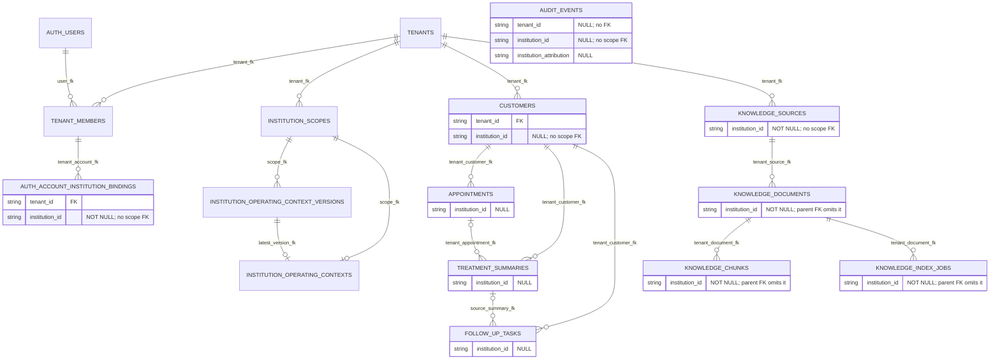
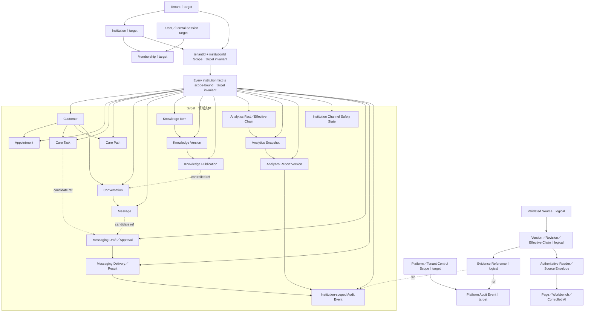

# 智美天工数据架构

- 日期：`2026-07-28 CST +0800`
- 任务：`V2-ARCH-DOCS-02`
- 基线：`5ceb3eb69f2d755c2ec20a4414c8d57c5ebd4961`
- 状态：`proposed_for_review`
- 执行性质：`docs-only`
- 适用状态词：`current`、`target`、`proposed`、`planned`、`historical`、`待核验`

## 1. 文档定位

本文是架构 V2 的数据视图，展开同一套总体架构中的实体关系、事实所有权、机构隔离、来源、版本、证据、审计和 Migration 序列。

权威关系固定为：

1. 当前 `main` 的代码、Schema、Migration、测试和配置决定 `current` 事实；
2. `docs/architecture/architecture-v2.md`、已接受 ADR 和模块映射决定已确认的 `target` 边界；
3. 本文解释、校验和补充数据视图，不建立第二套架构或数据库事实源；
4. `proposed` 和 `planned` 内容只有在独立任务获批并落地后，才能转为 `current`；
5. 仓库外数据库、数据量、生产 journal 和运行状态均为`待核验`。

本文不定义可直接执行的表、字段、约束、索引、Repository 或 Migration SQL。图中的 `target` 逻辑实体也不代表对应实现已经存在。

## 2. 事实依据

### 2.1 当前代码与数据资产

- `src/server/db/schema.ts`：当前 Drizzle PostgreSQL Schema；
- `src/server/db/client.ts`：当前 PostgreSQL／Drizzle 客户端入口；
- `drizzle/**`：当前 SQL、journal 和 snapshot 资产；
- `scripts/db/**`：当前 Migration 执行保护；
- `src/modules/**`：当前领域模型、Reader、Writer、Repository、契约和测试；
- `src/app/**`：当前页面与 API 的数据消费入口；
- `package.json`：数据库、测试和运行命令；
- `docs/operations/production-migration-runbook.md`：当前受控 Migration 规则。

### 2.2 已接受架构

- `docs/architecture/architecture-v2.md`：总体目标架构、MIG 序列和发布门禁；
- `docs/architecture/architecture-v2-module-map.md`：当前路径到目标所有者的映射；
- `docs/architecture/architecture-v2-evidence-audit-20260728.md`：代码证据与事实所有权审计；
- `docs/architecture/business-architecture.md`：业务对象、AI 边界和正式发布尺度；
- `docs/architecture/application-architecture.md`：应用入口、Source Envelope 和 Reader 依赖；
- `docs/decisions/architecture-v2-decisions.md`：已接受 ADR；
- `docs/architecture/institution-seven-stream-restart-baseline.md`：七线数据依赖和重启门禁。

较早文档、旧表命名、Demo／Mock／Seed 和历史实现仅是 `historical` 或 `current legacy` 证据，不能覆盖当前代码或已接受的 V2 所有权。

## 3. 当前实际状态

### 3.1 数据库资产与运行边界

`current` 数据库资产只有一套：

```text
src/server/db/
drizzle/
scripts/db/
```

`src/server/db/schema.ts` 使用 Drizzle 的 PostgreSQL Schema，`src/server/db/client.ts` 使用 PostgreSQL 客户端。`package.json` 的数据库命令继续指向现有 Drizzle 工具链。

不存在第二套 `database/`，也不得为匹配目标目录名创建它。共享 Schema 和统一 Migration 队列不改变领域事实所有权。

仓库只能证明数据库代码和迁移资产存在，不能证明：

- 任一远端数据库已经执行到哪个 journal；
- 生产表、索引、约束、数据量或数据质量与仓库一致；
- 备份、复制、恢复点或 RPO／RTO 已满足要求。

以上均为`待核验`，且不在本文任务中连接环境核验。

### 3.2 `tenantId + institutionId` 当前状态

`current` 已具备部分双键基础：

- `institution_scopes` 以 `tenantId + institutionId` 为复合主键；
- `institution_operating_context_versions` 保存版本化运行上下文；
- `institution_operating_contexts` 保存 current pointer；
- `auth_account_institution_bindings` 保存 `tenantId + institutionId + version`；
- 正式成员 Reader、机构锚点 Reader 和 Access Context 已有部分双键校验与 fail-closed 行为。

但机构隔离尚未完整关闭：

- `customers`、`appointments`、`treatment_summaries`、`follow_up_tasks` 和 `audit_events` 的机构归属仍存在可空或未强制关联 Scope 的情况；
- A1 没有为全部业务事实建立指向 `institution_scopes` 的强制关系；
- Treatment、Follow-up、Trial Provisioning、Seed 和 Audit Writer 尚未连续写入机构归属；
- Audit 查询仍存在只按 tenant 过滤的路径；
- `auth_account_institution_bindings` 当前也不能被解释为已完成全部 Scope FK 和数据回填。

因此 `MIG-01A1` 只是 `current expand`，不是机构隔离已关闭。任何 tenant-only、默认机构、未回填或未 enforce 的 Reader／Writer 都不能作为正式机构级数据能力。

### 3.3 当前实体关系

下图只画当前 Schema 可验证的主要关系；缺失的机构关系刻意不补画。



该图不是完整 Schema 图。尤其：

- Care 相关关系仍主要基于 tenant 和旧聚合表；
- Knowledge Source、Document、Chunk 和 Job 虽有机构列，但 Scope FK 与父子机构双键 FK 尚未统一 enforce；
- 现有 Knowledge 表不等于 MIG-03 的正式 Item／Version／Publication／Current Reader；
- `audit_events` 没有被画成所有实体的强制终点，因为当前 Writer 的机构归因并未闭环；
- 表中存在 `institutionId` 不等于双键隔离、Writer、Reader 和历史数据已经全部 enforce。

### 3.4 当前事实所有权落位

V2 事实所有权已经确认，但 `current` 物理实现仍处于新边界与旧聚合实现并存阶段。

| 事实域 | 已确认所有者 | `current` 实现状态 |
|---|---|---|
| 用户、正式会话 | Identity | 主要仍在 `src/modules/auth`，目标 `identity` 尚未物理落位 |
| 租户、机构、成员关系 | Tenancy + Access Control | 分布在 Schema、`auth`、`security` 和 `institution/server` |
| 客户稳定引用、客户主档 | Customers | 旧 `institution` Repository 与 `customer-center` 领域骨架并存 |
| 预约、随访任务、路径、结果 | Care | `care` 领域骨架与旧 `institution` 持久化并存 |
| 会话、消息、分配、身份复核 | Conversations | 新领域／测试存在，正式 Repository 和 MIG-04 未落位 |
| Item、Version、Publication、Job | Knowledge | 新领域设计与旧 `knowledge-base` Runtime 并存，MIG-03 未落位 |
| 消费事实、有效链、聚合 | Analytics | 新领域／测试存在，MIG-05 未落位 |
| Snapshot、报告版本 | Analytics | MIG-06 + AN-03C 前不存在正式事实链 |
| 持久化渠道安全状态 | Institution System | 目标属于 MIG-06；当前旧安全表不等于目标已完成 |
| 投递与渠道结果 | Messaging | 当前仍在旧 `institution`，目标模块尚不存在 |
| 审计事件 | Audit | 独立模块已存在，但机构归因与跨域引用尚未收口 |

“共享 Migration”不等于“共享 Repository”：

- MIG-02 由 Customers 与 Care 共享 Schema 编排；Customers 拥有客户稳定引用和责任归属，Care 拥有任务、路径、认领和结果；
- MIG-06 由 Analytics 与 Institution System 共享 Schema 编排；Analytics 拥有 Snapshot／报告事实，Institution System 只拥有持久化渠道安全状态；
- 任一领域都不得直接读取另一领域的内部表、Repository 或内部 DTO。

### 3.5 Source、Version、Evidence、Audit 当前状态

`current` 有多个局部构件，但没有统一 Source／Evidence Registry 或统一生命周期实现：

- Operating Context 有 `source`、`version` 和 migration provenance；
- Channel Consent 有 `sourceType`、`evidenceRef` 和 `version`；
- 旧 Care Path 有 `sourceType`、`sourceId` 和 template version；
- Knowledge 领域有 Version／Publication／Gate Evidence；
- Analytics 报告输入提案有 snapshot version、evidence references 和人工确认；
- `InstitutionSourceEnvelopeV1` 冻结了 scope、readiness、freshness、partitions、data 和 failure code 的 wire shape。

`InstitutionSourceEnvelopeV1` 本身不实现跨字段 Parser、不创建事实、不验证所有领域不变量，也不证明来源已被正式发布。当前这些构件不能被描述成统一数据血缘平台已经存在。

旧 Knowledge Runtime 的 Source 类型包含 Mock／Seed／Demo 历史语义。即使其表存在、`institutionId` 非空或测试通过，也不能成为 MIG-03 正式 Publication／Current Reader 的来源。

## 4. 建议目标状态

### 4.1 目标所有权与隔离

`target` 继续使用单一 PostgreSQL／Drizzle 资产链，并同时满足：

1. 所有机构业务事实由 `tenantId + institutionId` 强制归属；
2. 当前机构来自正式服务端会话、Fresh Active Membership 和机构锚点；
3. 缺失、未知、多候选、冲突和跨机构全部 fail-closed；
4. 每个事实只有一个领域语义所有者；
5. 跨域读取只通过版本化公共契约、Authoritative Reader 或 Provider；
6. Repository 只属于事实 Owner，不因共享 Migration 被共享；
7. Source、Version、Evidence 和 Audit 引用可追溯，但不复制业务事实；
8. 更正、撤销和重算形成新版本或有效纠正链，不静默覆盖；
9. Retention、Archive 和 Delete Policy 按领域、合规和证据要求独立批准。

### 4.2 目标数据生命周期

以下为 `proposed` 生命周期，不是已存在的统一实现：

```text
Source
→ Adapter／Parser／Scope 校验
→ 领域所有者的 canonical fact
→ Version／Revision／有效纠正链
→ Evidence Reference
→ Audit Event
→ Authoritative Reader／Source Envelope
→ 页面、Workbench 或受控 AI
→ Retention／Archive／Delete Policy
```

生命周期规则：

- External、Manual、System-derived 和 AI-proposed 来源必须可区分；
- Raw Payload 只由获批 Adapter 在受控边界处理，不进入公共 DTO、日志或 AI Prompt；
- Parser 先验证版本、Scope 和业务不变量，再交给领域 Application Service；
- Evidence Reference 引用证据，不把大段原始数据复制进 Audit；
- Reader 只返回已授权 Scope、已确认版本和低敏字段；
- 纠正链保留原记录和新有效版本之间的可审计关系；
- AI 输出首先是 suggestion／draft，只有经人工确认和领域规则处理后，才能形成获准的业务动作；
- 任何客户身份、治疗、消费、权限、任务终态、投递结果或正式报告都不能由 AI 直接写成权威事实。
- AI 也不能成为消息、审计或分析事实来源：消息事实由 Messaging 经人工门禁形成，审计事件由受控系统 Writer 形成，Analytics 事实由其权威来源形成。

### 4.3 目标实体关系

下图是 `target/proposed` 逻辑实体关系，不声明表名、字段、精确基数、外键或 Repository。实线表示领域内关系，虚线 `ref` 表示受控公共引用，不要求跨域数据库 FK。



目标事实所有者对应为：

- Identity：User 和正式会话；
- Tenancy + Access Control：Tenant、Institution、Membership 和授权上下文；
- Customers、Care、Conversations、Knowledge、Analytics、Institution System、Messaging：各自拥有图中的业务实体；
- Audit：Audit Event；
- Source／Evidence 是受控来源和引用，不成为第二业务事实库。

Identity、Tenancy 和 Access Control 提供主体与 Scope，不因此拥有 Customers、Care、Knowledge 或其他业务事实。跨域关系通过公共契约、Provider 或受控引用表达，不能据图创建跨域共享 Repository。

只有机构审计事件必须遵守 `tenantId + institutionId` 双键归属；平台或租户控制面审计使用其对应 Control Scope，不能伪造机构归属。Conversations 拥有会话内 Message，Messaging 拥有 Draft、Approval、Delivery 和渠道结果。

### 4.4 AI 数据边界

`target` AI 只允许读取：

- 已授权机构范围内的结构化事实；
- 字段白名单后的治疗、消费、预约和随访摘要；
- Knowledge 正式 Publication／Current Reader 返回的受控片段；
- Source、Version 和 Evidence Reference；
- 低敏聚合指标和冻结的 Analytics Snapshot。

必须人工确认 AI 推断标签、客户身份匹配、客户可见消息、路径变更、责任归属变更、真实发送、正式报告归档以及影响客户权益、医疗决策或外部系统状态的动作。

## 5. 当前与目标差距

| 差距 | `current` | `target` | 影响 |
|---|---|---|---|
| 机构隔离 | A1 Expand、部分双键 Reader／Guard | 全部事实双键、Writer、回填、FK／约束和 Reader enforce | tenant-only 或历史归属可能越界 |
| Scope 关系 | 多个业务表有可空 `institutionId`，Scope FK 不完整 | 经独立 MIG 评审后的强制关系 | 字段存在被误当隔离完成 |
| Audit 归因 | Schema 有字段，领域事件和 Writer 未连续写 | 机构归因连续、低敏、可追溯 | 审计链无法证明机构边界 |
| 事实所有权 | 旧聚合 Repository 与新领域骨架并存 | 单一 Owner + 公共 Reader／Provider | 重复事实和跨域耦合 |
| Knowledge | 旧 Runtime 和 Demo／Mock／Seed 历史语义 | MIG-03 后正式 Version／Publication／Current Reader | 非正式来源污染 AI 和页面 |
| Analytics | 领域算法和测试存在 | MIG-05 Facts；MIG-06 + AN-03C Snapshot／报告 | 指标不可复现、五页口径漂移 |
| Messaging | Draft／Delivery 在旧 `institution` | 独立 Messaging Owner + Adapter Port | 业务、审批和渠道耦合 |
| Source Envelope | Wire shape 已有，统一 Parser 缺失 | Scope／版本／交叉不变量统一验证 | 不同 Reader 对来源解释不一致 |
| Evidence | 多个局部引用形态 | 受控引用、可信校验和保留政策 | 证据丢失或复制敏感事实 |
| Migration 治理 | 通用 Guard 可覆盖多个 pending | 每个 V2 MIG 独立授权、PR、升级和回退验证 | 工具门禁不能单独证明治理门禁 |

## 6. 代码／Schema／Migration／测试／文档证据

| 类型 | 证据 | 支持的结论 |
|---|---|---|
| 代码 | `src/server/db/client.ts` | PostgreSQL／Drizzle 是当前数据库运行时 |
| Schema | `src/server/db/schema.ts` 中 `institutionScopes`、Operating Context、Bindings | A1 双键 Scope 和版本上下文存在 |
| Schema | `src/server/db/schema.ts` 中 Customers、Care、Audit 表 | 机构字段和约束仍处于过渡状态 |
| 代码 | `src/modules/auth/server/auth-account-repository.ts` | 正式成员 Reader 有双键读取和 fail-closed 基础 |
| 代码 | `src/modules/security/server/institution-anchor-repository.ts`、`institution-access-context.ts` | 机构锚点与 Access Context 有部分双键门禁 |
| 代码 | `src/modules/institution/server/treatment-summary-repository.ts`、`tenant-business-repository.ts` | Writer 双写尚未完整落位 |
| 代码 | `src/modules/audit/domain/audit-events.ts`、`server/audit-event-repository.ts` | Audit 机构归因尚未贯通领域事件、Writer 和 Reader |
| 契约 | `src/modules/institution-contracts/v1/institution-source.ts` | Source Envelope wire shape 已有，但不是统一 Parser／Registry |
| Migration | `drizzle/0038_mig_01a1_institution_isolation_expand.sql` | MIG-01A1 已存在且仅为 Expand |
| Migration | `drizzle/meta/_journal.json` | 仓库 journal 最新项为 `0038_mig_01a1_institution_isolation_expand` |
| 测试 | `src/server/db/tests/Schema.test.ts` | A1 不包含 Provision、Backfill、Enforce 或全部业务 FK |
| 测试 | `src/server/db/tests/MigrationGuard.test.ts` | Guard 验证 pending allowlist，但允许一次包含多个 pending |
| 文档 | `docs/architecture/architecture-v2.md` | MIG 状态、顺序、所有权和发布门禁 |
| ADR | `docs/decisions/architecture-v2-decisions.md` | 保留数据库目录、MIG 串行、共享 Migration 不共享所有权 |
| 映射 | `docs/architecture/architecture-v2-module-map.md` | 当前路径到目标 Owner 的迁移政策 |

### 6.1 已发现的数据治理漂移

`docs/operations/drizzle-migration-snapshot-strategy.md` 仍写 journal 到 `0035`、不新增 `0036`，而 `drizzle/meta/_journal.json` 已登记 `0036`、`0037`、`0038`。Snapshot 确实仍停在 `0026`。

这是 `current` 文档／测试漂移，不改变 V2 MIG 顺序。现行策略已经明确：

- 不能把旧 snapshot 文档写成当前 journal 事实；
- Snapshot baseline 治理完成前禁止运行 `db:generate`，也禁止新增基于 snapshot 差异的生产 Migration；
- 本轮不静默修改旧文档，也不推断任何远端环境已经执行到 `0038`。

将“校准 journal、SQL、snapshot strategy、runbook 和相关测试”扩大为所有新 V2 Migration 或环境执行前的硬门禁，属于 `proposed/待确认`；获批前不得写成现行规则。

## 7. 风险与影响

- tenant-only Reader／Writer 被误认为正式双键能力，可能造成跨机构读取或错误归属；
- 可空机构字段、缺 Scope FK、缺 Writer 双写和未回填历史数据会形成部分正确的假象；
- Audit 缺连续机构归因，会削弱越权调查、回滚和发布证明；
- Demo／Mock／Seed Knowledge 进入正式 Reader，会污染检索、AI 引用和运营判断；
- 旧表、领域类型、测试通过或 Migration 文件存在被误报为 MIG 完成；
- 共享 Migration 演化成共享 Repository，会破坏单一事实所有权；
- AI 绕过 Authoritative Reader、Scope 或 Evidence，会把建议误变为业务事实；
- 通用 Migration Guard 与 V2 单 Migration 独立授权之间存在流程缺口；
- 过时 snapshot 文档可能导致错误 pending 集合、generate 或生产执行判断。

## 8. 需要的改造

以下均为 `planned/proposed`，不是本任务授权：

1. 为 MIG-01A2 冻结机构锚点 provisioning manifest、幂等规则和 revision；
2. 逐 Writer 建立双写清单，覆盖业务事实、Audit 和当前成员上下文；
3. 为 MIG-01B 定义确定性回填、追赶、高水位、冲突分类和清零阈值；
4. 为 MIG-01C 独立设计非空、FK、attribution 和 shape enforce；
5. 在每个 MIG 中冻结目标表／字段／约束／索引白名单，禁止从本文直接生成实现；
6. 为 Source Envelope 指定 Parser Owner、版本策略和交叉不变量；
7. 为 Evidence Reference 定义可信来源、低敏引用、保留和删除政策；
8. 逐域将旧 Repository 迁往唯一 Owner，并由公共契约／Provider 替代跨域内部读取；
9. 修复 Audit 机构归因的领域契约、Writer、Reader 和历史兼容；
10. 独立校准 Migration runbook、snapshot strategy、journal 和测试；
11. 为每个 V2 MIG 增加独立授权、空库、升级、回退和停止条件证明。

不得为这些改造预先创建空表、空目录、空 Repository 或占位实现。

## 9. 实施顺序

固定顺序不得因页面或已有旧表重排：

```text
V2-ARCH-DOCS-02
→ V2-ARCH-DOCS-03
→ V2-02B-MIG01-CLOSURE-PREFLIGHT
→ V2-02C-PLATFORM-AUTH-ROUTE-PREFLIGHT
→ 最小 Architecture／Quality CI
→ MIG-01A1（已存在，复核）
→ MIG-01A2
→ BASE-02／全部 Writer 双写与 Guard
→ 最小 Audit 兼容 Writer
→ MIG-01B
→ MIG-01C
→ Customers／Institution System 真实只读
→ MIG-02 Customers + Care
→ MIG-03 Knowledge
→ MIG-04 Conversations
→ MIG-05 Analytics Facts／有效链／确定性聚合
→ MIG-06 Analytics Snapshot／Reports + Institution System Channel Safety
→ AN-03C／Analytics 正式 Providers／五页
→ Workbench 最后接线
→ 按线所需的外部 Adapter（Port-first）
→ Capability read_only／operational
→ 测试环境与七线发布验收
→ 旧实现观测和退出
```

每个 Migration 必须独立设计、授权、PR、升级验证和回退验证。数据设计可以准备，Schema、Migration、主线集成和发布必须串行。

## 10. 已确认决策

- 继续使用 `drizzle/`、`src/server/db/` 和 `scripts/db/`；
- 不创建第二套 `database/`、Schema 或数据事实源；
- 机构业务事实最终由 `tenantId + institutionId` 强制归属；
- 当前 MIG-01A1 只是 Expand；
- Customers 和 Institution System 真实 Reader 等待 MIG-01C；
- Care 等待 MIG-02；
- Knowledge 正式 Reader 等待 MIG-03；
- Conversations 等待 MIG-04；
- Analytics Facts 等待 MIG-05；
- Analytics Snapshot／五页等待 MIG-06 + AN-03C；
- Workbench 最后消费正式 Provider；
- MIG-02 和 MIG-06 的共享只表示 Migration 编排，不共享 Repository、内部 DTO 或事实；
- AI 只读取受控事实、摘要、证据和冻结 Snapshot，不成为权威业务事实；
- Capability、Mock、Demo、Seed、测试通过或代码存在均不代表正式发布；
- 七条机构业务线正式发布仍为 `0/7`。

## 11. 待确认决策

| 决策 | 当前建议 | 影响 |
|---|---|---|
| Evidence 是否立即成为独立模块 | 否；先使用 Contracts + Audit Reference | 避免空模块和第二事实库 |
| Source Envelope Parser 的 Owner | 在首个正式 Reader 预检中冻结 | 影响所有 Reader 的一致失败语义 |
| 各 MIG 精确表、字段、FK 和索引 | 每个 MIG 单独评审 | 本文不得成为 Schema 授权 |
| 回填冲突分类和清零阈值 | MIG-01B 预检冻结 | 决定能否进入 Enforce |
| Audit attribution 历史兼容规则 | MIG-01 关闭预检冻结 | 影响旧事件可解释性 |
| Evidence 保留、归档和删除期限 | 按领域与合规独立确认 | 影响成本、隐私和调查能力 |
| 旧表映射、对账和退出 | 逐域垂直切片决定 | 防止双事实源长期存在 |
| 单 Migration 工具门禁 | 增加 V2 级别的单元校验 | 通用 pending allowlist 不足以证明独立授权 |
| snapshot 文档漂移修复任务 | 现行先禁止 `db:generate`／snapshot 差异 Migration；是否扩大为所有新 V2 Migration 的硬门禁待确认 | 防止错误 generate／执行判断 |

## 12. 禁止范围

本文不授权：

- 修改或新增 Schema、Migration、Seed、Repository、Reader、Writer 或 Parser；
- 创建第二套 `database/`、数据库目录或事实源；
- 创建空模块、空表、空目录或占位 Port／Provider；
- 把 `target/proposed` 实体、字段、FK、索引或约束写成已存在；
- 在 MIG-01C 前开放 tenant-only 或默认机构 Reader；
- 让跨域模块直接读取其他领域内部表、Repository 或 DTO；
- 将 Demo／Mock／Seed／旧 Knowledge 索引接入正式 Reader；
- 让 AI 直接写入客户、治疗、消费、权限、任务终态、投递结果或正式报告；
- 让 AI 成为消息、审计或 Analytics 的事实来源；
- 连接数据库、读取 `DATABASE_URL`／`.env.local`／凭证；
- 执行 Migration、Seed、数据回填、对账或环境核验；
- 调整 MIG-01～MIG-06 顺序；
- 把代码、测试、Capability 或历史表存在解释为正式发布。
