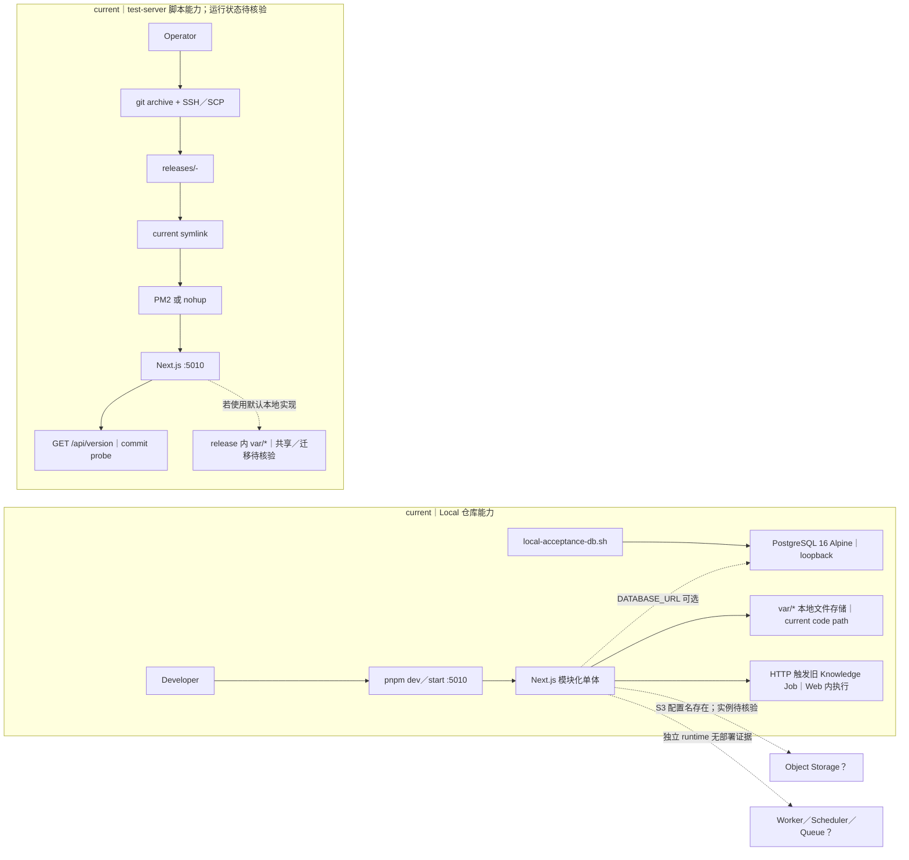
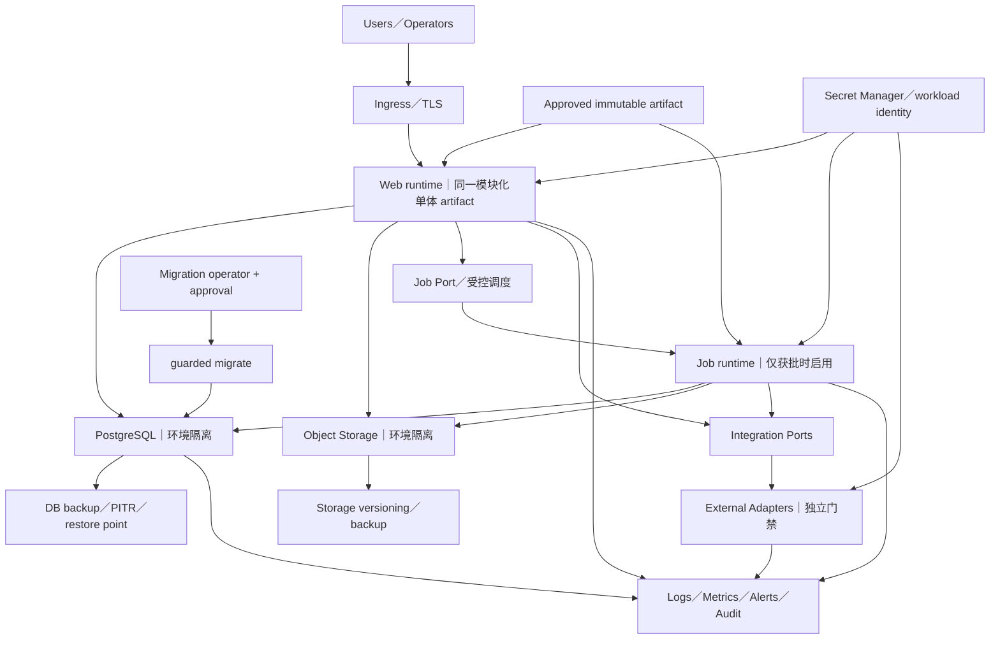

# 智美天工部署架构

- 日期：`2026-07-28 CST +0800`
- 任务：`V2-ARCH-DOCS-02`
- 基线：`5ceb3eb69f2d755c2ec20a4414c8d57c5ebd4961`
- 状态：`proposed_for_review`
- 执行性质：`docs-only`
- 适用状态词：`current`、`target`、`proposed`、`planned`、`historical`、`待核验`

## 1. 文档定位

本文是架构 V2 的部署视图，描述仓库可证明的运行、发布和运维能力，以及 Local、Test、Staging、Production 的建议职责、隔离、发布、回滚、可观测和安全门禁。

事实边界固定为：

1. 只把当前 `main` 中的代码、配置、脚本、测试和运维文档写成 `current repository evidence`；
2. 仓库存在部署脚本不等于目标服务器可达、正在运行或代表生产拓扑；
3. 仓库外 CI/CD、服务器、云资源、数据库、对象存储、Secret Manager、监控、告警、备份和运维状态统一标为`待核验`；
4. `target/proposed` 只表达建议职责和门禁，不代表环境已经创建；
5. 本文不建立第二套架构、部署事实源、数据库或服务拆分。

本任务没有执行部署、环境探测、网络请求、Migration、Seed、测试或 Build。

## 2. 事实依据

### 2.1 当前仓库证据

- `package.json`：Node、pnpm、dev／build／start／preflight／DB 命令；
- `scripts/run-next.mjs`、`scripts/runtime/**`：Next.js 命令入口；
- `next.config.ts`：构建版本元数据；
- `scripts/dev/local-acceptance-db.sh`：本地 PostgreSQL 验收辅助能力；
- `scripts/deploy-test-server.mjs`、`scripts/deploy/test-server.mjs`：测试服务器部署脚本能力；
- `src/app/api/version/route.ts`、`src/modules/deployment/**`：版本探针；
- `src/modules/open-platform/server/platform-knowledge-file-storage.ts`、`src/modules/open-platform/server/homepage-brand-asset-storage.ts`、`src/modules/open-platform/server/homepage-brand-local-repository.ts`：当前本地文件存储实现；
- `src/app/api/v1/knowledge-base/runtime/index-jobs/run/route.ts`：当前 Web 请求内触发的旧 Knowledge Job 路径；
- `.env.example`：配置变量名称示例；
- `drizzle.config.ts`、`scripts/db/guarded-migrate.mjs`：数据库配置与 Migration Guard；
- `docs/operations/local-development.md`：本地运行说明；
- `docs/operations/production-migration-runbook.md`：生产 Migration 规则；
- `docs/operations/wecom-production-secret-runbook.md`：Secret 和真实渠道安全规则；
- `docs/architecture/data-and-storage-boundaries.md`：本地、静态和正式数据边界。

### 2.2 已接受架构

- `docs/architecture/architecture-v2.md`：模块化单体、四层、MIG 和发布门禁；
- `docs/architecture/architecture-v2-module-map.md`：Deployment、DB 和外部 Adapter 的目标映射；
- `docs/architecture/architecture-v2-evidence-audit-20260728.md`：仓库内 CI／Observability 缺口和环境未核验声明；
- `docs/architecture/business-architecture.md`：正式发布定义；
- `docs/architecture/application-architecture.md`：授权、Capability 和 Adapter 边界；
- `docs/decisions/architecture-v2-decisions.md`：已接受部署相关治理原则。

脚本中的默认主机、用户、路径或端口只是代码默认值，不是环境事实；本文不据此声明任何服务器身份。

## 3. 当前实际状态

### 3.1 可证明的 Local 能力

仓库可证明：

- Node.js 要求为 20 或更新版本，pnpm 要求为 9 或更新版本；
- `pnpm dev`、`pnpm build` 和 `pnpm start` 通过稳定 Next.js 入口运行；
- Web 默认使用端口 `5010`；
- `preflight` 当前执行 typecheck、test 和 build；
- 本地开发文档说明 PostgreSQL + Drizzle 通过 `DATABASE_URL` 接入；
- 本地验收脚本可启动只绑定 loopback 的 PostgreSQL 16 容器，并提供本地 migrate／dev／stop 辅助；
- Demo Auth 和 Mock Provider 只应在 Development／Test 受控使用。

这些只证明 Local 工具链存在，不证明开发者机器当前正在运行 Web 或数据库，也不证明正式部署采用容器。

### 3.2 可证明的测试服务器脚本能力

仓库中存在一个测试服务器发布脚本，其 `current` 行为包括：

1. 要求部署密钥文件存在，并默认检查工作树干净；
2. 从当前 commit 生成 `git archive`；
3. 通过 SSH／SCP 上传归档；
4. 在远端创建时间戳加 commit 的 release 目录；
5. 从旧 current 或应用根复制既有 `.env*`；
6. 在远端安装依赖并构建；
7. 将 `current` 符号链接切到新 release；
8. 使用已存在的 PM2，或以 PM2／nohup 启动 Next.js；
9. 通过本机与公网 `/api/version` 比对 commit；
10. 只保留最近 5 个 release 目录。

仓库代码还存在以 `process.cwd()/var` 为默认根的本地文件实现：

- Knowledge 文件：`var/knowledge-files`；
- Homepage Brand 资产：`var/homepage-brand-assets`；
- Homepage Brand 本地 Repository fallback：`var/homepage-brand-local-store.json`。

Knowledge 文件 Route 和 Homepage Brand 资产 Route 当前会创建这些本地实现。由代码可推断：如果测试服务器脚本按 release 目录启动这些路径，`var/` 会落在各 release 内；脚本只复制 `.env*`，没有共享卷、`var/` 复制或迁移步骤。实际服务器是否使用了额外挂载或外部存储仍为`待核验`。

这只是“脚本具备上述动作”的仓库事实。以下仍为`待核验`：

- 默认目标服务器是否存在、可达或由项目控制；
- 脚本是否曾成功运行、最近部署时间和当前 SHA；
- PM2／nohup 的真实进程、开机拉起和多实例状态；
- 该服务器是 Test、Staging 还是 Production；
- DNS、TLS、Ingress、负载均衡、CDN 和网络边界；
- 数据库、Storage、Jobs、Secrets 和 Adapter 是否与该 Web 实例正确绑定。

### 3.3 当前部署图



`GET /api/version` 只返回 commit、build time 和来源。它可以证明响应进程携带哪个版本信息，但不是完整 health／readiness：

- 不检查 PostgreSQL；
- 不检查对象存储；
- 不检查 Jobs／Queue；
- 不检查 Secret 注入；
- 不检查外部 Adapter；
- 不证明业务线、授权或 Capability 已正式发布。

### 3.4 Web、PostgreSQL、Storage、Jobs、Secrets 和 Adapter

| 组件 | `current` 仓库证据 | 不能据此证明的事项 |
|---|---|---|
| Web | Next.js build／start 命令、端口 5010、测试服务器脚本 | 实例数、HA、扩缩容、Ingress、当前运行 SHA |
| PostgreSQL | Drizzle、postgres 依赖、Schema、Migration Guard | Provider、Cluster、Replica、PITR、实际 journal |
| Storage | Knowledge／Brand 资产和 Brand fallback 使用 `process.cwd()/var`；`.env.example` 另声明 S3 配置名 | 共享卷、对象存储实例、Bucket、加密、Versioning、Lifecycle、备份 |
| Jobs | 旧 Knowledge 有 HTTP 触发、在 Web 进程内同步执行的 Job 路径 | 独立 Worker、Scheduler、Queue、Retry、DLQ、Lease 的部署 |
| Secrets | 示例变量名和 Secret runbook | Secret Manager 产品、Workload Identity、实际注入和轮换 |
| External Adapter | 旧模块内有 Provider 代码和 fail-closed 安全规则 | 正式 endpoint、生产身份、egress、sandbox、真实网络授权 |
| Audit | 业务 Audit 模块和低敏规则 | 日志聚合、不可变审计存储、跨系统关联 |

当前 Web 内 Job 路径不等于独立 Jobs Runtime：它会与 Web 请求共享进程、超时和资源，且不能证明调度、重试、Lease 或故障恢复。不能把业务表或领域对象中出现 `job`、`queue`、`provider` 等名称写成对应 Runtime 已部署。当前 `package.json` 没有独立 Worker／Scheduler／Queue 启动命令，仓库也没有正式进程清单。

### 3.5 当前配置与 Secret 边界

`.env.example` 只列出 App URL、Session Secret、Database、S3 和 AI Provider 等变量名，不含真实值。它是最小示例，不是完整 Production Config Schema。

生产运维文档要求：

- Secret Manager 在 Runtime 注入；
- 使用限时、最小权限身份；
- 只做 masked existence check；
- 不在日志、工单、截图或命令中输出 Secret；
- 真实网络和真实发送默认关闭；
- 生产 Migration 显式核验目标数据库身份。

这些是仓库内规则，不证明 Secret Manager、Workload Identity 或生产绑定已经存在。其实际状态为`待核验`。

### 3.6 当前 Migration 发布能力

`current` Migration Guard 可验证：

- Local 模式只允许 loopback 数据库；
- Production 需要人工确认字符串和审批引用；
- 需要核对预期 host／database；
- expected current、expected target 和全部 pending allowlist 必须一致；
- 子进程输出不直接转发，减少连接信息泄漏；
- 非零退出返回低敏失败。

生产 runbook 要求：

- 执行人与复核人分离；
- 变更单、窗口、停止条件和恢复点；
- journal、SQL、pending 和 allowlist 对齐；
- 预先核验锁、错误率、复制延迟和资源阈值；
- 失败优先 forward-fix；
- 禁止 destructive down、手改 journal 和原地修改已执行 SQL。

这些是 `current repository controls`，不证明任一环境已经执行 Migration、已有可恢复备份或能满足阈值。

### 3.7 当前日志、指标、告警、审计和健康检查

可证明的仓库证据：

- 部署脚本输出带时间戳的 Shell 日志；
- nohup fallback 写入应用日志文件；
- Migration Guard 输出低敏 target／migration 结果；
- 业务 Audit 模块记录领域审计事件；
- `/api/version` 提供版本探针。

仓库内没有足够证据证明：

- 统一结构化应用日志；
- 日志收集、检索和保留平台；
- Metrics、Traces、Dashboard、SLO 或 Error Budget；
- 告警阈值、通知渠道、On-call 和升级流程；
- DB／Storage／Jobs／Adapter 依赖健康检查；
- Liveness／Readiness 的流量摘除语义；
- 备份作业、恢复演练或灾难恢复流程已运行。

以上全部为`待核验`。

### 3.8 当前 CI 与部署清单

仓库内未发现：

- `.github` Workflow；
- Dockerfile／Compose；
- Kubernetes／Helm；
- Vercel／Fly／Railway 等平台清单；
- Procfile 或正式 PM2 manifest；
- 声明式 Artifact Registry／Promotion 配置。

仓库外 CI/CD 是否存在为`待核验`。没有仓库证据时，不能把 GitHub 合并、测试通过或部署脚本存在描述为已发布。

## 4. 建议目标状态

### 4.1 环境职责与隔离

以下为 `target/proposed`：

| 环境 | 目标职责 | 数据与身份 | 网络与 Adapter | 发布尺度 |
|---|---|---|---|---|
| Local | 开发、调试和局部验证 | Loopback PostgreSQL、本地／一次性 Storage、仅本地低敏配置 | Mock；不得载入 Production Secret | 不构成发布 |
| Test | 自动化测试、契约、Architecture Gate、Migration 从零验证 | 短生命周期 DB／Storage、固定 Fixture、隔离身份 | 网络默认阻断，Jobs 可控触发，无真实 Adapter | 形成可复现证据 |
| Staging | Production-like 演练 | 独立账号、DB、Bucket、Secret；只用合成或脱敏数据 | Sandbox 或默认关闭；独立 egress | 演练 Migration、备份恢复、回滚、健康和告警 |
| Production | 正式流量和事实 | 专属 Workload Identity、DB、Storage、Job Role、Runtime Secret | 外部 Adapter 独立审批，安全开关默认关闭 | 通过全部发布门禁后受控放量 |

四个环境不得共享：

- 数据库；
- Bucket 或对象前缀；
- Secret 或长期凭证；
- 外部 Provider 身份；
- Queue／Schedule；
- 审批引用；
- 日志访问权限和保留策略。

Staging 是否建立、资源规格和 Provider 当前均为`待确认`。表中职责不证明环境已经存在。

### 4.2 目标部署关系

同一个模块化单体 Artifact 可以按 Web 和获批 Job 两种 Runtime Role 运行；这不代表拆微服务、第二仓库或第二数据库。



目标规则：

- Build once，使用不可变 Artifact 在环境间 Promote；
- Web、Jobs 和 Migration Operator 使用不同的最小权限身份；
- 业务模块只调用 Job／Integration Port，不直接依赖 Scheduler、Queue 或 Provider；
- Secret 运行时注入，不复制旧 Release 的 `.env*`；
- Adapter 默认无网络／无真实发送，必须单独放行；
- DB 和 Storage 备份、恢复点、验证和保留策略分别管理；
- Version、Liveness、Readiness 和业务 Smoke 分层；
- 生产流量切换不自动开放 Capability、Adapter 或真实发送。

### 4.3 Migration、备份、恢复与回滚

`target` 发布前必须：

- 确认 Artifact SHA、变更单和审批；
- 核验环境与数据库身份；
- 校准 Schema、SQL、journal、snapshot strategy 和 runbook；
- 创建并验证恢复点；
- 确认 backward compatibility 窗口；
- 按固定 MIG 顺序执行；
- 保持真实网络、真实发送和未发布 Capability 关闭。

备份与恢复的 `proposed` 最低证明：

- PostgreSQL 自动备份和按变更创建的恢复点；
- Object Storage Versioning／备份或等价恢复能力；
- 明确 RPO、RTO、Owner 和保留期；
- 定期隔离恢复演练；
- 恢复后核对 Schema、journal、数据完整性和审计；
- 证据不包含 Secret 或客户原始数据。

Web-only 回滚只有在数据库向后兼容时，才可切回上一已验证 Artifact。数据库失败优先新评审的 forward-fix；只有已演练、可证明安全且获批时使用恢复点。禁止 destructive down、手改 journal 或原地修改已执行 SQL。

### 4.4 安全开关与外部 Adapter

每个真实 Adapter 必须有独立门禁：

- Provider 身份与 endpoint 已核验；
- Sandbox／Production 明确隔离；
- Egress 白名单；
- Secret 最小权限与轮换；
- Dry-run／Read-only／Real-network／Real-send 状态分离；
- 人工审批和客户可见内容确认；
- 幂等、频控、重试和结果审计；
- Emergency Stop 可在不依赖业务页面的情况下生效。

事故停止顺序建议为：

```text
Real Send OFF
→ Real Network OFF
→ 停止相关 Web／Job workload
→ 撤销 Provider 凭证
→ 保全低敏证据与审计
```

该顺序不构成真实 Provider 操作授权。

### 4.5 日志、指标、告警、审计与健康检查

`target/proposed` 应分层：

- **Version**：Artifact SHA、build time、配置版本，不含 Secret；
- **Liveness**：进程能响应，不检查全部远端依赖；
- **Readiness**：关键 DB、Storage、Job／Queue、必需配置和发布状态；
- **Smoke**：获批的关键只读业务链和授权失败链；
- **Logs**：结构化、低敏、带 request／trace／tenant／institution 的受控关联；
- **Metrics**：请求、延迟、错误、资源、DB、Queue／Job、Adapter、Capability；
- **Alerts**：阈值、持续时间、去重、Owner、On-call 和升级；
- **Audit**：业务动作、审批、Migration、发布、配置和安全开关；
- **Tracing**：跨 Web／Job／Adapter 的低敏调用关联。

具体产品、采集器、阈值、SLO 和保留期为`待确认`。业务 Audit 不替代运行日志、指标或告警。

## 5. 当前与目标差距

| 领域 | `current` | `target` | 状态／影响 |
|---|---|---|---|
| Artifact | 测试脚本远端安装和构建 | Build once／Promote 不可变 Artifact | `proposed`；当前难复现 |
| Process | PM2 探测或 nohup fallback | 声明式 Web／Job Runtime Role | `proposed`；开机拉起和 HA 待核验 |
| Environments | Local 文档和测试服务器脚本 | Local／Test／Staging／Production 隔离 | 实际 Test／Staging／Production 待核验 |
| Database | Guard 和 runbook | 已验证备份、恢复点、独立 MIG 发布 | 实际 Provider／journal／PITR 待核验 |
| Storage | `var/*` 本地文件实现 + S3 配置名 | 环境隔离的对象存储、加密、Versioning、Lifecycle | Release 切换、多实例和数据丢失风险；实例和策略待核验 |
| Jobs | 旧 Knowledge Web 请求内同步执行 | 获批 Job Role、调度、Queue、Retry、DLQ | 独立 Runtime 不可证明；当前与 Web 竞争资源 |
| Secrets | 示例变量和 runbook | Secret Manager + Workload Identity | 产品、注入和轮换待核验 |
| Adapters | 旧模块代码和安全规则 | Port-first、独立身份、egress 和放行 | 正式网络和身份待核验 |
| Health | `/api/version` | Version／Liveness／Readiness／Smoke 分层 | 依赖健康缺口 |
| Observability | Shell 日志、业务 Audit | Logs／Metrics／Traces／Alerts／SLO | 平台和运行状态待核验 |
| Rollback | 旧 release 保留，无自动切回 | 已演练 Artifact 回滚和 DB 恢复 | 当前脚本不能证明 |
| CI/CD | 仓库无 Workflow | 可审计 Gate／Artifact／Promotion／审批 | 仓库外状态待核验 |

## 6. 代码／Schema／Migration／测试／文档证据

| 类型 | 证据 | 支持的结论 |
|---|---|---|
| 配置 | `package.json` | Node／pnpm、Web、preflight 和 DB 命令 |
| 配置 | `next.config.ts` | 构建版本元数据可写入 Artifact |
| Local | `docs/operations/local-development.md` | Local 启动、DB 和 Mock 边界 |
| Local | `scripts/dev/local-acceptance-db.sh` | Loopback PostgreSQL 验收辅助能力 |
| Deploy | `scripts/deploy/test-server.mjs` | Git archive、远端 build、symlink、PM2／nohup 和版本检查 |
| Probe | `src/app/api/version/route.ts`、`src/modules/deployment/server/deployment-version.ts` | `/api/version` 是版本探针 |
| 测试 | `src/modules/deployment/tests/DeploymentVersionRoute.test.ts` | 版本变量和 fallback 有测试 |
| Storage | `src/modules/open-platform/server/platform-knowledge-file-storage.ts`、`src/modules/open-platform/server/homepage-brand-asset-storage.ts`、`src/modules/open-platform/server/homepage-brand-local-repository.ts` | 当前存在 `process.cwd()/var` 本地文件实现 |
| Route／Storage | `src/app/api/v1/open-platform/knowledge-management/items/[knowledgeId]/files/route.ts`、`src/app/api/v1/open-platform/homepage-brand/_shared.ts` | 当前 Route 会实例化本地 Storage／fallback |
| Jobs | `src/app/api/v1/knowledge-base/runtime/index-jobs/run/route.ts`、`src/modules/knowledge-base/server/v1-knowledge-base-runtime-api-routes.ts` | 旧 Knowledge Job 由 HTTP 在 Web 进程内触发 |
| DB | `drizzle.config.ts`、`scripts/db/guarded-migrate.mjs` | PostgreSQL／Drizzle 和 Migration Guard |
| 测试 | `src/server/db/tests/MigrationGuard.test.ts` | Guard 的身份、pending 和低敏失败行为 |
| Runbook | `docs/operations/production-migration-runbook.md` | 生产 Migration、停止和 forward-fix 规则 |
| Secret | `docs/operations/wecom-production-secret-runbook.md` | Secret、真实网络、真实发送和 Emergency Stop 规则 |
| Config | `.env.example` | 仅证明配置变量名称，不证明值或绑定 |
| Storage | `docs/architecture/data-and-storage-boundaries.md` | 正式数据不得长期放在本地 JSON／public |
| 架构 | `docs/architecture/architecture-v2-evidence-audit-20260728.md` | 仓库内 CI／Observability 缺口和环境未核验 |

### 6.1 已发现的运维文档冲突

存在 `current` snapshot 文档／锁文案测试漂移：

- `docs/operations/drizzle-migration-snapshot-strategy.md` 仍声称 journal 到 `0035`、不新增 `0036`，并只要求检查 `0027` 至 `0035`；
- `drizzle/meta/_journal.json` 已登记 `0036`、`0037`、`0038`，最新是 `0038_mig_01a1_institution_isolation_expand`；
- Snapshot 确实仍只到 `0026`；
- `src/server/db/tests/ProductionReadinessDocs.test.ts` 仍断言旧文案存在，说明测试锁定了字符串，却没有验证 journal 最新状态。

处理原则：

- 不把过时文档写成当前 journal 事实；
- 不静默修改旧文档或测试；
- 现行 snapshot strategy 已明确：baseline 治理完成前禁止 `db:generate`，也禁止新增基于 snapshot 差异的生产 Migration；
- `production-migration-runbook.md` 使用 current／target／pending allowlist 的通用规则，本身没有声称 journal 最新项为 `0035`，不能把它写成与 journal 直接冲突；
- 将 SQL、journal、snapshot strategy、Migration 专项指导和锁文案测试的完整校准扩大为所有新 V2 Migration／环境执行前的硬门禁，属于 `proposed/待确认`；
- 不从仓库 journal 推断任何远端环境已经执行 Migration。

核心 V2 的模块化单体、两平面、四层、七线、MIG 串行和 Capability 不等于发布没有因此改变。

## 7. 风险与影响

- 把测试服务器脚本默认值当成真实拓扑，会产生错误的 Production 结论；
- 当前脚本在远端安装和构建，无法证明 Build once／Promote 或供应链一致性；
- 复制旧 Release 的 `.env*` 与 Runtime Secret 注入目标冲突；
- `var/*` 默认落在进程工作目录；Release 切换不复制它，可能造成资产不可见、回滚不一致、旧 Release 清理丢失和多实例分叉；
- 旧 Knowledge Job 在 Web 请求内同步执行，可能与在线请求竞争资源，并受 HTTP 超时和进程重启影响；
- 默认高权限远端用户、关闭 SSH Host Key 校验和本机密钥路径是脚本安全风险；
- `current` symlink 切换后才检查版本，失败时没有自动切回；
- 创建 `backups` 目录不等于数据库或对象存储备份；
- 保留 5 个 Release 不等于数据恢复能力；
- `/api/version` 通过可能掩盖 DB、Storage、Jobs 或 Adapter 故障；
- Deploy 脚本不编排 Migration，Web／DB 兼容窗口可能失配；
- Clean-tree 检查可由环境开关绕过，不适合作为 Production 目标；
- `preflight` 不含 Lint、E2E 或 Architecture Gate；
- 无可审计 CI／Observability 证据，会使发布和运行状态无法证明；
- 过时 Migration 文档可能导致错误 pending、generate 或恢复判断；
- 代码、测试、Merge 或脚本执行成功被误报为七线正式发布。

## 8. 需要的改造

以下均为 `planned/proposed`，不是本任务授权：

1. 独立盘点并确认 Local／Test／Staging／Production 是否存在及其身份；
2. 选择 Build once／Promote Artifact 和声明式 Process 方案；
3. 为 Web、Job、Migration 和 Adapter 定义独立 Runtime Role 与最小权限；
4. 盘点 `var/*` 数据、调用方、保留和迁移方式；在多 Release／多实例前消除本地工作目录事实源；
5. 决定旧 Web 内 Job 的隔离、超时、幂等和退出方式，再选择获批 Job Runtime；
6. 确认 PostgreSQL／Storage Provider、HA、RPO、RTO、备份和恢复 Owner；
7. 选择 Secret Manager、Workload Identity 和轮换流程；
8. 定义 Version、Liveness、Readiness 和 Smoke 的依赖与阈值；
9. 建立结构化 Logs、Metrics、Traces、Alerts、SLO 和 On-call；
10. 为每个 Adapter 建立 Sandbox、Egress、Secret 和独立放行；
11. 增加 Artifact 回滚、DB forward-fix／恢复点和演练证据；
12. 独立修复 0035→0038 snapshot 文档和锁文案测试漂移；
13. 评审测试服务器脚本的保留、加固或退役；
14. 建立仓库内可审计的 CI/CD 与 Architecture Gate。

这些改造必须拆分授权，不得在 docs-only 任务中创建环境、配置、Workflow、容器或部署文件。

## 9. 实施顺序

### 9.1 建议发布顺序

```text
冻结 commit／变更单／审批
→ 可复现 Quality + Architecture Gate
→ 构建一次不可变 Artifact
→ 核对目标环境身份与 masked Secret existence
→ 验证 PostgreSQL／Storage 备份与恢复点
→ 按获批范围校准 SQL／journal／snapshot strategy／专项指导／锁文案测试
→ 按 MIG-01～MIG-06 既定顺序执行获批 guarded Migration
→ 部署 Web／获批 Jobs，真实 Adapter／发送开关保持关闭
→ Version + Dependency Readiness + Smoke
→ 检查 Logs／Metrics／Alerts／Audit
→ Canary／受控切流
→ Postcheck
→ 另行审批 Capability／Adapter／真实发送
```

部署成功不自动开放 Capability、真实 Reader、外部网络或正式发布。Customers／System、Care、Knowledge、Conversations、Analytics 和 Workbench 仍受既定 MIG 与业务门禁约束。

### 9.2 立即停止条件

任一条件出现即停止，不绕过：

- Artifact 或 SHA 与审批不一致；
- 工作树、SQL 或依赖未审查；
- 获批范围依赖的 SQL、journal、snapshot strategy、Migration 专项指导或锁文案测试未完成对齐；
- 环境、数据库身份、pending 或 allowlist 不一致；
- 无可验证备份或恢复点；
- 锁等待、复制延迟、错误率或资源超过批准阈值；
- Migration 非零退出、未知状态或部分成功；
- Version、Readiness 或关键 Smoke 不通过；
- 日志可能泄露 Secret 或客户数据；
- 真实网络、真实发送或 Capability 意外开启；
- 外部 Adapter 产生未经授权的网络；
- Review、Approval 或职责分离缺失。

### 9.3 回滚条件与方式

- Web-only 变更且 DB 向后兼容：切回上一已验证 Artifact，重新执行 Version、Readiness 和 Smoke；
- DB 变更失败：停止写入，保全低敏证据，优先新评审 forward-fix；
- 数据一致性未知或部分成功：由 DBA、Owner 和 Approver 决定是否使用已验证恢复点；
- Secret／Adapter 事故：关闭发送、关闭网络、停相关 Runtime、撤销 Provider 凭证并保全审计；
- 禁止 destructive down、手改 journal、原地修改已执行 SQL 或反复重试未知写操作。

当前测试服务器脚本只记录 previous release 并保留旧目录，没有实现自动回滚；不得把上述目标回滚写成 `current`。

## 10. 已确认决策

- 只依据仓库内证据描述 `current`；
- 继续部署同一个模块化单体，不因 Web／Job Role 拆成微服务；
- 两平面、四层和七条机构业务线保持不变；
- PostgreSQL／Drizzle 继续使用现有资产链，不创建第二套数据库；
- MIG-01～MIG-06 顺序不得调整；
- Customers／System Reader 等待 MIG-01C；
- Care 等待 MIG-02；
- Knowledge 等待 MIG-03；
- Conversations 等待 MIG-04；
- Analytics Facts 等待 MIG-05；
- Analytics Snapshot／五页等待 MIG-06 + AN-03C；
- Workbench 最后接线；
- 平台正式服务端授权仍是独立缺口；
- 七线正式发布仍为 `0/7`；
- Capability、Mock、Demo、Seed、测试、Build、代码、Merge 或版本探针均不代表正式发布；
- Migration 成功不代表 Adapter、真实网络或真实发送获批；
- 数据库失败优先 forward-fix，禁止 destructive down 和手改 journal。

## 11. 待确认决策

| 决策 | 当前建议 | 影响 |
|---|---|---|
| 是否采用 Build once／Promote | 是 | 替代远端现场构建 |
| Staging 是否建立 | 建议建立并与 Production 完全隔离 | 支撑 Migration、恢复和告警演练 |
| Web／Job Runtime 与 Queue／Scheduler 选型 | 在首个获批 Job 前决定 | 当前无部署证据 |
| PostgreSQL／Storage Provider 与 HA | 独立基础设施评审 | 决定 RPO／RTO 和恢复能力 |
| RPO、RTO、备份保留与演练 Owner | 发布前冻结 | 无法验证恢复时必须停止 |
| Secret Manager／Workload Identity | 使用 Runtime 注入与最小权限 | 替代复制 `.env*` |
| Health／Readiness 依赖和阈值 | 按环境与关键依赖分层 | `/api/version` 不足 |
| Logs／Metrics／Traces／Alerts／SLO／On-call | 建立统一最低门禁 | 当前运行状态不可证明 |
| Adapter Sandbox／Production Egress | 每个 Provider 独立审批 | 防止未授权网络和发送 |
| 0035→0038 snapshot 文档／锁文案测试漂移修复 | 现行禁止 `db:generate`／snapshot 差异 Migration；是否扩大为所有新 V2 Migration 的硬门禁待确认 | 防止错误 generate／执行判断 |
| 测试服务器脚本去留 | 评审加固或退役 | 当前实现不适合作为 Production 目标 |
| 仓库外 CI/CD 当前状态 | 只读盘点后确认 | 现阶段必须标`待核验` |

## 12. 禁止范围

本文不授权：

- 执行测试、Build、Migration、Seed、部署或环境探测；
- 连接 Test、Staging、Production、数据库、对象存储、CI、监控或外部系统；
- 读取 `.env.local`、`DATABASE_URL`、Secret、Token、私钥或业务凭证；
- 创建或修改 Workflow、Docker、Kubernetes、云平台、PM2 或进程配置；
- 创建 Web、Job、Queue、Scheduler、Worker、Cron 或 Adapter Runtime；
- 把脚本默认主机、用户、路径、端口或 URL 当成真实环境事实；
- 把 `/api/version` 当成完整 Health／Readiness；
- 把 Release 目录保留当成数据库／Storage 备份；
- 把仓库外未知 CI、监控、告警、备份或运维流程写成已存在；
- 绕过 Migration Guard、审批、恢复点或安全开关；
- 使用 destructive down、手改 journal 或修改已执行 SQL；
- 开放 Capability、真实网络、真实发送或生产 Adapter；
- 调整 MIG 顺序、七线边界或 Workbench 最后接线原则；
- 把代码、测试、Build、Merge、Demo、Mock 或 Seed 解释为正式发布。
