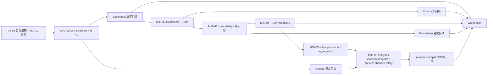

# 机构端七线重启基线

- 日期：2026-07-27
- 基线：`035c4516f448ca3bfcd95ba835c32ac367e0d964`
- 业务综合完成度：约 25%（规划估算）
- 公共底座完成度：约 65%（规划估算）
- 正式发布：0/7
- canonical 页面：仍以 capability-off 为主
- 本文性质：重启基线，不是 runtime 或 Migration 授权

## 一、统一完成尺度

```text
领域
→ 持久化／权威 reader
→ API
→ canonical 页面
→ 真实数据
→ 权限与审计
→ capability 发布
→ 测试环境验收
```

只完成公共契约、领域模型、安全收口或 capability-off 页面，不计为业务上线。

## 二、七线当前基线

| 支线 | 当前模块文件 | 目标模块 | 估算 | Migration／依赖 | 当前阻塞 | 下一垂直切片 | 发布门禁 |
|---|---:|---|---:|---|---|---|---|
| 工作台 | 22 | `src/modules/workbench` | 35% | 无独立 migration；依赖上游正式 provider | 真实客户、Care、会话、分析与机构运行 provider 尚未接入 | WB-01/WB-03 重新预检；至少三个正式上游 provider 可用后接线 | 真实聚合、机构 guard、局部失效、审计、页面验收、capability operational |
| 客户中心 | 14 | `src/modules/customers` | 20% | 真实 reader 依赖 MIG-01C；稳定引用／责任归属依赖 MIG-02 | MIG-01 未完整关闭；缺少本线 server/read-model、正式 API、canonical 页面和权威时间线聚合 | MIG-01C 后执行 CUS-01B；MIG-02 前隐藏 owner／“我的客户”等依赖能力 | 列表、详情、对象 guard、权威客户引用、审计、真实数据、capability read_only |
| 会话工作台 | 24 | `src/modules/conversations` | 25% | MIG-04 | 无正式持久化、API、页面、assignment 和 identity review 权威事实 | 先实施 MIG-04，再完成 CONV-03 repository/API 与 CONV-04 页面 | 会话、消息、分配、身份复核、风险、Care disposition provider 全部可追溯 |
| 预约与随访 | 14 | `src/modules/care` | 20% | MIG-02（与 Customers 共享） | 领域规则存在，但客户稳定引用／责任归属、任务/路径持久化、API、页面和正式来源 provider 尚未闭环 | 先实施 MIG-02，再完成任务列表、详情、分配、认领、流转与结果闭环 | 任务/路径 repository、对象 guard、并发版本、审计、时间线 contribution 完成 |
| 知识库 | 32 | `src/modules/knowledge` | 20% | MIG-03 | 版本与 job/lease 领域存在，但缺少正式 reader、页面、worker、OCR、索引与 AI adapter 接线 | 先实施 MIG-03，再统一 item/version/publication/job repository 与机构页面 | 上传、存储、解析、索引、检索、权限、审计和失败恢复满足发布门禁 |
| 经营分析 | 18 | `src/modules/analytics` | 25% | MIG-05 + MIG-06 | 计算领域存在，但消费事实 repository、snapshot repository/API、正式 providers、五页 UI 和真实数据源尚未闭环 | MIG-05 后仅完成事实 reader／有效链／确定性聚合；MIG-06 后完成 AN-03C snapshot repository/API、正式 providers、五页只读分析和报告治理 | 期间/金额/退款/消费事实可验证；五页共享同一 snapshot，不自行绕过快照读事实，capability read_only |
| 管理中心 | 20 | `src/modules/institution-system` | 25% | 真实 reader 依赖 MIG-01C；持久化渠道安全状态依赖 MIG-06 | 部分 AI 使用 reader 与留存领域存在，但 MIG-01 未完整关闭，正式页面、控制面持久化和连接状态边界尚未闭环 | MIG-01C 后完成 SYS-01B/C 真实只读；渠道急停等持久状态在 MIG-06 后接线 | 控制面权限、审计、配置并发、连接状态与低敏展示完成 |

## 三、业务依赖与发布列车



该图表达业务发布依赖，不替代数据库串行门禁。`MIG-01A1` 只完成 expand；A2、BASE-02 writer／Guard、B 回填和 C enforce 全部完成后，Customers／System 等既有事实 Reader 才可启动。Knowledge 正式 Reader 还必须等待 MIG-03，并且不得回退读取 mock／seed／demo 或旧可覆盖索引。

MIG-02 由 Customers 与 Care 共享；MIG-06 由 Analytics 与 Institution System 共享。共享只表示一个受控 schema/migration 单元，各模块仍分别拥有自身领域事实并通过版本化公共契约接线。

Analytics 的 MIG-05 节点只提供消费事实与确定性聚合。Workbench 和五页分析必须消费 MIG-06 后的 snapshot/API/providers，不得绕过快照直接读取事实或在 MIG-05 后提前接线。

工作台最后接线，不能继续以 mock、tenant-only 数据或 capability-off 投影代表正式业务数据。

## 四、公共底座重启条件

1. Route Group 保持 `/hospital` 和 `/open-platform` URL 不变；
2. 正式 provenance 验证；
3. fresh active 当前成员资格 provider；
4. institution-scoped guard；
5. object-scoped guard；
6. capability 与授权分离；
7. 统一页面状态、低敏错误和审计；
8. `src/modules/institution` 新业务冻结规则；
9. MIG-01A2 锚点 provisioning 和全部 writer 双写完成；
10. MIG-01B 确定性回填、追赶和冲突清零；
11. MIG-01C 非空、外键、attribution 和 shape enforce 完成。

前 8 项可在 V2-02 预检并形成低风险实施候选；第 9～11 项未完成前，任何七线都不得把 tenant-only、默认机构、未回填或未 enforce 的数据接成真实机构级 reader。

## 五、MIG 队列

### MIG-01 完整关闭门禁

| 单元 | 当前状态 | 下一动作 |
|---|---|---|
| MIG-01A1 | 已有 expand migration | 复核，不得据此宣告 closed |
| MIG-01A2 | 未关闭 | 按 manifest provision 锚点与 revision=1 |
| BASE-02B／BASE-02 | 需逐项复核 | 锚点／revision／Guard、全部 writer 双写与当前成员双键上下文 |
| MIG-01B | 未实施 | 确定性回填、高水位追赶、冲突清零 |
| MIG-01C | 未实施 | 非空、外键、audit attribution 和 shape enforce |

CUS-01B 及其他真实机构级 reader 必须等待 MIG-01C 和对应 BASE-02 上下文。

### MIG-02～MIG-06

| 编号 | 业务线／所有者 | 当前状态 | 下一动作 |
|---|---|---|---|
| MIG-02 | Customers + Care | 未形成正式 migration | 客户稳定引用、责任归属、认领、随访任务、结构化结果和线性路径最小持久化 |
| MIG-03 | Knowledge | 已有设计 | MIG-02 后独立实施 |
| MIG-04 | Conversations | 已有数据模型申请 | MIG-01、MIG-02、MIG-03 后独立实施 |
| MIG-05 | Analytics facts | 已有数据变更设计 | MIG-01～MIG-04 后实施消费事实、有效链与确定性聚合；不解锁 snapshot API／providers／五页 UI |
| MIG-06 | Analytics snapshots/reports + System channel safety | 仅计划 | MIG-05 后冻结 snapshot／报告与持久化渠道安全状态白名单；合并后才启动 AN-03C、正式 providers 和五页 UI |

完整顺序为：

```text
MIG-01A1 → MIG-01A2 → BASE-02／writer 门禁
→ MIG-01B → MIG-01C
→ MIG-02 → MIG-03 → MIG-04 → MIG-05 → MIG-06
```

所有 Migration 必须独立授权、独立 PR、空库验证、升级验证和回退验证。

## 六、旧目录停止增长

- `src/modules/institution/`：只允许修复、兼容和迁出；
- `src/modules/open-platform/`：禁止新增跨多个领域的巨型文件；
- `src/app/api/institution/`：旧七线计划明确端点仅可申请逐路由薄兼容例外；新实现默认进入 `src/app/api/v1/institution/`，兼容层不得承载业务逻辑；
- `src/app/api/open-platform/`：未经逐路由兼容例外，不新增非版本化路由；
- 外部 adapter 不再进入七线业务模块；
- 七线不得复制 `institution-contracts` 中的公共声明。

## 七、发布定义

- 领域完成度；
- 持久化完成度；
- API 完成度；
- 页面接线完成度；
- 权威数据完成度；
- 权限与审计完成度；
- capability 状态；
- 测试环境验收；
- 旧实现退出状态。

正式发布完成度只有 `0/7` 至 `7/7`，不得用领域测试数量替代。
