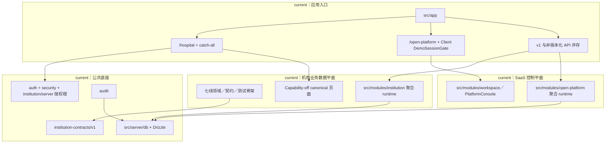
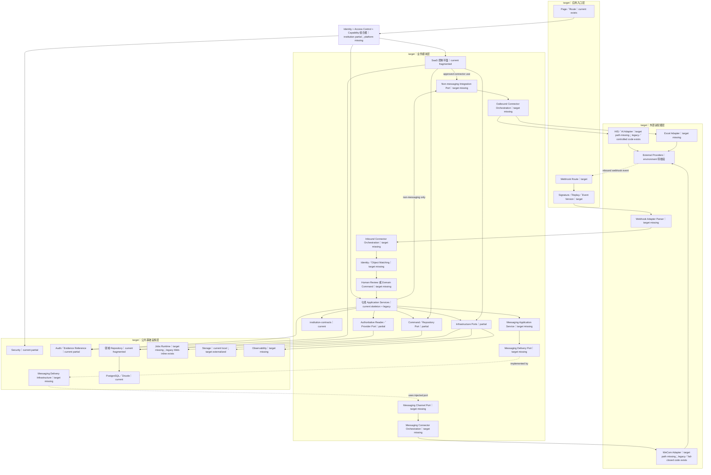

# 智美天工软件架构

- 日期：`2026-07-28 CST +0800`
- 任务：`V2-ARCH-DOCS-02`
- 基线：`5ceb3eb69f2d755c2ec20a4414c8d57c5ebd4961`
- 状态：`proposed_for_review`
- 执行性质：`docs-only`
- 适用状态词：`current`、`target`、`proposed`、`planned`、`historical`、`待核验`

## 1. 文档定位

本文是架构 V2 的软件视图，说明模块化单体内部的平面、分层、模块所有权、依赖方向、公共契约、授权、安全、消息、审计、Repository 和外部 Adapter 边界。

权威关系固定为：

1. 当前 `main` 的源码、测试和配置决定 `current`；
2. `docs/architecture/architecture-v2.md`、已接受 ADR 和模块映射决定已确认的 `target`；
3. 本文只展开同一套 V2 架构，不创建第二套模块图、第二套所有权或新的 Runtime 授权；
4. 目标目录、Port、Provider、Repository 和 Route Group 在没有代码证据时必须标为 `target/proposed`；
5. 仓库外 CI 和运行时依赖关系为`待核验`。

本文不授权代码、目录、API、Route、Schema 或配置迁移。

## 2. 事实依据

### 2.1 当前代码与配置

- `src/app/**`：当前 App Router 页面、API 和版本探针；
- `src/modules/**`：当前领域、应用服务、组件、Repository 和模块测试；
- `src/server/**`：当前数据库等公共运行时；
- `package.json`：Next.js、React、TypeScript、Vitest 和命令入口；
- `tsconfig.json`、`eslint.config.mjs`、`vitest.config.ts`：当前编译、Lint 和测试配置。

### 2.2 已接受架构与契约

- `docs/architecture/architecture-v2.md`：目标目录、分层、Migration 和发布顺序；
- `docs/architecture/architecture-v2-module-map.md`：当前模块到目标模块的唯一映射；
- `docs/architecture/architecture-v2-evidence-audit-20260728.md`：当前实现证据与缺口；
- `docs/architecture/business-architecture.md`：两平面、七条业务线和公共能力；
- `docs/architecture/application-architecture.md`：入口、授权、Reader、写操作和 Adapter 链；
- `docs/decisions/architecture-v2-decisions.md`：冻结、兼容、依赖和迁移 ADR；
- `src/modules/institution-contracts/v1/**`：当前版本化机构公共声明。

`docs/architecture/module-boundaries.md` 中较早的目标模块清单属于 `historical` 参考；其中 `appointments`、`treatments`、`followups`、`opportunities`、`rbac` 等拆分与已接受七线边界不一致，不能覆盖 V2。

## 3. 当前实际状态

### 3.1 架构风格

`current` 是一个 Next.js App Router、React、TypeScript、PostgreSQL 和 Drizzle 组成的模块化单体：

- 一个仓库；
- 一个 `package.json`；
- 一个 Web 应用入口；
- 一套 PostgreSQL／Drizzle 数据资产；
- 业务模块和测试主要共置在 `src/modules/**`。

当前处于过渡期：

```text
安全与契约底座较成熟
+ 七线领域／契约／测试骨架已建立
+ 旧 institution／open-platform 聚合 runtime 仍占主体
+ 目标 Access Control、Messaging、Integrations 等边界尚未完整物理落位
```

“模块化单体”不表示当前边界全部干净，也不表示需要拆成微服务。

### 3.2 当前两个平面

两平面是同一单体内的逻辑职责，不是两个服务、仓库或数据库。

#### SaaS 控制平面

`current` 主要分布在：

- `src/app/open-platform/page.tsx`；
- `src/modules/open-platform/**`；
- `src/modules/workspace/**`；
- `src/modules/auth/**`；
- `src/modules/security/**`；
- Branding、Entitlement、AI／连接器配置等旧聚合实现。

平台页面当前仍使用客户端 `DemoSessionGate`，缺少与机构端同等级的正式服务端授权根。因此平台控制平面只能视为 Demo／受控预览，不能写成正式授权已完成。

#### 机构业务数据平面

`current` 入口是 `/hospital` 和 Catch-all，七条业务线的当前模块为：

| 业务线 | `current` 路径 | 当前性质 |
|---|---|---|
| Workbench | `src/modules/institution-workbench` | 领域投影、契约消费、测试和 capability-off 壳 |
| Customers | `src/modules/customer-center` | 领域骨架；正式持久化仍主要在旧 `institution` |
| Conversations | `src/modules/institution-conversations` | 领域／契约／测试，MIG-04 未落位 |
| Care | `src/modules/care` | 领域骨架；旧持久化仍在 `institution` |
| Knowledge | `src/modules/institution-knowledge` + `knowledge-base` | 新领域与旧 Runtime 并存 |
| Analytics | `src/modules/institution-analytics` | 领域算法／测试，MIG-05／06 未落位 |
| Institution System | `src/modules/institution-system` | 领域／Reader seam，正式控制面未闭环 |

七条新线正式发布仍为 `0/7`。Capability 声明、Mock、Demo、Seed、领域测试、页面壳或代码合并均不代表正式发布。

### 3.3 当前软件结构



图中没有 `src/integrations/*`、`src/modules/access-control` 或 `src/modules/messaging`，因为这些目标路径当前不存在。Identity、Tenancy、Customers、Conversations、Analytics、Workbench 和 Route Group 的目标名称也尚未全部物理落位。

### 3.4 当前依赖链样本

已接受的目标依赖方向已有局部实现，但不是全仓现状：

- 机构 Page 先走服务端授权，再渲染 capability-off 页面；
- Workbench 的 Action、Capability 和 Lifecycle Projection 只消费公共契约与本地 View Model，是较好的局部边界；
- Institution System 有 Port-like `RecordSource` 接口和注入 Reader seam；
- 旧 Knowledge Runtime 有 Route Handler → Service／Repository → DB 的局部链；
- 大量旧 Route 仍直接组合 DB、Repository 或具体 Service；
- 外部 AI、WeCom、Knowledge Provider 仍位于 `open-platform` 或 `institution` 聚合模块。

因此不能把以下链写成 `current` 已全局实施：

```text
Page／Route
→ Application Service
→ Port／Provider
→ Repository／Adapter
```

它是已接受的 `target`，当前只有局部证据。

### 3.5 公共边界当前状态

| 边界 | `current` | 已确认职责 |
|---|---|---|
| `institution-contracts` | `v1` 导航、Route、Capability、Source 和 Action 声明已存在 | 只保存跨线版本化声明；不拥有 Repository、授权事实或发布状态 |
| Access Control | 目标边界已确认；`src/modules/access-control` 当前尚未物理落位，职责分散在 `auth`、`security`、`institution/server` | Provenance、成员资格、机构／对象 Guard、Action Policy |
| Security | 授权与通用安全混合 | 目标保留 Secret、低敏输出、安全开关和通用安全能力 |
| Messaging | 目标模块不存在；Draft／Delivery／渠道逻辑仍在旧 `institution` | 消息草稿、审批、Delivery 和结果，位于 Adapter 之前 |
| Audit | 独立模块和 Repository 已存在，但仍跨读旧业务表 | 低敏审计事件和 Evidence Reference，不拥有业务事实 |

Capability Registry 明确只是声明，不能证明授权、运行状态或正式发布。

### 3.6 旧聚合模块与 API 兼容

`current` 旧聚合模块仍承载大量运行时：

- `src/modules/institution/**`：只允许修复、兼容和迁出，禁止新增业务事实、Repository、长期 DTO、Provider 或页面；
- `src/modules/open-platform/**`：禁止新增跨多个职责的巨型文件，应按 Tenancy、Entitlements、Branding、AI Integration 和 Platform System 垂直迁出；
- v1 与非版本化 API 并存；
- 当前有一处 `v1 → legacy` re-export 兼容试点，它是过渡例外，不是最终目标方向。

最终政策仍是：新机构 API 默认 v1，旧 Route 逐路由成为薄兼容层；每条业务 Route 只能有一个业务所有者，兼容层不得保存 Parser 之外的业务规则、Repository、内部 DTO 或另一套测试事实。

### 3.7 Architecture Test、依赖方向和 CI

`current` 可验证证据：

- Vitest 发现模块共置测试；
- `package.json` 有 `lint`、`typecheck`、`test` 和 `preflight`；
- Workbench 有局部源码级 import 边界测试；
- Auth 和 Security 有局部 Owner／Reference 边界测试；
- Canonical Route、公共契约和 Guard 有模块级测试。

明确缺口：

- 仓库内没有 `.github/`，没有可审计的 Workflow；
- 根 `tests/` 不存在，目标 `contract/security/integration/e2e` 分层尚未落位；
- ESLint 没有全仓 `no-restricted-imports` 或模块依赖方向规则；
- TypeScript 路径别名不等于层级约束；
- 没有独立 Architecture Test 命令、全仓 import graph、循环依赖、冻结目录、API 兼容白名单或跨域 Repository 访问门禁；
- 仓库外 CI 是否存在为`待核验`。

局部边界测试不能被写成 Architecture CI 已建立。

## 4. 建议目标状态

### 4.1 模块化单体、两平面和四层

`target` 继续采用一个模块化单体：

1. **应用入口层**：Marketing、Auth、机构 Route Group、平台 Route Group、API v1、Webhook；
2. **业务模块层**：SaaS 控制平面与七条机构业务线；
3. **公共基础设施层**：DB、Jobs、Storage、Audit、Security、Messaging、Observability；
4. **外部适配器层**：HIS、WeCom、AI、Excel、Webhook Adapter。

SaaS 控制平面负责 Identity、Tenancy、Access Control、Entitlements、Platform System、Branding、AI／Connector 配置。机构业务数据平面保持 Workbench、Customers、Conversations、Care、Knowledge、Analytics、Institution System 七线。

### 4.2 目标依赖方向

只读链：

```text
Server Page／Route
→ Session／Membership／Scope／Authorization
→ Application Service
→ Authoritative Reader／Provider Port
→ Source Envelope
→ View Model
```

写链：

```text
Route
→ Versioned Parser
→ Authorization
→ Application Service
→ Preconditions
→ Repository Command Port
→ Audit／Evidence
→ Safe DTO
```

外部接入链：

```text
Page／Route
→ Domain Application Service
→ Application Port
→ Connector Orchestration
→ src/integrations/* Adapter
→ External Provider
```

依赖规则：

- Domain 不依赖 `src/app`、React 页面、DB 或具体 Adapter；
- Route 不拥有业务规则和 Repository 具体实现；
- Application Service 不读取其他领域内部表或 Repository；
- Repository 实现只属于事实 Owner；
- Workbench 只消费版本化公共契约和正式 Provider；
- Messaging 在业务模块与渠道 Adapter 之间形成统一审批和 Delivery 边界；
- External Adapter 不拥有业务事实、授权决策或客户可见内容审批；
- 公共契约只保存最小稳定声明，不成为共享业务实现。

### 4.3 目标软件结构



Webhook 不走用户会话授权组合根；它必须先经过签名、重放和事件版本校验，再由 Adapter Parser／Connector Orchestration 进入领域命令或人工复核。图中的 `partial` 表示已有局部能力但目标边界未完整落位，`target missing` 表示目标已确认但物理实现不存在。只有在对应垂直切片获批时才能创建目标模块、Port、Repository 或 Adapter；不得为图的完整性建立空目录、空模块或占位接口。

### 4.4 目标公共边界

#### `institution-contracts`

- 保存 canonical Route、导航、Capability、Source、Action 和跨线最小 DTO；
- 使用显式版本；
- 不包含 Repository、Provider、权限事实、发布状态或可变实现；
- 变更必须有消费者测试和兼容策略。

#### Access Control

- 拥有 Provenance、Fresh Membership、Institution Scope、Object Guard 和 Action Policy；
- Role Audience、Entitlement、Capability、对象权限和动作前置条件分别判断；
- 缺失、未知、多候选或冲突全部 fail-closed；
- 不整体吞并 Security。

#### Security

- 保留 Secret、低敏输出、安全开关、加密和通用请求安全；
- 不拥有业务角色、客户对象或跨域事实；
- 与 Access Control 通过明确契约组合。

#### Messaging

- 作为公共能力同时包含单一 Owner 的 Messaging Application Service 与 Delivery 基础设施；二者不是两个事实源；
- Delivery Port 和 Integration Port 由应用边界先定义，基础设施与渠道 Adapter 分别实现或消费这些抽象，不能反向让 Application Service 依赖具体基础设施；
- 拥有消息 Draft、审批、Delivery、幂等和渠道结果；
- 客户可见内容和真实发送必须人工确认；
- 通过 Integration Port 调用渠道 Adapter；
- 不拥有 Care、Conversation 或 Customer 的内部事实。

#### Audit

- 记录低敏、可追溯的动作、结果、Scope 和 Evidence Reference；
- 不直接跨读其他领域内部表；
- 由 Owner 提供公共引用或投影；
- Audit 存在不替代业务事务、权限或运行监控。

### 4.5 目标 Architecture Test 与 CI 门禁

`proposed` 最小门禁至少覆盖：

- Domain 禁止依赖 `app`、React、DB 和 Adapter；
- 业务模块禁止读取其他领域 Repository／内部 DTO；
- Workbench 只消费 Contracts／Provider；
- 新外部调用只允许进入获批的 `src/integrations/*`；
- `institution` 和 `open-platform` 冻结政策；
- 非版本化 Route 白名单与薄兼容形状；
- v1 Route 与唯一业务 Owner 的映射；
- 当前物理路径和目标路径不得混写；
- Architecture Test、typecheck、test、build 的明确执行顺序和失败策略。

具体工具、历史违规基线和 CI Workflow 尚属 `proposed/待确认`，不能写成已部署。

## 5. 当前与目标差距

| 领域 | `current` | `target` | 影响 |
|---|---|---|---|
| 模块边界 | 新领域骨架与旧聚合 Runtime 并存 | 单一业务 Owner 的垂直切片 | 重复逻辑、迁移面扩大 |
| 平台授权 | Client Demo Gate | 正式服务端平台授权根 | 页面可见性被误当权限 |
| Access Control | 分散在 Auth／Security／Institution | 独立职责边界 | 授权与通用安全混合 |
| Messaging | 旧 Institution 内 Draft／Delivery／渠道逻辑 | 独立 Messaging + Adapter Port | 审批、业务和渠道耦合 |
| Audit | 独立模块但跨读业务表 | 公共引用／Owner 投影 | 跨域 Repository 耦合 |
| Route | 大量 Route 直接组合具体实现 | 薄入口 + Application Service | HTTP、授权、业务和 DB 混合 |
| API 版本 | v1／非 v1 并存 | 新实现默认 v1，旧路径薄兼容 | 长期双实现 |
| Integrations | 目标目录不存在，Provider 在聚合模块 | Port-first + Provider Adapter | 凭证、协议和业务规则混合 |
| Workbench | 投影边界较好但正式 Provider 不足 | 最后聚合已发布 Provider | 复制 Mock 或上游事实 |
| Architecture Test | 局部源码边界测试 | 全仓依赖门禁和 CI | 违规只能人工发现 |
| 测试分层 | 模块共置测试为主 | 共置测试 + 获批的跨模块分层 | 集成与兼容证明不完整 |

## 6. 代码／Schema／Migration／测试／文档证据

| 类型 | 证据 | 支持的结论 |
|---|---|---|
| 配置 | `package.json` | 单一 Next.js／React／PostgreSQL 技术栈和验证命令 |
| 入口 | `src/app/hospital/page.tsx`、`src/app/hospital/[...slug]/page.tsx` | 机构服务端授权和 capability-off 当前入口 |
| 入口 | `src/app/open-platform/page.tsx` | 平台仍为 Client Demo Gate |
| 契约 | `src/modules/institution-contracts/v1/institution-navigation.ts`、`institution-routes.ts` | 七栏目与 canonical Route 已集中声明 |
| 契约 | `institution-capability-registry.ts` | Capability 声明不证明授权或发布 |
| 授权 | `src/modules/security/server/institution-request-authorization.ts` | 当前正式机构授权链的一部分 |
| 组合根 | `src/modules/institution/server/institution-server-runtime.ts` | 当前授权／运行时仍跨模块组合 |
| Workbench | `src/modules/institution-workbench/domain/**` | 局部公共契约消费和投影边界 |
| Legacy | `src/modules/institution/**`、`src/modules/open-platform/**` | 旧聚合 Runtime 仍占主体 |
| Route／Audit | `src/app/api/open-platform/audit-events/route.ts`、`src/modules/audit/server/audit-event-repository.ts` | 当前仍有 Route 直接组合 DB／Repository，以及 Audit 跨读旧业务表 |
| Route／Repository | `src/app/api/v1/knowledge-base/runtime/search/route.ts`、`src/modules/knowledge-base/server/v1-knowledge-base-runtime-api-routes.ts` | 旧 Knowledge 展示局部 Route → Service／Repository → DB 链 |
| Adapter | `src/modules/open-platform/server/platform-knowledge-ai-provider-adapter.ts` 等 | 外部 Adapter 尚未统一迁往 `src/integrations/*` |
| 兼容 | `src/app/api/v1/institution/wecom-official-dry-run/route.ts` | 当前有反向 re-export 过渡试点 |
| Schema | `src/server/db/schema.ts` | 当前单体共享 PostgreSQL Schema，领域物理所有权仍待垂直收口 |
| Migration | `drizzle/0038_mig_01a1_institution_isolation_expand.sql`、`drizzle/meta/_journal.json` | MIG-01A1 已存在，但只完成 Expand |
| 测试 | `src/modules/institution-workbench/tests/*Boundary.test.ts` | 局部 import 边界已有测试 |
| 测试 | `src/modules/auth/tests/FormalServerSessionProvenanceOwner.test.ts` | 正式 Session Owner 有局部禁止依赖门禁 |
| 配置 | `eslint.config.mjs`、`tsconfig.json`、`vitest.config.ts` | 尚无全仓层级和依赖图约束 |
| 文档 | `docs/architecture/architecture-v2.md` | 两平面、四层、目标目录和实施顺序 |
| 映射 | `docs/architecture/architecture-v2-module-map.md` | 唯一 current→target 模块映射 |
| ADR | `docs/decisions/architecture-v2-decisions.md` | 冻结、Port-first、薄兼容和无空目录规则 |

### 6.1 已发现的软件架构冲突

`docs/architecture/module-boundaries.md` 的旧目标清单把 Appointments、Treatments、Follow-ups 等拆为独立模块，并列出旧 RBAC 等边界；这与当前已接受的 Customers、Care、Conversations、Knowledge、Analytics、Institution System、Workbench 七线所有权不一致。

处理原则：

- 将该清单视为 `historical` 低优先级材料；
- 以 `architecture-v2.md`、模块映射和 ADR 为准；
- 不静默复用旧清单，不修改旧文档；
- 若未来需要清理，必须由独立文档治理任务完成。

另一个 `current gap` 是现有 `v1 → legacy` re-export 试点与最终“legacy 薄兼容到 v1 Owner”的方向相反。它是受控过渡例外，不推翻目标，也不能成为新 Route 模板。

## 7. 风险与影响

- 把目标目录或 Port 写成 `current`，会掩盖真正的实现缺口；
- 旧聚合模块继续新增业务，会扩大跨域依赖和迁移风险；
- Route 直接创建 DB／Repository，会把授权、业务、持久化和 HTTP 错误处理混在一起；
- 平台 Client Demo Gate 被误当正式授权，会形成高风险控制面越权；
- Access Control 与 Security 整体搬迁或重命名，会同时改变授权和通用安全；
- Messaging 未独立前直接迁移渠道 Adapter，会绕过审批和 Delivery 事实；
- Workbench 读取上游 Repository 或复制事实，会成为新的聚合事实库；
- v1 和非 v1 长期保留两套业务逻辑，会造成行为漂移；
- 局部测试被误写为全仓 Architecture CI，会产生虚假门禁；
- 一次性创建目标目录和空 Port，会制造无行为、无 Owner 的架构外壳。

## 8. 需要的改造

以下均为 `planned/proposed`，不是本任务授权：

1. 先冻结平台正式授权、Route Group 和 API 兼容白名单；
2. 为每条垂直切片指定唯一业务 Owner、Application Service、Port 和 Repository；
3. 逐路由将旧 API 收敛为薄兼容层，保留调用观测和回退；
4. 将 `institution` 和 `open-platform` 的新业务写入保持冻结；
5. 按职责拆分 Access Control 与 Security，不做整体移动；
6. 以首个真实 Delivery 切片建立 Messaging，而不是创建空模块；
7. 先定义 HIS／WeCom／AI／Excel／Webhook Port，再迁移获批 Adapter；
8. 解除 Audit Repository 对旧业务表的直接耦合；
9. 让 Workbench 最后消费至少经独立发布的正式 Provider；
10. 建立最小 Architecture Test、冻结目录和 Route 白名单门禁；
11. 为历史违规建立显式白名单和退出条件，不一次性大改。

不得预先创建空目录、空模块、空 Port、空 Provider 或占位 Adapter。

## 9. 实施顺序

```text
V2-ARCH-DOCS-02
→ V2-ARCH-DOCS-03
→ V2-02B-MIG01-CLOSURE-PREFLIGHT
→ V2-02C-PLATFORM-AUTH-ROUTE-PREFLIGHT
→ 最小 Architecture／Quality CI
→ MIG-01A1 复核
→ MIG-01A2
→ BASE-02B／BASE-02 锚点验证、scope revision、Guard 与全部 Writer 双写
→ Audit 兼容 Writer／模板保护
→ MIG-01B
→ MIG-01C
→ Customers 真实只读
→ MIG-02 + Care
→ MIG-03 + Knowledge
→ MIG-04 + Conversations
→ MIG-05 Analytics Facts
→ MIG-06 + AN-03C／Analytics／Institution System
→ Workbench 最后接线
→ 外部 Adapter 正式发布
→ 旧入口观测和退出
```

Route Group、平台授权、API 兼容、Architecture CI 和数据 Migration 必须拆为不同 PR。软件边界随真实垂直切片落位，不先建空壳。

## 10. 已确认决策

- 继续采用模块化单体，不拆微服务；
- 两平面是职责划分，不是服务、仓库或数据库拆分；
- 保持应用入口、业务模块、公共基础设施和外部适配器四层；
- 保持七条机构业务线；
- `institution-contracts` 是跨线公共声明边界，不是共享实现；
- Access Control 与 Security 分责，不整体搬迁；
- `institution` 只允许修复、兼容和迁出；
- `open-platform` 禁止继续新增跨职责巨型文件；
- 外部接入采用 Port-first；
- 新机构 API 默认 v1，旧 Route 逐路由薄兼容；
- 一条 Route 只有一个业务 Owner；
- Workbench 最后消费正式 Provider；
- Customers／System Reader、Care、Knowledge、Conversations、Analytics 严格等待既定 MIG 门禁；
- 平台正式服务端授权仍是独立缺口；
- 七线正式发布仍为 `0/7`；
- Capability、Mock、Demo、Seed、测试通过或代码存在均不代表正式发布。

## 11. 待确认决策

| 决策 | 当前建议 | 影响 |
|---|---|---|
| 平台正式授权是否为全部平台 Runtime 的硬门禁 | 是 | 完成前平台仅为 Demo／受控预览 |
| 最小 Architecture CI 工具和失败策略 | 先覆盖高风险依赖规则 | 决定 MIG 前自动门禁强度 |
| 历史违规白名单和退出期限 | 按垂直切片维护 | 避免一次性大重构 |
| 旧 Route 白名单与最长兼容期 | 按路由族决定并依赖真实观测 | 防止永久双实现 |
| Messaging 首个垂直切片 | 从受控 Draft／Delivery 开始 | 决定旧 Repository 迁出顺序 |
| Audit 跨表查询的目标 Owner | 由业务 Owner 提供公共投影 | 解除跨域读取 |
| Workbench 首次正式发布的 Provider 数量 | 建议至少 3 个 | 需在 WB 预检冻结 |
| Source Envelope Parser Owner | 在首个真实 Reader 前确认 | 影响全线失败语义 |
| 当前反向 re-export 试点退出方式 | 独立路由预检后收敛 | 防止复制过渡模式 |

## 12. 禁止范围

本文不授权：

- 修改或移动 `src/**`、API、Route、组件、测试或配置；
- 创建空目录、空模块、空 Port、空 Provider 或占位 Adapter；
- 创建 `src/integrations/*` 空壳；
- 把目标 Route Group、Access Control、Messaging 或 Integrations 写成已存在；
- 整体重命名或搬迁 `auth`、`security`、`institution` 或 `open-platform`；
- 在旧聚合模块新增业务事实、Repository、长期 DTO 或 Provider；
- 让 Route Handler、Page 或 Workbench 直接拥有跨域 Repository；
- 让业务模块直接调用 HIS、WeCom、AI、Excel 或 Webhook Provider；
- 把 Capability、客户端 Gate 或 Role Audience 当成正式授权；
- 把局部测试或仓库外未知 CI 写成 Architecture CI 已建立；
- 调整七线所有权、MIG 顺序或 Workbench 最后接线原则；
- 连接数据库、外部系统、CI、监控、测试服务器或生产环境。
