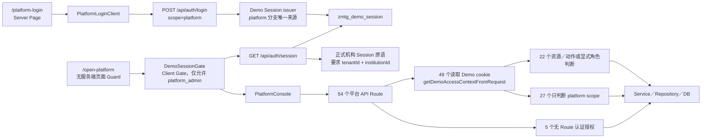

# V2-02C 平台正式授权与路由族静态预检

- 任务：`V2-02C-PLATFORM-AUTH-ROUTE-PREFLIGHT`
- 日期：2026-07-28
- 基线：`main@677177d8551546ed7142aaffb07f911c43ad095c`
- 性质：`docs-only` 仓库静态证据审计
- 唯一交付：本文
- 结论：正式平台服务端授权根尚未形成；本轮未实施平台 Runtime、Route Group、API 兼容迁移或发布

## 1. 文档定位

本文冻结平台登录、Session、页面入口、API 路由族、角色／策略、Service、Repository、测试和调用方在当前 `main` 的静态证据，并给出后续独立实施切片的依赖与安全边界。

本文不是第二套权限模型、路由事实源或 API 规范，不授权：

- 实施正式平台认证、Session、Guard、Entitlement、Capability 或 Audit；
- 移动 `src/app/open-platform` 或创建 `src/app/(platform)`；
- 新建、改写、代理、删除任何 API；
- 修改 Runtime、Schema、Migration、配置、package 或 lock；
- 连接真实环境，或启动任何候选实施切片。

## 2. 事实源、状态词与审计方法

### 2.1 事实与权威关系

1. `current` 事实由当前 `main` 的代码、测试、Schema、Migration、配置和已合并记录决定。
2. 最高级 `target` 约束由 `docs/architecture/architecture-v2.md` 与已接受的 `docs/decisions/architecture-v2-decisions.md` 决定。
3. `architecture-v2-module-map.md`、六类架构视图、代码证据审计、架构索引和 handoff 只负责展开、导航、核验与记录状态，不得独立改写模块所有权、权限根、路由政策、Migration 顺序或发布门禁。
4. 仓库外调用方、真实 Session、环境配置、部署状态、真实流量和生产授权均标记为“待确认”。
5. `target`、`proposed`、候选切片和本文结论都不构成 Runtime、安全、环境或发布授权。

已读取的核心证据包括：

- `src/app/(auth)/platform-login/**`
- `src/app/open-platform/**`
- `src/app/api/auth/{login,logout,session}/**`
- `src/app/api/open-platform/**`
- `src/app/api/v1/open-platform/**`
- `src/modules/{auth,security,open-platform,workspace,audit}/**`
- `src/modules/institution/server/{entitlement-usage-service,institution-ai-call-service,institution-ai-call-usage-repository}.ts`
- 相关模块测试
- `docs/architecture/{architecture-v2,application-architecture,software-architecture,development-architecture,architecture-v2-module-map,architecture-v2-evidence-audit-20260728}.md`
- 已接受 ADR、`docs/handoff/{NEXT_TASK,CURRENT_STATUS}.md`

`src/modules/entitlements/**` 当前不存在；这本身是缺口证据，不推导为可以创建该目录。

### 2.2 状态词

所有审计单元只使用以下状态：

| 状态 | 含义 |
|---|---|
| `已具备` | 当前仓库存在完整、一致、可追溯的静态证据 |
| `部分具备` | 存在部分结构或接线，但不足以关闭 |
| `缺失` | 仓库中没有所需实现或证据 |
| `阻断` | 存在必须先解决的授权、安全、依赖或兼容问题 |
| `待确认` | 仅凭仓库无法确定，或必须由后续获批环境核验 |

Demo、Mock、角色常量、客户端 Gate、页面／Route 存在、测试存在或 Capability 声明，都不能单独证明正式平台授权或正式发布。

### 2.3 计数口径

- 页面：`src/app/(auth)/platform-login/page.tsx` 与 `src/app/open-platform/page.tsx`，共 2 个。
- 旧 Route：`src/app/api/open-platform/**/route.ts`，按 Route 文件计 6 个、按导出 HTTP handler 计 7 个。
- v1 Route：`src/app/api/v1/open-platform/**/route.ts`，按 Route 文件计 48 个、按导出 HTTP handler 计 58 个；另有 3 个族内共享 helper（2 个 `_shared.ts` + 1 个 `_plan-change-shared.ts`）。
- API 总计：54 个 Route 文件、65 个 HTTP handler。
- Service／Repository：从 2 个页面、54 个 Route 及 3 个共享 helper 的直接本地 import 去重；文件名明确为 Service 的 14 个、Repository 的 14 个，共 28 个。
- 仓库内生产 HTTP 调用方：排除 Route 树、测试和 import 行后，静态检索 `/api/open-platform` 与 `/api/v1/open-platform` 字面量，共 12 个文件；另有 1 个营销页面直接 import Route `_shared` helper，不计为 HTTP 调用方。
- 核心相关测试文件：47 个直接 import 平台 Route／Route helper 或包含平台 API／路径字面量的测试文件，加 9 个 Session／认证／策略／页面关键测试文件，共 56 个。五个相关模块测试池总计 146 个，只作为更宽回归候选，不把其余 90 个写成直接 Route 证据。
- 仓库外调用方和环境真实流量无法由静态检索穷尽，统一为“待确认”。

## 3. 当前实际接线与总判断



核心判断：

1. `/platform-login` 提交 `scope: 'platform'` 后，`src/app/api/auth/login/route.ts` 只执行 Demo 认证；正式账户认证分支仅服务机构 scope。
2. `/api/auth/session` 具备正式机构 Session 校验原语，但正式 cookie 要求 `accountId + tenantId + institutionId`，`auth-account-repository.ts` 的 `findCurrentFormalSessionUser()` 在正式 Session snapshot 解析中拒绝平台角色，不能据此宣称正式平台 Session 已具备。
3. `/open-platform` 没有服务端页面 Guard；`DemoSessionGate` 是客户端展示门禁，只检查 `authenticated + role`，当前页面还只允许 `platform_admin`。
4. 平台 API 不复用 `/api/auth/session` 的正式分支，而是直接或经共享 helper 解码 Demo cookie。54 个 Route 中 49 个依赖 Demo Context，5 个完全没有认证授权。
5. 当前角色、资源和动作矩阵是“部分具备”，但没有形成平台正式 Session → Actor／Provenance → platform Scope → target tenant／对象 → Action → Entitlement／Capability → Audit 的统一服务端组合根。
6. 登录态存在不等于平台角色有效；平台角色有效不等于 target tenant 授权；target tenant 授权不等于对象／Action 授权；Capability 或测试存在也不等于正式发布。

## 4. 平台入口与 Session 审计

| 审计单元 | 状态 | 当前证据 | 关键缺口 |
|---|---|---|---|
| `/platform-login` | `阻断` | 页面壳和品牌加载为部分结构：`src/app/(auth)/platform-login/page.tsx` 加载已发布品牌配置，异常时回退默认配置，再渲染 `PlatformLoginClient` | 正式平台登录入口链未形成；页面不建立正式平台身份，品牌数据回退也不是认证证据 |
| `PlatformLoginClient` | `部分具备` | `ConfiguredLoginPages.tsx` 向 `/api/auth/login` 提交 `scope: 'platform'`，成功后跳转 `/open-platform` | 客户端提交的 scope 不是可信授权来源 |
| 平台登录 Route | `阻断` | `src/app/api/auth/login/route.ts` 的 platform 分支只调用 `authenticateDemoUser()` 并签发 `zmtg_demo_session`；`FormalAuthRoutes.test.ts` 明确验证零 DB、零 formal runtime | 缺正式平台账户来源、签发、Provenance、撤销和平台角色绑定 |
| Demo Session | `部分具备` | `demo-session.ts` 有一个 `platform_admin` Demo 用户，`tenantId=null`、`source=demo_session`，签名和过期校验存在 | Demo 入口在非生产默认开启，生产可通过配置显式开启；真实环境状态为“待确认”，且 Demo 不能成为正式平台 Actor |
| `/api/auth/session` | `部分具备` | 可区分 formal 与 demo cookie；formal 分支校验 key ring、claims 与 DB snapshot，demo 分支校验 Demo 开关和签名 | formal 分支是机构双键语义；没有正式平台 Session 产出与消费闭环 |
| 正式 Server Session 原语 | `部分具备` | `formal-server-session-provenance-owner.ts` 与 `auth-account-repository.ts` 提供机构正式 Session 基础 | issuer 要求 tenantId、institutionId；`findCurrentFormalSessionUser()` 的正式 Session snapshot 解析拒绝平台角色 |
| `DemoSessionGate` | `部分具备` | 客户端请求 `/api/auth/session`，失败跳登录、角色不符跳机构端 | 不校验正式 source、platform scope、target tenant、对象、Action、Entitlement 或 Release Gate |
| `/open-platform` 页面 | `阻断` | `src/app/open-platform/page.tsx` 只包裹 `DemoSessionGate allowedRole="platform_admin"` | 没有服务端 Guard；深链接和首屏执行不能以客户端 Gate 作为正式安全边界 |
| `PlatformConsole` | `阻断` | 一个 Client Component 聚合 14 个导航视图（平台总览 + 13 个导入面板），并显示静态“超级管理员” | 页面栏目没有按正式 Actor、三类角色、对象或 Action 逐项授权；全部栏目可被客户端 Gate 通过后加载 |
| 页面与 API 授权根一致性 | `缺失` | 页面通过 `/api/auth/session` 做客户端角色检查；API 通过 `getDemoAccessContextFromRequest()` 独立解码 Demo cookie | 页面和 API 没有共享正式平台服务端组合根 |

由当前 platform login 签发的 Demo Actor 来自 `demo-session.ts` 中的静态用户；`getDemoAccessContextFromRequest()` 根据 Demo role 推导 `scope='platform'`，通常得到 `userId`、role、`tenantId=null`、`institutionId=null`、`source='demo_session'`。但该函数会保留 Demo cookie payload 中已有的 Session source，`decodeDemoSession()` 也接受 `server_session`；`AccessContext.test.ts` 明确覆盖了这种保留行为。因此 Demo-cookie Context 的 `source` 字段不能作为正式 Provenance 证明。业务 Route 接收的 tenantId 多来自 path、query 或 body，而不是该 Actor Context。

## 5. 平台角色、资源与动作策略

### 5.1 当前策略矩阵

`src/modules/security/domain/access-control.ts` 定义三类平台角色、17 个 `ProtectedResource` 和 20 个 `ProtectedAction`。当前与平台角色有关的策略如下：

| 角色 | 当前已声明 Resource／Action | Route 接线判断 |
|---|---|---|
| `platform_admin` | `tenant: read_aggregate/read_detail/manage_status`；`permission_policy: read_detail/manage_policy/review`；`ai_model_config: read_detail/update/manage_credentials/test_connection`；`safety_switch: read/read_detail/update/disable`；`real_channel: read/enable/disable` | tenant 与 AI model 的部分 Route 已接线；permission、safety、real_channel 未形成完整平台 Route 族 |
| `platform_operator` | `platform_health: read_aggregate/read_detail`；`ai_model_config: read_detail`；`tenant: read_aggregate` | 只在少数读取 Route 可达；scope-only Route 反而会放行超出矩阵的 mutation |
| `security_auditor` | `ai_model_config: read_detail/review`；`audit_log: read_detail/export_report/review` | AI model 读取和旧 audit-events 局部可达；scope-only Route 会让该角色命中 provider、Knowledge、品牌和 reset mutation |

`knowledge_management` 虽列入 `ProtectedResource`，但当前策略表没有对应平台角色 policy；现有 Knowledge Route 也没有用该资源执行 `canAccessResource()`。角色和常量存在不等于该领域已授权。

### 5.2 当前接线分布

| Route 分类 | Route 文件数 | 含义 | 判断 |
|---|---:|---|---|
| Demo + 直接 `canAccessResource` | 14 | Route 直接读 Demo Context，并检查 Resource／Action | `部分具备` |
| Demo + 共享 policy helper | 7 | plan-catalog 与 tenant plan-change 经族内 helper 检查 Resource／Action | `部分具备` |
| Demo + 显式角色 | 1 | 旧 audit-events 允许 `platform_admin/security_auditor` | `部分具备` |
| Demo + 直接 scope-only | 21 | 只要求 Demo Context 且 `scope='platform'` | `阻断` |
| Demo + 共享 scope-only | 6 | homepage-brand `_shared.ts` 只检查 platform scope | `阻断` |
| 无认证授权 | 5 | 不读取 Session／Context，不执行 Guard | `阻断` |
| 合计 | 54 | 22 个带 policy／显式角色，27 个 scope-only，5 个无 Guard | `阻断` |

只有 `tenants/[tenantId]/entitlement-usage` 把 `targetTenantId` 传给 `canAccessResource()`；但该函数只在 `context.scope === 'tenant'` 时执行跨租户比较，因此对 platform scope 仍不构成 target tenant 授权。其余携带 tenantId 的 Route 连该参数都没有传入。

## 6. 正式平台授权根总表

| 单元 | 状态 | 当前证据 | 缺失证据 | 阻断项 | 仓库外待确认事项 | 建议后续切片 |
|---|---|---|---|---|---|---|
| 正式服务端 Session 解析 | `部分具备` | `/api/auth/session` 有正式机构 cookie 校验、claims 与 DB snapshot | 平台正式签发、平台 claims shape、撤销与统一消费 | platform 登录只签发 Demo；`findCurrentFormalSessionUser()` 的正式 Session snapshot 解析拒绝平台角色 | 真实身份源、SSO／账号政策、密钥和 Session TTL | 切片 1 |
| Actor／Provenance | `缺失` | 机构正式 Provenance 原语存在 | 平台 Actor、来源、认证强度、revision 与可追溯 owner | 54 个平台 Route 均未消费正式 provenance；Demo-cookie Context 不验证 source 与 cookie 类型一致 | 真实平台管理员来源与审计主体映射 | 切片 1 |
| platform Scope | `部分具备` | Demo role 可由 `access-context.ts` 推导 platform scope | 正式 Session 到可信 platform scope 的组合根 | scope 由 Demo role 推导，不是正式服务端证明 | 生产平台 scope 的签发和撤销策略 | 切片 1、2 |
| 页面 Guard | `部分具备` | `DemoSessionGate` 有客户端角色跳转 | 服务端页面 Guard、深链接一致性、低敏拒绝 | `/open-platform` 首屏没有正式服务端授权 | 实际 CDN／边缘／部署缓存行为 | 切片 3 |
| Route Guard | `阻断` | 49 个 Route 有 Demo Context；22 个另有 policy／角色判断 | 正式 request owner、统一 guard、每路由 action | 5 个 Route 无 Guard；27 个只按 scope 放行 | 外部调用是否依赖当前宽松行为 | 切片 2、4 |
| target tenant 授权 | `阻断` | 多个 Route 能解析 path/query/body tenantId | 可信 target tenant 解析、存在性／状态／授权证明 | platform scope 不做跨 tenant 判断 | 真实 tenant 生命周期与管理员授权范围 | 切片 5 |
| 对象授权 | `缺失` | 部分 Route 有 knowledgeId、fileId、versionId、providerId 等对象键 | 对象归属 snapshot、tenant／对象一致性、not-found 安全语义 | 对象键主要直接传给 Service／Repository | 对象级委派和跨租户运营政策 | 切片 5 |
| Action Policy | `部分具备` | `canAccessResource()` 默认拒绝未知组合，三类平台角色有局部矩阵 | 覆盖全部 65 个 handler 的 resource/action、统一 owner | scope-only mutation 绕过矩阵；Knowledge policy 未接线 | 三类角色首版是否全部开放 | 切片 2、4 |
| Entitlement | `部分具备` | entitlement usage Route、机构侧 usage Service 与套餐事实存在 | 平台 Actor 的 entitlement 决策、目标对象绑定、独立 owner | `src/modules/entitlements/**` 不存在；当前 usage 不进入授权组合根 | 真实套餐、授权委派和商业策略 | 切片 6 |
| Capability／Release Gate | `阻断` | Knowledge capability 状态和若干 UI 能力声明存在 | 平台页面／Route 的权威 Capability 与 Release 决策 | `PlatformConsole` 客户端直接暴露全部栏目 | 环境发布状态、Pilot／Released／Suspended 证据 | 切片 6 |
| Audit attribution | `部分具备` | AI model、Knowledge directory、tenant/account/plan-change、homepage、QA、trial reset 有局部审计 | 正式 Actor／Provenance、统一 tenant/object/action attribution、审计失败政策 | attribution 仍多来自 Demo；tenant account／plan-change 接收 Demo Actor，却把 Audit source 固定为 `server_session`；visibility mutation 无 Actor／Audit | 生产 Audit 存储、保留和告警 | 切片 6 |
| fail-closed | `阻断` | formal 机构 cookie 原语和多条 Route 的 401/403 较严格 | 全部页面／Route 在缺 Session、Scope、target、policy 时统一拒绝 | 5 个无 Guard Route；Demo Context 不检查 `isDemoAuthEnabled()` | 网关、代理、缓存是否另有保护 | 切片 1～6 |
| 低敏错误 | `部分具备` | 多数 Route 有稳定 errorCode；`low-sensitive-output-guard.ts` 存在 | 全路由统一映射、日志与调用方契约 | 0 个平台 Route 使用该 Guard；Knowledge files 直接返回 `error.message` | 生产日志、追踪和错误展示策略 | 切片 6 |

总状态不是“平台授权完全没有代码”，而是“局部原语与策略已存在，但正式平台统一服务端授权根缺失，当前进入 Runtime 前仍被阻断”。

## 7. 影响面总览与依赖编号

### 7.1 数量

| 影响面 | 数量 | 补充 |
|---|---:|---|
| 页面 | 2 | `/platform-login`、`/open-platform` |
| 旧 Route 文件 | 6 | 7 handlers：GET 5、POST 1、PATCH 1 |
| v1 Route 文件 | 48 | 58 handlers：GET 25、POST 22、PUT 4、PATCH 3、DELETE 4 |
| 全部平台 API | 54 | 65 handlers |
| Route 族共享 helper | 3 | homepage-brand、plan-catalog、tenant plan-change |
| 直接 Service | 14 | 下表 S1～S14 |
| 直接 Repository | 14 | 下表 R1～R14 |
| 生产 HTTP 调用方 | 12 | 下表 C1～C12 |
| 核心相关测试文件 | 56 | 47 个严格静态相关测试文件 + 9 个 Session／Policy／页面测试文件 |

### 7.2 Service

| 编号 | 路径 |
|---|---|
| S1 | `src/modules/institution/server/entitlement-usage-service.ts` |
| S2 | `src/modules/institution/server/institution-ai-call-service.ts` |
| S3 | `src/modules/open-platform/server/homepage-brand-service.ts` |
| S4 | `src/modules/open-platform/server/plan-catalog-service.ts` |
| S5 | `src/modules/open-platform/server/platform-knowledge-document-parsing-service.ts` |
| S6 | `src/modules/open-platform/server/platform-knowledge-embedding-vector-search-service.ts` |
| S7 | `src/modules/open-platform/server/platform-knowledge-file-management-service.ts` |
| S8 | `src/modules/open-platform/server/platform-knowledge-keyword-search-service.ts` |
| S9 | `src/modules/open-platform/server/platform-knowledge-management-service.ts` |
| S10 | `src/modules/open-platform/server/platform-knowledge-qa-service.ts` |
| S11 | `src/modules/open-platform/server/tenant-account-management-service.ts` |
| S12 | `src/modules/open-platform/server/tenant-plan-binding-service.ts` |
| S13 | `src/modules/open-platform/server/tenant-plan-change-service.ts` |
| S14 | `src/modules/open-platform/server/trial-data-reset-service.ts` |

### 7.3 Repository

| 编号 | 路径 |
|---|---|
| R1 | `src/modules/audit/server/audit-event-repository.ts` |
| R2 | `src/modules/institution/server/institution-ai-call-usage-repository.ts` |
| R3 | `src/modules/open-platform/server/homepage-brand-local-repository.ts` |
| R4 | `src/modules/open-platform/server/homepage-brand-repository.ts` |
| R5 | `src/modules/open-platform/server/plan-catalog-repository.ts` |
| R6 | `src/modules/open-platform/server/platform-knowledge-management-repository.ts` |
| R7 | `src/modules/open-platform/server/platformAiModelConfigPersistenceRepository.ts` |
| R8 | `src/modules/open-platform/server/platformAiProviderConfigRepository.ts` |
| R9 | `src/modules/open-platform/server/tenant-account-management-repository.ts` |
| R10 | `src/modules/open-platform/server/tenant-commercial-records-repository.ts` |
| R11 | `src/modules/open-platform/server/tenant-management-repository.ts` |
| R12 | `src/modules/open-platform/server/tenant-plan-binding-repository.ts` |
| R13 | `src/modules/open-platform/server/tenant-plan-change-repository.ts` |
| R14 | `src/modules/open-platform/server/vendorProviderConfigRepository.ts` |

### 7.4 调用方编号

| 编号 | 路径 |
|---|---|
| C1 | `src/modules/audit/client/open-platform-audit-events-client.ts` |
| C2 | `src/modules/open-platform/client/platform-ai-credit-metering-rules-client.ts` |
| C3 | `src/modules/open-platform/client/platform-ai-usage-credits-client.ts` |
| C4 | `src/modules/open-platform/client/platform-plan-catalog-client.ts` |
| C5 | `src/modules/open-platform/client/platform-tenant-management-client.ts` |
| C6 | `src/modules/open-platform/components/HomepageBrandPanel.tsx` |
| C7 | `src/modules/open-platform/components/OpenPlatformAiModelConfigPanel.tsx` |
| C8 | `src/modules/open-platform/components/OpenPlatformKnowledgeManagementPanel.tsx` |
| C9 | `src/modules/open-platform/components/OpenPlatformTenantManagementPanel.tsx` |
| C10 | `src/modules/open-platform/components/TrialDataResetPanel.tsx` |
| C11 | `src/modules/open-platform/components/WeComCustomerDataGovernancePanel.tsx` |
| C12 | `src/modules/open-platform/lib/platformKnowledgeManagementViewLoader.ts` |

`src/app/(marketing)/page.tsx` 直接 import `homepage-brand/_shared.ts` 的 Repository helper。这不是 HTTP 调用方，却说明 Route helper 已被页面跨层复用；未来 Route Guard 或物理移动不能假定 `_shared.ts` 只被 Route 使用。

### 7.5 Route 表缩写

- `DP`：直接读取 Demo Session + platform scope + `canAccessResource(resource/action)`。
- `DP-S`：经共享 helper 执行上述 policy。
- `DS`：直接读取 Demo Session，仅检查 platform scope。
- `DS-S`：经共享 helper 仅检查 platform scope。
- `DR`：Demo Session + 显式角色集合。
- `NONE`：Route 没有认证授权。
- 角色：`PA=platform_admin`、`PO=platform_operator`、`SA=security_auditor`。
- Audit 列也只使用五种状态：`部分具备` 表示有 Route／Service 审计但 Actor 仍为 Demo 或覆盖不完整；`缺失` 表示未发现该入口的访问／变更审计。若 Route 只是读取审计事实，会在状态后的说明中写明，不能另造状态词。
- `V1` 生命周期：当前原生 v1 实现，不需要旧路径兼容才能继续存在；后续只允许逐路由 Guard／Owner 切片。回退是恢复该 Route 变更前版本，并在有对应旧入口时保持旧入口不变；v1 Route 不是本轮退出候选，未来如需删除仍须独立证明 Owner、调用方、观测、回退和删除授权。
- `LEG` 生命周期：当前旧路径仍是独立业务实现，不是薄转发；兼容条件是先冻结唯一 v1 Owner、调用方与新旧契约；回退必须保留旧入口并可回切调用方；只有 v1 Owner 已发布、调用方归零、观测完成、测试环境验收和删除授权全部满足后才能退出。
- 每个条目的仓库外调用方均为“待确认”，下表不重复书写。
- `LF = src/app/api/open-platform`、`LU = /api/open-platform`；第 9 节文件后缀与 URL 分别以 LF、LU 为完整前缀。
- `VF = src/app/api/v1/open-platform`、`VU = /api/v1/open-platform`；第 10 节文件后缀与 `…/` URL 分别以 VF、VU 为完整前缀。因此例如 `ai-model-config/route.ts` 的完整路径是 `src/app/api/v1/open-platform/ai-model-config/route.ts`，`…/ai-model-config` 的完整公开 URL 是 `/api/v1/open-platform/ai-model-config`。
- 正式平台 Runtime／发布准入口径下，第 9、10 节编号 #1～#54 的每个 Route 总状态统一为 `阻断`：没有任何一个 Route 消费正式平台 Session／Provenance 组合根。各行 Audit 单元另以五种状态独立标记。

## 8. 页面完整清单

两项页面均不适用 legacy／v1 API 版本分类；在正式平台 Runtime／发布准入口径下，两项页面总状态均为 `阻断`。

| 文件／公开 URL | 当前 Owner | 当前认证与授权 | 角色／Resource／Action／目标 | 数据来源／Repository | Audit | 仓库内调用方 | 兼容、回退与退出 |
|---|---|---|---|---|---|---|---|
| `src/app/(auth)/platform-login/page.tsx`；`/platform-login` | `auth`；品牌读取仍依赖 `open-platform` | 页面公开；客户端向 login Route 提交 platform scope；平台分支仅 Demo | 无页面授权；目标是建立正式平台 Actor，而不是信任客户端 scope | S3、R4、DB；异常回退 `defaultHomepageBrandConfig` | `缺失`：Demo 登录无正式平台登录 Audit | 首页品牌 alternate link、`TrialV01ExperienceHandoffPanel` | URL 保持；正式 Session 切片失败时必须保持拒绝或受控 Demo，不得降级为匿名；无退出授权 |
| `src/app/open-platform/page.tsx`；`/open-platform` | `workspace` 页面组合 + `open-platform` 面板 | 客户端 `DemoSessionGate`，无服务端 Guard | 仅 PA；无 Resource／Action；目标 tenant／对象由后续 API 自行接收 | `PlatformConsole` 经 C1～C12 调用平台 API | `缺失`：页面访问 Audit 未证明 | 平台登录成功跳转、platform homepage 链接、页面自身与 `WorkspaceEntryPages.test.tsx` | 目标物理路径为 `(platform)/open-platform` 且 URL 不变；回退为恢复原物理路径；正式 Guard、深链接和测试等价前不得移动；当前页面不退出 |

### 8.1 支撑平台入口的 Auth Route

以下 3 个 Auth Route 是平台入口的支撑面，不计入 6 个 legacy 或 48 个 v1 平台业务 Route：

平台正式授权链口径下，login Route 状态为 `阻断`，session 与 logout Route 状态为 `部分具备`；三项都不适用平台业务 API 的 legacy／v1 分类。

| 文件／公开 URL／方法 | 当前 Owner | 当前认证与授权 | 角色／Resource／Action／目标 | 数据来源／Repository | Audit | 仓库内调用方 | 兼容、回退与退出 |
|---|---|---|---|---|---|---|---|
| `src/app/api/auth/login/route.ts`；`/api/auth/login`；POST | `auth` | 公开认证入口；platform scope 只走 Demo，institution scope 先走 formal account | 输入 scope 只用于选择认证分支，不是授权；platform 仅静态 Demo PA | platform：`demo-session.ts`；institution：`auth-account-service.ts`、`auth-account-repository.ts`、DB | `缺失`：platform 分支无正式登录 Audit；机构分支 Audit 只作为可复用旁证 | `ConfiguredLoginPages.tsx` | 不属于平台业务 API v1 迁移；正式平台登录必须独立切片，失败时保持拒绝且不得降级匿名 |
| `src/app/api/auth/session/route.ts`；`/api/auth/session`；GET | `auth` | 按 cookie 分类；formal 分支校验机构 claims／DB snapshot，demo 分支校验 Demo 开关／签名 | 返回登录用户，不执行平台 target／object／Action；formal 需要 tenantId + institutionId | `auth-account-repository.ts`、formal owner、demo-session、DB | `缺失`：Session 读取 Audit 未证明 | `DemoSessionGate.tsx`、`InstitutionWorkspace.tsx` | 不属于平台业务 API v1 迁移；平台正式 claims 未冻结前保留当前行为并 fail-closed |
| `src/app/api/auth/logout/route.ts`；`/api/auth/logout`；POST | `auth` | 无前置 Session 要求；清除 formal 与 demo cookie | 无角色／Resource／Action | cookie response，无 Repository | `缺失`：Logout Audit 未证明 | `LogoutButton.tsx` | 不属于平台业务 API v1 迁移；未来 Session 变化必须同步清除语义和测试 |

支撑链还直接涉及 `src/modules/auth/server/auth-account-service.ts` 与 `src/modules/auth/server/auth-account-repository.ts`；它们不计入第 7 节“平台页面／54 个业务 Route 直接 Service／Repository”的 28 个。

## 9. 旧 `/api/open-platform/**` Route 完整清单

| # | 文件／URL／方法 | Owner；授权／允许角色 | 目标对象；数据／Repository | Audit；调用方 | legacy／v1、兼容、回退与退出 |
|---:|---|---|---|---|---|
| 1 | `ai-credit-metering-rules/[id]/route.ts`；`/api/open-platform/ai-credit-metering-rules/[id]`；PATCH | `open-platform`；DP `tenant/manage_status`；PA | rule id；`ai-credit-metering-rules-management.ts` 内部 repository factory | `缺失`；C2 | LEG；无已证明 v1 Owner；保留旧 Route 回退；调用方迁移、观测和删除授权前不得退出 |
| 2 | `ai-credit-metering-rules/route.ts`；`/api/open-platform/ai-credit-metering-rules`；GET/POST | `open-platform`；DP `tenant/manage_status`；PA | 规则集合／创建输入；同上 | `缺失`：未发现 POST Audit；C2 | LEG；GET/POST 不能批量代理；先冻结 v1 Owner 与契约；其余退出门禁同上 |
| 3 | `ai-usage-credits/route.ts`；`/api/open-platform/ai-usage-credits`；GET | `open-platform`；DP `tenant/read_aggregate`；PA/PO | query tenant/status/provider/model/date；`ai-usage-credits.ts` repository factory | `缺失`；C3 | LEG；现有 v1 `ai-usage` 语义未证明等价；保留旧入口直到逐路由验证 |
| 4 | `audit-events/route.ts`；`/api/open-platform/audit-events`；GET | `audit`；DR；PA/SA | 可选 tenantId + audit query；R1 + `audit-event-query-parser.ts` | `缺失`：返回审计事实，但访问行为 Audit 未证明；C1 | LEG；无 v1 Owner；不得用通配代理；回退保留当前读取路径 |
| 5 | `tenants/route.ts`；`/api/open-platform/tenants`；GET | `open-platform`；DP `tenant/read_detail`；PA | tenant 列表；R11 + `tenant-management` DTO | `缺失`；C5 | LEG；v1 `/tenants` 当前只有 POST，语义不等价；属于人工阻断，不能直接转发或删除 |
| 6 | `wecom/customer-data-governance/route.ts`；`/api/open-platform/wecom/customer-data-governance`；GET | `open-platform` 旧聚合；DP `tenant/read_aggregate`；PA/PO | domain builder `createWeComPlatformGovernancePayload()` 内部使用 `createWeComExternalContactMockFixture()`，生成受控 `controlled_mock_governance_summary`，`mockDemo=true`，不含真实客户数据且不发起 outbound，再由 parser 校验 | `缺失`；C11 | LEG；无 v1 Owner；正式 Owner、调用方和观测未冻结前保留 |

六个旧 Route 都有独立业务逻辑或数据组合，没有一个是到 v1 的薄兼容转发。未发现 deprecation／Sunset、调用观测窗口、rewrite／proxy 或退出阈值；业务名为 rollback 的 API 不是路由兼容回退证据。

## 10. v1 `/api/v1/open-platform/**` Route 完整清单

### 10.1 AI 与 Runtime（8）

| # | 文件／URL／方法 | Owner；授权／允许角色 | 目标对象；数据／Repository | Audit；调用方 | 生命周期 |
|---:|---|---|---|---|---|
| 7 | `ai-model-config/route.ts`；`…/ai-model-config`；GET/PUT | `open-platform`；DP；GET `ai_model_config/read_detail` PA/PO/SA，PUT `update` PA | 全局模型配置；R7 + persistence types | `部分具备`：失败被吞并；C7 | V1 |
| 8 | `ai-model-config/sync/route.ts`；`…/ai-model-config/sync`；POST | `open-platform`；DP `ai_model_config/update`；PA | vendor + model catalog；R7/R14 + vendor adapter | `部分具备`：Demo attribution；C7 | V1；外部 provider 环境状态待确认 |
| 9 | `ai-model-config/test/route.ts`；`…/ai-model-config/test`；POST | `open-platform`；DP `ai_model_config/test_connection`；PA | vendor connection/model；R7/R14 + vendor adapter | `部分具备`：Demo attribution；C7 | V1；真实外部连接需另行环境授权 |
| 10 | `ai-readonly/route.ts`；`…/ai-readonly`；GET | `open-platform`；NONE | month/usageDate；`platformAiReadonlyApiContract.ts` 的只读样本／契约 | `缺失`；未发现生产 HTTP 调用方 | V1；无 Guard 是阻断，Mock／契约存在不代表发布 |
| 11 | `ai-runtime/provider-config/route.ts`；`…/ai-runtime/provider-config`；GET/POST | `open-platform`；DS；PA/PO/SA | provider config；R8 + `platformAiProviderConfig.ts` | mutation Audit `缺失`；未发现生产 HTTP 调用方 | V1；SA 可命中 mutation，阻断 |
| 12 | `ai-runtime/smoke/route.ts`；`…/ai-runtime/smoke`；POST | `open-platform`；DS；PA/PO/SA | 先读 R8 保存配置，失败／缺失时回退 env；配置齐全时 runtime smoke 具备向 provider base URL 的 `/chat/completions` 发起 outbound `fetch` 的能力 | `缺失`；未发现生产 HTTP 调用方 | V1；真实 outbound 能力与宽授权均阻断；本审计未读取环境值，也未发起调用 |
| 13 | `ai-runtime/status/route.ts`；`…/ai-runtime/status`；GET | `open-platform`；DS；PA/PO/SA | `platformAiRuntimeConfig.ts` 返回 `dataSource='env_only'` 的状态元数据，无 Repository；真实环境状态待确认 | `缺失`；未发现生产 HTTP 调用方 | V1 |
| 14 | `ai-usage/route.ts`；`…/ai-usage`；GET | `institution` 服务被平台 Route 直接消费；DS；PA/PO/SA | 平台 AI usage summary；S2/R2 | `缺失`；C9 | V1；跨 Owner 依赖需后续明确 |

### 10.2 Homepage Brand（6）

| # | 文件／URL／方法 | Owner；授权／允许角色 | 目标对象；数据／Repository | Audit；调用方 | 生命周期 |
|---:|---|---|---|---|---|
| 15 | `homepage-brand/assets/route.ts`；`…/homepage-brand/assets`；POST | `open-platform` branding；DS-S；PA/PO/SA | brand asset；S3、R3/R4、本地 storage | `部分具备`：Service audit；C6 | V1；scope-only mutation 阻断 |
| 16 | `homepage-brand/draft/route.ts`；`…/homepage-brand/draft`；PUT | 同上；DS-S；PA/PO/SA | config draft；S3、R3/R4 | `部分具备`：Service audit；C6 | V1；scope-only mutation 阻断 |
| 17 | `homepage-brand/publish/route.ts`；`…/homepage-brand/publish`；POST | 同上；DS-S；PA/PO/SA | config/version publish；S3、R3/R4 | `部分具备`：Service audit；C6 | V1；SA 可发布，阻断 |
| 18 | `homepage-brand/rollback/route.ts`；`…/homepage-brand/rollback`；POST | 同上；DS-S；PA/PO/SA | published version；S3、R3/R4 | `部分具备`：Service audit；C6 | V1；业务回滚不等于 Route 回退；scope-only 阻断 |
| 19 | `homepage-brand/route.ts`；`…/homepage-brand`；GET | 同上；DS-S；PA/PO/SA | management view；S3、R3/R4 | `缺失`：响应可含历史 audit logs，但本次访问 Audit 未证明；C6 | V1 |
| 20 | `homepage-brand/versions/route.ts`；`…/homepage-brand/versions`；GET | 同上；DS-S；PA/PO/SA | version list；S3、R3/R4 | `缺失`：未发现本次访问 Audit；未发现生产 HTTP 调用方 | V1 |

`homepage-brand/_shared.ts` 在非生产环境或特定 DB 异常下可使用本地 Repository fallback；该行为是当前数据来源事实，不是正式授权、正式发布或兼容回退证据。

### 10.3 Knowledge Management（18）

| # | 文件／URL／方法 | Owner；授权／允许角色 | 目标对象；数据／Repository | Audit；调用方 | 生命周期 |
|---:|---|---|---|---|---|
| 21 | `knowledge-management/capabilities/route.ts`；`…/knowledge-management/capabilities`；GET | `open-platform` 旧聚合；DS；PA/PO/SA | Knowledge capability matrix；production governance policy | `缺失`；未发现生产 HTTP 调用方 | V1；Capability 不等于授权或发布 |
| 22 | `knowledge-management/directories/[directoryId]/route.ts`；`…/knowledge-management/directories/[directoryId]`；PATCH/DELETE | 同上；DS；PA/PO/SA | path directoryId；PATCH 从 body 取 tenantId，DELETE 从 query 取 tenantId；S9/R6 | `部分具备`：Route audit；C8 | V1；无 target tenant／Action policy，阻断 |
| 23 | `knowledge-management/directories/reorder/route.ts`；`…/knowledge-management/directories/reorder`；PATCH | 同上；DS；PA/PO/SA | body tenantId + directory order；S9/R6 | `部分具备`：Route audit；C8 | V1；scope-only mutation 阻断 |
| 24 | `knowledge-management/directories/route.ts`；`…/knowledge-management/directories`；POST | 同上；DS；PA/PO/SA | body tenantId + parent/name；S9/R6 | `部分具备`：Route audit；C8 | V1；scope-only mutation 阻断 |
| 25 | `knowledge-management/embeddings/route.ts`；`…/knowledge-management/embeddings`；POST | 同上；DS；PA/PO/SA | body tenantId + 可选 knowledgeId/fileId；S6 默认使用 `createMockKnowledgeEmbeddingProvider()`（deterministic `mock_local_embedding`）处理 R6 中的候选 chunk | `缺失`；C8 | V1；target tenant、Action 与 Audit 阻断；真实 embedding provider 缺失，不能把 mock 写成外部 AI |
| 26 | `knowledge-management/files/route.ts`；`…/knowledge-management/files`；GET | 同上；NONE | query tenantId/filter/page；S9/R6；DB 缺失时契约 fallback | `缺失`；C12 | V1；无 Guard 且直接返回部分 `error.message`，阻断 |
| 27 | `knowledge-management/items/[knowledgeId]/files/[fileId]/download/route.ts`；`…/knowledge-management/items/[knowledgeId]/files/[fileId]/download`；GET | 同上；DS；PA/PO/SA | query tenantId + knowledgeId/fileId；S7/R6 + local storage | `缺失`；C8 | V1；缺对象归属授权 |
| 28 | `knowledge-management/items/[knowledgeId]/files/[fileId]/parse/chunks/route.ts`；`…/knowledge-management/items/[knowledgeId]/files/[fileId]/parse/chunks`；GET | 同上；DS；PA/PO/SA | query tenantId + knowledgeId/fileId；S5/R6 | `缺失`；C8 | V1；缺对象归属授权 |
| 29 | `knowledge-management/items/[knowledgeId]/files/[fileId]/parse/route.ts`；`…/knowledge-management/items/[knowledgeId]/files/[fileId]/parse`；GET/POST | 同上；DS；PA/PO/SA | query/body tenantId + knowledgeId/fileId；S5/R6 + local storage | mutation Audit `缺失`；C8 | V1；scope-only parse mutation 阻断 |
| 30 | `knowledge-management/items/[knowledgeId]/files/[fileId]/route.ts`；`…/knowledge-management/items/[knowledgeId]/files/[fileId]`；DELETE | 同上；DS；PA/PO/SA | body/query tenantId + knowledgeId/fileId；S7/R6 | `缺失`；C8 | V1；scope-only delete 阻断 |
| 31 | `knowledge-management/items/[knowledgeId]/files/route.ts`；`…/knowledge-management/items/[knowledgeId]/files`；GET/POST | 同上；DS；PA/PO/SA | query/body tenantId + knowledgeId；S7/R6 + local storage | mutation Audit `缺失`；C8 | V1；上传缺 Action／target policy |
| 32 | `knowledge-management/items/[knowledgeId]/visibility/route.ts`；`…/knowledge-management/items/[knowledgeId]/visibility`；POST/DELETE | 同上；NONE | body tenantId/institutionId + knowledgeId；S9/R6 | `缺失`；未发现生产 HTTP 调用方 | V1；无 Session、target、对象和 Audit，是明确阻断 |
| 33 | `knowledge-management/items/route.ts`；`…/knowledge-management/items`；GET | 同上；NONE | query tenantId/institutionId/filter；S9/R6；DB 缺失时契约 fallback | `缺失`；C12 | V1；无 Guard，可读取跨租户概览，阻断 |
| 34 | `knowledge-management/qa/audits/route.ts`；`…/knowledge-management/qa/audits`；GET | 同上；DS；PA/PO/SA | query tenantId；S10/R6 | `缺失`：返回 QA audit，但访问行为 Audit 未证明；C8 | V1；缺正式 Actor 与 target policy |
| 35 | `knowledge-management/qa/route.ts`；`…/knowledge-management/qa`；POST | 同上；DS；PA/PO/SA | body tenantId + question；S10/R6 + 默认启用的 `mockLocalProvider`；真实 provider 默认禁用 | `部分具备`：Service audit；C8 | V1；target、Action 和 release gate 阻断；当前 mock 不能证明真实 AI 已接入 |
| 36 | `knowledge-management/route.ts`；`…/knowledge-management`；GET | 同上；NONE | query tenantId；S9/R6；DB 缺失时契约 fallback | `缺失`；C12 | V1；无 Guard 的平台总览读取，阻断 |
| 37 | `knowledge-management/search/route.ts`；`…/knowledge-management/search`；GET | 同上；DS；PA/PO/SA | query tenantId + keyword；S8/R6 | `缺失`；C8 | V1；缺 target tenant／对象授权 |
| 38 | `knowledge-management/vector-search/route.ts`；`…/knowledge-management/vector-search`；GET | 同上；DS；PA/PO/SA | query tenantId + query；S6 使用 deterministic mock query vector，R6 读取已存 vector | `缺失`；C8 | V1；真实 embedding provider 未接入，授权未闭环 |

### 10.4 Package、Plan、Provider 与 Tenant（16）

| # | 文件／URL／方法 | Owner；授权／允许角色 | 目标对象；数据／Repository | Audit；调用方 | 生命周期 |
|---:|---|---|---|---|---|
| 39 | `package-ai-quota/route.ts`；`…/package-ai-quota`；GET | `open-platform`；DP `tenant/read_detail`；PA | `package-ai-quota-readonly.ts` 从 `PACKAGE_AI_QUOTA_FIXTURES` 构造 mock/fixture readonly contract，不是正式 package／quota 事实 | `缺失`；未发现生产 HTTP 调用方 | V1；未绑定 target tenant；fixture 不证明正式套餐事实或发布 |
| 40 | `plan-catalog/[planId]/versions/route.ts`；`…/plan-catalog/[planId]/versions`；POST | `open-platform` commercial；DP-S `tenant/manage_status`；PA | planId + draft；S4/R5 | mutation Audit `缺失`；C4 | V1 |
| 41 | `plan-catalog/route.ts`；`…/plan-catalog`；GET | 同上；DP-S `tenant/read_detail`；PA | plan catalog；S4/R5 | `缺失`；C4 | V1 |
| 42 | `plan-catalog/versions/[versionId]/publish/route.ts`；`…/plan-catalog/versions/[versionId]/publish`；POST | 同上；DP-S `tenant/manage_status`；PA | versionId；S4/R5 | mutation Audit `缺失`；C4 | V1 |
| 43 | `plan-catalog/versions/[versionId]/retire/route.ts`；`…/plan-catalog/versions/[versionId]/retire`；POST | 同上；DP-S `tenant/manage_status`；PA | versionId；S4/R5 | mutation Audit `缺失`；C4 | V1 |
| 44 | `plan-catalog/versions/[versionId]/route.ts`；`…/plan-catalog/versions/[versionId]`；PUT | 同上；DP-S `tenant/manage_status`；PA | versionId + draft；S4/R5 | mutation Audit `缺失`；C4 | V1 |
| 45 | `provider-configs/route.ts`；`…/provider-configs`；GET/POST/PUT/DELETE | `open-platform` AI integration；DS；PA/PO/SA | vendor config／credential metadata；R14 + vendor config DTO | mutation Audit `缺失`；C7 | V1；SA 可保存／删除配置，阻断 |
| 46 | `provider-configs/smoke/route.ts`；`…/provider-configs/smoke`；POST | 同上；DS；PA/PO/SA | vendor dry-run readiness；R14 + smoke adapter | `缺失`；未发现生产 HTTP 调用方 | V1；当前不解密、不发起 outbound fetch、不发送 Bearer；Action policy／Audit 缺失，真实外部连接未实施且需另行授权 |
| 47 | `tenant-plan-options/route.ts`；`…/tenant-plan-options`；GET | `open-platform` tenancy/commercial；DP `tenant/read_detail`；PA | plan options；S12/R12 | `缺失`；C5 | V1 |
| 48 | `tenants/[tenantId]/account/route.ts`；`…/tenants/[tenantId]/account`；PATCH | `open-platform` tenancy；DP `tenant/manage_status`；PA | path tenantId + account action；S11/R9；quota 依赖 institution | `部分具备`：Service audit；未发现生产 HTTP 调用方 | V1；未把 targetTenantId 传入 policy |
| 49 | `tenants/[tenantId]/commercial-records/route.ts`；`…/tenants/[tenantId]/commercial-records`；GET | `open-platform` commercial；DP `tenant/read_detail`；PA | path tenantId；R10 + DTO | `缺失`；C5 | V1；未把 targetTenantId 传入 policy |
| 50 | `tenants/[tenantId]/entitlement-usage/route.ts`；`…/tenants/[tenantId]/entitlement-usage`；GET | institution entitlement Service 被平台 Route 消费；DP `tenant/manage_status`；PA | path tenantId；S1 间接创建 `createTenantQuotaEnforcementRepository()` 并读取 DB，该间接 Repository 不计入 14 个直接 Repository | `缺失`；C9 | V1；唯一传 targetTenantId，但 platform scope 不执行跨 tenant 比较 |
| 51 | `tenants/[tenantId]/plan-change-preview/route.ts`；`…/tenants/[tenantId]/plan-change-preview`；POST | `open-platform` commercial；DP-S `tenant/manage_status`；PA | path tenantId + plan input；S13/R13 | preview Audit `缺失`；C5 | V1；未把 targetTenantId 传入 policy |
| 52 | `tenants/[tenantId]/plan-change/route.ts`；`…/tenants/[tenantId]/plan-change`；POST | 同上；DP-S `tenant/manage_status`；PA | path tenantId + plan change；S13/R13 | `部分具备`：Service audit；C5 | V1；未把 targetTenantId 传入 policy |
| 53 | `tenants/route.ts`；`…/tenants`；POST | `open-platform` tenancy；DP `tenant/manage_status`；PA | tenant create + plan；S12/R12 | `部分具备`：Service audit；C5 | V1；与旧 GET 是同资源后缀／对应路由族，但版本前缀和 method 均不同，不是已证明兼容对 |
| 54 | `trial-data-reset/route.ts`；`…/trial-data-reset`；GET/POST | `open-platform` operations；DS；PA/PO/SA | trial tenant data；S14 + shared DB | `部分具备`：POST audit；C10 | V1；高危 reset 对全部平台角色开放，Action／Release Gate 阻断 |

## 11. DTO、Parser、Guard、Audit 与数据边界

### 11.1 DTO／Contract／Parser

直接证据包括：

- `src/modules/open-platform/domain/tenant-management.ts`：旧 tenants DTO 与 opening contact 归一化；
- `src/modules/open-platform/domain/tenant-commercial-records.ts`：商业记录 DTO；
- `src/modules/open-platform/server/platformAiModelConfigPersistenceTypes.ts`、`vendorProviderConfigTypes.ts`：AI 配置输入；
- `src/modules/open-platform/server/platformKnowledgeManagementApiContract.ts`：Knowledge response、只读 fallback 与错误 contract；
- `src/modules/audit/domain/audit-event-query.ts`、`src/modules/audit/server/audit-event-query-parser.ts`：Audit query；
- 3 个 Route 族共享 helper（`homepage-brand/_shared.ts`、`plan-catalog/_shared.ts`、`tenants/[tenantId]/_plan-change-shared.ts`）以及多处 Route 内联 JSON/query parser。

当前没有覆盖全部平台 Route 的统一请求 DTO、target object parser 或低敏错误 mapper。Parser 能验证形状，不证明调用者有权访问目标 tenant／object。

### 11.2 Guard

核心 Guard 依赖只有：

- `src/modules/security/server/access-context.ts`
- `src/modules/security/domain/access-control.ts`
- `src/app/api/v1/open-platform/homepage-brand/_shared.ts`
- `src/app/api/v1/open-platform/plan-catalog/_shared.ts`
- `src/app/api/v1/open-platform/tenants/[tenantId]/_plan-change-shared.ts`

前两个只从 Demo cookie 构造平台 Context 和执行通用 policy；后三个仍基于同一个 Demo Context。没有正式平台 request owner、平台服务端页面 Guard 或全路由统一组合根。

### 11.3 Audit

局部审计存在于：

- AI model config GET／PUT／sync／test；
- Knowledge directory create／rename／archive／reorder；
- tenant create、account management、plan change；
- homepage brand Service；
- Knowledge QA Service；
- trial data reset。

关键缺口：

- attribution 多为 `demo_session`；
- tenant account 与 tenant plan-change Route 都从 Demo Context 取 `actorId`／role，但 `tenant-account-management-service.ts` 和 `tenant-plan-change-service.ts` 把 Audit `source` 固定为 `server_session`；这种来源归因失真是正式 Audit attribution 的阻断项；
- credit metering、provider config、plan catalog、Knowledge file／visibility／embedding 等 mutation 没有统一 Audit；
- AI model Route 明确吞掉 Audit 写入失败，安全响应不反映失败；哪些高风险动作必须 audit-fail-closed 尚待独立决策；
- 读取 Audit 日志不等于该读取动作已被审计；
- 生产 Audit 存储、保留、告警和不可抵赖性为“待确认”。

### 11.4 Repository 与数据来源

14 个 Repository 中包含 DB、local fallback、文件存储和跨旧模块读取。Route Handler 仍大量直接创建 Repository／DB；这与 target 的 `Route → Application Service → Port／Provider → Repository／Adapter` 有差距。

首页品牌在非生产或特定 DB 缺失时使用 local fallback；Knowledge 三个无 Guard overview Route 在缺 DB 配置时返回契约 fallback。Fallback 是当前错误／演示行为，不得解释为正式数据来源、正式权限或生产可用。

## 12. 调用方与测试证据

### 12.1 仓库内调用方

12 个生产 HTTP 调用方已在 C1～C12 列出。静态检索没有发现以下 Route 的生产 HTTP 调用方：

- v1 `ai-readonly`
- v1 `ai-runtime/**`
- v1 `homepage-brand/versions`
- v1 `package-ai-quota`
- v1 `provider-configs/smoke`
- v1 `tenants/[tenantId]/account`
- v1 Knowledge `capabilities`
- v1 Knowledge `visibility`

“未发现”只表示当前仓库没有匹配字面量，不证明仓库外调用方为零。动态拼接、外部客户端、测试服务器和真实流量均为“待确认”。

### 12.2 测试计数与证据

严格静态相关测试文件 47 个：该口径包含直接 import 平台 Route／Route helper，或包含平台 API／路径字面量的文件，不等于 47 个完整 Route 行为测试：

- `src/modules/open-platform/tests/**` 中 42 个：

```text
AiCreditMeteringRulesApiRoute.test.ts
AiCreditMeteringRulesClient.test.ts
AiUsageCreditsApiRoute.test.ts
AiUsageCreditsClient.test.ts
HomepageBrandApiRoute.test.ts
HomepageBrandLocalRepository.test.ts
HomepageBrandPanel.test.tsx
OpenPlatformAiCreditMeteringRulesPanel.test.tsx
OpenPlatformAiModelConfigPanel.test.tsx
OpenPlatformAiModelConfigPersistence.test.ts
OpenPlatformAiModelVendorOperations.test.ts
OpenPlatformAiProviderConfig.test.ts
OpenPlatformAiReadonlyContract.test.ts
OpenPlatformAiReadonlyPanel.test.tsx
OpenPlatformAiRuntimeConfig.test.ts
OpenPlatformAiRuntimeSmoke.test.ts
OpenPlatformAiUsageCreditsPanel.test.tsx
OpenPlatformAuditEventsPanel.test.tsx
OpenPlatformKnowledgeManagementApiContract.test.ts
OpenPlatformKnowledgeManagementPanel.test.tsx
OpenPlatformKnowledgeManagementRealApiRoute.test.ts
OpenPlatformTenantManagementApiRoute.test.ts
OpenPlatformTenantManagementPanel.test.tsx
PackageAiQuotaReadonlyApiRoute.test.ts
PlanCatalogApiRoute.test.ts
PlatformCommercialHealthClient.test.ts
PlatformEntitlementUsageApiRoute.test.ts
PlatformKnowledgeDirectoryManagementApiRoute.test.ts
PlatformKnowledgeDocumentParsingApiRoute.test.ts
PlatformKnowledgeEmbeddingVectorSearchApiRoute.test.ts
PlatformKnowledgeFileManagementApiRoute.test.ts
PlatformKnowledgeKeywordSearchApiRoute.test.ts
PlatformKnowledgeQaApiRoute.test.ts
ProductPlanPanel.test.tsx
TenantAccountManagementApiRoute.test.ts
TenantCommercialRecordsApiRoute.test.ts
TenantPlanBindingApiRoute.test.ts
TenantPlanChangeApiRoute.test.ts
VendorProviderConfig.test.ts
VendorProviderSmoke.test.ts
WeComCustomerDataGovernanceApiRoute.test.ts
WeComCustomerDataGovernancePanel.test.tsx
```

- 跨模块 5 个：

```text
src/modules/audit/tests/OpenPlatformAuditEventsApiRoute.test.ts
src/modules/institution/tests/InstitutionAiCallApiRoute.test.ts
src/modules/institution/tests/PackageAiQuotaContract.test.ts
src/modules/marketing/tests/MarketingPage.test.tsx
src/modules/workspace/tests/WorkspaceEntryPages.test.tsx
```

另计 9 个关键支撑测试：

- `src/modules/auth/tests/AuthAccountRepository.test.ts`
- `src/modules/auth/tests/DemoAuthRoutes.test.ts`
- `src/modules/auth/tests/FormalAuthRoutes.test.ts`
- `src/modules/auth/tests/FormalServerSessionProvenanceOwner.test.ts`
- `src/modules/auth/tests/LoginShell.test.tsx`
- `src/modules/security/tests/AccessContext.test.ts`
- `src/modules/security/tests/AccessControlDomain.test.ts`
- `src/modules/security/tests/LowSensitiveOutputGuard.test.ts`
- `src/modules/open-platform/tests/PlatformConsoleUx.test.tsx`

关键结论：

- `FormalAuthRoutes.test.ts` 证明 platform scope 只走 Demo，Demo 关闭后拒绝；不证明正式平台登录。
- `AuthAccountRepository.test.ts` 证明 `findCurrentFormalSessionUser()` 的正式机构 Session snapshot 解析拒绝平台角色。
- `AccessContext.test.ts` 只证明 Demo role 可推导 platform scope。
- `AccessControlDomain.test.ts` 证明局部 policy 和默认拒绝；不证明 54 个 Route 已全部接线。
- `OpenPlatformKnowledgeManagementRealApiRoute.test.ts` 覆盖无 Guard Knowledge Route 的数据／错误行为，但没有形成授权拒绝证明。
- `WorkspaceEntryPages.test.tsx` 直接 import 当前物理页面路径，说明 Route Group 移动会影响测试 import。
- 测试存在或通过不等于环境部署、真实 Session、生产授权或调用观测已经完成。

本轮没有运行上述测试；这些都是静态读取到的现存证据。

## 13. Route Group 目标与公开 URL 证明

已接受 target：

```text
src/app/open-platform
→ src/app/(platform)/open-platform
→ 公开 URL 仍为 /open-platform
```

当前状态：

- 页面仍位于 `src/app/open-platform/page.tsx`；
- `src/app/(platform)/open-platform` 不存在；
- 公开链接、登录跳转和退出跳转使用 `/open-platform`／`/platform-login`；
- `WorkspaceEntryPages.test.tsx` 直接 import 当前物理路径。

未来实施前提：

1. 先建立正式服务端页面 Guard，并证明未授权、错误角色、陈旧 Session 和深链接都 fail-closed。
2. 建立页面路径、公开 URL、metadata、静态资源、登录／退出跳转和测试 import 清单。
3. 只移动页面物理位置，不同时改 API、业务数据、UI 或公开 URL。
4. 以路由解析测试、页面 Guard 测试、深链接测试和构建产物路由清单证明 `/open-platform` 不变。
5. 回退只恢复页面原物理路径与相应 import；不得回退到客户端 Gate 作为正式授权。
6. URL、Guard 或测试任一无法证明等价时立即停止。

本轮没有移动页面、创建 Route Group 或验证真实部署。

## 14. API 路径与逐路由薄兼容政策

固定政策：

- 新平台 API 默认 `/api/v1/open-platform/**`。
- 旧 `/api/open-platform/**` 只能逐路由申请薄兼容。
- 薄兼容只允许服务端转发／re-export、输入兼容、安全错误映射、低敏观测和明确回退。
- 禁止通配代理、批量迁移、第二套业务逻辑、独立 Repository、长期 DTO、新业务状态、扩大权限或隐式 Mock fallback。
- 每个旧 Route 必须绑定唯一 v1 Owner、调用方、契约测试、观测窗口、回退和删除门禁。

| 旧 Route | 当前 v1 Owner 证据 | 状态 | 进入薄兼容前必须补齐 |
|---|---|---|---|
| AI credit metering rules collection／item | 未发现等价 v1 Route | `阻断` | v1 Owner、GET/POST/PATCH 契约、C2 迁移、Audit 与回退 |
| AI usage credits | v1 `ai-usage` 存在，但数据语义和响应未证明等价 | `阻断` | 逐字段契约、C3 迁移、双读观测与回退 |
| Audit events | 未发现等价 v1 Route | `阻断` | v1 Audit Owner、tenant/object policy、C1 迁移与观测 |
| Tenants GET | v1 同 URL 族只有 POST；不是等价 Owner | `阻断` | 列表 v1 Owner、C5 迁移、response contract 和观测 |
| WeCom customer data governance | 未发现等价 v1 Route | `阻断` | 目标 Owner、C11 迁移、外部边界和安全契约 |

旧 AI credit collection／item 合计两个 Route 文件，表中按一个业务族列示；退出仍必须分别对每个文件和 handler 取证。

通用退出条件：

1. v1 单一业务 Owner 已发布；
2. 仓库内调用方归零；
3. 仓库外调用方经获批观测确认归零；
4. 新旧契约、权限和低敏错误测试通过；
5. 观测窗口完成且没有回切；
6. 回退路径可用；
7. 测试环境验收完成；
8. 用户对删除旧入口单独授权。

任何条件缺失时保留旧入口；不得因本文完成直接代理、迁移或删除。

## 15. 后续候选实施切片

以下只冻结依赖与风险，不是项目级自动下一任务，也不构成实施许可。

### 15.1 正式平台 Session／Provenance

- 前置依赖：冻结正式平台身份源、账号／角色来源、Session claims、撤销、TTL、Demo 隔离和低敏错误契约。
- 后续允许文件类型：经独立授权的 auth／identity domain、server issuer／resolver、登录／session Route 与单元／契约测试；目标目录只在首个真实实现获批时创建。
- 禁止范围：不得顺带改页面、业务 API、tenant 数据、Entitlement、Schema 或生产配置；若需要 Schema／Migration，必须停止并拆为独立审批。
- 测试要求：签发、验证、过期、撤销、cookie 冲突、平台／机构隔离、伪造、未知角色、Demo 关闭和低敏错误。
- 启动条件：用户明确批准 Runtime 与 Security 范围；真实密钥或环境验证另行批准。
- 完成证据：正式 platform Actor 可由服务端唯一解析，Provenance 可追溯，Demo 不可进入正式链，失败统一拒绝。
- 立即停止：身份源不唯一、claims 无法区分平台／机构、需要读取真实凭证或扩大文件范围。
- 回退／前向修复：上线前可回退新 issuer／resolver；已签发正式 cookie 后涉及兼容与撤销的安全缺陷必须前向修复，不能降级 Demo。
- 所需授权：用户、Auth Runtime、Security；密钥、环境和发布分别授权。

### 15.2 平台 Access Context 与 Action Policy

- 前置依赖：切片 1 的正式 Actor／Provenance；冻结 PA／PO／SA 对全部 Resource／Action 的矩阵。
- 后续允许文件类型：access-control/security domain、server context／guard、契约与安全测试。
- 禁止范围：不得改业务 Repository、页面、Route Group、Schema 或 Capability 发布状态。
- 测试要求：未知角色／资源／动作默认拒绝；Scope、角色、对象、Action、陈旧 revision 和机构／平台隔离。
- 启动条件：用户批准 Runtime 与安全模型，三类角色是否首版同时开放已有明确决策。
- 完成证据：同一正式 Context 可被页面与 Route 组合根消费；没有宽泛 platform scope 兜底。
- 立即停止：角色语义冲突、无法绑定正式 Session、需要默认 tenant 或客户端状态补全。
- 回退／前向修复：未发布策略可回退；已扩大权限的缺陷必须立即关闭入口并前向修复。
- 所需授权：用户、Runtime、Security／Access Control；发布另批。

### 15.3 服务端页面 Guard 与 Route Group 证明

- 前置依赖：切片 1、2；冻结 URL 不变证明、深链接和测试 import 清单。
- 后续允许文件类型：单个平台 page／layout、服务端 Guard 组合、页面／路由解析测试；物理移动单独成小 PR。
- 禁止范围：不得同时改 API、UI 业务行为、Session claims、数据或兼容 Route。
- 测试要求：匿名、错误角色、错误 source、陈旧 Session、深链接、metadata、公开 URL 与回退路径。
- 启动条件：用户分别批准页面 Guard Runtime 与 Route Group 物理移动。
- 完成证据：服务端先于 `PlatformConsole` 拒绝未授权请求；构建／路由证据证明 URL 仍为 `/open-platform`。
- 立即停止：URL、Guard、缓存、链接或测试行为出现无法解释的差异。
- 回退／前向修复：物理路径可恢复；正式 Guard 不得回退为客户端 Gate，安全缺陷前向修复。
- 所需授权：用户、Runtime、Security；测试环境和发布另批。

### 15.4 v1 平台 API 逐路由 Guard

- 前置依赖：切片 1、2；54 Route 的唯一 Owner、method、Resource／Action 与调用契约已冻结。
- 后续允许文件类型：一次一个 Route 或紧密路由族、唯一共享 Guard helper、对应单元／契约／安全测试。
- 禁止范围：不得批量改 48 个 v1 Route、不得创建通配代理、不得同时迁移 legacy 调用方或业务 Repository。
- 测试要求：401／403、角色矩阵、method-level Action、低敏错误、原成功契约和无授权数据访问。
- 启动条件：用户对具体 Route、文件清单和安全风险明确授权。
- 完成证据：该 Route 消费正式 Context，缺 Session／Scope／policy 时 fail-closed，旧成功契约不漂移。
- 立即停止：Owner 不唯一、调用契约不明、需要跨族批量 helper、出现外部调用兼容风险。
- 回退／前向修复：可恢复单 Route 旧实现但不得重新开放无 Guard；若已发布且发现越权，关闭入口并前向修复。
- 所需授权：用户、API Runtime、Security；环境／发布另批。

### 15.5 target tenant／对象授权

- 前置依赖：切片 2、4；每个 Route 的 target 来源、对象 Owner、tenant/object 归属和状态规则已冻结。
- 后续允许文件类型：领域 owner 的 object authorization、可信 target resolver、必要 Service／Repository 只读证明和安全测试。
- 禁止范围：不得使用 query/body tenantId 直接作为授权事实；不得顺带改 Schema、Migration、业务写入或 Entitlement。
- 测试要求：跨 tenant、对象不存在、对象与 tenant 不一致、停用 tenant、陈旧对象、猜测 ID 和低敏 not-found。
- 启动条件：用户批准具体对象族；若现有数据不足以证明归属，停止并另提数据任务。
- 完成证据：target 与对象均由服务端可信事实解析，policy 在进入业务 Service 前拒绝越权。
- 立即停止：归属不唯一、需要默认 tenant、需要数据库实况或 Schema 变更才能判断。
- 回退／前向修复：未发布可回退；已发现跨 tenant 风险必须关闭入口并前向修复。
- 所需授权：用户、Runtime、Security、领域 Owner；数据／环境另批。

### 15.6 Entitlement、Audit 与低敏错误

- 前置依赖：正式 Actor、target/object、Action Policy 已具备；冻结 Entitlement 与 Capability／Release 的独立职责。
- 后续允许文件类型：获批 entitlement owner、audit domain／repository adapter、统一低敏 mapper、逐路由接线与测试。
- 禁止范围：不得创建空 `entitlements` 模块、不得自动开启 Capability、不得用 Audit 替代授权、不得读取生产日志或凭证。
- 测试要求：无 entitlement、Capability-off、release-off、Audit attribution、Audit 失败政策、错误去敏和敏感字段禁止输出。
- 启动条件：用户批准具体业务族；明确哪些高风险动作 Audit 失败时必须 fail-closed。
- 完成证据：Entitlement、Capability、Release 和 Authorization 可独立判定；Audit 有正式 Actor／target／object／action attribution；错误契约稳定低敏。
- 立即停止：职责混用、缺正式数据源、Audit 失败语义不明、需要环境密钥或扩大数据范围。
- 回退／前向修复：功能保持 off／deny；已写 Audit 不删除，schema／语义错误走前向修复。
- 所需授权：用户、Runtime、Security、Entitlement、Audit；环境与发布另批。

### 15.7 legacy Route 调用方迁移、观测与退出

- 前置依赖：对应 v1 Owner、正式 Guard、契约和回退已发布；每个旧 Route 的仓库内外调用方已核验。
- 后续允许文件类型：一次一个调用方／Route 的 client、薄兼容 Route、契约测试、获批观测配置和文档。
- 禁止范围：不得通配代理、批量迁移、复制业务逻辑、无观测删除或顺带改业务语义。
- 测试要求：新旧输入／输出／错误／权限等价、调用方切换、回切、兼容观测和零调用门禁。
- 启动条件：用户批准具体旧 Route、v1 Owner、调用方和观测窗口；外部观测另行环境授权。
- 完成证据：仓库内调用方归零，仓库外真实流量经获批观测归零，测试环境验收与回退演练完成。
- 立即停止：外部调用未知、契约不等价、流量非零、观测不可用或回退未证明。
- 回退／前向修复：迁移期保留双入口并可回切调用方；删除后发现真实调用必须按发布事故流程前向恢复兼容入口。
- 所需授权：用户、API Runtime、Observability、Environment、Release；删除旧 Route 单独授权。

## 16. 项目级顺序

已合并架构索引与 handoff 记录的项目级实施阶段相对顺序为：

```text
V2-02C-PLATFORM-AUTH-ROUTE-PREFLIGHT
→ 最小 Architecture／Quality CI
→ MIG-01 后续独立数据 PR
→ 后续既定顺序
```

本任务明确要求的阶段转换门禁顺序为：

```text
V2-02C-PLATFORM-AUTH-ROUTE-PREFLIGHT
→ 独立 handoff
→ 最小 Architecture／Quality CI
→ 独立 handoff
→ MIG-01 后续独立数据 PR
→ 后续既定顺序
```

两次“独立 handoff”用于回填前一 PR 并重新冻结唯一下一任务，不是新增 Runtime 阶段，也不改变三类实施阶段的相对顺序。

本文第 15 节只是平台授权与路由内部的候选切片，不是本文合并后的自动 `NEXT_TASK`。本文完成后仍需独立 handoff 回填 PR 结果并冻结唯一下一任务；不得自动启动平台 Runtime、Architecture／Quality CI、MIG-01A2 或机构端旧任务。

## 17. 关键阻断、风险与待确认事项

### 17.1 关键阻断

1. 平台登录只签发 Demo Session，没有正式平台 Actor／Provenance。
2. `/open-platform` 只有客户端 Gate，没有服务端页面 Guard。
3. 54 个平台 Route 中 49 个依赖 Demo cookie，5 个无认证授权。
4. 27 个 scope-only Route 会让 PA／PO／SA 都命中，包括 provider config、Knowledge mutation、品牌发布／回滚和 trial reset 等高风险操作。
5. platform target tenant 比较没有闭环；对象归属与 Action 授权普遍缺失。
6. Entitlement、Capability、Release Gate、Audit 和低敏错误没有形成统一组合根。
7. 6 个 legacy Route 都是活跃独立实现，尚未成为薄兼容层。

### 17.2 风险

- 把 Demo Session 当正式来源会使 SaaS 控制平面身份不可追溯。
- 把 platform scope 当全局管理员授权会绕过资源、动作和对象限制。
- 无 Guard Knowledge Route 可读取或修改 tenant／institution 作用域数据。
- scope-only mutation 允许 security auditor 等只读目标角色执行写操作。
- 客户端 Gate 被绕过时，API 仍没有正式授权根兜底。
- 旧／v1 双实现长期并存会造成权限、契约和数据语义漂移。
- 将 Route Group、正式授权和 API 兼容放进一个 PR 会失去可审查回退点。

### 17.3 待确认

- 正式平台账号、角色与平台 scope 的真实身份源；
- 三类平台角色是否首版同时开放；
- 平台管理员可管理的 target tenant 范围与委派模型；
- 仓库外调用方和真实流量；
- Session key、TTL、撤销、部署和网关保护；
- 生产 Entitlement、Capability、Release 和 Audit 运行证据；
- 旧 Route 的观测窗口和最长兼容期；
- 哪些高风险 mutation 在 Audit 写入失败时必须 fail-closed。

## 18. 停止条件与禁止范围

后续任一任务遇到以下情况必须停止：

- 页面、Route、角色、策略、调用方或 Repository 影响面无法确认；
- 当前实现与已接受架构出现无法解释的冲突；
- 需要读取真实 Session、凭证、环境变量值或 PII；
- 需要连接数据库、外部系统、测试服务器或生产环境，但没有独立授权；
- 需要超出当次唯一允许文件范围；
- 需要批量创建／修改源码、Route、Guard、API、测试或配置；
- 出现并发写入；
- 需要跳过独立 handoff、Architecture／Quality CI 或其他项目级门禁。

本文严格禁止：

- 读取 `.env.local`、`DATABASE_URL`、Secret、Token、私钥、真实 Session 或凭证；
- 运行测试、Build、`db:generate`、Migration、Seed 或部署；
- 连接数据库、HIS、企业微信、AI 厂商、对象存储、CI、监控、测试服务器或生产环境；
- 修改 Runtime、Schema、Migration、API、UI、配置、package 或 lock；
- 创建 Route Group、API、Guard、占位模块或第二套业务逻辑；
- 自动进入正式审查、自动合并或启动任何候选切片。

## 19. 预检结论

V2-02C 已完成仓库静态影响面冻结：

- 页面 2 个；
- 旧 Route 6 个；
- v1 Route 48 个；
- Service／Repository 28 个；
- 核心相关测试文件 56 个；
- 生产 HTTP 调用方 12 个。

当前正式平台服务端授权根状态为“缺失”，平台 Runtime／发布准入状态为“阻断”：正式机构 Session 原语和局部平台 policy 是“部分具备”，但正式平台 Session／Provenance、统一页面与 Route Guard、target tenant／对象授权以及完整 Entitlement／Audit／Release／低敏错误链尚未关闭。Route Group target 已确认保持公开 URL `/open-platform`，但没有移动。legacy／v1 政策已冻结为逐路由薄兼容，当前 6 个旧 Route 均不满足退出条件。

本轮只完成静态预检，没有实施任何平台 Runtime，没有修改 Runtime、Schema 或 Migration，没有启动七个候选切片、Architecture／Quality CI、MIG-01A2 或机构端旧任务。
