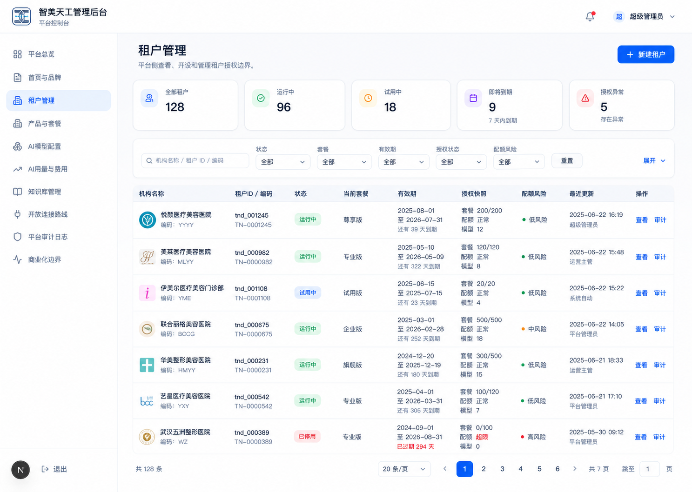
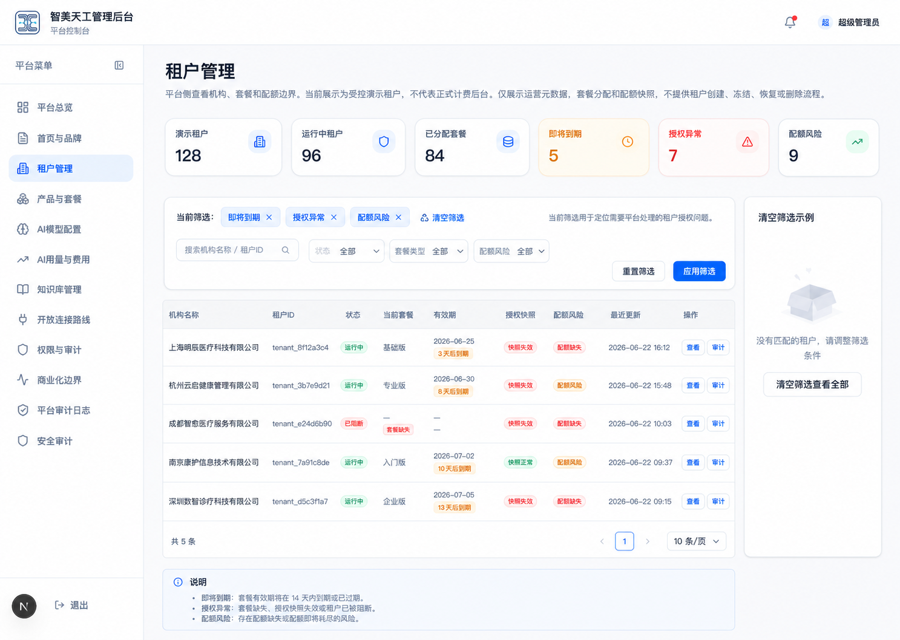
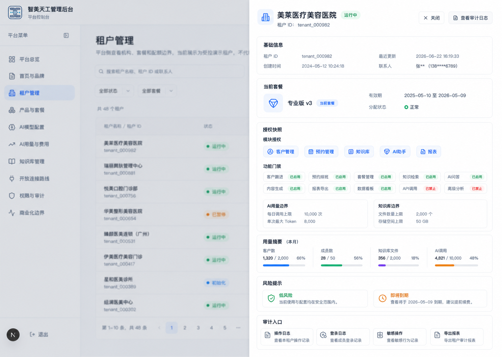
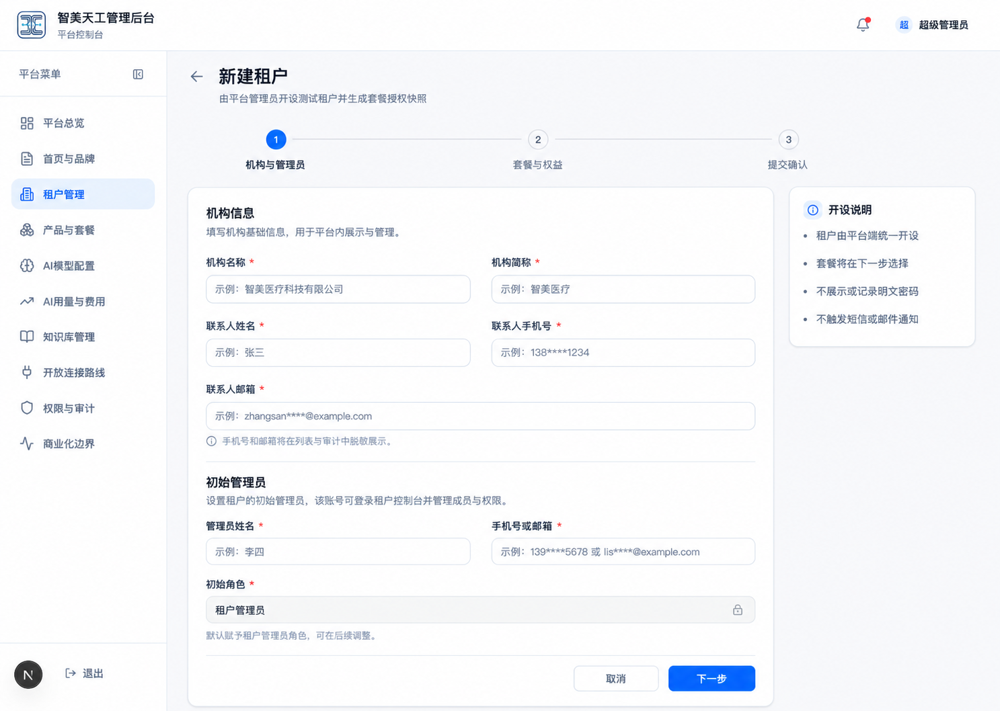
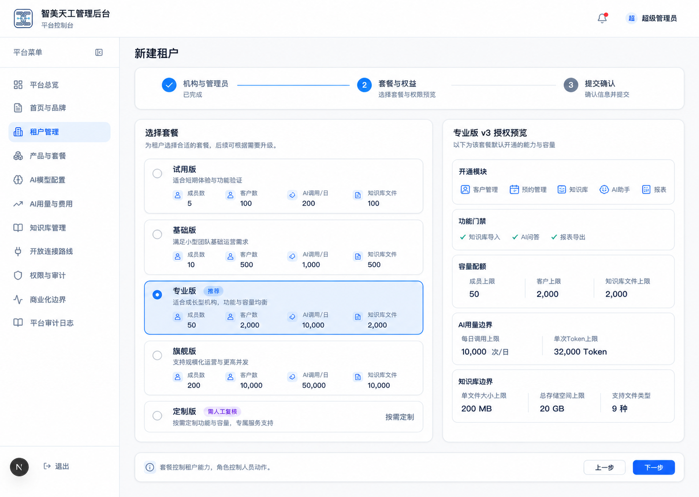
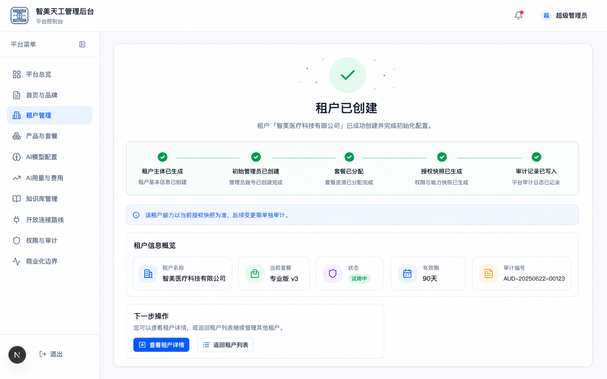
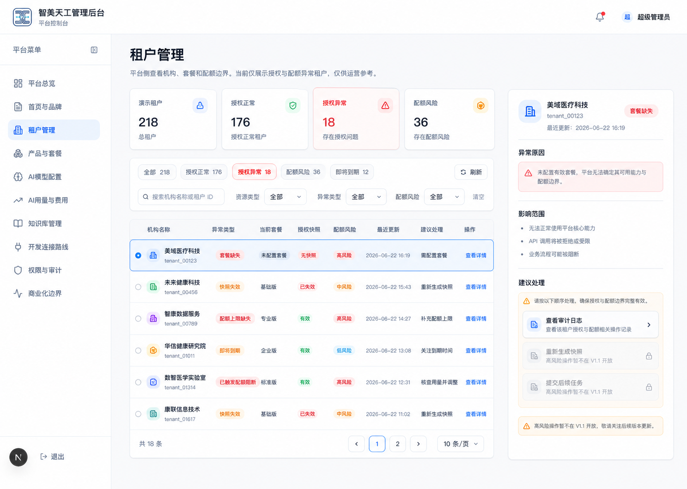
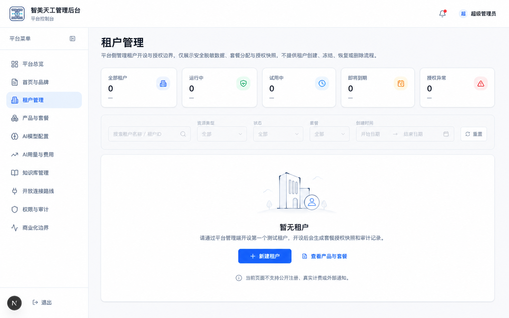

# 平台端租户管理、账户开设与套餐授权 UI 设计稿

> 日期：2026-06-22 CST +0800。
>
> 类型：docs-only / design-only。本文基于 `docs/superpowers/specs/2026-06-22-tenant-account-plan-entitlement-design.md`，只产出页面设计、操作路径、交互状态和效果图，不实现 runtime，不修改 `src/**`、数据库 schema、migration、SQL、真实 API、支付、计费、外部通知或凭证。

## 1. 设计目标

平台端租户管理从“只读查看租户、套餐和配额边界”演进为“可查询、可开设、可解释授权、可追溯审计”的后台工作台。设计稿坚持规格文档中的四层模型：

```text
套餐模板 -> 权益版本 -> 租户授权快照 -> 角色权限
```

设计重点：

- 租户账户必须由平台管理端开设。
- 开设租户时必须选择套餐。
- 套餐只决定租户级能力和容量，不替代角色权限。
- 租户管理首页必须先支持整体租户情况查询，而不是只突出新建租户。
- 提交前必须展示授权快照和审计摘要。
- 所有创建、套餐分配和后续变更都要进入平台审计日志。
- V1.1 不做真实支付、合同、发票、短信、邮件、自动营销或外部 HIS。

## 2. 使用角色

| 角色 | 设计权限 | 页面表现 |
| --- | --- | --- |
| 平台管理员 | 可查看全局租户状态、新建租户、选择套餐、提交开设、查看授权快照 | 显示“新建租户”主按钮和提交按钮 |
| 平台运营 | 可查看租户、筛选风险、查看套餐授权，是否能提交需后续审批 | V1.1 可先禁用提交按钮并提示需管理员操作 |
| 平台审计人员 | 可查看审计记录，不参与开设 | 不展示创建入口 |
| 租户管理员 | 不进入平台端开设流程 | 只在机构端使用本租户能力 |

## 3. 信息架构

平台端建议保留当前左侧导航结构，并在两个栏目中形成协作：

- `租户管理`：负责租户概览、查询列表、新建租户、租户详情、授权快照、配额摘要和审计入口。
- `产品与套餐`：负责套餐模板、权益矩阵和版本历史。V1.1 可先只读。

与其他栏目关系：

- `平台审计日志`：记录租户创建、套餐分配、快照生成、覆盖项调整、停用恢复等事件。
- `平台审计日志`：记录租户创建、套餐分配、快照生成、覆盖项调整、停用恢复等事件。
- `AI 用量与费用`：后续读取套餐中的 AI 用量边界，但 V1.1 不在开设流程里产生真实费用。
- `知识库管理`：后续读取套餐中的知识库文件和解析能力边界，但 V1.1 不改知识库业务逻辑。

## 4. 主操作路径

### 4.1 查询整体租户情况

1. 进入 `平台端管理后台`。
2. 点击左侧 `租户管理`。
3. 先查看轻量概览：全部租户、运行中、试用中、即将到期、授权异常。
4. 在列表中按关键词、状态、套餐、有效期、授权状态和配额风险筛选。
5. 通过列表字段快速判断租户是否需要处理。

### 4.2 查看租户详情与授权快照

1. 在租户列表中点击目标租户的 `查看`。
2. 右侧打开租户详情抽屉或进入详情页。
3. 查看基础信息、当前套餐、套餐版本、有效期、授权快照、配额摘要和风险提示。
4. 如需审查创建或变更记录，点击审计入口跳转到 `平台审计日志`，并携带租户 ID 作为筛选条件。

### 4.3 平台管理员新建租户

1. 在 `租户管理` 页面点击右上角 `新建租户`。
2. 第一步填写机构基础信息和初始租户管理员信息。
3. 第二步选择套餐并查看权益预览。
4. 第三步查看提交前确认页和审计摘要。
5. 点击 `确认开设租户`。
6. 系统生成租户、初始管理员、套餐分配、租户授权快照和平台审计事件。
7. 返回租户详情或租户列表。

### 4.4 套餐权益核对

1. 进入 `产品与套餐`。
2. 查看套餐权益矩阵。
3. 对比试用版、基础版、专业版、旗舰版、定制版。
4. 查看当前启用版本。
5. V1.1 不允许直接修改套餐；如需修改，后续进入套餐管理任务。

## 5. 效果图

> 本节效果图为 OpenAI 生成的静态方向图，用于确认布局、信息层级、路径和状态。图内中文细字可能存在字形误差，后续实现或正式设计稿应以本文档文案为准。

### 5.1 租户管理首页：总览 + 查询列表

用于展示租户概览、查询列表和 `新建租户` 入口。当前页面应明确这是平台端租户管理工作台，不是公开注册入口。



设计要点：

- 顶部说明清楚“租户由平台管理员开设，套餐决定租户授权边界”。
- 入口页第一屏应优先呈现整体租户情况和查询能力。
- 主按钮放在标题区右侧，符合后台高频操作位置。
- 租户列表字段优先展示机构、状态、套餐、有效期、授权快照和操作。
- 统计卡仅保留运营判断需要的指标，避免变成商业计费大屏。

### 5.2 筛选状态：即将到期 + 授权异常

用于展示租户列表的筛选能力和运营定位能力，帮助平台快速找出需要处理的租户。



设计要点：

- 筛选条件需要可见，避免运营人员不知道当前列表为何变少。
- 即将到期、授权异常、配额风险应使用清晰状态标签。
- 表格仍保留 `查看` 和 `审计` 两个低风险操作。
- 不在筛选页直接开放修改套餐、调整配额或删除租户。

### 5.3 租户详情抽屉：授权快照 + 用量摘要

创建后或列表查看时，右侧抽屉展示租户当前授权状态。该图需要完整展示当前套餐、套餐版本、有效期、授权快照、配额风险和审计入口。



设计要点：

- 详情抽屉避免跳转打断列表扫描。
- 授权快照独立成块，便于运营和审计理解“这个租户当前拥有什么能力”。
- 功能门禁使用标签展示。
- 配额快照展示当前用量和上限，但不作为正式计费账单。
- 详情里不放修改套餐、删除、重置密码等高风险操作。

### 5.4 新建租户 Step 1：机构与管理员

第一步填写机构信息和初始管理员信息。



设计要点：

- 采用三步式流程：机构与管理员、套餐与权益、提交确认。
- 表单字段只保留 V1.1 开设必需项。
- 手机号和邮箱标注为 PII，后续 runtime 前必须审批存储与脱敏策略。
- 初始管理员默认为租户管理员，不展示明文密码。
- 不在此流程里触发短信、邮件或外部通知。

### 5.5 新建租户 Step 2：套餐与权益预览

第二步选择套餐，并展示该套餐将写入授权快照的能力和配额。



设计要点：

- 套餐卡横向对比，当前选中套餐高亮。
- 权益预览必须强调：功能门禁是租户级能力入口，不替代 RBAC。
- 专业版示例展示模块、容量、AI 调用和成员数量。
- 定制版保留人工审批提示，不在 V1.1 做复杂审批流。
- 不展示真实价格、合同、发票或付款状态。

### 5.6 新建租户 Step 3：提交确认 + 审计摘要

第三步展示创建结果预览和审计摘要。


设计要点：

- 左侧确认租户和初始管理员。
- 右侧确认套餐版本、有效期和快照状态。
- 下方展示即将写入审计的低敏摘要。
- 明确不记录完整手机号、邮箱、密码、请求体、SQL 或服务端错误细节。
- 主按钮文案使用 `确认开设租户`，避免“保存”这种含义不清的弱操作。

### 5.7 新建成功状态

用于展示租户创建完成后的结果、系统写入项和下一步去向。



设计要点：

- 成功状态需要逐项说明：租户主体、初始管理员、套餐分配、授权快照、审计记录。
- 成功后应提供 `查看租户详情` 和 `返回租户列表`。
- 不暗示已经发送短信、邮件或外部通知。
- 不展示明文密码或完整联系方式。

### 5.8 授权异常处理视图

用于展示平台运营需要关注的授权风险和处理入口。



设计要点：

- 授权异常需要能按异常类型筛选，包括套餐缺失、快照失效、配额缺失、即将到期、已触发阻断。
- 右侧或详情区展示异常原因、影响范围和建议处理。
- 高风险处理动作可以展示为后续任务或禁用状态，不在 V1.1 直接开放。
- 保留 `查看审计日志` 作为低风险追溯入口。

### 5.9 暂无租户空状态

用于平台尚未创建任何租户时的首次使用体验。



设计要点：

- 空状态应引导平台管理员开设第一个测试租户。
- 说明租户开设后会生成套餐授权快照和审计记录。
- 可提供 `新建租户` 主按钮和 `查看产品与套餐` 次按钮。
- 明确当前页面不支持公开注册、真实计费或外部通知。

## 6. 页面状态设计

### 6.1 Loading

触发场景：

- 进入租户管理列表。
- 打开租户详情抽屉。
- 选择套餐后加载权益预览。
- 提交开设请求。

文案建议：

- `正在加载租户管理数据...`
- `正在生成套餐权益预览...`
- `正在开设租户，请勿重复提交...`

### 6.2 Empty

触发场景：

- 尚无租户。
- 当前筛选条件下无结果。
- 当前套餐暂无可见权益版本。

文案建议：

- `暂无租户，请通过平台管理端开设第一个测试租户。`
- `没有匹配的租户，请调整筛选条件。`
- `暂无启用中的套餐版本，请先完成套餐权益配置。`

### 6.3 Error

触发场景：

- 租户列表请求失败。
- 权益预览生成失败。
- 提交失败。

文案建议：

- `租户管理数据加载失败，请稍后重试。`
- `套餐权益预览暂不可用，请重新选择套餐。`
- `租户开设失败，未写入租户或授权快照。`

错误展示原则：

- 不展示 SQL、stack、服务端内部错误或凭证信息。
- 失败后必须说明是否已写入数据。
- 如果无法确认写入状态，提示进入审计或联系管理员核对。

### 6.4 Forbidden

触发场景：

- 平台运营或审计角色无开设权限。
- 非平台端角色进入租户开设入口。

文案建议：

- `当前账号没有开设租户权限。`
- `请联系平台管理员完成租户开设。`

交互建议：

- 隐藏或禁用提交按钮。
- 保留查看权限时，允许查看租户列表和授权快照。

### 6.5 Disabled

触发场景：

- 必填字段不完整。
- 未选择套餐。
- 选中套餐已停用。
- 试图使用未审批的定制版。

禁用按钮旁提示：

- `请先填写机构名称和初始管理员。`
- `请选择一个启用中的套餐。`
- `定制版需要先完成平台审批。`

## 7. 表单字段与校验

| 分组 | 字段 | 校验 | 展示方式 |
| --- | --- | --- | --- |
| 机构信息 | 机构名称 | 必填，建议 2-60 字 | 普通输入 |
| 机构信息 | 机构简称 | 可选，建议 2-20 字 | 普通输入 |
| 机构信息 | 联系人姓名 | 必填 | 普通输入 |
| 机构信息 | 联系人手机号 | 必填，进入 runtime 前单独审批存储策略 | 列表和审计中脱敏 |
| 机构信息 | 联系人邮箱 | 可选，进入 runtime 前单独审批存储策略 | 列表和审计中脱敏 |
| 初始账号 | 管理员姓名 | 必填 | 普通输入 |
| 初始账号 | 手机号或邮箱 | 至少一项 | 输入组合 |
| 初始账号 | 初始角色 | 默认租户管理员 | 只读选择 |
| 套餐选择 | 套餐 | 必填，必须是启用中套餐 | 卡片选择 |
| 套餐选择 | 有效期 | 必填 | 日期范围 |
| 安全确认 | 创建原因 | 必填 | 多行输入 |

## 8. 权限边界

授权判断不在前端单独完成。后续 runtime 必须按以下顺序在服务端验证：

```text
平台身份有效
-> 操作人具备租户开设权限
-> 套餐处于启用状态
-> 套餐权益版本可用于新租户
-> 必填字段通过低敏校验
-> 创建租户和初始管理员
-> 生成套餐授权快照
-> 写入平台审计日志
```

创建成功后的使用授权判断：

```text
租户状态有效
&& 租户授权快照包含模块或能力
&& 当前用户角色具备动作权限
&& 配额未触发阻断
&& 功能开关或灰度策略允许
```

## 9. 审计设计

租户开设成功后至少记录：

- 操作：创建租户。
- 操作者：平台管理员 ID。
- 资源：租户 ID。
- 套餐：套餐编码和版本。
- 结果：成功或失败。
- 原因：创建原因的低敏摘要。
- 时间：服务端时间。

不记录：

- 明文密码。
- 完整手机号。
- 完整邮箱。
- 请求体全文。
- SQL。
- stack。
- 凭证或外部连接信息。

## 10. 响应式建议

桌面端：

- 保持左侧导航 + 顶部栏 + 内容区。
- 租户列表可使用表格。
- 新建流程建议用居中面板或右侧抽屉。
- 套餐卡片横向展示。

窄屏：

- 租户列表改为卡片。
- 新建流程每步单列展示。
- 套餐卡片纵向排列。
- 提交确认页先展示风险和审计摘要，再展示明细。

## 11. V1.1 不做范围

- 不做公开注册。
- 不做真实支付、合同、发票。
- 不做短信、邮件或外部通知。
- 不做真实 HIS 连接。
- 不做自动营销触达。
- 不做复杂审批流。
- 不做跨租户数据迁移。
- 不做完整套餐商业化后台。
- 不在前端绕过服务端权限或配额校验。

## 12. 后续实现拆分建议

1. Domain-only 契约任务：定义套餐权益、授权快照、覆盖项和权限合并判断的纯函数与测试。
2. Schema / migration 任务：单独审批最小表结构。
3. API / service 任务：实现平台端新建租户、套餐分配和审计写入。
4. UI 任务：按本文设计实现租户管理入口、新建流程、提交确认和详情抽屉。
5. 配额 enforcement 任务：将客户、知识库、AI 调用等关键动作接入服务端配额判断。

## 13. 验收标准

- 设计稿可解释完整开设路径。
- 每张效果图对应一个关键页面或状态。
- 能清楚区分套餐权益和角色权限。
- 能清楚说明 V1.1 不做真实计费、支付、外部通知和复杂审批。
- 能作为后续 Claude Code 审查和 implementation plan 的依据。
