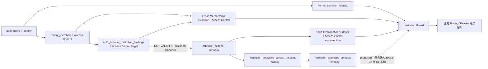

# BASE-02 准入审计与实施冻结方案

> 状态：`proposed readiness plan`
>
> 审计基线：`443033b7f06ba9d5a08b37ddeddf112162cea4b8`
>
> 审计日期：2026-08-01（Asia/Shanghai）
>
> 任务性质：仓库静态审计、固定 localhost-only `local_acceptance` 显式只读探针、范围与实施切片冻结
>
> 授权边界：本文不是 Runtime、数据修复、数据库写入、外键验证、Reader 放行或发布授权

## 1. 准入结论

BASE-02 的准入规划可以形成完整、可审查的候选实施链，但当前不能把 BASE-02 标记完成，也不能
把 historical orphan 自动修复或把 Reader 放行：

- A2-P1 的 Scope／Context Version／Context Head 低敏计数保持 `1／1／1`；
- 仓库 Migration journal 为 `40` 项，实际 SQL 集合为 `40` 个，末项为
  `0039_mig_01a2_anchor_bridge`；snapshot 仍为 `0026_snapshot.json`；
- A2-P2 索引和外键定义精确存在，外键继续保持 `convalidated=false`；
- Binding 总数／双键 NULL／重复复合键／Scope 关系 orphan 为 `1／0／0／1`；
- active historical orphan 数量也为 `1`，其语义 Owner 是 Access Control 的 Binding 生命周期；
- 当前证据不能唯一决定该 orphan 应撤销、重绑或等待独立 Tenancy Provisioning，处置动作继续
  阻断；
- 当前仓库已有正式 Session、Fresh Membership、Anchor 与机构 Guard 的 fail-closed 基础，但
  `auth_account_institution_bindings` 只有查询链路，没有权威生命周期命令与 Writer 实现；
- BASE-02 不是简单清理 orphan。它还必须关闭 Membership／Binding 生命周期、正式 Session、
  Tenancy Scope 消费、revision、Guard 与绕过入口之间的闭环。

冻结状态：

```text
base02_readiness_audit=completed_with_blocking_decisions
orphan_semantic_owner=access_control_binding_lifecycle
orphan_remediation_action=blocked_pending_authoritative_decision
base02_implementation_plan=proposed
base02_implementation_authorized=false
base02_started=false
fk_validation_authorized=false
reader_release_authorized=false
```

## 2. 文档定位、事实源与审计方法

### 2.1 事实层级

1. 当前 `main` 的代码、测试、Schema、Migration、配置和已合并记录决定 `current` 事实；
2. [`architecture-v2.md`](../architecture/architecture-v2.md) 与已接受 ADR／决策决定最高级
   `target` 约束；
3. 模块映射、六类架构视图、专项预检、独立审查和 handoff 负责展开、核验和记录状态，不得独立
   改写事实所有权、Migration 顺序或发布门禁；
4. 固定 localhost-only `local_acceptance` 的本轮探针只证明探针时点的低敏环境状态，不替代仓库
   事实，也不构成永久环境证明。

主要证据：

- [`src/server/db/schema.ts`](../../src/server/db/schema.ts)；
- [`0037_v08_05b_b3a_real_task_readiness_foundation.sql`](../../drizzle/0037_v08_05b_b3a_real_task_readiness_foundation.sql)；
- [`0038_mig_01a1_institution_isolation_expand.sql`](../../drizzle/0038_mig_01a1_institution_isolation_expand.sql)；
- [`0039_mig_01a2_anchor_bridge.sql`](../../drizzle/0039_mig_01a2_anchor_bridge.sql)；
- [`drizzle/meta/_journal.json`](../../drizzle/meta/_journal.json) 与
  [`0026_snapshot.json`](../../drizzle/meta/0026_snapshot.json)；
- [`mig01-a2-provisioning-accepted-decisions.md`](../decisions/mig01-a2-provisioning-accepted-decisions.md)；
- [`v2-02b-mig01-closure-preflight.md`](../architecture/v2-02b-mig01-closure-preflight.md)；
- [`NEXT_TASK.md`](../handoff/NEXT_TASK.md) 与
  [`RELEASE_HISTORY.md`](../handoff/RELEASE_HISTORY.md)。

### 2.2 只读环境探针归因

本轮获授权的数据库探针满足：

- 固定 localhost-only `local_acceptance` 目标身份核对通过；
- 单进程、显式 `REPEATABLE READ` 与 `READ ONLY` 事务；
- 固定 `search_path`、`statement_timeout`、`lock_timeout` 和空闲事务超时；
- 只使用固定 Catalog／低敏聚合计数 SELECT 白名单；
- 输出仅包含固定状态、布尔值和低敏计数，不包含原始行、双键、连接参数、角色名或 PII；
- 事务开始和结束时均未分配事务 ID，最终执行 `ROLLBACK`；
- DDL、DML、Migration、Seed、Runner、Lease 和数据库写入均为 `0`。

现有 `ProvisioningReadonlyPostgresAdapter` 只负责 tenant 存在性及 Manifest triplet 分类。本轮
journal、Catalog、A1 Shape、Binding Shape 和并发状态来自独立临时只读探针，未错误归因给该
Adapter；探针未进入仓库。

### 2.3 本轮禁止范围

本文及本轮审计不授权：

- 修改 Runtime、测试、Schema、Migration、journal、snapshot、脚本、CI、package 或 lock；
- 对 historical orphan 执行 UPDATE、DELETE、重绑、回填或从 Binding 反推创建 Scope；
- 执行 `VALIDATE CONSTRAINT`、`SET NOT NULL`、Migration、Seed、DDL 或 DML；
- 启动业务 Writer 双写、Audit／模板、MIG-01B、MIG-01C、Reader 或 Capability；
- 把规划、测试或 CI 通过写成生产发布，七线正式发布继续为 `0/7`。

## 3. 当前数据库与关系状态

### 3.1 仓库与环境一致性

| 项目 | 当前低敏结论 | 影响 |
|---|---|---|
| 仓库 journal | `40` 项，末项 `0039_mig_01a2_anchor_bridge` | 与 SQL 集合一致 |
| 环境 journal | `40` 项，latest 与仓库一致 | 探针时点无 Migration 漂移 |
| snapshot | `0026_snapshot.json` | 允许阶段性落后；继续禁止 `db:generate` 与 snapshot-diff Migration |
| A2-P1 三表 | `1／1／1` | Scope、Context Version 1、Context Head 1 保持收口状态 |
| Scope 索引 | 精确定义存在 | 普通非唯一 btree，列序 `tenant_id, institution_id` |
| Binding→Scope FK | 精确定义存在，`convalidated=false` | 保持 `NOT VALID`，不得提前验证 |
| Binding Shape | 总数 `1`、NULL `0`、重复 `0` | 当前结构满足窄关系，不证明业务归属正确 |
| historical orphan | `1` | BASE-02 完成、FK 验证与 Reader 放行的硬门 |
| 并发执行 | 其他活动客户端、写锁持有者、prepared transaction 均为 `0` | 仅证明探针时点无并发写入 |

### 3.2 当前受影响表与事实 Owner

| 表 | 当前职责 | target Owner | BASE-02 关系 |
|---|---|---|---|
| `auth_users` | 用户、账号和正式登录状态 | Identity | 只读主体与正式 Session 来源，不转移 Owner |
| `tenant_members` | 用户在 tenant 中的 Membership 和角色 | Access Control | Fresh Membership、撤销／版本语义的核心输入 |
| `auth_account_institution_bindings` | 账号到 tenant／institution 的 Binding、状态、来源和版本 | Access Control | 生命周期与 orphan 的核心对象 |
| `institution_scopes` | tenant／institution Scope、状态与 revision | Tenancy | 由版本化 Port 只读消费，不得由 Binding 反向写入 |
| `institution_operating_context_versions` | Context Version 原始事实 | Tenancy | 只读版本事实；不成为授权 Owner |
| `institution_operating_contexts` | 当前 Context Head 原始事实 | Tenancy | 只读 head/revision；不复制到 Access Control 事实库 |

BASE-02 直接处理前三类授权关系并且必须消费 Tenancy Scope；Context Version／Head 是否进入授权
组合由 BASE-B1 冻结。它不拥有 Customers、Care、Conversations、Knowledge、Analytics、
Institution System、Messaging 或 Audit 的业务事实表。

### 3.3 当前关系链



虚线不是已完成或已接受的发布链。数据库 FK 未验证；Operating Context Provider 是独立 Runtime
缺口，Context Head／Version 是否需要参与 BASE-02 授权组合仍须由 BASE-B1 冻结，不能作为当前
已接受硬门。业务 Route／Reader 也没有因当前 Guard 代码存在而获准发布。

## 4. Binding 生命周期现状

### 4.1 已具备

- [`auth-account-repository.ts`](../../src/modules/auth/server/auth-account-repository.ts) 提供
  `listActiveInstitutionBindingsByAccountAndTenant`、
  `findCurrentInstitutionMembershipFacts` 和 `findCurrentFormalSessionUser`；
- [`institution-membership-provider.ts`](../../src/modules/security/server/institution-membership-provider.ts)
  对账号、Membership、Binding 状态、来源、过期、撤销、版本和请求机构进行 fail-closed 校验；
- [`institution-anchor-repository.ts`](../../src/modules/security/server/institution-anchor-repository.ts)
  以 `tenantId + institutionId` 读取 Scope；
- [`institution-anchor-provider.ts`](../../src/modules/security/server/institution-anchor-provider.ts)
  只在 Scope active 且 revision 合法时生成短生命周期锚点证据；
- [`formal-request-provenance-owner.ts`](../../src/modules/security/server/formal-request-provenance-owner.ts)、
  [`institution-guard-evidence.ts`](../../src/modules/security/server/institution-guard-evidence.ts) 与
  [`institution-guard-reference.ts`](../../src/modules/security/server/institution-guard-reference.ts) 已有
  正式请求 provenance、短生命周期 evidence 和不透明引用基础；
- [`institution-scope-guard.ts`](../../src/modules/security/server/institution-scope-guard.ts) 与
  [`institution-section-guard.ts`](../../src/modules/security/server/institution-section-guard.ts) 组合正式
  provenance、Membership 与 Anchor，并提供 section／navigation 的 fail-closed 决策；公开 Scope Guard
  明确不授予 page、object、action 或 capability 权限；
- [`institution-request-authorization.ts`](../../src/modules/security/server/institution-request-authorization.ts)
  当前只公开 section／navigation 授权句柄；对象 Guard 与 Action Policy 仍是缺口；
- [`institution-server-runtime.ts`](../../src/modules/institution/server/institution-server-runtime.ts)
  是当前机构服务端组合入口之一。

### 4.2 未具备或未关闭

- 当前 `src/**` 与 `scripts/**` 未找到对 `auth_account_institution_bindings` 的正式
  create／rebind／revoke／expire／delete 生命周期 Writer；
- 当前物理读取实现位于 `src/modules/auth/**`，这是兼容现状，不把目标语义 Owner 从 Access
  Control 改为 Identity；
- 仓库中尚无物理 `src/modules/access-control/**` 模块，不能把 target 模块写成 current；
- `findCurrentFormalSessionUser` 读取账号、Membership 与 Binding，但正式 Session claim 不能单独
  证明 Scope active；缺 Scope 的历史 Binding 必须在后续 Guard 阶段继续 fail-closed；
- Binding revision 当前主要来自 `version` 与 `assignedAt`，重绑、撤销、过期和 CAS 的时间语义尚未
  冻结为完整生命周期契约；
- `tenant_members` 当前没有 status／version；Fresh Membership revision 实际使用 `updatedAt`，其撤销、
  刷新与稳定版本语义尚未冻结；
- `findPrimaryTenantMembershipByUserId` 当前无显式排序即 `.limit(1)`，多 Membership 情形下 tenant
  选择可能不确定；未来必须显式选择或 fail-closed，不能隐式选第一行；
- onboarding、租户重置、Seed、fixture、导入和维护任务是否需要进入统一 Binding 生命周期仍须
  逐入口审计；当前只能证明仓库没有正式 Binding 生命周期 Writer，不能把所有候选入口直接定性为
  已发生绕过；
- `resolveInstitutionAccessContextV1` 只完成结构性校验，不能替代 live Membership、Scope、对象和
  Action Policy 校验；
- 当前正式授权根的直接消费者是 `/hospital` 两个 Page 与 Workbench entry/runtime；静态导入扫描
  未发现 `src/app/api/institution/**/route.ts` 接入该根。代码存在与测试通过仍不代表机构 API、业务
  Reader 或正式发布已完成。

## 5. Historical orphan 责任边界

### 5.1 可证事实

- orphan 数量精确为 `1`；
- 在本轮只读探针时点，该 Binding 为 active、未过期、version 为正，低敏来源分类为
  `manual_admin`；
- 对应 tenant 与 Membership 父记录存在；
- Binding 早于 A2-P1 Scope 建立，`0037` 建表时不存在 Binding→Scope 关系；
- `0038` 只执行 Expand，没有回填；`0039` 只创建索引和 `NOT VALID` FK，没有改写历史行；
- 当前唯一 Scope 不匹配该 Binding，因此不能用“环境只有一个 Scope”推断应自动重绑；
- A2-P1／A2-P2 没有制造、修复或验证该历史归属。

### 5.2 当前不可证事实

仓库与本轮低敏探针不能证明：

- 原操作者、审批记录或完整业务意图；
- Binding 指向的机构是否应继续存在；
- 应撤销、重绑、删除还是先走独立 Tenancy Provisioning；
- 是否存在仓库外权威机构登记或批准来源。

以上未知项不能用文件名、唯一候选、当前角色常量或主观偏好填补。

### 5.3 Owner 结论

| 角色 | 责任 | 不允许承担的责任 |
|---|---|---|
| Access Control／Binding 生命周期 | 对 orphan 分类、业务有效性与处置语义负责；拥有 Binding 状态与版本推进 | 不得创建或复制 Tenancy Scope 原始事实 |
| Tenancy | 证明或提供经批准的 Scope／Context 原始事实 | 不得根据 Binding 反向猜测并自动建立 Scope |
| Identity | 继续拥有账号与正式 Session；当前可提供兼容读取 | 不成为 Binding 生命周期 target Owner |
| 独立数据修复专项 | 在明确动作、授权、恢复点和 affected rows 下执行一次性修复 | 不自行决定业务语义，也不成为新事实 Owner |
| A2-P2／MIG-01B／MIG-01C | 保持各自既定边界 | 不得静默接管该 Binding orphan |

早期
[`mig01-a2-p2-catalog-data-shape-independent-review-20260731.md`](./mig01-a2-p2-catalog-data-shape-independent-review-20260731.md)
曾笼统建议由 MIG-01B 处理 orphan；后续已合并
[`RELEASE_HISTORY.md`](../handoff/RELEASE_HISTORY.md) 和
[`NEXT_TASK.md`](../handoff/NEXT_TASK.md) 已明确纠正：该项归 Access Control／Binding 生命周期或
独立专项数据修复，不属于 MIG-01B 的静默处理范围。本方案采用后来的权威收口结论，并保留这项
漂移说明。

### 5.4 允许进入未来决策的处置分支

1. **撤销或失效**：只有 Access Control 的权威证据证明该 Binding 不应继续有效时，才可按
   生命周期语义执行撤销／版本推进；这只能令 active historical orphan 归零并消除授权风险，
   Scope 关系 orphan 仍为 `1`，因此不能单独满足 BASE-B5／B6 的关系清零或未来 FK 验证；
2. **确定性重绑**：只有独立权威来源证明预期 Scope 且该 Scope 已获批存在时，才可重绑；不得
   以当前唯一 Scope 代替证据；成功后必须同时证明 active historical orphan 与 Scope 关系 orphan
   均为 `0`；
3. **先 Provisioning 后复核**：若真实机构应存在但 Scope 尚未获批，必须先建立独立 Tenancy
   Provisioning 任务，完成后再重新核验 Binding；不得由 BASE-02 自动补建 Scope；
4. **受控删除／归档决策**：只有 Access Control 证明记录无效且数据保留政策允许时，才可另立
   数据治理与 DML 任务；当前 Schema 没有独立归档关系，不能凭“保留历史”假定关系已关闭；
5. **保持阻断**：证据不足、冲突或环境漂移时保持 fail-closed，不得为了推进 BASE-02 清零。

任何实际处置都必须是独立授权切片，包含只读预检、精确主键定位（不在文档中公开）、
`expected=affected=1`、`conflict=0`、无并发 Writer、执行前恢复点、单事务、禁止自动重试、低敏
证据和独立审查。本任务未选择或授权其中任何动作。

## 6. BASE-02 目标与边界

### 6.1 目标

BASE-02 已接受核心必须形成一个请求绑定、可撤销、可版本比较、默认拒绝的机构访问上下文：

```text
Identity formal session
→ Access Control fresh tenant membership
→ Access Control active institution binding
→ Tenancy active scope + scope revision（版本化 Port 读取）
→ short-lived request-bound authorization evidence
→ institution scope/section/navigation Guard
```

Operating Context Provider 以及 Context Head／Version 是否加入上述组合仍为 `proposed／待确认`。
BASE-B1 必须比较其必要性、Owner、revision 关系和失效语义；用户接受前不得把它写成 BASE-02 完成
硬门。对象 Guard 与 Action Policy 是 BASE-02 target 缺口，也不能把当前 section／navigation
授权误报为已经具备。

必须满足：

- `tenantId + institutionId` 同时存在且来自权威服务端事实；
- Membership、Binding 与 Scope revision 在签发、刷新和消费时可比较；Membership 稳定 revision
  的载体仍须在 BASE-B1 冻结；
- 撤销、过期、停用、缺失、重复、跨 tenant／institution、陈旧 revision 和 Provider 不可用全部
  fail-closed；
- Access Control 只消费 Tenancy 原始事实并签发短生命周期授权证据，不建立第二套 Scope／Context
  事实源；
- Page／Route 不能直接信任客户端 tenant／institution；Application Service 和 Repository 继续
  接收经过 Guard 的显式 Scope；
- BASE-02 完成不等于业务 Reader 自动放行。

### 6.2 进入 BASE-02 的关系

- `auth_users` → `tenant_members`：正式主体与 Fresh Membership；
- `tenant_members` → `auth_account_institution_bindings`：成员到机构 Binding 生命周期；
- Binding → `institution_scopes`：活动 Scope 存在性与 revision 消费；
- Scope → Context Version／Head：是否进入 BASE-02 授权组合的 proposed 关系，由 BASE-B1 决定；
- 正式 Session → Membership／Binding／Anchor 证据：签发、刷新和每请求重检；
- Guard → 对象／Action Policy：仅形成授权决定，不放行具体业务 Reader。

### 6.3 暂不进入 BASE-02

- A2-P2 外键 `VALIDATE`、`NOT NULL`、新索引／约束或任何 Schema／Migration；
- 全业务表 `tenantId + institutionId` Writer 双写和旧 Writer 封堵；
- Audit 全局 institution attribution、模板 fail-closed 与历史审计修复；
- MIG-01B 高水位回填、追赶和业务事实冲突清零；
- MIG-01C Enforce；
- Customers／Institution System 或其他业务 Reader、Route、Capability 的正式放行；
- MIG-02～MIG-06 的表、模块或发布工作。

本方案采用最新 handoff 的窄义 BASE-02：先关闭 Membership／Binding、正式上下文与 Guard，再进入
独立业务 Writer。旧架构文档中“BASE-02／全部 Writer”合并出现的阶段标签不表示 BASE-02 完成时
全部业务 Writer 已完成，也不能覆盖当前 `BASE-02 → Writer` 的串行门禁。

## 7. 静态影响面

### 7.1 当前主要代码路径

| 类别 | 当前路径／符号 | current 结论 | target 处理 |
|---|---|---|---|
| Identity Session | `src/modules/auth/server/formal-server-session-provenance-owner.ts` | 正式 cookie／provenance Owner 已存在 | 保持 Identity Owner，增加与 BASE-02 事实的版本化消费边界 |
| Auth Repository | `src/modules/auth/server/auth-account-repository.ts` | 读取 account、Membership、Binding；无 Binding 生命周期 Writer | 兼容层逐步委托 Access Control Port，不复制 Repository |
| 登录／Session Route | `src/app/api/auth/login/route.ts`、`session/route.ts`、`logout/route.ts` | 正式 Session 入口存在 | 冻结刷新、撤销、陈旧 revision 与缺 Scope 的 fail-closed 语义 |
| Membership Provider | `src/modules/security/server/institution-membership-provider.ts` | Fresh Membership／Binding 校验基础已存在 | 对接 Access Control Owner 契约与稳定 revision |
| Anchor Repository／Provider | `src/modules/security/server/institution-anchor-repository.ts`、`institution-anchor-provider.ts` | Scope active/revision 读取与短生命周期证据存在 | 通过 Tenancy Port 消费；不让 Security 成为 Scope Owner |
| Request Provenance | `src/modules/security/server/formal-request-provenance-owner.ts` | 正式请求 provenance 解析基础已存在 | 保持不可由调用方伪造 |
| Evidence／Reference | `src/modules/security/server/institution-guard-evidence.ts`、`institution-guard-reference.ts`、`institution-guard-runtime-config.ts` | Membership／Binding／Anchor revision 的短生命周期引用基础已存在 | 冻结轮换、失效与低敏边界 |
| Scope／Section Guard | `src/modules/security/server/institution-scope-guard.ts`、`institution-section-guard.ts` | Scope fail-closed 与 section/navigation 基础已存在；不授予对象／Action | 保持窄职责并新增独立对象／Action Policy 边界 |
| Request Authorization | `src/modules/security/server/institution-request-authorization.ts` | 当前组合并公开 section/navigation 句柄 | 不误报为完整对象／Action 授权 |
| Access Context | `src/modules/security/server/institution-access-context.ts` | 结构校验，不是 live authorization | 仅作 wire/context 解析，不替代 Owner Provider |
| 组合根 | `src/modules/institution/server/institution-server-runtime.ts` | 部分机构运行时接入正式依赖 | 统一组合，不自动开放 Route／Reader |
| 页面消费者 | `src/app/hospital/page.tsx`、`src/app/hospital/[...slug]/page.tsx` | 消费正式 navigation 授权，页面仍受 Capability 阻断 | 保持 URL 与 capability-off，不借 BASE-02 放行业务 Reader |
| Workbench 消费者 | `src/modules/institution-workbench/server/institution-workbench-entry.ts`、`institution-workbench-runtime.ts` | 消费 section/navigation 授权 | Workbench 继续最后接线，不扩为 Reader 发布 |

候选 target 物理边界可以是 `src/modules/access-control/**`，但该目录当前不存在；是否创建、精确
文件名和迁移策略必须在未来 Runtime 授权中冻结。本方案不创建空目录、占位 Port 或第二套事实源。

### 7.2 完整调用面快照

以下数量来自基线上的精确路径枚举；各组可能重叠，不能相加成“总文件数”：

- **正式链与直接消费者生产路径：24 个**。Identity／Auth 为
  `src/modules/auth/domain/auth-account.ts`、`auth-account-repository.ts`、
  `auth-account-service.ts`、`formal-server-session-provenance-owner.ts` 及 auth login／session／logout
  三个 Route；Security 为 `domain/access-control.ts`、`domain/institution-access.ts`、
  `formal-request-provenance-owner.ts`、Membership／Anchor Repository／Provider、Guard Evidence／
  Reference／Runtime Config、Scope／Section Guard 与 Request Authorization；组合与消费者为
  `institution-server-runtime.ts`、两个 `/hospital` Page、Workbench entry/runtime；
- **核心直接测试：26 个**。包括 AuthAccount domain／repository／service、Formal Auth Routes／
  Session Owner，AccessContext／AccessControl／InstitutionAccess domain，Formal Request、Membership、
  Anchor、Evidence、Reference、Runtime Config、Scope／Section／Request Authorization，Schema，
  Institution Server Runtime／Route Shell／Conversation capability-off，以及两个 Workbench 测试；
- **Binding 符号直接引用：7 个生产路径、11 个测试路径**。生产路径为 auth login／session Route、
  Auth Repository／Service、Institution Server Runtime、Membership Provider 与 Schema；
- **旧 `canAccessResource` 的机构／Workspace 生产消费者：15 个**：两个 WeCom mapping handler，
  appointment/customer/followup/real-channel 四个 domain，followup timeline/message draft/operations
  dashboard/path enrollment 四个 service，`tenant-business-api.ts`，两个 WeCom real-send service，以及
  Workspace component/domain。它们只是 BASE-02 绕过审计候选，不得在本轮或单个切片中整体改写；
- **Membership 创建／删除／维护候选：5 个**：
  `tenant-plan-binding-repository.ts`、`tenant-account-management-repository.ts`、
  `trial-data-reset-service.ts`、`src/server/db/seed-demo-data.ts` 和
  `scripts/demo/seed-v06-low-sensitive-demo.ts`。其中部分仅查询或维护 Membership，必须逐符号判定，
  不能从路径名推断绕过；
- **正式授权根的当前公开消费者：4 个路径**，即两个 `/hospital` Page 和两个 Workbench
  entry/runtime；机构 API Route 直接接入数量为 `0`。

该快照覆盖 Membership／Binding／Anchor／Guard 的直接实现、调用方、消费者、旧授权入口和测试
族。未来切片必须从其最新 Base 重新枚举，任何新增、删除或调用方向变化都属于需解释的漂移。

### 7.3 绕过面

未来实施必须逐项审计以下已证缺口或候选入口：

- `src/modules/open-platform/server/tenant-plan-binding-repository.ts` 当前创建 tenant、account 与
  Membership，但不建立 Binding／Scope；这是需审计的 onboarding 边界，不代表它已获授权补建
  Scope；
- `src/modules/open-platform/server/trial-data-reset-service.ts` 的 reset／tenant delete 与 Binding
  生命周期缺少显式协调，需核对是否只依赖 FK 失败；
- `src/server/db/seed-demo-data.ts`、fixture、导入、维护脚本和旧 Route 是否直接写 account／
  Membership 或默认机构；除已列静态路径外均保持“待审计候选”，不得凭名称断言已绕过；
- Session claim、客户端 tenant／institution、Demo／Mock／Seed 上下文或缓存旧 Anchor 是否被当作
  当前授权；
- 业务 Repository 是否绕过 Guard 仅按 tenant 查询。

该审计只关闭 Membership／Binding 与上下文入口的绕过面；全业务表 Writer 双写仍属于后续独立
Writer 阶段。

### 7.4 必测范围

未来 Runtime 切片至少覆盖：

- `src/modules/auth/tests/AuthAccountRepository.test.ts`（包括多 Membership 显式选择或 fail-closed）；
- `src/modules/auth/tests/AuthAccountDomain.test.ts`；
- `src/modules/auth/tests/AuthAccountService.test.ts`；
- `src/modules/auth/tests/FormalServerSessionProvenanceOwner.test.ts`；
- `src/modules/auth/tests/FormalAuthRoutes.test.ts`；
- `src/modules/security/tests/InstitutionMembershipProvider.test.ts`；
- `src/modules/security/tests/FormalRequestProvenanceOwner.test.ts`；
- `src/modules/security/tests/InstitutionGuardEvidence.test.ts` 与
  `InstitutionGuardEvidenceBoundary.test.ts`；
- `src/modules/security/tests/InstitutionGuardReference.test.ts` 与
  `InstitutionGuardReferenceBoundary.test.ts`；
- `src/modules/security/tests/InstitutionGuardRuntimeConfig.test.ts`；
- `src/modules/security/tests/AccessContext.test.ts`、`AccessControlDomain.test.ts` 与
  `InstitutionAccessDomain.test.ts`；
- `src/modules/security/tests/InstitutionAnchorRepository.test.ts`；
- `src/modules/security/tests/InstitutionAnchorProvider.test.ts`；
- `src/modules/security/tests/InstitutionScopeGuard.test.ts`；
- `src/modules/security/tests/InstitutionRequestAuthorization.test.ts`；
- `src/modules/security/tests/InstitutionSectionGuard.test.ts`；
- `src/modules/institution/tests/InstitutionServerRuntime.test.ts`；
- `src/modules/institution/tests/InstitutionRouteShell.test.tsx` 与
  `InstitutionConversationCapabilityOffRoute.test.tsx`；
- `src/modules/institution-workbench/tests/HospitalWorkbenchEntry.test.tsx`；
- `src/modules/institution-workbench/tests/InstitutionWorkbenchRuntime.test.ts`；
- 未来 Access Control 生命周期的独立 domain／repository／service／concurrency 测试。

测试矩阵必须包含：缺失／停用 Scope、Membership 缺失或陈旧、Binding 缺失／重复／撤销／过期／
placeholder、跨 tenant／institution、多 Membership 未显式选择、CAS 冲突、Provider 异常、对象不
归属、Action 不允许、绕过入口以及 capability-off 保持关闭。如果 BASE-B1 接受 Operating Context
组合，还必须增加 Context Head 缺失／漂移矩阵。禁止用 Mock 成功证明正式发布。

## 8. 实施阶段冻结

以下切片是 proposed 串行关系。每个切片都需要独立用户授权、精确文件 allowlist、Draft PR、真实
Required Check、独立审查与 handoff；本文合并也不会自动启动任何切片。

### BASE-B1：Owner、Port 与 revision 契约

- **目标**：冻结 Access Control／Tenancy／Identity／Security 的物理依赖方向、版本化 Port、
  Membership／Binding／Scope revision 以及短生命周期证据契约；另行决定 Operating Context
  Provider 与 Context Head／Version 是否进入 BASE-02；
- **候选文件类型**：Access Control domain／port、Tenancy 公共 reader contract、兼容 Adapter 和
  对应测试；
- **数据影响**：`0`；
- **停止条件**：出现循环依赖、第二 Scope／Membership 事实源、调用方可伪造 evidence，或需要
  Schema／Migration；
- **回退**：撤销该 Runtime commit，不迁移数据；
- **成功门**：依赖方向测试与负向契约矩阵通过，业务 Capability 继续关闭。
- **待决策**：Membership 撤销／刷新／稳定 revision 是否能在现有字段内表达；若需要 Schema，
  本 Runtime 切片停止并拆出独立 Migration 任务。多 Membership 必须显式选择或 fail-closed。

### BASE-B2：Membership／Binding 生命周期

- **目标**：在 BASE-B1 冻结表达后，由 Access Control 实现或显式拥有 Membership
  create／refresh／revoke／delete 的获批命令边界，并实现 Binding create／rebind／revoke／expire 的
  明确状态机、CAS/version、provenance 和 active 唯一性；现有调用方只能委托该 Owner 或保持禁用；
- **当前基数**：数据库部分唯一索引保证每个 `(account_id, tenant_id)` 最多一个 active Binding；
  `selectAuthoritativeInstitutionId` 又要求候选 active Binding 精确为一个，否则 fail-closed；
- **状态冻结**：当前持久化状态只有 `active／revoked`，过期由 `expiresAt` 派生，不得在无 Schema／
  Migration 授权下发明第三个 `expired` 枚举；
- **rebind 待决策**：必须在 revoke-old + create-new 与同一行 CAS/version 推进之间明确选择，并定义
  provenance／恢复语义；若目标要允许同一账号／tenant 同时绑定多个 active 机构，必须停止并另立
  ADR 与 Schema／Migration 任务；
- **候选文件类型**：Access Control domain、application service、repository／adapter、兼容 Auth
  委托层和对应测试；
- **边界**：这是 Binding 生命周期 Writer，不是后续全部业务表的双写 Writer；
- **数据影响**：实现 PR 不处理历史行；任何真实 DML 必须另立执行任务；
- **Schema 门禁**：如果 Membership 的撤销／稳定 revision 无法在当前字段中正确表达，必须停止
  Runtime 切片并拆出独立 Schema／Migration 决策和实施；该门未关闭前 BASE-B6 不得完成；
- **停止条件**：需要隐式默认机构、允许从 Binding 创建 Scope、绕过 Membership／Scope 校验，
  或 CAS affected rows 不唯一；
- **回退**：保持旧读取 fail-closed，撤销未接线 Runtime；已发生的生命周期事实不得盲目逆写，
  只能按新版本 forward-fix。

### BASE-B3：正式 Session 与上下文刷新

- **目标**：登录、Session 恢复／刷新和请求 owner 同时核验 Fresh Membership、active Binding、
  active Scope 与 Scope revision；多 Membership 必须显式选择或 fail-closed；只有 BASE-B1 接受
  Operating Context 组合后才加入 Context Head/version；
- **候选文件类型**：Identity Session owner、Auth routes、Access Control provider、Tenancy reader
  Adapter、组合根和测试；
- **数据影响**：`0`；
- **停止条件**：Session claim 可单独授权、旧 revision 可回退、Provider 不可用时 fail-open，或
  敏感事实进入 cookie／日志；
- **回退**：保持 capability-off／拒绝路径，撤销接线提交。

### BASE-B4：Guard 与绕过入口闭环

- **目标**：统一入口 Guard、机构 Scope Guard、对象 Guard 与 Action Policy；审计 onboarding、
  reset、Seed、fixture、导入、维护任务和旧 Route 的绕过风险；
- **候选文件类型**：Security Guard、institution composition、受影响入口的薄接线、架构依赖测试
  和负向测试；
- **对象事实边界**：Access Control 只拥有 Guard 决策与 Action Policy；对象存在性和归属事实仍由
  Customers、Care、Knowledge 等对应业务 Owner 经版本化 Port／低敏投影提供。Access Control 不得
  直接读取业务 Repository、内部表或 DTO；capability-off 证明不得变成提前实现业务 Reader；
- **生命周期入口门禁**：逐一关闭已证的 Membership／Binding 创建、删除和维护入口；每个入口
  必须委托 BASE-B2 的唯一 Owner 或保持禁用。若涉及 open-platform、Seed 或 script 文件，必须拆成
  精确授权的独立子切片，不得借 Guard PR 扩大修改范围；
- **数据影响**：`0`；
- **停止条件**：需要开放业务 Reader／Capability、修改业务 Writer、扩大到 Audit 模板或无法
  枚举绕过入口；
- **回退**：保持旧入口关闭，按 Route 单独撤销接线，不降级 Guard。

### BASE-B5：Historical orphan 独立处置

- **前置**：BASE-B1／B2 的 Owner 与状态机已通过独立审查；用户已选择确定性处置分支；仓库外
  权威证据、恢复点、固定 localhost-only 目标和无并发 Writer 重新核验；
- **候选资产**：独立低敏执行计划、一次性受控执行资产或明确受控生命周期命令、证据与独立
  审查文档；是否使用脚本或手写 DML 必须由该任务另行决定；
- **授权要求**：精确 DML、目标环境、affected rows、操作者、恢复／forward-fix 必须逐项明确；
- **Access Control-only 分支成功门**：`expected=1`、`affected=1`、`conflict=0`、
  `unexpected=0`；active historical orphan 与全部 Scope 关系 orphan 都从 `1` 到 `0`，A2-P1
  三表不变；仅撤销但保留失配关系不满足该成功门；
- **独立 Tenancy Provisioning 分支**：BASE-02 本身不得创建 Scope。若权威证据要求建立获批
  Scope，必须先退出本切片、另立 Tenancy Provisioning 任务；该任务完成后重新冻结 A2-P1 三表
  计数和 Scope revision，再返回 BASE-B5 只读复核，不能继续要求旧 `1／1／1` 计数不变；
- **停止条件**：缺权威处置依据、需要创建 Scope、存在第二候选／并发 Writer、计数漂移、结果
  不确定或需要自动重试；
- **回退／forward-fix**：事务内失败整批回滚；提交后不做破坏性盲回退，以恢复点和已冻结旧
  状态生成显式新版本或受控 forward-fix。

### BASE-B6：完成审计与后续 handoff

- **目标**：综合验证 Owner、Session、Membership、Binding、Scope revision、Guard 和绕过矩阵；
  若 BASE-B1 接受 Operating Context 组合，则一并验证其 revision；
- **完成硬门**：active historical orphan=`0` 且全部 Scope 关系 orphan=`0`、BASE-B1～B5 独立
  证据全部通过、全部 current Membership／Binding 生命周期入口已委托唯一 Owner 或禁用、直接
  跨域 Writer／Deleter=`0`、业务 Reader 仍关闭、FK 仍未被本阶段擅自验证；
- **结论**：只能将 BASE-02 标记完成并 handoff 至后续 Writer；不得顺手启动 Writer、Audit／
  模板、MIG-01B／C 或 Reader。

## 9. 文件范围冻结原则

未来各切片必须在启动时从最新 `main` 重新枚举精确文件。允许的候选文件类型为：

- `src/modules/access-control/**`：只有 Runtime 任务明确授权创建时才允许；
- `src/modules/auth/**`：Identity Session 与当前兼容读取／委托；
- `src/modules/security/**`：Provider、Guard、Action Policy 与低敏引用；
- `src/modules/tenancy/**`：仅版本化公共 Port／Reader 和 composition，不转移事实 Owner；
- `src/modules/institution/server/institution-server-runtime.ts`：组合根接线；
- `src/app/api/auth/**` 与获批的机构入口：只做薄接线；
- 与上述改动一一对应的测试和必要架构规则。

默认禁止：

- `src/server/db/schema.ts`、`drizzle/**`、journal、snapshot；
- 全业务 Repository／Writer、Audit 模板和业务 Reader；
- package、lock、CI、环境文件与凭证；
- 新建无消费者的空模块、空目录或占位 Port。

如果任一切片需要 Schema／Migration、跨模块业务 Writer、Audit 或数据修复，必须拆成单独授权任务，
不得借 BASE-02 Runtime PR 扩大范围。

## 10. Migration、Writer 与 Audit 边界

### 10.1 Migration

- A2-P2 已提供精确索引与 `NOT VALID` FK；BASE-02 不再创建第三个关系对象；
- orphan 清零不自动授权 `VALIDATE CONSTRAINT`；FK 验证属于后续独立 Enforce 决策；
- BASE-02 不运行 `db:generate`、不修改 snapshot、不分配 Migration 编号或 Lease；
- 如未来发现必须修改 Schema，当前切片立即停止，另立 Migration 预检与授权。

### 10.2 Writer

- BASE-02 的“Binding 生命周期 Writer”只管理 Membership／Binding 状态和版本，是 Access Control
  自身事实写入；
- 后续“全部 Writer 双写”负责各业务事实的 `tenantId + institutionId` 归属，不得混入 BASE-02；
- Seed、fixture、导入和维护任务必须调用 Owner 或保持禁用，不能直接绕过 Repository；
- historical orphan 数据修复是一次性专项，不等于正式生命周期 Writer 已完成。

### 10.3 Audit

- BASE-02 可定义 Access Control 所有的 Authorization Provenance、revision 与低敏 evidence 引用；
- Audit 模块的 institution attribution、模板 fail-closed、持久化 Writer 和历史兼容仍在后续独立
  Audit／模板切片；
- 不得为了 BASE-02 把 Audit 变成 Membership、Binding 或 Scope 的第二事实源。

## 11. Reader 放行条件

BASE-02 完成只是 Reader 的必要条件之一。任何真实 Reader 必须继续等待：

1. active historical orphan 与全部 Scope 关系 orphan 均清零，且独立审查通过；
2. BASE-02 的 Session、Fresh Membership、Binding、Scope revision 和 Guard 闭环完成；若 B1 接受
   Operating Context 组合，其 Head/version revision 也必须闭环；
3. 全部业务 Writer 双写与旧 Writer 封堵完成；
4. Audit attribution 与模板保护完成；
5. MIG-01B 确定性回填、高水位追赶和冲突清零完成；
6. MIG-01C 的非空、关系、attribution 与 shape enforce 完成，包含另行授权的 FK 验证；
7. Reader 查询、对象归属、Action Policy、跨机构拒绝和无 fallback 测试通过；
8. 每类 Reader 取得独立审查与发布授权。

Customers／Institution System Reader 只有在 MIG-01C + BASE-02 后成为候选；Care、Knowledge、
Conversations、Analytics 与 Workbench 仍分别等待 MIG-02～MIG-06、AN-03C 和既定最后接线门禁。

## 12. 风险与缓解

| 风险 | 影响 | 冻结缓解 |
|---|---|---|
| 将 orphan 当作 A2-P2 或 MIG-01B 数据 | 错误 Owner、静默改写历史归属 | 归 Access Control Binding 生命周期；active historical 与全量 Scope 关系两个计数分别核验；执行载体独立授权 |
| 根据唯一 Scope 自动重绑 | 错误机构授权，可能跨机构越权 | 必须有独立权威来源；证据不足保持 fail-closed |
| Session claim 代替 live Scope | 缺 Scope 的 Binding 获得业务权限 | 每次请求组合 Fresh Membership 与 active Anchor/revision |
| Access Control 复制 Tenancy facts | 第二事实源和 revision 漂移 | 只经版本化 Port 读取，短生命周期 evidence 不持久化原始事实 |
| Binding 生命周期与全业务 Writer 混合 | PR 范围失控，责任模糊 | BASE-02 只做 Access Control 自身生命周期；业务 Writer 后置 |
| orphan 修复与 Runtime 同 PR | 难以回退、审查和证明 | 独立数据修复任务、恢复点、单事务、低敏证据与复审 |
| 提前 FK VALIDATE／Reader 放行 | historical orphan 导致失败或越权 | orphan=0、MIG-01C 与独立授权前保持阻断 |
| 代码／测试存在被误报为发布 | 未覆盖真实 Route、环境和发布证据 | capability-off 集成证明；七线正式发布继续 `0/7` |

## 13. 统一停止条件

出现以下任一情况，未来对应切片必须立即停止：

- `main`、journal、A2-P1 三表、A2-P2 Catalog 或 historical orphan 出现无法解释的漂移；
- 无法唯一定位 Owner、调用方、绕过入口或受影响测试，且候选也无法枚举；
- 需要从 Binding 反向创建 Scope，或需要第二套 Membership／Scope／Context 事实源；
- 需要在未授权切片中修改 Schema、Migration、snapshot、业务 Writer、Audit 或 Reader；
- 数据修复缺少权威处置依据、恢复点、精确 affected rows、单事务或独立审查；
- 出现并发 Writer、计数冲突、未知数据来源或环境不再是获批固定目标；
- 需要降低 fail-closed、允许默认机构、信任客户端 Scope 或复用陈旧 Anchor；
- 需要自动重试、破坏性回退、`DROP ... CASCADE`、提前 FK `VALIDATE` 或 Reader 放行；
- 工作树出现范围外改动或另一个 Agent 写入同一 Git 索引。

Owner 候选可枚举但无法唯一决定时，应把结果记录为“阻断／待确认”并继续其他静态审计；不得凭
偏好选定 Owner。本轮已能冻结语义 Owner，但具体 orphan 处置仍属于这种阻断项。

## 14. 建议项目顺序与授权清单

```text
BASE-02 准入方案
→ 独立审查
→ handoff
→ BASE-B1 Owner／Port／revision 契约
→ BASE-B2 Membership／Binding 生命周期
→ BASE-B3 正式 Session／上下文刷新
→ BASE-B4 Guard／绕过入口闭环
→ BASE-B5 historical orphan 独立处置
→ BASE-B6 BASE-02 完成审查与 handoff
→ 全部业务 Writer 双写与旧 Writer 封堵
→ Audit／模板
→ MIG-01B
→ MIG-01C
→ Reader 独立核验与放行
```

用户若要启动 BASE-02 实施，至少必须明确授权：

1. 当前切片（从 BASE-B1 开始）及精确文件 allowlist；
2. 是否允许创建 `src/modules/access-control/**` 物理模块；
3. 依赖方向、兼容 Adapter 与旧路径退出策略；
4. 允许的 Runtime／测试范围和明确禁止的 Schema／Migration／业务 Writer 范围；
5. Required Check、独立审查、Ready／Merge 权限；
6. historical orphan 的处置选择另行决定；任何数据库连接或 DML 必须单独明确授权；
7. 每个切片的停止、回退／forward-fix、handoff 和下一切片启动条件。

在本方案与独立审查尚未正式合并、且用户尚未给出上述实施授权时，只能认为准入证据可供审查，
不得执行 BASE-02。

## 15. 最终冻结声明

本文确认：BASE-02 的语义范围、Owner 边界、风险、候选切片、文件类型、测试、停止和回退要求已
形成 proposed 方案；historical orphan 的语义 Owner 已定位为 Access Control／Binding 生命周期，
但具体处置仍未决定、未授权。本文没有修改数据库、Schema、Migration、Runtime、Writer、Audit
或 Reader，也没有执行 FK `VALIDATE`。

```text
base02_readiness_plan=proposed
base02_complete=false
active_historical_orphan_count=1
scope_relation_orphan_count=1
historical_orphan_remediation_authorized=false
a2_p2_scope_fk_validated=false
eligible_for_base02_implementation_authorization=review_required
eligible_for_reader=false
```
