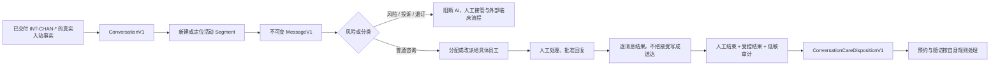

# 机构端：会话工作台技术计划

> **给后续执行 Agent 的要求：** 本文由 `PLAN-CONV-01` 创建，经 `PLAN-CONV-REV-02` 完成第二轮契约返修，并由 `PLAN-CONV-REV-03` 完成第三轮字段定点修正；三轮均为 docs-only 规划，不构成任何 runtime、schema/migration 或外部集成授权。后续 `CONV-*` 任务必须取得用户对具体任务编号、允许文件、数据影响、外部能力和验证范围的明确授权；不得因本文存在而修改源码、API、schema、migration、渠道 adapter、凭证、Webhook、worker 或定时任务。

**目标：** 将当前 AI 会话工作台演示升级路径拆为可独立审查的领域契约、人工闭环、机构权限、审计、单渠道生产门禁，以及与预约随访、客户匹配、知识库和管理中心的版本化接口；首先交付可靠的人工会话能力，AI 与自动触达后置。

**架构方案：** 用 `ConversationV1` 作为跨渠道会话根，用不可重开的 `ConversationSegmentV1` 承载一次连续服务，用不可变 `ConversationMessageV1` 和逐消息结果记录事实。会话线只拥有会话、分段、分配、风险和消息事实；客户匹配、随访、知识、渠道连接、凭证与生产放行分别通过版本化契约或独立集成任务衔接。生产路径遵循“一个获准渠道、人工接管、服务端授权、持久化事实、低敏审计”的顺序，任一门禁不满足时隐藏相应操作，不用演示状态降级冒充成功。

**技术栈：** Next.js、React、TypeScript、Vitest、Testing Library、Drizzle、PostgreSQL、机构访问控制、审计事件、Git Worktree。

---

## 一、文档状态与历史启动检查

- 初始规划日期：`2026-07-17 CST`。
- 初始任务链：`PLAN-CONV-01 → PLAN-CONV-REV-02 → PLAN-CONV-REV-03`，均为 docs-only 规划或修订。
- 历史启动基线：第一轮文档从 `e7450909b794c5dfa54e07e2fd878bdd2ab8b7aa` 的独立 detached Worktree 形成；旧 Worktree 路径和 detached 状态不再作为当前事实。
- 发布载体：本文已纳入 Draft PR `#536` 的 `codex/institution-plans-customer-care-conversation` 分支；Draft 只表示候选，不代表已获合并或 runtime 授权。
- 任何后续审查都必须以当次命令重新核验日期、分支、`HEAD`、`origin/main` 和 `git status --short`，不得复用历史启动快照。
- 总计划：`docs/superpowers/plans/2026-07-17-institution-seven-stream-development-plan.md`
- 产品规格：`docs/superpowers/specs/2026-07-15-institution-navigation-page-system-design.md`
- 文档文件边界：`docs/superpowers/plans/2026-07-17-institution-conversations-technical-plan.md`。
- 授权边界：本计划本身不授权修改 `src/**`、`drizzle/**`、schema、migration、API、测试、配置、脚本或依赖，不授权读取凭证、接 Webhook、出网、真实发送、接入 AIBOTK runtime、提交、推送、创建/合并 PR 或继续任何 runtime；任何实际动作均需独立明确授权。

本文的建议目录、API、表和测试名称仅是未来小 PR 的申请清单。它们在具体 `CONV-*` 获批前均不得创建。

---

## 二、只读盘点结论与不可替代的生产事实

### 2.1 当前代码事实

| 范围 | 现有证据 | 可复用的边界 | 不能当作生产事实的原因 |
| --- | --- | --- | --- |
| AI 会话工作台 | `src/modules/institution/components/AiConversationWorkbenchShell.tsx`、`src/modules/institution/domain/ai-conversation-workbench.ts` | 低敏展示、风险词阻断、人工接管交互、演示状态机和时间线文案 | 组件从 `getAiConversationWorkbenchFixture()` 初始化，并由 `useState` 保存会话、草稿和结果；刷新或进程重启后不保留，且没有会话服务端授权、持久化分配或渠道入站。 |
| 消息发送展示 | `mockSendAiConversationMessage()`、`src/modules/institution/domain/followup-message-deliveries.ts` | 人工批准草稿、低敏快照和安全判定的字段经验 | `mock_sent` 表示模拟记录；它不表示服务商已接受、渠道已送达、客户已回复或业务已完成。现有 `MessageDelivery` 属于随访触达语义，不能直接充当会话消息表。 |
| 渠道前置检查 | `real-channel-preflight.ts`、`wecom-official-dry-run*.ts`、`wecom-real-send-proof*.ts` | 默认关闭、人工确认、同意/退订/频控、紧急停止和低敏预检规则 | `proofEligibleMock`、`plan_ready`、`mock_dry_run_completed` 只允许模拟 proof；既不读取凭证也不调用生产 provider。现有 broadcast execution shell 也在 provider 未注入时 fail-closed。 |
| 渠道与联系人 | `wecom-customer-contact-*.ts`、`wecom-customer-mapping-*.ts` | `tenantId + institutionId` 范围、候选版本、冲突和幂等审查经验 | 候选读取含 fixture 路径；`customer-mapping-reviews/[mappingId]/actions` 使用 `weComCustomerMappingReviewActionMockRuntime`，响应明确标注 `mockDemo: true` 和 `volatile_process_memory`，不能作为正式身份匹配决策。 |
| 权限 | `src/modules/security/domain/access-control.ts`、`src/modules/security/server/access-context.ts` | `AccessContext`、服务端 `canAccessResource`、tenant 角色基础和 fail-closed 习惯 | 当前会话演示没有逐按钮服务端授权；`getDemoAccessContextFromRequest` 是演示会话入口，不能替代 `BASE-02` 所要求的正式机构访问上下文与本人分配范围。 |
| 审计 | `src/modules/audit/domain/audit-events.ts`、`src/modules/audit/server/audit-event-repository.ts` | 受控 reason、禁止 secret、写入事务和低敏 audit | 当前审计实体主要以 `tenantId` 查询；机构级审计、会话专属 action/reason 和“消息正文不入审计”的完整契约仍依赖 `BASE-04`。 |
| 知识 | `institution-knowledge-management-service.ts`、`institution-knowledge-rag-answer-service.ts` | 机构可见性、引用、无答案和“需人工确认”输出 | 当前资料管理与问答尚不是不可变发布版本的 `PublishedKnowledgeReferenceV1`；provider、检索、额度和敏感资料门禁不能作为会话 AI 发布前提。 |

### 2.2 本线的四条事实规则

1. fixture、mock、`mock_sent`、`proofEligibleMock`、dry-run、内存 Map 和 React `useState` 都只能用于隔离的内部演示或测试；不得进入正式会话队列、指标、SLA、分配、风险、客户时间线或“发送成功”结果。
2. 服务商接受、渠道送达、客户入站回复、会话问题解决、随访完成是不同事实；只能分别记录，不能由前一项推导后一项。
3. 当前代码出现的 `real_readonly_proof`、演示 session 或 mock mapping 不等于一个可用生产渠道、真实联系人或正式客户关系。
4. 无持久化会话事实、`tenantId + institutionId` 隔离、服务端权限、审计和能力放行时，会话工作台不得进入正式导航；页面不使用静态 `0`、空壳或假成功补齐。

### 2.3 总控冻结的共享口径

四种机构角色只使用统一稳定代码：`tenant_admin | tenant_operator | consultant | customer_service`。本文后续出现的中文角色名均只是显示名称：

| 稳定代码 | 显示名称 |
| --- | --- |
| `tenant_admin` | 管理员 |
| `tenant_operator` | 运营 |
| `consultant` | 咨询师 |
| `customer_service` | 客服 |

所有跨线读取统一由总协调台声明公共契约，只使用以下唯一响应 envelope；会话线只能在自身模块实现 provider，消费者必须通过服务端 reader 读取，不能访问会话 repository 或表：

```text
InstitutionSourceEnvelopeV1<T,K>
  contractVersion: 'v1'
  scope: { tenantId, institutionId }
  readiness: ready | empty | partial | stale | unavailable | denied | disabled
  freshness: { observedAt, freshUntil } | null
  partitions: [{
    key: K
    readiness: ready | empty | stale | unavailable | denied | disabled
    freshness: { observedAt, freshUntil } | null
    failureCode: null | upstream_unavailable | timeout | invalid_payload | scope_mismatch | permission_denied | not_released | data_incomplete
  }]
  data: T | null
  failureCode: null | upstream_unavailable | timeout | invalid_payload | scope_mismatch | permission_denied | not_released | data_incomplete
```

- `scope` 必须由服务端访问上下文生成并同时校验 `tenantId + institutionId`；客户端提交的 scope 不能作为授权依据。
- reader 只作为消费服务的服务端输入依赖，不是 `InstitutionSourceEnvelopeV1<T,K>` 的响应字段，也不得序列化到浏览器。
- 只有权威查询成功且确定没有记录、即 `readiness=empty` 时，计数才允许显示 `0`。`partial`、`unavailable`、`denied`、`disabled` 或未知结果显示 `--` 或对应受控状态。
- `stale` 只允许展示带 `observedAt` 与 `freshUntil` 的已验证快照，不得驱动当前写操作、工作台行动队列、分配、自动完成或恢复判断。
- 顶层 `denied`、`disabled`、`failureCode=scope_mismatch` 和跨机构请求固定返回 `data=null`，不返回业务数据、分区项目、计数或对象存在性。任一分区出现 `failureCode=scope_mismatch` 时必须提升为顶层 `failureCode=scope_mismatch`，整包 `data=null`；不得用顶层 `partial` 保留其他成功分区。
- 只有顶层 `readiness` 可以为 `partial`；分区 `readiness` 严格限于 `ready | empty | stale | unavailable | denied | disabled`。不存在任何 `scope_mismatch` 时，顶层 `partial` 才可逐分区保留已独立授权且验证成功的数据，并标明各分区状态与 freshness；不能把失败分区计作空数据，也不能用成功分区推断全量结果。
- 顶层与分区 `failureCode` 只使用同一组 `null | upstream_unavailable | timeout | invalid_payload | scope_mismatch | permission_denied | not_released | data_incomplete`，不得出现自由文本或本线自定义 code。
- `ConversationCareDispositionV1`、`IdentityMatchReviewV1`、`ConversationActionSourceV1`、`CustomerReferenceV1`、`CreateCustomerFromIdentityReviewV1` 及其他跨线公共声明均归总协调台所有。本文只记录已冻结字段需求和本线 provider/consumer 责任，不声称拥有或自行创建公共声明。

---

## 三、目标边界与人工闭环

### 3.1 本线拥有与不拥有的事实

| 本线内部事实所有权 | 本线实现的 provider / 消费的契约 | 明确不拥有 |
| --- | --- | --- |
| 会话根、分段、授权消息、未读和排序依据、分配事件、独立风险、处置 revision、身份复核事实、逐消息结果 | 为总协调台公共声明实现 `ConversationCareDispositionV1`、`IdentityMatchReviewV1`、`ConversationActionSourceV1` provider；消费 `CustomerReferenceV1`、`CreateCustomerFromIdentityReviewV1`、`PublishedKnowledgeReferenceV1`、`ReachOutSafetyV1`、`CapabilityStatusV1` 和已批准渠道 adapter 契约 | 公共契约声明、客户主档案、预约/随访事实、HIS 责任归属、知识发布/解析/检索底座、渠道连接与凭证、provider 私有 payload、自动营销旅程和外部临床处置 |

会话/身份服务拥有复核事实及其状态转换；管理中心只提供复核操作界面，客户中心只执行受委派的客户创建。会话线可以提交数据、权限、审计、外部集成和公共契约申请，但不得绕过总协调台修改共享锁定文件、schema 或 `drizzle/**`，不得自行声明不同版本公共契约，也不得读取其他线 repository 或内部表。

### 3.2 人工闭环的目标序列



1. 只有总协调台外部集成串行队列已独立交付 `INT-CHAN-*`，且 `CONV-05` 完成消费验收后的入站事件，才可创建生产会话；未接通渠道时，正式队列隐藏，内部演示入口与正式路径物理分离。
2. 每条入站消息先持久化为消息事实，再进行风险/分类、分配和界面刷新。风险或渠道异常不得因 AI、人工草稿或重试而改变原消息的时间、方向或来源。
3. 当前处理人完成接管、发送、交回 AI 和正常结束。`tenant_admin`/`tenant_operator` 只在授权范围内改派、兜底、强制结束或确认治理动作；强制结束必须有受控原因和审计，只关闭服务窗口，不产生 `resolvedAt`，也不能解除风险。
4. 已结束分段不可编辑、不可接管、不可继续发送。客户再次入站时创建与原会话根关联的新分段，保留旧分段、消息、分配和风险历史，不“重开”或篡改旧事实。
5. 会话只协调风险转交、人工处理和留痕；临床风险必须进入既有外部临床流程。没有外部受控结构化回流与人工再评估时，不允许在会话中解除风险、创建临床结论或恢复受阻业务动作。

---

## 四、领域契约与状态机设计

### 4.1 `ConversationV1`：会话根

`ConversationV1` 只保存跨分段稳定身份、范围和最新指针，不把一次服务的可变状态混进根对象。建议字段：

- `conversationId`、`tenantId`、`institutionId`、`channelType`、`serviceProviderType`、`connectionInstanceId`、`channelConversationRef`（均为安全引用，不保存 provider payload）。`channelType`、接入服务商和连接实例是三个不同维度。
- `customerReference: CustomerReferenceV1 | null`、`identityState`、`activeSegmentId | null`、`latestCustomerInboundAt | null`、`createdAt`、`updatedAt`。
- 会话根 `identityState` 投影严格限于 `matched | pending_review | unmatched | conflict`：review 的 `pending_review`/`awaiting_customer_creation` 映射为 `pending_review`，`conflict` 映射为 `conflict`，`matched` 映射为 `matched`，`rejected`/`withdrawn`/`expired`/`revoked` 映射为 `unmatched`。非 `matched` 投影必须清空 `customerReference`，不得沿用旧客户引用；只有 `matched` 且 `CustomerReferenceV1` 服务端校验成功时才能开放来源限定业务入口。
- 同一机构、连接和渠道会话安全引用的去重键由后续 `MIG-04` 申请确定；入站幂等键不能由前端生成。

### 4.2 `ConversationSegmentV1`：一次连续服务

分段是会话状态机和人工闭环的最小单位。建议字段：`segmentId`、`conversationId`、`sequenceNo`、`state`、`openedByMessageId`、`everHumanHandled`、`closedAt`、`closedBy`、`segmentCloseKind`、`closeDisposition`、`forceCloseReason | null`、`resolvedAt | null`、`lastCustomerMessageAt`、版本与审计引用。

主状态代码固定为 `ai_handling`、`awaiting_human`、`human_handling`、`waiting_customer`、`closed`：

```text
ai_handling → awaiting_human → human_handling ⇄ waiting_customer → closed
      ↑                              │
      └──── 当前处理人受控交回 AI ────┘
ai_handling ── 纯 AI auto_close 守卫 ──→ closed
```

- `ai_handling → awaiting_human`：风险、低置信度、知识冲突、隐私、退订、投诉、退款争议、诊疗/疗效/价格承诺、客户主动要求或人工分流均触发；不能继续自动回复。
- `awaiting_human → human_handling`：必须存在唯一活动分配，由被分配员工服务端接受；第一次成功接管后永久置 `everHumanHandled=true`。
- `human_handling ⇄ waiting_customer`：只允许当前活动处理人操作；新客户消息使 `waiting_customer` 返回 `human_handling`，并生成新的处置 revision。
- `human_handling/waiting_customer → ai_handling`：只有当前处理人可交回 AI，且最新事实必须 `riskState=none`、`blockingReasonCodes=[]`、没有未确认业务动作或未知发送结果，AI/已发布知识/敏感数据授权均为当前 `ready`，消息类型在获准范围内，机构策略允许，并成功写入低敏审计。交回 AI 不清除 `everHumanHandled`，因此该分段以后仍不得 AI 自动结束。
- `ai_handling → closed` 的 `auto_close`：仅限从未人工接管的纯 AI 分段，即 `everHumanHandled=false`，并且无风险、无 blocker、无待处理/未知出站、已超过机构批准等待窗口、渠道规则允许且期间没有新入站。这里只冻结领域守卫；任何实际自动执行机制仍需独立 runtime 授权。
- `human_handling/waiting_customer → closed` 的人工正常结束：仅当前处理人可执行，必须选择受控结果并审计。关闭服务窗口本身不自动生成 `resolvedAt`；只有问题确已解决的追加事实才能令处置为 `resolved`。
- `tenant_admin`/`tenant_operator` 可对未关闭分段执行受控强制结束。强制结束固定写 `segmentCloseKind=forced`、`resolutionState=open`、`resolvedAt=null` 和 `forced_close_unresolved` blocker；风险状态保持原值，不能借强制结束解除风险。
- `closed` 是终态，不可编辑、接管、交回 AI 或继续发送。新客户入站必须创建同一会话根下的新 `segmentId` 与新 `sequenceNo`，不得重开旧分段；AI、人工、系统事件或内部操作也不得把没有新客户消息的会话顶到队首。

### 4.3 `ConversationMessageV1` 与逐消息结果

消息一经落库不可修改或删除；纠错、撤回、送达更新和风险补充都以追加事件或受控结果关联，不覆盖正文、方向或来源时间。

| 对象 | 建议最小字段 | 关键规则 |
| --- | --- | --- |
| `ConversationMessageV1` | `messageId`、`conversationId`、`segmentId`、`direction`（`inbound`/`outbound`/`system`）、`senderKind`、`occurredAt`、`receivedAt`、授权内容引用/受控正文、低敏摘要、`sourceMessageRef`、`idempotencyKey` | 原始内容只在完成服务所需的授权消息视图读取；列表、时间线、审计和跨模块 URL 只使用低敏摘要或对象 ID。 |
| `ConversationMessageResultV1` | `resultId`、`messageId`、`stage`、`status`、`occurredAt`、`providerMessageRef` 的脱敏引用、`failureCode`、`attemptNo`、`dedupeKey` | 按阶段追加发送提交、服务商接收、渠道送达等真实结果；不以一个总状态覆盖其他阶段。 |
| `ConversationMessageReplyLinkV1` | `outboundMessageId`、`inboundMessageId`、`linkedAt`、关联依据 | 客户回复是新的入站消息及关联事实，不能写入出站消息的“已回复/已完成”状态。 |

第一阶段人工出站应只允许一条经过服务端重新校验、人工确认和幂等保护的消息。以下状态族必须独立，不能合并为一个 `sent/completed`：

1. **发送/接收事实：** 入站使用不可变 `inbound_received`；出站依次追加 `outbound_created`、`outbound_submitted`，失败、跳过或未知保留对应受控结果。
2. **服务商接收事实：** `provider_accepted | provider_rejected | provider_unknown`，只说明接入服务商是否接受请求。
3. **渠道送达事实：** `delivery_not_reported | channel_delivered | channel_failed | channel_unknown`，只能由该渠道权威回执产生。
4. **客户回复事实：** 新的 `ConversationMessageV1(direction=inbound)` 加 `ConversationMessageReplyLinkV1`；没有关联时为无已验证回复，不能从已读、点击或会话继续推断。
5. **业务完成事实：** 只由最新 `ConversationCareDispositionV1` 或目标业务服务记录；消息、服务商接收、渠道送达和客户回复均不自动等于业务完成。

无渠道回执时必须显示“送达未知”，不得根据 HTTP 成功、provider 接受、超时重试或人工主观判断推断已送达。`channelType`、`serviceProviderType` 和 `connectionInstanceId` 分开保存和展示，任何一个维度的可用性都不能替代另外两个维度的状态。

### 4.4 `ConversationAssignmentV1`：分配不是客户归属

建议将接受、拒绝、改派和兜底记录为追加的 `ConversationAssignmentV1`，含 `segmentId`、`assigneeUserId`、`assigneeRole`、`assignedBy`、`reasonCode`、`status`、`assignedAt`、`acceptedAt | null`、`releasedAt | null`、版本和幂等键。

- `tenant_admin` 和 `tenant_operator` 可查看当前机构会话并按角色、在线状态和负载分配、改派或兜底；`consultant` 和 `customer_service` 只读写本人被分配的活动分段。
- 当前处理人可接受、拒绝、处理和交回 AI；仅具备分配角色不等于可修改任意分段。
- 会话临时处理人永不修改 HIS 客户负责人或客户持续业务归属。
- 并发接受/改派使用服务端版本条件和唯一活动分配约束；冲突返回可恢复状态，不能让两个处理人同时拥有发送权。

### 4.5 `ConversationRiskV1`：独立于主状态

风险状态使用 `none | unconfirmed | confirmed | resolved`，其中实际风险记录按 `unconfirmed → confirmed → resolved` 追加演进，并与分段主状态正交。建议记录 `riskId`、`segmentId`、受控 `riskCode`、`riskDomain`、来源消息、检测来源、确认/解决人、关键时间、`riskClosureReference | null`、受控说明和审计引用。`riskDomain` 固定为 `clinical | non_clinical`；服务、隐私、财务和同意等细分只进入受控 `riskCode`。无风险时 Care 快照的 `riskDomain=null`，不得扩张公开枚举。

- 医疗、术后异常、诊疗建议、疗效/价格承诺、投诉、隐私或其他高风险至少触发人工处理；高风险确认不得由 AI 自动完成。
- 风险未解决时阻断普通结束、自动回复、自动触达和业务续流；强制结束只能结束服务窗口，不能伪造风险已解决。
- 外部临床流程只回流无敏感正文的受控关闭引用与状态；会话线不保存诊疗结论，也不代替临床处置。临床 `riskClosureReference` 必须能由服务端 reader 验证为同一机构、有效且未撤销，引用失效或撤销后重新阻断。

### 4.6 `ConversationCareDispositionV1`：提供给预约与随访的结果契约

公共声明归总协调台；会话线根据自身追加式消息、风险、分配、解决和关闭事件实现 provider，预约与随访线通过服务端 reader 消费 `InstitutionSourceEnvelopeV1<T,K>` 中的最新快照。它不是随访状态机，也不直接创建、完成或恢复任务。会话内部可以保留所有 append-only 事实事件和历史 revision，但跨线唯一有效读模型是当前 revision 的 `ConversationCareDispositionV1` 快照。

```text
ConversationCareDispositionV1
  contractVersion: 'v1'
  dispositionId, revision
  scope: { tenantId, institutionId }
  conversationId, segmentId, sourceMessageId
  confirmedCustomer: CustomerReferenceV1 | null
  identityState: matched | pending_review | unmatched | conflict
  classification: simple_confirmation | substantive_consultation | ambiguous | risk | null
  resolutionState: open | resolved | invalidated
  segmentCloseKind: open | normal | forced
  riskState: none | unconfirmed | confirmed | resolved
  riskDomain: clinical | non_clinical | null
  riskClosureReference | null
  blockingReasonCodes: Array<clinical_risk | complaint | refund_dispute | opt_out | privacy_request | unresolved_consultation | identity_unconfirmed | forced_close_unresolved>
  sourceMessageOccurredAt, classifiedAt, lastCustomerMessageAt
  resolvedAt | null, segmentClosedAt | null, snapshotCreatedAt, invalidatedAt | null
  auditReference
```

- `classification` 非空时只有四类，优先级固定为 `risk > substantive_consultation > ambiguous > simple_confirmation`；`null` 只表示最新消息尚未完成分类。投诉、退款争议、退订、隐私、未解决咨询、身份未确认和强制结束未解决不是第五类分类，而是受控 blocker。
- `blockingReasonCodes` 仅允许 `clinical_risk`、`complaint`、`refund_dispute`、`opt_out`、`privacy_request`、`unresolved_consultation`、`identity_unconfirmed`、`forced_close_unresolved`。任一枚举或 blocker 新增值都必须进入 V2，不得在 V1 增补自由文本或别名。
- 每条新客户消息先持久化消息事实，并原子追加旧 revision 的 invalidation 事件与新的当前 revision；旧 revision 派生为 `resolutionState=invalidated`、写入 `invalidatedAt`，不能继续驱动 Care。新 revision 尚未完成分类时保持 `classification=null`，最新跨线读取固定返回顶层 `readiness=partial` 与 `data=null`，不得沿用旧 revision 的分类、解决状态或数据；分类完成后才生成可消费的 `readiness=ready` 最新快照。历史 revision 仅用于本线授权审计与解释。
- 强制结束只把 `segmentCloseKind` 变为 `forced` 并关闭服务窗口；固定保持 `resolutionState=open`、`resolvedAt=null`，追加 `forced_close_unresolved`，且不改变 `riskState` 或撤销任何 blocker。
- `riskClosureReference` 只能是低敏受控引用。临床风险即使有引用也不能由会话线自动解除；reader 必须验证它属于同一 `scope`、有效且未撤销。
- 契约只含低敏对象引用、受控分类、状态、时间、reason code 和 audit reference；不含消息正文、外部账号、AI 回答、渠道 payload 或临床结论。

Care 消费守卫固定如下，消费者不得自行放宽：

| 场景 | 必须同时满足的守卫 | 允许结果 |
| --- | --- | --- |
| 简单确认自动完成 | 关联 Care 对象当前状态为 `waiting_customer`；服务端 reader 返回最新 revision 且 `readiness=ready`，不是 `partial/stale`；`identityState=matched` 且 `confirmedCustomer` 与 Care 客户一致；`classification=simple_confirmation`；`resolutionState=resolved`；`riskState=none`；`blockingReasonCodes=[]` | Care 可按自身幂等状态机自动完成；任何条件不满足都保持原状态。 |
| 实质咨询或含糊回复 | `classification=substantive_consultation \| ambiguous` | 始终保持等待，不自动完成或恢复。人工只能在最新 fresh revision 为 `resolved`、`resolvedAt` 存在、`blockingReasonCodes=[]`，且当前时间不早于 `max(resolvedAt,lastCustomerMessageAt)+60分钟` 时复核恢复；期间任何新客户消息都会令旧 revision 失效并重算。 |
| 临床风险 | `classification=risk` 且 `riskDomain=clinical` | 必须存在同机构、有效、未撤销的外部临床 `riskClosureReference`，最新 revision 已解决且无 blocker；仍只允许人工复核恢复，永不自动恢复或自动完成。 |
| 其他风险或 blocker | `classification=risk` 或任一 `blockingReasonCodes` 非空 | 保持阻断，只能按对应业务治理流程产生新事实和新 revision；Care 不得自行清除。 |

### 4.7 `IdentityMatchReviewV1`：未知联系人复核契约

现有企微映射状态机和复核 handler 可作为低敏校验、候选版本、幂等与冲突处理的参考，但其 fixture 和 volatile mock runtime 不能升级为本契约的后端。

`IdentityMatchReviewV1` 公共声明归总协调台；会话/身份服务拥有复核事实、revision、决定和审计，并实现 provider/command handler；管理中心只消费契约提供决定界面，客户中心只处理受委派的新建客户命令。唯一状态集合固定为 `pending_review`、`awaiting_customer_creation`、`matched`、`rejected`、`conflict`、`withdrawn`、`expired`、`revoked`，不得出现第二套状态名。

```text
IdentityMatchReviewV1
  contractVersion: 'v1'
  reviewId, revision
  scope: { tenantId, institutionId }
  conversationId, segmentId, connectionInstanceId
  irreversibleIdentityReference
  candidateSnapshotVersion, candidateSetDigest
  state
  lastDecision: confirm_existing | delegate_create_customer | reject | withdraw | revoke | null
  lastDecisionReasonCode | null, lastDecisionActorReference | null
  resolvedCustomer: CustomerReferenceV1 | null
  submittedBy, submittedAt
  assignedReviewer | null, assignedAt | null
  decidedAt | null, expiresAt | null, expiredAt | null
  auditReference
```

合法状态转换仅为：

```text
pending_review → matched | awaiting_customer_creation | rejected | conflict | withdrawn | expired
awaiting_customer_creation → matched | pending_review | conflict | withdrawn | expired
conflict → pending_review  仅当出现新候选
matched → revoked
```

`rejected`、`withdrawn`、`expired`、`revoked` 均为旧 review 终态；`revoked` 后重新匹配必须创建新 review，不存在旧 review 的出向转换。除上述转换外一律拒绝。`lastDecision` 仅允许 `confirm_existing | delegate_create_customer | reject | withdraw | revoke | null`，其中冲突与过期是状态事实，不另造 decision 值；新增动作必须进入 V2。

- `irreversibleIdentityReference` 是服务端生成的不可逆身份引用；原始手机号、外部账号 ID、备注、聊天原文、连接凭证和 provider payload 均不得进入契约、URL 或 audit。
- `candidateReference` 只允许服务端 reader 在同一 scope 内解析候选，不进入跨线响应、浏览器状态或命令参数。跨线快照只暴露 `candidateSnapshotVersion` 与受控 `candidateSetDigest`；决定或建客命令不提交 `candidateReference`。
- `consultant` 和 `customer_service` 只能为本人已分配的活动分段提交或补充低敏复核；`tenant_admin` 和 `tenant_operator` 才能决定匹配既有客户、拒绝、标记冲突、撤回或发起受控新建客户。
- 每个复核决定命令必须同时绑定 `reviewId + expectedRevision + candidateSnapshotVersion + idempotencyKey`；委派新建客户还必须携带下述 `actionToken + createCustomer`。任一 revision/candidate 变化、重复键载荷不一致、scope mismatch、跨机构、过期或已终态均 fail-closed，并且不返回候选或客户数据。
- `CreateCustomerFromIdentityReviewV1` 必须完整消费总协调台冻结形状，精确字段为 `contractVersion`、`reviewId`、`expectedRevision`、`candidateSnapshotVersion`、`idempotencyKey`、`actionToken`、`createCustomer`，不得遗漏 `actionToken` 或使用本线别名。`createCustomer` 必须原样使用客户中心冻结的完整标准创建 DTO，不得用候选摘要拼装缩减 DTO。
- `actionToken` 只能由身份决定服务端在重新验证当前 `institutionId`、reader、review、revision、候选版本与完整创建 DTO 后签发，并绑定当前机构、reader、`reviewId`、`expectedRevision`、DTO 摘要和短时有效期；它是一次性服务间动作令牌。管理中心 UI 只向身份决定服务端提交最终确认意图和受控 DTO，不取得令牌；令牌绝不进入浏览器内存/响应/持久化、URL、日志或审计。会话/身份服务只在服务端编排调用中把原令牌透传给客户中心命令处理者，不返回客户端、不解析为客户事实，也不长期保存。
- 新建客户必须将 review 先转为 `awaiting_customer_creation`，再由会话/身份服务调用总协调台声明、客户中心实现的 `CreateCustomerFromIdentityReviewV1`。客户中心必须原子验证并消费 `actionToken`；令牌过期、已被不同命令使用、绑定机构/reader/review/revision/DTO 摘要不一致或重放载荷不一致时 fail-closed，不创建客户，并要求重新读取 review 后取得新令牌。相同 `idempotencyKey` 与完全相同载荷的安全重试返回第一次已持久化结果，不因一次性令牌已消费而重复建客；不同载荷重放固定拒绝。
- 客户中心成功返回同 scope 的 `CustomerReferenceV1` 后，身份服务才可在一个本地事务中重新校验 `expectedRevision`、`candidateSnapshotVersion`、`idempotencyKey` 和已消费令牌所绑定的命令结果，原子写入 `matched + resolvedCustomer + audit`；创建失败或身份事务失败不得产生部分匹配，重试只能读取同一幂等创建结果。
- `matched` 后撤销关系使用 `revoked`，保留原决定和客户引用的低敏历史。`revoked` 后如需重新匹配必须创建新的 `reviewId`，不得重开、改写或复用旧 review。
- 八种 review 状态向会话身份投影的映射固定为：`pending_review`/`awaiting_customer_creation` → `pending_review`，`conflict` → `conflict`，`matched` → `matched`，`rejected`/`withdrawn`/`expired`/`revoked` → `unmatched`。只有 `matched` 且 `resolvedCustomer` 经服务端 reader 当前校验成功后，当前会话才能保留客户引用；`pending_review`、`awaiting_customer_creation`、`conflict`、`rejected`、`withdrawn`、`expired` 的 `resolvedCustomer` 必须为 null。`revoked` review 可保留原客户的低敏历史引用用于审计，但当前会话必须清空 `customerReference`、保留 `identity_unconfirmed` blocker，不得沿用该引用或开放预约、随访等客户业务写入。

### 4.8 `ConversationActionSourceV1`：提供给工作台的生产行动源

公共声明归总协调台；会话线实现只读 provider，工作台只能通过服务端 reader 消费。响应只使用 2.3 节的 `InstitutionSourceEnvelopeV1<T,K>`，固定且仅有 `waiting_human`、`unresolved_risk` 两个分区。

每个行动项精确包含：

```text
conversationId, segmentId
sourceVersion
production: true
subject: customer(CustomerReferenceV1) | unmatched_contact('待匹配联系人')
conversationState, riskState
partitions: Array<waiting_human | unresolved_risk>
sortSignals: Array<urgent | overdue | sla_due | today | high_priority>
lastCustomerMessageAt, slaAt
priority
assignee
safeSummary
detailHref: "/hospital/conversations/:conversationId"
```

- 只允许从真实持久化、未关闭的最新分段生成，且 `production=true`、`sourceVersion` 有效、`subject` 合法。`waiting_human` 收录 `conversationState=awaiting_human` 的人工待接管项；`unresolved_risk` 收录风险尚未解决的活动分段。`safeSummary` 不含消息正文、聊天原文、AI 全文或原始外部身份。
- 排序信号由 provider 以 `priority + sortSignals + slaAt + lastCustomerMessageAt` 确定：未解决临床/高风险优先，其后按 SLA 到期与最后客户入站时间；工作台不得读取会话表自行复刻排序。同一 `segmentId` 同时命中两分区时，通过 `partitions` 保留两分区计数，跨分区行动队列去重并优先展示 `unresolved_risk`。
- `tenant_admin`/`tenant_operator` 可读取当前机构内其有权处理的项目；`consultant`/`customer_service` 只读取本人已分配的活动分段。未分配项、其他员工分段和跨机构对象不向普通角色暴露，且不能通过计数、空态或错误文案泄露存在性。
- `readiness=stale` 的快照可带截止时间显示为历史参考，但不得进入当前工作台行动队列或待办数字；不存在 scope mismatch 时，`partial` 只展示成功分区并明确失败分区。任一分区 `scope_mismatch` 都必须提升为顶层同名错误并整包 `data=null`；`denied/disabled` 分区不返回对应项目或计数。
- `detailHref` 唯一指向 `/hospital/conversations/:conversationId`；不得创建第二套会话详情路由、在 URL 携带消息正文/外部身份，或使用旧演示入口承载生产行动。`actionId`、`partitionKey`、`sortPriority`、`slaDueAt`、`canonicalHref` 及其他近义字段不属于 V1。

### 4.9 规范页面与兼容路由

会话工作台的页面路由固定为下表；`automations` 静态段必须优先于动态 `:conversationId` 解析，不能被识别为会话 ID：

| 页面 | canonical 路由 | 交付与权限边界 |
| --- | --- | --- |
| 会话队列 | `/hospital/conversations` | `CONV-04`；仅展示服务端当前角色可读的生产会话。 |
| 会话详情 | `/hospital/conversations/:conversationId` | `CONV-04`；桌面三栏中间主区域、移动端全屏，直达和刷新都重验 scope、角色、活动分配与对象版本。 |
| 自动触达 | `/hospital/conversations/automations` | `CONV-08`；仅管理员/运营进入受控旅程列表，能力未发布时隐藏且不取数。 |
| 自动触达详情 | `/hospital/conversations/automations/:journeyId` | `CONV-08`；桌面完整页，移动端只读详情与获准暂停入口；每次重验旅程机构归属、角色、revision 和触达安全状态。 |
| 旧客服工作台 | `/hospital/service` | 仅由 `BASE-01A` 提供服务端兼容跳转至 `/hospital/conversations`，不保留第二套页面、状态或数据源；目标能力关闭或无权限时沿用目标页受控状态。 |

- 两个顶部页签固定为“会话队列、自动触达”；各自 capability 独立，人工会话可先发布，自动触达未满足 `CONV-08` 门禁时不显示空壳。
- URL 只允许对象 ID 和批准的安全结构化筛选，不传消息正文、外部身份、客户名称、令牌或 provider 参数。打开 canonical 页面不代表业务动作成功，所有操作仍在目标服务端命令重新授权。
- `detailHref`、列表点击、直接访问、刷新、前进/后退和移动端入口必须使用同一 canonical URL；兼容路由只重定向，不承载业务 client 或请求旧数据源。

---

## 五、依赖、共享锁和数据变更申请

### 5.1 前置依赖

| 前置项 | 会话线的使用方式 | 未完成时的行为 |
| --- | --- | --- |
| `BASE-01 / BASE-01A` | `/hospital/conversations/**` 路由、能力关闭和导航隐藏 | 仅做领域测试；不接正式路由，不用旧 mock 页替代。 |
| `BASE-02` | 统一 `tenantId + institutionId`、四角色、本人分配范围与逐按钮授权 | 无正式访问上下文时拒绝会话读写。 |
| `BASE-04` | 会话、风险、分配、复核、消息结果和强制结束的机构级低敏审计 | 审计不可写的高风险写操作 fail-closed。 |
| `BASE-05` | 未发布、无权限、局部失败、连接不可用、冲突、过期和未知结果状态 | 不将失败显示为 `0` 或“已送达”。 |
| `MIG-01 → MIG-02 → MIG-03` | 机构归属/审计、客户稳定引用/随访结构化结果、知识不可变版本/发布指针的串行前置 | 任一未合并，不得进入 `MIG-04`。 |
| `MIG-04` | 会话根、分段、消息、逐消息结果、分配、风险、处置 revision、身份复核事实的唯一迁移单元 | 会话线只提交/消费申请；栏目 PR 不得编辑 schema/migration，也不得另造并行编号。 |
| 总协调台外部集成串行队列 | 交付一个已批准 `INT-CHAN-*` 的渠道 adapter、凭证/回调边界、触达安全和生产放行 | `CONV-05` 只做消费验收；没有已交付 adapter 时无生产入站/出站。 |
| 知识库线 | `PublishedKnowledgeReferenceV1` | AI 能力隐藏；人工会话继续可用。 |
| 预约与随访线 | 消费 `ConversationCareDispositionV1` | 会话只留痕，不以自由文本改变随访。 |
| 工作台线 | 消费 `ConversationActionSourceV1` | 不直接读取会话 repository/table，不用 stale 项驱动待办。 |
| 管理中心线 | 消费 `IdentityMatchReviewV1` 并提供决定界面；管理连接状态和生产放行 | 不拥有复核事实，未知联系人保持不可用于业务写入。 |
| 客户中心线 | 实现总协调台声明的 `CreateCustomerFromIdentityReviewV1` 并返回 `CustomerReferenceV1` | 会话线不直接创建客户，失败不得产生部分身份匹配。 |

### 5.2 共享文件锁

会话线不得修改以下总协调台独占或已冻结的路径：

- `src/app/hospital/layout.tsx`、`src/app/hospital/page.tsx`、公共导航和路由解析；
- `src/modules/security/**`、公共审计核心、`src/modules/auth/components/DemoSessionGate.tsx`；
- `src/server/db/schema.ts`、`drizzle/**`、`package.json`、锁文件和公共配置；
- `src/modules/workspace/components/InstitutionWorkspace.tsx`；
- `src/modules/institution/client/tenant-business-client.ts`、`domain/tenant-business-view-models.ts`、`server/tenant-business-api.ts`、`server/tenant-business-audit-transaction.ts`、`server/tenant-business-repository.ts`、`server/tenant-business-write-input.ts`。

未来会话线优先在独占目录 `src/modules/institution-conversations/**`、`src/app/hospital/conversations/**`、`src/app/api/institution/conversations/**` 和对应独占测试目录实施。涉及上述锁定文件时只提交 integration request，不能在栏目 PR 中顺手修改。

### 5.3 `MIG-04` 数据变更申请内容（不是 migration 授权）

唯一迁移顺序固定为 `MIG-01 → MIG-02 → MIG-03 → MIG-04 → MIG-05 → MIG-06`。在前三项依次合并前，`CONV-02` 只能完善 `MIG-04` 申请，不能执行迁移。申请至少覆盖：

1. `MIG-04` 只承载会话根、分段、消息、逐消息结果、分配、风险、`ConversationCareDispositionV1` revision/失效事实和 `IdentityMatchReviewV1` 复核事实；现有 demo fixture、mock runtime、dry-run 和随访 `MessageDelivery` 均不是回填源。
2. 每张记录的 `tenantId + institutionId`、外键、跨机构拒绝语义、历史数据是否为空以及不猜测归属的策略。
3. 入站渠道安全引用、消息幂等键、活动分段、活动分配、逐消息 attempt、处置 revision 和复核 revision 的组合唯一约束、版本字段和索引。
4. 原始内容授权视图、低敏摘要、消息附件安全引用、保留期和清理关系；渠道凭证、Webhook 配置/原始 payload、provider 私有 payload、OCR/ASR 私有输出和内部错误堆栈不进入 `MIG-04` 或审计。
5. `expand → backfill → enforce` 是否需要多步；停机/回滚、历史数据预检、写入冲突和重复渠道回调的处理。
6. 对 `ConversationCareDispositionV1`、`IdentityMatchReviewV1`、`ConversationActionSourceV1`、权限、审计、UI 和 `INT-CHAN-*` adapter 消费的影响，以及独立数据库和 migration lease 验证方案。

任何渠道/AIBOTK、HIS、ERP/POS、受控导入、OCR/embedding/rerank/知识 AI 或经营报告 provider 都只进入总协调台唯一外部集成串行队列；栏目计划只提出业务契约、消费已批准 adapter 并验收，不把 provider 实现或私有 schema 塞进会话页面 PR。

---

## 六、从 `CONV-01` 开始的小 PR 计划

所有切片均为未来申请，均从满足前置条件的最新 `origin/main` 创建独立短分支；一个 PR 只完成一个切片。能力默认 `hidden` 或 `read_only`，合并代码不等于发布。

### `CONV-01`：领域契约与状态机测试

- **目标：** 在不接数据库、路由、UI、网络或凭证的前提下，实现本线内部 `ConversationV1`、分段、消息、分配、风险、处置 revision、身份复核和逐消息结果领域模型，并针对总协调台冻结的公共 V1 声明编写 provider 映射/兼容测试。
- **建议范围：** 只申请新增 `src/modules/institution-conversations/domain/**`、`src/modules/institution-conversations/tests/**`。`src/modules/institution-contracts/v1/**` 的公共声明由总协调台单独拥有和修改，不能混入 `CONV-01`。
- **必须测试：** 五态合法/非法转换、人工交回 AI 守卫、纯 AI auto-close、人工/强制结束语义、结束后新入站创建新分段、旧处置 revision 失效、Care 四类分类与守卫、风险独立状态、分配并发、消息幂等、发送/接收/送达/回复/业务完成分离、身份八状态、expected revision/候选版本/幂等绑定、`CreateCustomerFromIdentityReviewV1` 完整七字段，以及 `actionToken` 的服务端签发、机构/reader/review/revision/DTO 摘要绑定、短时过期、一次性消费、相同幂等重试、不同载荷重放拒绝和绝不返回浏览器；同时覆盖低敏契约输出和四角色边界。
- **明确非范围：** schema/migration、repository、API、页面、渠道 adapter、AI 调用、真实消息、自动触达。

### `CONV-02`：会话数据模型申请与 `MIG-04` 排队

- **目标：** 提交第四个迁移单元的技术设计和历史预检，不在会话分支直接修改 `src/server/db/schema.ts` 或 `drizzle/**`。
- **输出：** 5.3 所列数据申请、表/索引/约束提案、数据留存与回滚方案，以及对 `MIG-01 → MIG-02 → MIG-03` 串行前置的明确依赖。
- **停止条件：** 前三项 migration 未依次合并、唯一迁移队列被占用、机构归属不可验证、回填来源依赖 fixture/mock，或用户未批准 schema/migration 时停止。

### `CONV-03`：持久化服务、服务端授权、审计和 API

- **前提：** `BASE-02`、`BASE-04` 与获批并合并的 `MIG-04`。
- **目标：** 为会话读写、分配、风险、结束和逐消息结果建立 repository/service/API；每个动作服务端重新解析访问上下文、机构范围、当前处理人、对象版本和幂等键。
- **权限矩阵：** `tenant_admin`/`tenant_operator` 可按当前机构范围读取、分配和执行受控治理动作；`consultant`/`customer_service` 只看本人已分配活动分段。当前处理人才能发送、交回 AI、普通结束；改派、兜底和强制结束需要独立受控 reason。未知联系人不能取得预约/随访写入入口。
- **审计：** 使用受控 action/reason 记录允许、拒绝、并发冲突和强制动作；事务内保持业务写入与审计一致。正文、原始账号、凭证、Webhook payload、provider 错误和 AI 全文均不得进入 audit。

### `CONV-04`：人工会话队列、详情与跨线结果

- **前提：** `CONV-03` 已提供真实持久化服务，且 `BASE-01A` 分配了稳定路由壳。
- **目标：** 实现 canonical `/hospital/conversations` 队列、`/hospital/conversations/:conversationId` 桌面三栏/移动全屏详情、接管/拒绝/改派/结束、风险状态和消息授权视图；为总协调台公共声明实现 `ConversationCareDispositionV1` 与 `ConversationActionSourceV1` provider。向 `BASE-01A` 提交 `/hospital/service` 只跳转新队列的兼容 request，并验证 `automations` 静态段不会被动态会话详情吞并；本切片不实现自动触达页面。
- **展示规则：** 仅当前角色有权处理的唯一会话进入四项指标；默认排除已结束分段，按最后客户入站消息倒序；未知和局部失败显示 `--`。搜索只匹配低敏名称/脱敏引用且仅保留页面内存，不搜索正文。
- **发送规则：** 未通过 `CONV-05` 时隐藏正式发送按钮；仅可展示已持久化的内部草稿/处理状态，不能显示“模拟发送成功”。

### `CONV-05`：消费一个已交付渠道 adapter 的真实入站与人工出站验收

- **任务定位：** 只消费总协调台唯一外部集成串行队列已独立审批、实现、测试并交付的一个 `INT-CHAN-*` adapter；本 PR 不实现 adapter，不读取凭证，不接 Webhook，不出网，不包含 provider 私有 payload，也不改变生产配置。
- **三层模型：** `channelType` 表示个人微信、企业微信客户联系/会话存档、微信客服或未来获准渠道；`serviceProviderType` 表示官方接口、AIBOTK 或未来接入服务商；`connectionInstanceId` 表示当前机构的具体连接。渠道、服务商、连接实例的授权、健康与生产放行分别判断。
- **AIBOTK 边界：** AIBOTK 永远是接入服务商，不是渠道。任何获准 PoC 必须使用非核心账号，明确客户端扫码与 API 凭据依赖，个人微信与企业微信能力分别验证，人工始终可接管，禁止自动营销和跨渠道补发；PoC、安全、稳定性、急停和生产放行全部通过前不得启用。AIBOTK runtime 只属于独立 `INT-CHAN-*`，不进入栏目 PR。
- **消费验收门禁：**
  1. `BASE-02`、`BASE-04`、`MIG-04`、`CONV-03/04` 已验收，且 `INT-CHAN-*` 的契约版本、单机构/单连接/单渠道范围、授权、健康、发送窗口、消息数量、回执能力和生产放行均由服务端当前验证；
  2. 客户匹配已确认或仅走获准匿名服务规则；同意、退订、安静时段、频控、风险、当前处理人和人工确认在每次出站前重新校验，stale 快照不得发送；
  3. 重复入站、幂等、超时、未知结果、渠道掉线、授权撤销和急停均有低敏审计与回滚；故障暂停该连接新出站，不自动切换服务商或跨渠道补发；
  4. 真实发送只限当前处理人的人工动作。发送/接收、服务商接受、渠道送达、客户回复和业务完成分别记录；没有权威回执时保持未知；
  5. adapter fake 契约、受控 proof、回滚演练和人工发布确认已在独立集成任务完成，`CONV-05` 重新做消费侧契约与端到端验收。fixture、dry-run、HTTP 200 或 provider 接受均不能替代生产证据。

### `CONV-06`：未知联系人复核

- **前提：** `IdentityMatchReviewV1` 与 `CreateCustomerFromIdentityReviewV1` 已由总协调台冻结，管理中心决定界面与客户中心幂等创建 provider 已明确。
- **目标：** 会话/身份服务持久化复核事实和八状态；`consultant`/`customer_service` 仅提交，`tenant_admin`/`tenant_operator` 通过管理中心决定。委派新建客户时完整消费含 `actionToken` 的 `CreateCustomerFromIdentityReviewV1`，覆盖服务端获取、原样透传、绑定验证、短时过期、一次性消费、相同幂等结果复用及不同载荷重放拒绝；客户中心成功返回 `CustomerReferenceV1` 后才原子匹配。
- **禁止：** 管理中心拥有或另建复核事实、会话线直接创建/合并客户、把候选视为确认、复用 mock runtime、`candidateReference` 出现在客户端，或把原始外部标识/聊天正文带入跨线契约。`revoked` 复核不得重开。

### `CONV-07`：AI 建议与已发布知识引用

- **前提：** `PublishedKnowledgeReferenceV1`、可用且机构隔离的知识授权、AI 单独安全审批和可审计使用记录，以及总协调台外部集成串行队列已交付的知识 AI provider；栏目 PR 不实现 OCR、embedding、rerank 或 AI provider。
- **目标：** 仅在已批准知识范围内提供可追溯建议与持续身份披露；对低置信度、冲突、来源失败、医疗/疗效/价格/投诉/隐私/退订和任何高风险强制转人工。
- **禁止：** AI 自动结束人工接管分段、输出医疗判断、读取超过当前处理人权限的数据、将内部摘要/画像对外发送，或将 provider 可用性视为人工会话发布前提。

### `CONV-08`：自动触达（最后且独立）

- **前提：** `ReachOutSafetyV1`、版本模板、同意、退订、安静时段、去重、有限幂等重试、逐收件人结果、急停、单渠道生产门禁和用户再次明确授权全部满足。
- **目标：** 只允许受控旅程和固定批准模板，并实现 `/hospital/conversations/automations` 与 `/hospital/conversations/automations/:journeyId`；营销回复回到会话队列，但预约提醒、治疗后服务和随访通知仍由预约与随访模块持有自己的业务状态。
- **默认：** L4 营销自动化、群发、加好友、裂变、任意图形/SQL/代码旅程和跨渠道补发保持关闭。自动触达失败、跳过、退订、暂停、完成不能以 provider 接受替代。

---

## 七、验证、发布与回滚门禁

### 7.1 分层验证

| 层级 | 未来验证重点 | 不可接受的替代证据 |
| --- | --- | --- |
| 纯领域 | 五态转换、交回 AI/auto-close/正常与强制结束守卫、处置 revision 失效、Care 四类分类与恢复守卫、身份八状态、低敏校验、分配冲突、幂等和逐消息结果语义 | fixture 截图、组件 `useState` 或 mock happy path。 |
| repository / migration | 机构隔离、唯一约束、并发、历史数据预检、事务与审计原子性 | 共享开发库的偶然数据、跳过 migration 或把 mock 回填进表。 |
| API / 权限 | `tenant_admin/tenant_operator/consultant/customer_service`、本人分配、跨机构、结束/风险/分配/复核的 401/403/409、expected revision、候选版本、幂等与审计失败 fail-closed | 仅客户端隐藏按钮或仅 tenant 前端筛选。 |
| UI | 队列排序、`--`、局部失败、未发布、移动全屏、授权消息视图和无发送按钮；五条规范/兼容路由、`automations` 静态优先级、直达/刷新/前进后退和 `/hospital/service` 单向跳转 | 静态 `0`、演示会话、`mock_sent` 指标、第二套旧客服页面或把 `automations` 当作 conversationId。 |
| 跨线契约 | 唯一 `InstitutionSourceEnvelopeV1<T,K>`、服务端 scope/reader 输入、readiness/freshness/分区/受控 failure code、任一分区 scope mismatch 整包无数据、Care 暂停恢复、身份复核、含 `actionToken` 的客户创建委派和工作台两分区行动源 | 第二套 envelope、reader 出现在响应、scope mismatch 下保留其他分区、缺少/绕过一次性令牌、直接读其他模块 repository/table、自由文本、客户端 scope、stale 行动项或跨线共享内部 DTO。 |
| `INT-CHAN-*` 消费验收 | 单 adapter 入站幂等、人工出站、窗口约束、回执、未知状态、紧急停止、故障回滚和审计 | 栏目内实现 adapter、dry-run、模拟 provider、HTTP 200 或 provider 接受。 |

数据库测试和 migration 只能在总协调台批准的独立测试库/隔离容器或取得 DB lease 后运行；不得与其他 Worktree 共用写库环境。测试日志和 fixture 不得包含凭证、原始消息、外部账号、客户敏感字段或 provider payload。

### 7.2 人工会话发布门禁

人工能力可早于 AI 和自动触达发布，但必须同时满足：

- 会话、分段、消息、分配、风险、结束和逐消息结果是真实、持久化、可解释的机构范围事实；
- 所有读取和写入按 `tenantId + institutionId`、角色、本人分配和对象状态在服务端授权；
- 低敏审计完整，审计不可用时高风险写操作 fail-closed；
- 已结束分段不可重开，重入站按新分段保存；未解决高风险不会被普通结束或 AI 自动处理绕过；
- `ConversationCareDispositionV1`、`IdentityMatchReviewV1`、`ConversationActionSourceV1` provider 均符合总协调台公共 `v1` 声明，所有响应只使用 `InstitutionSourceEnvelopeV1<T,K>`；消费者只走服务端 reader 输入，stale/partial/denied/disabled/scope mismatch 按统一口径处理；
- 工作台行动源只含 `waiting_human` 与 `unresolved_risk`，普通角色只见本人已分配活动分段；只有权威 `readiness=empty` 才显示 `0`；
- 任一 envelope 分区出现 `scope_mismatch` 都提升为顶层同名错误并整包 `data=null`，不得以 `partial` 保留其他分区；
- 队列、指标、SLA、时间线和工作台来源不包含 fixture、mock、dry-run、`mock_sent` 或客户端内存状态；
- 没有独立交付并通过消费验收的 `INT-CHAN-*` 时，正式发送按钮和“已发送/已送达”指标均隐藏；
- 会话队列和详情只使用 `/hospital/conversations` 与 `/hospital/conversations/:conversationId`，旧 `/hospital/service` 只做单向兼容跳转；自动触达两条路由在 `CONV-08` 独立验收前保持隐藏且不取数；
- 发布开关对代码成熟度、机构授权、连接可用、数据状态和生产放行分别判断，未发布深链接返回统一未发布/无权限状态。

### 7.3 回滚原则

1. UI/AI/自动化能力可独立隐藏，不删除已持久化会话事实，不把状态回写成 mock。
2. 渠道连接异常、授权撤销、回执异常或紧急停止立即阻断该连接新出站，保留历史、人工查看和低敏审计；不自动切换供应商或跨渠道重发。
3. 风险、处置 revision、身份复核和业务事实均追加受控更正/失效/终止事件；禁止修改历史消息或消除审计。强制结束不产生解决事实，`revoked` 后重新匹配使用新 review。
4. migration 回滚按获批的 `MIG-04` expand/contract 方案执行；没有安全回滚路径时不得发布破坏性约束。

---

## 八、交接结论

`PLAN-CONV-REV-03` 只完成会话工作台第三轮字段定点修正。下一步不是自动开始 `CONV-01`：必须先由总协调台冻结公共 `v1` 声明和服务端 reader 语义，并由用户明确授权具体 runtime 切片、允许路径和验证范围。`MIG-04` 必须等待 `MIG-01 → MIG-02 → MIG-03`；任何渠道/AIBOTK、Webhook、凭证、出网、OCR/embedding/rerank、AI provider 或自动触达都必须进入总协调台唯一外部集成串行队列并另行授权。
