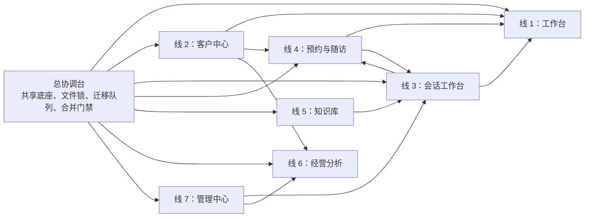

# 机构端七线并行开发总计划

> **给智能体执行者：** 本文用于把机构端七栏目规格拆成可并行规划、可独立审查、可分批发布的开发线。本文已获准创建，但不构成任何 runtime 授权。执行源码、API、schema、migration、adapter、外部网络、真实凭证、消息发送、worker、scheduler、提交、推送、PR 或合并前，必须由用户针对具体任务再次明确批准。`PLAN-PUBLISH-01` 仅批准本轮 docs-only 提交、推送和创建草稿 PR；合并及任何 runtime 仍需后续单独授权。

**目标：** 建立一个总协调台和七条独立业务开发线，使工作台、客户中心、会话工作台、预约与随访、知识库、经营分析、管理中心能够在独立 Worktree 中同步推进，同时保证共享底座、机构隔离、数据库迁移、审计、合并和正式发布不会失控。

**架构方案：** 七条业务线各自拥有稳定的路由子树、模块目录、API 边界、测试和连续小 PR；总协调台不开发栏目业务，只维护公共路由壳、能力注册、机构权限、统一页面状态、公共审计、共享契约、文件锁、migration 队列和主线集成。开发并行与发布并行分离：代码可以在能力关闭状态下提前完成，只有满足真实数据、持久化、`institutionId` 隔离、服务端权限、审计和能力级验收后才进入正式导航。

**技术栈：** Next.js、React、TypeScript、Vitest、Testing Library、Drizzle、PostgreSQL、Git Worktree、GitHub PR。

---

## 一、文档状态与当前基线

- 日期：`2026-07-17 CST`
- 当前阶段：机构端七线技术计划 docs-only 发布，任务编号 `PLAN-PUBLISH-01`
- 当前分支：`codex/institution-plan-contract-baseline`
- 当前 `HEAD`：`e7450909b794c5dfa54e07e2fd878bdd2ab8b7aa`
- 当前 `main` 与 `origin/main`：`e7450909b794c5dfa54e07e2fd878bdd2ab8b7aa`
- 任务开始时主工作区干净，`main` 与 `origin/main` 一致；本分支仅允许修改本文档
- 产品规格：`docs/superpowers/specs/2026-07-15-institution-navigation-page-system-design.md`
- 本轮允许：仅修订本文档，冻结七份栏目技术计划共同依赖的规划契约，并提交、推送本 docs-only 分支和创建草稿 PR
- 本轮不是：不修改 `src/**`、`drizzle/**`、schema、migration、API、配置、脚本、依赖或数据库，不启动七条 runtime 任务，不合并 PR

产品规格确认的是产品方向，不是七条线的通用开发许可证。每个切片仍需分别确认任务编号、允许文件、禁止范围、数据影响、验证命令和停止条件。

---

## 二、并行模型



### 2.1 两种时钟

1. **开发时钟可以并行：** 七条线可同时完成只读盘点、技术设计、版本化契约、领域测试和各自目录内的代码。
2. **集成时钟必须串行：** 公共底座、schema/migration、共享文件、PR 合并和主线验收依次执行。
3. **发布时钟独立判断：** 栏目或子能力只有满足自己的门禁才进入导航；代码已合并不等于能力已发布。

### 2.2 总协调台不是第八条业务线

总协调台由当前总计划任务或后续专门的集成任务承担，只负责：

- 冻结共享基线 commit。
- 维护公共路由、导航与能力发布注册表。
- 维护统一 `tenantId + institutionId` 访问上下文和四角色权限。
- 维护公共页面状态、局部失效和审计契约。
- 管理共享文件锁、跨线契约版本和 integration request。
- 管理唯一 schema/migration 队列。
- 依次审查、合并和回归七条线的 PR。
- 维护 `5010` 主线集成预览。

总协调台不得代替某条业务线开发页面，也不得把多个栏目的业务改动塞入一个集成 PR。

---

## 三、七线正式开工前的共享底座

以下任务均需单独 runtime 授权。七条线可以先并行完成技术设计，但正式接入路由、权限和数据库前必须以共享底座合并后的同一个 commit 为基线。

### BASE-01：导航与能力发布契约

- [ ] 定义七栏目 canonical 路由、兼容路由、移动五入口和安全查询参数。
- [ ] 分别定义代码成熟度、机构授权、连接可用、数据状态和生产放行，不把它们压缩成一个布尔开关。
- [ ] 由服务端能力决策统一返回 `hidden / read_only / operational`，导航、深链接和 API 使用同一结果。
- [ ] 定义四角色导航可见性，但不以客户端可见性代替服务端权限。
- [ ] 未发布能力不出现在正式导航，也不显示“开发中”空壳。
- [ ] 为路由解析、兼容跳转和未知路由编写测试。

已确认路由和所有者直接冻结如下，详细子路由以产品规格第 3.1 节为准：

| 栏目 | canonical 路由 | 兼容入口 | 路由内容所有者 |
| --- | --- | --- | --- |
| 工作台 | `/hospital` | 不新增 `/hospital/dashboard` | 工作台线；根包装由总协调台维护 |
| 客户中心 | `/hospital/customers/**` | 无第二套入口 | 客户中心线，随访例外见第 6.1 节 |
| 会话工作台 | `/hospital/conversations/**` | `/hospital/service` → `/hospital/conversations` | 会话工作台线 |
| 预约与随访 | `/hospital/care/**` | 旧预约/随访入口只做安全兼容 | 预约与随访线 |
| 知识库 | `/hospital/knowledge/**` | 无第二套入口 | 知识库线 |
| 经营分析 | `/hospital/analytics/**` | `/hospital/opportunities/**` → 对应 `/hospital/analytics/opportunities/**` | 经营分析线 |
| 管理中心 | `/hospital/system/**` | `/hospital/system/wecom/**` → `/hospital/system/channels/**`；`/hospital/system/his/**` → `/hospital/system/data?sourceType=his` | 管理中心线 |

### BASE-01A：internal 稳定路由壳与移动壳

- [ ] 先建立 capability-off 的稳定路由壳，不等待业务 migration 完成。
- [ ] 将当前单页 `activeView` 逐步替换为真实 URL，不在一个 PR 中重写全部栏目。
- [ ] 桌面端提供七栏目目标壳；移动端固定为工作台、客户、会话、待办、更多。
- [ ] 未满足权限和发布门禁的路由返回统一无权限或未发布状态，不渲染空壳业务页。
- [ ] 旧入口只有目标能力已正式可用时才安全跳转，不能把 mock 旧页导入正式页面。

### BASE-02：机构访问控制核心

- [ ] 服务端访问上下文同时要求 `tenantId + institutionId`。
- [ ] 客户端提交的机构 ID 不作为授权依据。
- [ ] 缺机构、跨机构、未知角色和非法数据范围全部 fail-closed。
- [ ] 管理员、运营、咨询师、客服分别覆盖导航、深链接、读取和写入矩阵。
- [ ] 建立统一机构访问 guard，避免各 API 自行拼接权限判断。

#### BASE-02B：正式来源证明与当前机构成员资格 provider（仅设计）

**目标：** 为 `BASE-CAP`、`BASE-02A` 和后续栏目服务端 guard 补齐正式来源证明与当前成员资格，不把演示会话、缓存角色、客户端机构选择或结构校验当成授权事实。本节沿用现有 `AccessContext`，不新造外部 session 来源枚举，也不在本轮实现 session、provider、API、schema、migration 或审计写入。

**编辑与发布边界：** 本节初稿来源于旧 SYS worktree `codex/institution-system-sys-01a-r1-a4`，其基线早于后续发布时的 `main`，因此不得直接把旧分支作为发布分支。发布时必须把本节搬到基于最新 `main` 创建的独立 docs 分支，并复核为单文件 docs-only diff 后再进入提交、推送和 PR 流程。

**所有权：** 总协调台拥有 guard 公共语义、受控 decision code 和 action matrix；认证模块拥有正式 `server_session` 证明；受信网关所有者拥有 `trusted_gateway` 证明；机构成员事实的权威生产者拥有成员状态、当前角色、停用和撤销事实。栏目 provider、页面和路由只能消费 guard 决定，不能读取成员表、从 session claim 补机构，或复制另一份角色矩阵。

##### 1. 沿用现有 `AccessContext` 的逐来源规则

BASE-02B 的输入必须与现有 `AccessContext` 字段兼容：`userId`、`role`、`scope`、`tenantId`、`institutionId`、`source`。其中 `source` 只沿用现有三种值，不增加 `authenticated_session`、`formal_session` 或其他外部别名。

| `AccessContext.source` | 正式 guard 规则 | 必须保留的证明与限制 |
| --- | --- | --- |
| `demo_session` | 永远拒绝 | 仅用于开发、测试或显式演示 fixture；不得进入正式导航、深链接 reader、对象 reader 或写命令，不得由环境变量、前端标记或 fallback 提升为其他来源。 |
| `server_session` | 只有在认证模块已于服务端验证正式会话，且当前成员资格 provider 返回 fresh、`active` 结果后才可继续 | 不信任客户端传入或自行解码得到的 role、`tenantId`、`institutionId`；会话有效不等于成员资格仍有效。 |
| `trusted_gateway` | 只有在受信网关证明可验证，且当前成员资格与目标 action 校验均通过后才可继续 | 网关证明必须绑定当前 `userId` 与请求，不能扩大 role、scope、机构或 action；缺证明、证明过期或来源不匹配均拒绝。 |

`source` 必须贯穿正式 context、guard decision 和低敏审计投影，不能在转换时丢失或被统一改写。`server_session` 与 `trusted_gateway` 都只证明请求来源满足其各自前置条件；二者都不能替代当前成员资格、机构 scope、角色或对象归属校验。

##### 2. 当前机构成员资格 provider 的最小语义

provider 的输入只能来自已验证的服务器端来源证明与服务器端当前机构选择意图。客户端 body、query、header、URL、localStorage 或 sessionStorage 中的 tenant、机构和 role 只能是请求意图，不能成为授权事实。provider 必须从权威成员关系重新确认当前结果。

成功结果必须至少证明以下事实；任一必需事实缺失都不能产生正式机构访问 context：

| 字段或结论 | 固定要求 |
| --- | --- |
| `userId` | 与现有 `AccessContext.userId` 兼容，并由来源证明绑定到当前请求；不得由栏目自行替换。 |
| `role` | 仅允许 `tenant_admin`、`tenant_operator`、`consultant`、`customer_service`；以权威成员关系中的当前角色为准。 |
| `tenantId`、`institutionId` | 非空且由同一条当前成员关系权威给出；不能分别从 session、网关和请求参数拼接。 |
| `source` | 保留原始且已验证的 `server_session` 或 `trusted_gateway`；不得转换成新造来源值。 |
| 成员状态与 freshness | 只有 fresh、`active` 可继续；停用、移出、撤销、过期、待确认、未知、无记录、provider unavailable 或 stale 均 fail-closed。 |

`membershipReference`、`membershipRevision`、`observedAt` 和 `freshUntil` 可作为后续 runtime 的低敏补充，用于重验、并发控制和审计，但它们不能替代 `userId`、`role`、`tenantId`、`institutionId`、`source`，也不能改变 BASE-02A 的 V1 context 形状。是否把这些补充字段放在内部 provider result 或独立 guard evidence 中，须在 runtime 技术设计中另行冻结。

角色变化必须使用 provider 返回的新角色重新计算 action；停用、撤销或移出必须拒绝。已打开页面、已有列表结果或旧 session claim 不构成继续许可；详情读取、写入预检和写入提交都重新校验所需的最新事实。

##### 3. 与 `BASE-02A`、`BASE-CAP` 的状态和关系

以下状态以 2026-07-18 的实际 GitHub / `main` 状态为准，不能解释为生产放行：

| 任务或 PR | 所有者 | 当前状态 | 与 BASE-02B 的关系 |
| --- | --- | --- | --- |
| `BASE-CAP` / PR #568 | 总协调台拥有公共能力状态 reader；能力生产者拥有各分区事实 | Draft、NO-GO、保持 capability-off；当前输入没有正式成员资格或逐目标授权来源 | BASE-02B 先提供可信 context 与 guard decision；PR #568 后续只能消费已授权结果，不能仅凭 `expectedScope`、provider payload 或 `reachableDiagnosticTargetKeys` 自证可达。 |
| `BASE-02A` / PR #569 | 总协调台与 security 边界所有者 | 已合并至 `main`；只定义严格 context 结构收窄、同机构 scope 比较和角色上限，不是成员授权器 | BASE-02B 的 provider/guard 是其上游授权前置。V1 context 继续保持 `userId`、`role`、`tenantId`、`institutionId`、`source`；结构合法不等于当前成员有效，也不等于对象或 action 已授权。 |
| `BASE-02B` | 总协调台统筹；认证、受信网关和成员事实所有者分别提供权威证明 | 本节仅为 docs-only 设计，尚无 runtime | 后续独立 runtime 任务组合来源证明、当前成员资格和两级 guard；不得把实现塞回栏目线或把文档当成可调用 provider。 |

##### 4. 两级 guard：机构级与对象级

后续 runtime 必须拆成两个明确层级，不能要求所有机构级读取先伪造对象，也不能让对象级读取跳过权威对象 scope：

1. **institution-scoped guard：** 用于机构导航、机构级聚合、能力摘要和不绑定单一业务对象的操作。它验证来源证明、fresh active 成员关系、请求机构与权威 `tenantId + institutionId` 精确一致，并按当前 role/action matrix 决策；不需要对象 reader。
2. **object-scoped guard：** 用于客户、会话、预约、随访、消费单、报告等具体对象。它必须先通过 institution-scoped guard，再由目标资源的权威 reader 读取对象真实 `tenantId + institutionId` 及必要对象约束，精确匹配后计算 action；URL ID、列表缓存、客户端过滤器或“曾经可见”都不能替代对象 reader。

两级 guard 都不接受“管理员绕过 scope”。未知 role、未知 action、scope 缺失、跨租户、跨机构、对象无法证明归属或权威 reader 不可用均拒绝。对象级拒绝不得泄露对象是否存在、名称、计数、链接或其他业务数据。

```text
AccessContext（保留 source）
  → 逐来源证明
  → 当前成员资格 provider（fresh + active）
  → BASE-02A 兼容 context：{ userId, role, tenantId, institutionId, source }
  → institution-scoped guard
  → [仅对象操作] 权威对象 scope reader → object-scoped guard
```

##### 5. 无权威 context 时的失败关闭

当来源证明、当前成员资格、权威 tenant/机构或必要对象 scope 任一不可得时，不得用默认机构、客户端值、`scope_unavailable`、哨兵 ID 或历史缓存强行构造 `InstitutionSourceEnvelopeV1`。没有权威 scope 的失败不是“带虚构 scope 的 V1 业务 envelope”。

| 条件 | 服务端边界 | 页面边界 |
| --- | --- | --- |
| 会话缺失、失效或无法认证；`trusted_gateway` 证明缺失、无效或过期 | route/API 返回受控 `401`，不调用业务 provider | 清除受保护 display model，按统一登录/未认证状态处理。 |
| `demo_session`、成员无记录/停用/撤销、role 不获准、scope 不获准或 action 不获准 | route/API 返回受控 `403`，不返回业务数据或目标存在性 | 使用统一无权限 `InstitutionPageState`；未知值不显示为 `0` 或 empty。 |
| 成员 provider、对象 scope reader 或其他授权前置不可用/过期 | 在 BASE-01A/BASE-05 冻结的受控失败映射中 fail-closed，不构造强制 scope envelope | 清除受保护 display model，只使用现有 `kind='unavailable'` 的 `InstitutionPageState`；不能降级到 demo、旧 claim 或本地默认机构。 |

只有 guard 已建立权威 `tenantId + institutionId` 后，业务 reader 才能按公共契约构造 `InstitutionSourceEnvelopeV1`；只有权威业务 provider 明确返回空，才允许 `empty`。`stale` 只允许作为已建立权威 scope 后业务 envelope 的 readiness，不新增 stale 页面 kind，也不能用于表达授权前置失败。HTTP 映射和文案仍由 BASE-01A/BASE-05 统一冻结，本节不新建第二套页面状态枚举。

##### 6. 审计与后续验收边界

后续 runtime 的低敏审计投影至少保留受控 `decisionCode`、`actionKey`、安全 `userId`/成员/目标引用、权威 `tenantId + institutionId`、原始 `source` 和服务器决策时间；若 provider 提供 `membershipRevision`，可作为补充证据。不得写入 cookie、token、原始认证或网关 payload、客户端提交的 scope、手机号、邮箱、外部账号、完整对象内容、provider 原始错误或堆栈。

后续 runtime 最小验收必须覆盖：三种现有 source 的逐来源行为；伪造、过期和撤销证明；fresh active、stale、停用、移出、角色变化和 provider unavailable；institution-scoped 与 object-scoped 分流；跨 tenant/机构、对象归属缺失、reader unavailable；未知 role/action；未建立权威 context 时不构造 V1 envelope；401、403 与 `InstitutionPageState` 一致；拒绝结果无业务数据、计数、名称、链接、PII 或原始错误泄露。

**明确非范围：** 本节以单文件 docs-only 形式发布，不修改 `src/**`、认证 session、成员 provider、RBAC、route/API/UI、公共 DTO、数据库/schema/migration、审计写入、凭证、外部连接、测试 runtime 或任何 `BASE-02A` / `BASE-CAP` 实施。本文档的提交、推送、PR 或合并只发布设计，不构成任何 runtime 授权；后续实现前必须另行冻结 provider 接口、两级 guard、action matrix、失败映射和审计字段，并获得 runtime 授权。

### BASE-03：机构隔离 schema/migration 技术设计

- [ ] 先形成独立技术设计、历史数据预检、回填策略、唯一约束、索引和回滚说明。
- [ ] schema 评审与 migration 分别取得明确授权。
- [ ] 优先覆盖客户、预约、治疗、随访和审计的机构归属。
- [ ] 无法可靠回填的历史数据不得猜测机构归属。
- [ ] 本任务只形成 `MIG-01` 的设计，不重复生成第二套机构隔离迁移。
- [ ] 实际 migration 只允许在唯一迁移队列中执行，不与栏目 PR 混合。

### BASE-04：机构级审计

- [ ] 机构业务事件带可靠 `institutionId`。
- [ ] 管理员查看当前机构允许范围；运营只查看授权模块和本人低敏操作。
- [ ] 高风险写操作在审计失败时 fail-closed。
- [ ] 审计不得记录凭证、原始请求体、provider payload、聊天原文或内部错误堆栈。
- [ ] 覆盖跨机构、分页游标、角色范围和历史 legacy 事件。

### BASE-05：统一状态与局部失效

- [ ] 统一加载、刷新、空数据、筛选空、部分失败、过期、外部不可用、整页失败、无权限、未发布、不存在、会话过期和冲突状态。
- [ ] 未知数字显示 `--`，不得转换为 `0`。
- [ ] 定义客户、预约、随访、会话、知识、分析、审计和工作台的局部失效主题。

共享底座建议合并顺序：

```text
BASE-01 导航与能力契约
→ BASE-01A internal 路由壳与移动壳
→ BASE-02 机构访问控制
→ BASE-03 机构隔离 migration 技术设计与 MIG-01（分别审批）
→ BASE-04 机构级审计 + BASE-05 页面状态和局部失效
```

---

## 四、共享文件锁与所有权

### 4.1 总协调台独占文件

| 路径或范围 | 原因 | 栏目线处理方式 |
| --- | --- | --- |
| `src/app/hospital/layout.tsx`、`src/app/hospital/page.tsx`、根路由解析和公共导航 | 七线共同入口，冲突风险最高 | 提交 integration request |
| `src/modules/workspace/domain/institution-dashboard.ts`、公共能力注册表和发布策略 | 决定导航、深链接和发布状态 | 只消费版本化接口 |
| `src/modules/security/**` | 四角色、机构隔离和权限核心 | 提交权限需求矩阵 |
| 公共审计核心 | 所有写操作共同依赖 | 提交 action、reason 和低敏字段需求 |
| `src/modules/auth/components/DemoSessionGate.tsx` | 当前机构入口角色门禁热点 | 提交角色接入需求 |
| `src/modules/institution/components/InstitutionPageState.tsx` 及其测试 | 全栏目页面状态热点 | 只消费统一状态契约 |
| `src/server/db/schema.ts` | 当前为集中 schema 热点 | 提交数据变更申请 |
| `drizzle/**` | migration 必须全项目串行 | 进入唯一 migration 队列 |
| `src/modules/workspace/components/InstitutionWorkspace.tsx` | 当前大型单页壳，七线同时编辑必然冲突 | 冻结，由底座 PR 逐步拆解 |
| `src/modules/institution/tests/InstitutionBusinessShells.test.tsx` | 当前多个业务壳共用验收热点 | 新测试迁移到各线独占目录 |
| `package.json`、锁文件和公共配置 | 可能影响所有 Worktree | 单独依赖或配置审批 |

### 4.2 暂时冻结的大型共享业务文件

以下现有集中式文件全套冻结，不得由多条线同时修改：

- `src/modules/institution/client/tenant-business-client.ts`
- `src/modules/institution/domain/tenant-business-view-models.ts`
- `src/modules/institution/server/tenant-business-api.ts`
- `src/modules/institution/server/tenant-business-audit-transaction.ts`
- `src/modules/institution/server/tenant-business-repository.ts`
- `src/modules/institution/server/tenant-business-write-input.ts`

总协调台应先选择一种方式：

1. 将客户、预约、随访、治疗等能力拆成按领域独占文件；或
2. 在过渡期冻结旧文件，只允许一个小型集成 PR 修改，栏目线通过新领域接口调用。

禁止七条线在各自分支中对同一个大型文件分别重构，随后依靠人工解决大面积冲突。

### 4.3 跨线契约

所有跨线公共声明均由总协调台唯一维护。下表中的“事实/provider 所有者”只负责本模块事实和实现，不拥有第二份公共类型。

| 公共契约 | 事实/provider 所有者 | 主要消费者 | 用途 |
| --- | --- | --- | --- |
| `InstitutionSourceEnvelopeV1<T, K>` | 总协调台提供公共 reader 边界；各生产者返回合规结果 | 全部跨线读取 | 统一 scope、readiness、freshness、分区和失败语义 |
| `CustomerReferenceV1` | 客户中心 | 工作台、会话、预约随访、经营分析 | 低敏客户引用，不含非必要 PII |
| `CustomerLifecycleSummaryV1` | 客户中心 | 客户列表、工作台 | 五类生命周期低敏聚合 |
| `CustomerTimelineContributionV1` | 各业务事实生产线 | 客户中心 | 各模块贡献可解释时间线事件 |
| `CustomerCareSummaryV1` | Care provider（预约与随访） | 客户中心 | 客户详情中的预约与随访低敏摘要、受控跳转和详情依据 |
| `CareActionSourceV1` | 预约与随访 | 工作台 | 预约和随访行动项、计数、详情链接与数据状态 |
| `ConversationActionSourceV1` | 会话工作台 | 工作台 | 生产会话的风险和人工行动项 |
| `TreatmentCareSourceV1` | 客户中心治疗模块 | 预约与随访 | 治疗来源、建议、作废及路径/任务取消影响 |
| `ConversationCareDispositionV1` | 会话工作台 | 预约与随访 | 简单确认、实质咨询、含糊、风险、解决时间和最后消息时间 |
| `IdentityMatchReviewV1` | 会话/身份服务 | 会话、管理中心、客户中心 | 未知联系人复核、候选版本和最终客户匹配 |
| `CreateCustomerFromIdentityReviewV1` | 客户中心处理命令；会话/身份服务编排 | 会话、客户中心 | 从已验证复核委派幂等建客，不跨库伪装原子事务 |
| `ReachOutSafetyV1` | 获准渠道集成任务 | 预约与随访、会话、管理中心 | 客户级渠道同意、退订、安静时段和安全发送判定 |
| `PublishedKnowledgeReferenceV1` | 知识库 | 会话、受控 AI | 当前发布知识版本和精确内容引用 |
| `ApprovedKnowledgeAssetReferenceV1` | 知识库 | 会话素材发送、获准渠道流程 | 当前 publication 内逐附件发送批准引用 |
| `RestrictedCustomerKnowledgeAccessV1` | 多个权威 provider；公共 reader 组合 | 客户中心、获准单客户 AI | 单客户受限附件最小安全引用与敏感 AI 门禁 |
| `AnalyticsCustomerConsumptionV1`（内含 `AnalyticsCustomerConsumptionPayloadV1`） | 经营分析 | 客户中心 | 统一 envelope 结果别名；payload 不复制金额算法 |
| `AnalyticsDataGovernanceSummaryV1` | 经营分析 | 管理中心 | 低敏来源覆盖、高水位、批次和治理异常摘要 |
| `InstitutionOperatingContextV1` | 机构设置生产者 | Care、经营分析、管理中心 | 当前及待生效时区、默认币种和版本 |
| `ControlledImportCommandV1` | 独立受控导入任务 | 管理中心发起；经营分析验收结果 | 绑定预检、映射、幂等、审计与批准行摘要的十五字段命令 |
| `AnalyticsReportInputV1` | 经营分析 | 独立 AI 经营报告 provider | 只发送固定模板所需的机构级低敏指标 |
| `CapabilityStatusV1` | 各能力所有者 | 工作台、管理中心、公共导航 | 代码成熟度、机构授权、连接可用、生产放行和数据新鲜度摘要 |

契约规则：

- 消费方不得直接读取生产方 repository 或内部表。
- 公共接口计划落在 `src/modules/institution-contracts/v1/**`，只由总协调台修改；生产者在自己的模块内实现 provider/adapter 和兼容测试。
- 契约变更采用 `V1 → V2`，保留兼容窗口。
- URL 只传对象 ID、日期和安全结构化筛选，不传姓名、金额、消息正文、外部账号或凭证。
- 打开目标页面不等于业务操作成功，目标模块必须重新验证权限和机构归属。

### 4.4 共享契约冻结基线（v1，规范性）

本节是七份栏目技术计划的公共规划基线。栏目计划只可镜像或消费本节字段；出现别名或竞争形状时，以本节为准并在发布前修正文档。它仍是 docs-only 设计，不代表 `src/modules/institution-contracts/v1/**` 已存在，也不授权实现。

稳定角色固定为 `tenant_admin | tenant_operator | consultant | customer_service`。统一读取外层精确为：

```ts
type InstitutionSourceReadinessV1 =
  | 'ready'
  | 'empty'
  | 'partial'
  | 'stale'
  | 'unavailable'
  | 'denied'
  | 'disabled';

type InstitutionSourcePartitionReadinessV1 = Exclude<
  InstitutionSourceReadinessV1,
  'partial'
>;

type InstitutionSourceFailureCodeV1 =
  | 'upstream_unavailable'
  | 'timeout'
  | 'invalid_payload'
  | 'scope_mismatch'
  | 'permission_denied'
  | 'not_released'
  | 'data_incomplete';

type InstitutionSourceFreshnessV1 = {
  observedAt: string;
  freshUntil: string;
};

type InstitutionSourceEnvelopeV1<T, K extends string> = {
  contractVersion: 'v1';
  scope: { tenantId: string; institutionId: string };
  readiness: InstitutionSourceReadinessV1;
  freshness: InstitutionSourceFreshnessV1 | null;
  partitions: Array<{
    key: K;
    readiness: InstitutionSourcePartitionReadinessV1;
    freshness: InstitutionSourceFreshnessV1 | null;
    failureCode: InstitutionSourceFailureCodeV1 | null;
  }>;
  data: T | null;
  failureCode: InstitutionSourceFailureCodeV1 | null;
};
```

reader、`AccessContext`、角色和查询对象只作为服务端输入，不进入响应。只有权威查询成功并确认真实为空时才能返回 `empty` 和业务 `0`；只有顶层允许 `partial`；`stale` 不驱动当前写操作、报告生成或行动队列；顶层 `denied`、`disabled` 或任一 `scope_mismatch` 必须 fail-closed 且不返回业务 data。

已冻结的专属字段与命名如下：

| 契约 | v1 冻结基线 |
| --- | --- |
| `CustomerReferenceV1` | 精确字段为 `contractVersion`、`customerId`、`displayName`、`maskedReference`；最后一项可空。 |
| `CustomerLifecycleSummaryV1` | payload 只有 `buckets[{ key, count }]`；key 精确为 `consulting`、`scheduled`、`post_care`、`repurchase_window`、`silent_reactivation`，count 在未知时为 `null`，不增加 total。 |
| `CustomerCareSummaryV1` | PartitionKey 精确为 `'appointments' \| 'followups'`，唯一别名为 `InstitutionSourceEnvelopeV1<CustomerCareSummaryPayloadV1, 'appointments' \| 'followups'>`。payload 精确且仅含 `customerId: string`、`appointments`、`followups`，不得返回 `CustomerReferenceV1` 或 `displayName`；后二者各为 `null` 或 `{ items, hasMore: boolean }`，每组 `items` 最多 5 条。预约 item 精确为 `{ appointmentId, sourceVersion, scheduledAt, businessState, rescheduleRequestState: 'pending' \| null, safeSummary: string \| null, detailHref }`，其中预约事实 `businessState` 只允许 `'pending_confirmation' \| 'confirmed' \| 'arrived' \| 'completed' \| 'cancelled' \| 'no_show'`；`rescheduleRequestState='pending'` 只表示存在尚未由 HIS 原子接受的独立改约请求，不得覆盖原预约事实状态，HIS 接受新时段后更新预约事实并将该标记清空，完整请求历史仍由 Care/HIS 边界保存。随访 item 精确为 `{ taskId, sourceVersion, dueAt, businessState, riskLevel: 'normal' \| 'watch' \| 'urgent', safeSummary: string \| null, detailHref }`，其中 `businessState` 只允许 `'pending' \| 'in_progress' \| 'waiting_customer' \| 'escalated' \| 'completed' \| 'cancelled'`。预约组固定按 `scheduledAt DESC, appointmentId ASC`，随访组固定按 `dueAt DESC, taskId ASC`；每组 `items + hasMore` 必须来自该确定性排序下的同一次 Care 服务端 RBAC `limit + 1` 查询，不得返回或推导 exact total。`ready`、`empty`、`stale` 可对应非 `null` 分组；`empty` 精确返回 `{ items: [], hasMore: false }`；`stale` 只允许返回同 scope 已验证的只读快照并显示 freshness，且不得驱动写入。`unavailable`、`denied`、`disabled` 对应分组必须为 `null`。顶层 `partial` 允许一个分区成功、另一个分区发生普通失败；任一 `scope_mismatch` 必须提升为顶层状态并整包返回 `data: null`。 |
| `CareActionSourceV1` | 四分区固定为 `pending_confirmation_appointments`、`reschedule_requested_appointments`、`overdue_followups`、`today_due_followups`；payload 只有 `cards + actions`；action 字段固定为 `entityType`、`objectId`、`sourceVersion`、`customer`、`businessState`、`cardKeys`、`sortSignals`、`appointmentAt`、`dueAt`、`slaAt`、`riskLevel`、`priority`、`owner`、`safeSummary`、`detailHref`。`reschedule_requested_appointments` 只由独立待改约请求事实命中并写入 `cardKeys`，不得把预约 `businessState` 覆盖为 `reschedule_requested`；HIS 接受新时段前原预约时间和事实状态继续有效。 |
| `ConversationActionSourceV1` | 分区固定为 `waiting_human \| unresolved_risk`；行动字段固定为 `conversationId`、`segmentId`、`sourceVersion`、`production: true`、`subject`、`conversationState`、`riskState`、`partitions`、`sortSignals`、`lastCustomerMessageAt`、`slaAt`、`priority`、`assignee`、`safeSummary`、`detailHref`。废弃 `actionId`、`partitionKey`、`sortPriority`、`slaDueAt`、`canonicalHref` 等别名。 |
| `TreatmentCareSourceV1` | payload 字段固定为 `sourceId`、`sourceVersion`、`customer`、`treatmentOccurredAt`、`projectRef`、`categoryCode`、`treatmentStageCode`、`recoveryStageCode`、`riskLevel`、`approvedTagCodes`、`sourceState`、`suggestion`、`voidedAt`、`voidReasonCode`。 |
| `ConversationCareDispositionV1` | 当前快照的并发字段只叫 `revision`，不使用 `dispositionRevision`；blocker 只允许 `clinical_risk`、`complaint`、`refund_dispute`、`opt_out`、`privacy_request`、`unresolved_consultation`、`identity_unconfirmed`、`forced_close_unresolved`。 |
| `IdentityMatchReviewV1` | 使用 `connectionInstanceId`、`irreversibleIdentityReference`、`lastDecisionReasonCode`、`lastDecisionActorReference` 和 `auditReference`；状态固定八种，其他栏目不得改名为 `channelConnectionId`、`channelIdentityReference` 或 `sourceAuditReference`。 |
| `CreateCustomerFromIdentityReviewV1` | 精确字段为 `contractVersion`、`reviewId`、`expectedRevision`、`candidateSnapshotVersion`、`idempotencyKey`、`actionToken`、`createCustomer`。`createCustomer` 精确包含 `displayName`、`ownerUserId`、`sourceCode`、`projectRefs`、`primaryProjectRef`、`priority`、`nextAction`；`nextAction` 可空，非空时只含 `actionCode`、`plannedAt`、`safeNote`。 |
| `InstitutionOperatingContextV1` | 唯一别名为 `InstitutionSourceEnvelopeV1<InstitutionOperatingContextPayloadV1, 'operating_context'>`；payload 只有 `version`、`source`、`current{ timeZone, defaultCurrency }`、`pending{ timeZone, defaultCurrency, requestedVersion, effectiveFromBusinessDate } \| null`、`updatedAt`、`updatedBy`。版本统一叫 `version`，不使用 `timezoneVersion`。 |
| `AnalyticsCustomerConsumptionV1` | 唯一结果别名为 `InstitutionSourceEnvelopeV1<AnalyticsCustomerConsumptionPayloadV1, AnalyticsCustomerConsumptionPartitionKeyV1>`；payload 不重复 envelope 字段，只含 snapshot/version、安全 `customerId`、当前/上期周期、按币种金额、`paidCustomer`、可空消费单计数、可用性和获准低敏明细。 |
| `ControlledImportCommandV1` | 精确十五字段为 `contractVersion`、`tenantId`、`institutionId`、`precheckId`、`fileSecurityReference`、`approvedScope`、`approvedRowCount`、`approvedRowsDigest`、`hisDirectoryVersion`、`mappingVersion`、`idempotencyKey`、`operatorReference`、`expectedVersion`、`sourceAuditReference`、`reasonCode`。 |

`CustomerCareSummaryV1` 的 item `detailHref` 由 Care provider 提供，且只能使用 Care 的 canonical URL。客户详情不提供 cursor，也不在抽屉内继续加载；`hasMore: true` 时只显示“查看全部”，由 Customer 按 canonical 规则派生并跳转 Care 列表链接。创建链接同样由 Customer 派生、不进入公共 payload，但只能在 Care 服务端写权限 authorizer 对当前机构、角色、客户、来源和 capability 返回 fresh allow 时显示，绝不能由摘要可读或 `hasMore` 推导；普通手工随访的新建快捷入口只对管理员/运营开放，会话来源限定例外仍只能从已分配且已匹配的会话发起。打开详情、列表或创建入口后，目标 Care 模块必须重新校验当前角色、`tenantId + institutionId`、客户归属、对象状态和 capability；摘要可见不代表目标读取或写入获准。

以下字段仍是 runtime 前真实阻塞，不能由任一栏目线自行猜测：

1. `AnalyticsCustomerConsumptionPartitionKeyV1` 的固定 key 集合；在总协调台冻结前，经营分析 provider 与客户消费 consumer 均不得实现。
2. `RestrictedCustomerKnowledgePartitionKeyV1` 的固定 key 集合、组合 reader 所有者、敏感 AI 授权权威来源和撤回传播时限。
3. `CapabilityStatusV1` 与 `ReachOutSafetyV1` 的逐字段公共形状。
4. 工作台局部刷新 revision 的层级、字段位置和生成方。

这些阻塞不影响本轮发布技术计划，但阻断相应 runtime 切片；不得用 fixture、本地 DTO、默认泛型或近义字段绕过。

---

## 五、线 1：工作台

**分支前缀：** `codex/institution-workbench-*`

**栏目目标：** 只聚合真实预约、随访和生产会话行动，不承担业务表单，不读取其他模块内部表，不使用客户自由文本 `nextAction` 冒充任务。

### 5.1 文件所有权

- 计划新增：`src/modules/institution-workbench/**`
- 计划新增：`src/app/api/institution/workbench/**`
- 计划新增：工作台领域、聚合、客户端组件和测试
- 根 `/hospital` 路由包装和公共 layout 仍由总协调台维护

### 5.2 PR 切片

- [ ] `WB-01`：定义四卡、行动队列、数据新鲜度和部分失败的只读契约及领域测试；能力保持关闭。
- [ ] `WB-02`：接入 `CareActionSourceV1`，实现待确认预约、改约申请、逾期随访和今日到期随访的确定性聚合。
- [ ] `WB-03`：实现桌面最多 6 条、移动最多 4 条的行动队列、排序、详情跳转和局部刷新。
- [ ] `WB-04`：接入 `ConversationActionSourceV1` 的生产会话行动项；角色动态卡仍为可选，未发布时直接隐藏。
- [ ] `WB-05`：完成角色数据范围、部分来源、过期、未知值、空数据和跨机构验收后申请发布。

### 5.3 发布门禁

- 四张固定卡全部有真实、持久化、稳定且可解释的数据来源。
- 卡片计数与点击后的目标列表筛选结果一致。
- 同一对象不会因多个标签重复计数。
- 单一来源失败不清空其他已核验来源。
- 未知或失败显示 `--`，不得显示静态 `0`。
- 工作台必须同时完成预约、随访和有权限生产会话的可靠聚合；工作台不得早于这三类行动来源正式发布。

---

## 六、线 2：客户中心

**分支前缀：** `codex/institution-customers-*`

**栏目目标：** 建立客户规范入口、稳定详情 URL、低敏资料、真实时间线和治疗记录；预约、随访、会话和消费业务仍跳转到对应正式模块。

### 6.1 文件所有权

- 计划新增或迁移：`src/app/hospital/customers/**`
- 计划新增：`src/modules/customer-center/**`
- 负责：`src/app/api/institution/customers/**`，但 `customers/[customerId]/followup-*` 由预约与随访线负责，`customers/[customerId]/wecom-reachout-safety` 由获准渠道/触达安全集成任务负责
- 负责：客户时间线读模型、客户查询/写入边界及对应测试
- 客户中心拥有时间线最终聚合与排序；其他线只实现 `CustomerTimelineContributionV1` provider
- 治疗记录由本线负责页面与事实归属；随访任务创建、路径和触达由预约与随访线通过 `TreatmentCareSourceV1` 处理

### 6.2 PR 切片

- [ ] `CUS-01`：客户列表、低敏搜索、结构化筛选、稳定详情 URL、概览和时间线只读闭环。
- [ ] `CUS-02`：治疗记录列表和详情只读；管理员、运营、咨询师可读，客服完全隐藏。
- [ ] `CUS-03`：治疗记录新建、编辑、作废和低敏随访建议；只有管理员可写，建议创建任务通过 `TreatmentCareSourceV1` 交给 Care，风险或来源失败硬阻断。
- [ ] `CUS-04`：客户创建编辑、稳定外部引用、多项目及主项目、结构化下一步行动；如需 schema，先提交数据变更申请。
- [ ] `CUS-05`：CSV/XLSX 预检、精确重复阻断和模糊重复复核；导入执行另行授权。
- [ ] `CUS-06`：可逆归档与合并；只有管理员可执行，责任转交、审计和回滚必须原子化。
- [ ] `CUS-07`：消费页签只消费统一结果 `AnalyticsCustomerConsumptionV1`，不复制金额计算和交易存储。

### 6.3 发布门禁

- 列表、详情、时间线、治疗记录均按 `institutionId` 隔离。
- 范围外对象统一返回不可用语义，不泄露是否存在。
- URL 不包含姓名、联系方式或业务敏感字段。
- 桌面抽屉和移动全屏使用同一个稳定对象链接。
- 管理员可创建、编辑和导入客户并写治疗记录；运营可创建、编辑和导入客户但治疗只读；咨询师客户与治疗只读；客服客户只读且治疗入口隐藏。
- 客户归档、合并及治疗新建/编辑/作废只允许管理员，服务端不能从页面入口推导写权限。
- 客户详情不得重复实现预约、随访或消费业务表单。
- 未完成的消费、导入、归档和合并能力直接隐藏。

---

## 七、线 3：会话工作台

**分支前缀：** `codex/institution-conversations-*`

**栏目目标：** 建立真实入站、队列分配、人工接管、人工回复、风险处理、逐消息结果和结束留痕的生产闭环；AI 接待与自动触达后置。

### 7.1 文件所有权

- 计划新增：`src/app/hospital/conversations/**`
- 计划新增：`src/app/api/institution/conversations/**`
- 计划新增：会话、消息、分配、风险、发送结果领域和测试
- 现有 `*AiConversation*` 演示文件仅由本线评估和维护，不直接作为生产实现

### 7.2 PR 切片

- [ ] `CONV-01`：会话、分段、消息、分配、风险和发送结果的领域契约与状态机测试。
- [ ] `CONV-02`：提交会话事实模型和 migration 申请，不在栏目分支直接修改 schema。
- [ ] `CONV-03`：repository/API、机构隔离、分配范围、幂等和审计。
- [ ] `CONV-04`：会话队列、三栏详情、接管、改派、结束和移动端全屏页；实现 `ConversationCareDispositionV1`，无真实出站时隐藏发送按钮。
- [ ] `CONV-05`：接入一个获准渠道的真实入站与人工出站；逐消息区分服务商接受、渠道送达、客户回复和业务完成。
- [ ] `CONV-06`：未知联系人通过 `IdentityMatchReviewV1` 提交复核；咨询师/客服只能提交，管理员/运营在管理中心确认。
- [ ] `CONV-07`：接入当前发布知识引用、AI 建议、身份披露和高风险强制转人工。
- [ ] `CONV-08`：自动触达、版本模板、同意、退订、安静时段、逐收件人状态和急停。

### 7.3 外部与发布门禁

- AIBOTK 始终是候选接入服务商，不是渠道。
- AIBOTK、企微、微信客服、真实凭证、Webhook、签名和真实发送分别审批。
- 未匹配联系人不得直接创建预约或随访。
- 实质咨询和含糊回复转入人工会话；会话解决时间与最后消息时间通过版本化契约回流 Care，不允许两线各自推算。
- 高风险未解决时阻断普通结束。
- AI 不可用不得阻断人工会话。
- 现有 fixture、`mock_sent`、dry-run 或客户端 `useState` 不得进入正式导航。

---

## 八、线 4：预约与随访

**分支前缀：** `codex/institution-care-*`

**栏目目标：** 将预约请求、HIS 预约事实、人工随访任务和路径模板明确分层；优先交付不依赖外部消息的人工随访闭环。

### 8.1 文件所有权

- 计划新增：`src/app/hospital/care/**`
- 计划新增：`src/modules/care/**`
- 负责：`src/app/api/institution/appointments/**`
- 负责：`src/app/api/institution/followups/**`
- 负责：`src/app/api/institution/customers/[customerId]/followup-*`、随访反馈/概览/时间线端点
- 负责：随访路径、草稿、反馈和对应测试；通过 `ReachOutSafetyV1` 消费触达安全结果，不拥有 `wecom-reachout-safety` 路由或渠道内部状态

### 8.2 PR 切片

- [ ] `CARE-01`：人工随访任务列表、详情、创建、具体员工/固定角色池分配和认领。
- [ ] `CARE-02`：结构化结果、合法状态机、风险升级、客户时间线、审计和工作台来源失效刷新；消费 `ConversationCareDispositionV1` 处理简单确认、实质咨询、含糊和风险回复。
- [ ] `CARE-03`：版本化线性路径、确定性自动入组、幂等、暂停恢复；消费 `TreatmentCareSourceV1` 处理来源治疗作废。
- [ ] `CARE-04`：待提交预约请求与 HIS 预约事实技术设计；本地记录不得冒充 HIS 已确认预约。
- [ ] `CARE-05`：HIS 时段读取、提交前重校验、原子占位、确认、改约、取消和通知状态分离。
- [ ] `CARE-06`：今日队列和移动端紧凑计数；预约在上、随访在下。

### 8.3 发布门禁

- 随访可以早于预约独立发布。
- 完成随访必须有结构化结果，风险内容不得普通完成。
- 实质咨询暂停关联路径；会话标记问题已解决后，以解决时间和最后消息时间较晚者起算，连续 60 分钟无新消息才可恢复，任何新消息重置计时。
- 来源治疗作废只取消同源路径、未完成路径任务和未发送触达，不影响手工或其他来源任务。
- 今日到期和逾期按机构时区派生，不持久化伪状态。
- 首批不发生真实消息发送，也不显示“发送成功”。
- HIS 不可用时只保存待提交请求，不生成本地假预约。
- HIS adapter、凭证和外部网络另行授权。

---

## 九、线 5：知识库

**分支前缀：** `codex/institution-knowledge-*`

**栏目目标：** 先发布真实、持久化、可审计的机构资料库，再完成不可变版本、原子发布、真实混合检索、内部问答和受限客户资料。

### 9.1 文件所有权

- 计划新增或迁移：`src/app/hospital/knowledge/**`
- 负责：`src/app/api/institution/knowledge-management/**`
- 负责：机构端知识组件、服务和测试
- `src/modules/knowledge-base/**` 与平台端知识管理属于保护区，跨端改动走独立集成 PR

### 9.2 PR 切片

- [ ] `KB-01`：资料库列表、详情、真实页面状态，仅管理员和运营可见。
- [ ] `KB-02`：不可变版本、用途范围、当前发布指针和原子发布；schema/migration 单独申请。
- [ ] `KB-03`：草稿、上传、批准素材、回滚和退役。
- [ ] `KB-04`：真实持久化解析、OCR、索引任务和任务记录。
- [ ] `KB-05`：真实混合检索、阈值、质量评估和人工回归集。
- [ ] `KB-06`：内部问答、无答案规则、精确引用快照和审计。
- [ ] `KB-07`：受限客户资料、隔离索引、单一客户选择和敏感 AI 授权。
- [ ] `KB-08`：知识专属存储、上传、OCR、索引和 QA 额度视图；全局 AI 使用仍归管理中心。

### 9.3 发布门禁

- 资料库可早于 OCR、检索和问答发布。
- 发布失败必须保留旧发布版本，不得原地覆盖历史。
- mock embedding、内存余弦结果和模拟索引不得正式发布。
- 无有效引用、存在冲突或相关性不足时返回无答案。
- AI/OCR 不可用时，已发布资料仍能正常浏览。
- 知识额度不可读取或额度用尽时，不阻断已发布资料浏览；只阻断对应上传、OCR、索引或问答动作。
- 咨询师和客服看不到入口，越权深链接返回统一无权限状态。

---

## 十、线 6：经营分析

**分支前缀：** `codex/institution-analytics-*`

**栏目目标：** 以真实消费、支付、退款、项目目录、导入批次和追加纠正为事实基础，由服务端确定性计算经营指标，最后才接 AI 报告。

### 10.1 文件所有权

- 计划新增：`src/app/hospital/analytics/**`
- 计划新增：`src/app/api/institution/analytics/**`
- 计划新增：分析领域计算、聚合、报告和测试
- 客户消费页只消费本线 API，不建立第二套金额算法
- HIS/ERP/POS adapter 和文件导入执行器不属于本线直接所有

### 10.2 PR 切片

- [ ] `AN-01`：消费事实输入、期间切分、实付/退款/净额、客单价、未匹配客户、未映射项目和多币种规则的纯领域契约与边界测试。
- [ ] `AN-02`：提交数据源、导入批次、消费单、支付、退款、客户匹配、追加纠正和项目映射的数据模型申请。
- [ ] `AN-03`：机构级聚合 repository/API，覆盖去重、负净额、部分来源、过期、缺失和聚合失败。
- [ ] `AN-04`：经营总览、消费分析、项目分析和客户与机会页面。
- [ ] `AN-05`：客户消费页、项目详情和旧机会入口的安全兼容跳转。
- [ ] `AN-06`：固定 AI 报告模板、指标快照、预检、结构化输出校验、留档和归档。
- [ ] `AN-07`：五页口径一致、权限和完整性全部验收后申请发布。

### 10.3 发布门禁

- 只允许机构管理员和运营查看完整经营分析。
- 支付按成功日、退款按确认日；净消费额允许为负。
- 未匹配客户金额进入机构总额，但不进入客户数和客单价。
- 未映射项目进入机构总额，但不进入标准项目排行。
- 不同币种不得直接相加，未知值不得显示为 `0`。
- 不得用治疗摘要、平台商业记录或演示数据冒充消费事实。
- AI 不负责计算核心数字，AI 不可用不影响基础分析和历史报告。
- 确定性分析可以在 capability-off 状态下先合并，但经营分析正式进入导航必须等待 `AN-06` 报告治理、审计和输出校验完成；正式上线后 provider 临时不可用只阻断新报告。

---

## 十一、线 7：管理中心

**分支前缀：** `codex/institution-system-*`

**栏目目标：** 提供机构控制面和治理界面，只聚合已经真实存在的机构资料、成员、渠道、数据接入、AI 使用、隐私和审计能力，不拥有其他业务域的底层事实。

### 11.1 文件所有权

- 计划新增：`src/app/hospital/system/**`
- 计划新增：`src/app/api/institution/system/**`
- 计划新增：管理中心页面、聚合服务和测试
- 公共权限、审计、导航、schema 和 adapter 仍由总协调台或对应生产者管理

### 11.2 PR 切片

七个切片与七个固定二级页一一对应；实现顺序可以按真实数据成熟度调整：

- [ ] `SYS-01`：AI 与额度只读页，先展示真实持久化的使用、成功率、失败/拒绝；fixture 剩余额度隐藏。
- [ ] `SYS-02`：机构与成员，覆盖机构资料、时区、默认币种、固定角色、一次性初始密码、首次强制改密、最后管理员保护和责任转交；写操作分切片审批。
- [ ] `SYS-03`：渠道接入与身份匹配，区分已授权、已连接、渠道可用和生产放行；消费 `IdentityMatchReviewV1`，管理员/运营完成复核。
- [ ] `SYS-04`：数据接入与治理，覆盖数据源摘要、导入预检、异常、项目映射和追加纠正。
- [ ] `SYS-05`：数据与隐私，覆盖同意、退订、敏感 AI 授权和留存摘要。
- [ ] `SYS-06`：审计与安全页；等待 BASE-04 完成，并落实管理员全量、运营授权范围。
- [ ] `SYS-07`：系统概览最后实现，只聚合前述已发布真实卡片；单卡失败不清空整页。

### 11.3 发布门禁

- 管理中心至少有一个真实、持久化且当前角色有权的子页才显示入口。
- 系统概览不能使用静态“系统正常”或固定卡片凑数。
- 管理员和运营的动作权限分别校验。
- 页面刷新不得自动触发外部调用、测试连接或同步。
- 移动端除获准紧急暂停外只读。
- 急停必须持久化并审计；凭证、外部账号和原始错误不得进入页面或 URL。

---

## 十二、schema/migration 唯一串行队列

七条栏目线可以并行提交数据变更申请，但一律不得在自己的栏目 PR 中直接修改 `src/server/db/schema.ts` 或 `drizzle/**`。

### 12.1 数据变更申请模板

每份申请必须说明：

1. 权威数据来源与业务事实。
2. 当前机构隔离方式和目标 `institutionId` 约束。
3. 历史数据预检和回填策略。
4. 唯一约束、幂等键、去重和追加纠正规则。
5. 外键、组合索引、删除/归档语义和并发风险。
6. 兼容期、迁移失败处理和回滚方案。
7. 权限、审计、API 和测试影响。
8. 是否涉及凭证、外部网络、worker、scheduler 或生产配置。

### 12.2 建议迁移顺序

```text
MIG-01 机构归属、机构级审计与 InstitutionOperatingContextV1 持久化设置
→ MIG-02 客户稳定引用、责任归属、随访任务/认领/结构化结果与线性路径最小持久化
→ MIG-03 知识不可变版本、publication/current pointer、附件修订、parse/chunk/index/job、受限客户附件与回答快照
→ MIG-04 会话根/分段/消息/逐消息结果/分配/风险、处置 revision 与身份复核
→ MIG-05 消费来源、导入批次与行、稳定消费单、支付退款、客户匹配、HIS 项目映射、幂等与追加纠正
→ MIG-06 分析 snapshot、报告输入输出/版本/归档/来源变化状态与持久化渠道安全状态
```

`BASE-03` 是 `MIG-01` 的技术设计任务，`MIG-01` 是获批后的实际迁移单元，两者不是两次机构归属迁移。schema 与 migration 范围分别获批后，应在一个原子 migration PR 中保持应用 schema、SQL、Drizzle 元数据和迁移测试一致；如果需要 `expand → backfill → enforce`，则预先批准为连续多 PR，并保证每个中间 main 都可运行和回滚。

同一时间只允许一个 migration PR。迁移合并后，其他 Worktree 使用 `git fetch origin` 并将自己的未合并短分支按已批准策略同步 `origin/main`，再执行相应测试，才能进入下一个迁移。

禁止多个 Worktree 对同一个本地开发数据库同时运行 migration、写库集成测试或会修改共享业务数据的开发服务器。runtime 开工前必须二选一：

1. **推荐：** 每线使用独立测试数据库或隔离容器，并证明数据库名称、端口和数据卷不会串线。
2. **临时方案：** 总协调台维护全局 DB lease；同一时间只允许一个 Worktree 执行 migration、写库测试或修改共享开发数据。

未明确选择并验证其中一种方案前，七线只允许并行只读分析、纯领域测试和不连接数据库的 UI 工作。

### 12.3 外部集成交付串行队列

HIS/ERP/POS、受控文件导入、渠道服务商、OCR、索引和 AI provider 都有明确业务消费者，但不应塞进七个栏目页面 PR。总协调台在获得独立授权后创建临时集成交付任务；它不是第八个栏目，也不是长期开发线。

| 集成任务 | 契约提出者与验收者 | 控制面消费者 | 独立审批内容 |
| --- | --- | --- | --- |
| HIS adapter | 预约与随访线、经营分析线分别验收所需能力 | 管理中心 | 凭证、出站网络、预约时段/原子占位、标准项目目录和获准消费事实分别验收 |
| ERP adapter | 经营分析线 | 管理中心 | 来源契约、支付退款、幂等、同步和纠正 |
| POS adapter | 经营分析线 | 管理中心 | 来源契约、支付退款、幂等、同步和纠正 |
| 受控文件导入规范化 | 经营分析线 | 管理中心 | 文件契约、批次、预检、行级结果、去重和追加纠正 |
| 单一渠道官方接口 | 会话工作台线；Care 验收 `ReachOutSafetyV1` | 管理中心 | 个人微信、企业微信客户联系、微信客服分别交付授权、回调、签名、幂等、同意/退订、送达、急停和生产放行 |
| AIBOTK 受控试点 adapter | 会话工作台线；Care 验收 `ReachOutSafetyV1` | 管理中心 | 非核心试点账号、人工接管、授权、回调、幂等、急停与独立生产放行 |
| OCR provider | 知识库线 | 管理中心只读取低敏治理状态 | 文件安全、解析质量、失败与恢复 |
| embedding provider | 知识库线 | 管理中心只读取低敏治理状态 | 机构隔离、版本绑定和向量生成质量 |
| rerank provider | 知识库线 | 管理中心只读取低敏治理状态 | 机构隔离、质量阈值和失败降级 |
| 知识 AI provider | 知识库线 | 管理中心只读取全局 AI 使用 | 无答案、精确引用、安全和用途边界 |
| AI 经营报告 provider | 经营分析线 | 管理中心只读取全局 AI 使用 | 低敏指标、固定模板、输出校验、快照和留档 |

每个临时集成任务必须有独立分支、允许路径、fake 契约测试、真实网络/凭证审批和生产放行门禁。ERP 与 POS、三种官方渠道、AIBOTK、OCR、embedding、rerank、知识 AI 和 AI 经营报告均是独立交付单元；任一时刻只允许一个任务进入真实凭证或网络阶段。栏目线只消费正式契约，不直接实现 provider 私有逻辑。

---

## 十三、Worktree、端口和分支规范

### 13.1 Worktree 分配

| 开发线 | 建议任务名 | 预览端口 |
| --- | --- | ---: |
| 主线集成 | `机构端七线总协调` | `5010` |
| 工作台 | `机构端-工作台` | `5011` |
| 客户中心 | `机构端-客户中心` | `5012` |
| 会话工作台 | `机构端-会话工作台` | `5013` |
| 预约与随访 | `机构端-预约与随访` | `5014` |
| 知识库 | `机构端-知识库` | `5015` |
| 经营分析 | `机构端-经营分析` | `5016` |
| 管理中心 | `机构端-管理中心` | `5017` |

不要求七个开发服务器持续运行。只有需要浏览器验收的线才启动独立端口；单元测试、类型检查和只读分析不占用预览端口。

当前 `pnpm dev` 固定使用 `5010`。各 Worktree 如获准启动独立预览，使用以下明确命令：

```bash
node scripts/run-next.mjs dev --webpack --port 5011
node scripts/run-next.mjs dev --webpack --port 5012
node scripts/run-next.mjs dev --webpack --port 5013
node scripts/run-next.mjs dev --webpack --port 5014
node scripts/run-next.mjs dev --webpack --port 5015
node scripts/run-next.mjs dev --webpack --port 5016
node scripts/run-next.mjs dev --webpack --port 5017
```

命令顺序分别对应工作台、客户中心、会话工作台、预约与随访、知识库、经营分析、管理中心。启动前先确认该端口未被占用。

Codex-managed Worktree 不保证带有未跟踪的 `node_modules` 或 `.env.local`。runtime 开工前应单独批准安全 bootstrap：优先复用已安装依赖或使用本地环境 setup；不得自动复制 `.env.local`、凭证或 secret。确需复制忽略文件时，只能在审查后通过最小 `.worktreeinclude` 白名单处理非敏感文件。

### 13.2 分支规则

- `PLAN-PUBLISH-01` 是一次明确的 docs-only 例外：七个 `PLAN-*` 规划 Worktree 已从共同启动基线 `e7450909b794c5dfa54e07e2fd878bdd2ab8b7aa` 创建并只产出七份技术计划；连同共享契约基线分支形成四个 Draft PR `#535` 至 `#538`。该例外不授权任何 runtime、schema、migration、adapter、凭证或外部网络工作，也不得重复创建同一批规划 Worktree。
- 当前规划 PR 列车固定为：先审查 `#535`；`#536`、`#537` 完成各自修订后，必须在 `#535` 获得后续明确合并授权并进入 `main` 后同步最新 `main`、重新执行范围与文档验证并复核；`#538` 最后审查。任何一步都不得从 Draft 状态或前序审查结果推导自动合并授权。
- runtime Worktree 必须从共享底座合并后的同一个 `origin/main` commit 创建，不能沿用旧规划分支假装已经同步底座。
- 每条线是长期逻辑责任，不是长期巨型分支。
- 每个 PR 新建一个短分支，例如 `codex/institution-customers-cus01-readonly-detail`。
- 未合并短分支先 `git fetch origin`，再按该 PR 已批准的 merge/rebase 策略同步 `origin/main`。
- 一个 PR 合并后，同一 Worktree 从最新 `origin/main` 创建下一条短分支；主集成 Worktree已经 checkout `main` 时，其他 Worktree 不得尝试 checkout `main`。
- 同一分支不得同时被多个 Worktree checkout。
- 不允许七条线直接推送或合并 `main`。

### 13.3 每次任务启动检查

每条线每次开始前必须报告：

```text
当前日期和时区
任务编号与本次明确非范围
当前 Worktree 路径
当前分支
当前 HEAD
main / origin/main
git status --short
允许修改路径
共享文件锁命中情况
```

如基线不一致、工作区不干净、任务编号不明或需要修改共享锁定文件，立即停止并交回总协调台。

如果本轮可能提交、推送、创建 PR 或同步远端，还必须在改动前完成 GitHub 同步能力检查：

- `git status --branch --short` 正常。
- 在 `git rev-parse --git-dir` 指向的目录内创建并删除临时探针文件，证明 `.git` 可写。
- `git fetch --dry-run` 或等价检查能够访问远端。
- 明确当前 PR 依赖的已合并 commit 或前置 PR。
- 任一检查失败时停止，不得先完成大量改动再报告无法同步。

---

## 十四、PR、合并和主线验收

### 14.1 PR 规则

- 一个 PR 只交付一个可说明、可测试、可回滚的切片。
- runtime PR 原则上控制在 3 至 5 个核心业务文件；薄路由和测试文件可单独说明。
- schema/migration、外部 adapter、凭证、worker/scheduler 和生产开关不得混入栏目 UI PR。
- 能力默认关闭；代码成熟度、机构授权、连接可用、数据状态和生产放行分别判断，发布决策使用单独小 PR。
- PR 必须列出变更摘要、非范围、权限/机构影响、风险、回滚和验证证据。
- PR 必须声明依赖 commit/PR；本计划统一使用 merge commit，不使用 squash 或 rebase merge。栏目线不得自行选择、改变或自动执行合并；未来如要改变策略必须由用户明确批准并同步修改本计划。

### 14.2 推荐合并列车

```text
共享底座
→ 客户中心只读 / 知识资料库只读 / 管理中心首个真实只读页
→ 人工随访闭环
→ 人工会话持久化闭环
→ 受控消费数据与项目目录
→ 确定性经营分析（capability off）
→ 真实 HIS / 渠道 / OCR / AI adapter
→ 经营分析报告治理与五页统一发布门禁
→ 工作台真实聚合发布
```

开发可以超前，但合并前必须更新到最新 `main` 并重新验证。工作台最适合“同步开发、最后启用”。

### 14.3 每次合并后的总协调验收

- [ ] 核对 PR 文件范围与任务授权一致。
- [ ] 核对共享文件锁没有被绕过。
- [ ] 核对没有 fixture、Mock、静态 `0` 或 dry-run 进入正式能力。
- [ ] 运行目标模块测试、`pnpm typecheck` 和必要构建检查。
- [ ] 对权限、跨机构、深链接和页面状态执行回归。
- [ ] 使用 `.env*` 排除的隔离镜像执行适合的敏感验证。
- [ ] 合并后在新 `main` 重新运行同一验证。
- [ ] 使用 GitHub 状态查询核验 PR 实际已合并、merge commit 和远端 `main`，不只相信 merge 命令输出。
- [ ] 确认主线工作区干净，再允许下一个 PR 进入合并队列。

---

## 十五、七个 Worktree 的启动提示词

以下提示词是七条线第一轮 `PLAN-*` 技术计划的已执行 docs-only 启动记录。`PLAN-PUBLISH-01` 明确允许七个规划 Worktree 以 `e7450909b794c5dfa54e07e2fd878bdd2ab8b7aa` 为共同启动基线并行产出唯一技术计划文档，再与共享契约基线一起组成四个 Draft PR：`#535`、`#536`、`#537`、`#538`。这是本轮规划发布的受控例外，不是今后绕过最新 `origin/main` 的先例，也不授权 runtime。

执行提示词时已先用 `date "+%Y-%m-%d"` 的结果替换 `<当天日期>`。各规划任务本身不授权提交、推送、创建 PR、合并或继续 runtime；四个 Draft PR 的创建来自后续独立的 `PLAN-PUBLISH-01` docs-only 授权。后续审查与同步遵循第 13.2 节的固定顺序。

### 15.1 工作台线提示词

```text
你负责“机构端-工作台”开发线的第一轮技术计划。请在独立 Codex Worktree 中工作，基于任务开始时最新且干净的 origin/main，遵守 AGENTS.md 和《机构端七线并行开发总计划》。

本轮任务编号：PLAN-WB-01。
先执行日期、分支、HEAD、origin/main 和 git status 启动检查。本轮只允许新增：docs/superpowers/plans/<当天日期>-institution-workbench-technical-plan.md。

只读盘点工作台、Care、Customer、Conversation、权限和审计现状，形成可执行计划：定义待确认预约、改约申请、逾期随访、今日到期随访四卡，生产会话行动项，以及桌面 6 条、移动 4 条队列的数据契约、部分失败、过期、未知值、排序、详情链接和局部失效测试。计划按 WB-01 起拆小 PR，并明确工作台只能消费 CareActionSourceV1 和 ConversationActionSourceV1。

禁止修改 src、drizzle、schema、migration、API、测试、配置或脚本；禁止外部调用、提交、推送、PR、合并和继续 runtime。发现共享修改需求时只记录 integration request。除唯一计划文档外出现其他改动时立即停止。
```

### 15.2 客户中心线提示词

```text
你负责“机构端-客户中心”开发线的第一轮技术计划。请在独立 Codex Worktree 中工作，基于任务开始时最新且干净的 origin/main，遵守 AGENTS.md 和《机构端七线并行开发总计划》。

本轮任务编号：PLAN-CUS-01。
先执行日期、分支、HEAD、origin/main 和 git status 启动检查。本轮只允许新增：docs/superpowers/plans/<当天日期>-institution-customer-center-technical-plan.md。

只读盘点客户、治疗、时间线、权限和相关 API，形成可执行计划：客户列表、低敏搜索、结构化筛选、/hospital/customers/:customerId 稳定详情、overview/timeline、治疗记录、桌面抽屉、移动全屏、刷新/前进后退和机构隔离。计划按 CUS-01 起拆小 PR，明确 CustomerReferenceV1、TreatmentCareSourceV1、时间线 provider、客户/Care API 子树例外和精确角色权限。

禁止修改 src、drizzle、schema、migration、API、测试、配置或脚本；禁止外部系统、提交、推送、PR、合并和继续 runtime。schema 或共享需求只形成数据变更申请/integration request。除唯一计划文档外出现其他改动时立即停止。
```

### 15.3 会话工作台线提示词

```text
你负责“机构端-会话工作台”开发线的第一轮技术计划。请在独立 Codex Worktree 中工作，基于任务开始时最新且干净的 origin/main，遵守 AGENTS.md 和《机构端七线并行开发总计划》。

本轮任务编号：PLAN-CONV-01。
先执行日期、分支、HEAD、origin/main 和 git status 启动检查。本轮只允许新增：docs/superpowers/plans/<当天日期>-institution-conversations-technical-plan.md。

只读盘点现有 AiConversation 演示、渠道、匹配、知识、权限和审计代码，形成可执行计划：会话、分段、消息、分配、风险、逐消息结果、ConversationCareDispositionV1 和 IdentityMatchReviewV1；明确人工闭环、一个生产渠道门禁、AI 与自动触达后置边界。计划按 CONV-01 起拆小 PR，并指出 fixture、mock_sent、dry-run 和 useState 不能作为生产事实。

禁止修改 src、drizzle、schema、migration、API、测试、配置或脚本；禁止凭证、Webhook、外部网络、真实发送、AIBOTK runtime、提交、推送、PR、合并和继续 runtime。消息模型和渠道需求只形成申请。除唯一计划文档外出现其他改动时立即停止。
```

### 15.4 预约与随访线提示词

```text
你负责“机构端-预约与随访”开发线的第一轮技术计划。请在独立 Codex Worktree 中工作，基于任务开始时最新且干净的 origin/main，遵守 AGENTS.md 和《机构端七线并行开发总计划》。

本轮任务编号：PLAN-CARE-01。
先执行日期、分支、HEAD、origin/main 和 git status 启动检查。本轮只允许新增：docs/superpowers/plans/<当天日期>-institution-care-technical-plan.md。

只读盘点预约、随访、路径、治疗来源、会话回流、权限和审计，形成可执行计划：人工任务列表/详情、具体员工或固定角色池、认领、合法状态流转、结构化结果、风险升级、TreatmentCareSourceV1、ConversationCareDispositionV1、客户时间线和局部失效。计划按 CARE-01 起拆小 PR，预约/HIS 作为后续独立切片。

禁止修改 src、drizzle、schema、migration、API、测试、配置或脚本；禁止真实消息、真实 HIS、外部网络、提交、推送、PR、合并和继续 runtime。字段需求只形成数据变更申请。除唯一计划文档外出现其他改动时立即停止。
```

### 15.5 知识库线提示词

```text
你负责“机构端-知识库”开发线的第一轮技术计划。请在独立 Codex Worktree 中工作，基于任务开始时最新且干净的 origin/main，遵守 AGENTS.md 和《机构端七线并行开发总计划》。

本轮任务编号：PLAN-KB-01。
先执行日期、分支、HEAD、origin/main 和 git status 启动检查。本轮只允许新增：docs/superpowers/plans/<当天日期>-institution-knowledge-technical-plan.md。

只读盘点机构端、公共 knowledge-base、平台端知识管理、权限和审计现状，形成可执行计划：真实资料库列表/详情、不可变版本、原子发布、解析/OCR/索引、真实混合检索、问答引用、受限客户资料和知识专属额度。计划按 KB-01 起拆小 PR，明确哪些现有字段真实持久化且可解释，哪些 mock embedding/job 必须隔离。

禁止修改 src、drizzle、schema、migration、API、测试、配置或脚本；禁止 OCR/AI 外部调用、提交、推送、PR、合并和继续 runtime。跨端、schema 和 provider 需求只形成申请。除唯一计划文档外出现其他改动时立即停止。
```

### 15.6 经营分析线提示词

```text
你负责“机构端-经营分析”开发线的第一轮技术计划。请在独立 Codex Worktree 中工作，基于任务开始时最新且干净的 origin/main，遵守 AGENTS.md 和《机构端七线并行开发总计划》。

本轮任务编号：PLAN-AN-01。
先执行日期、分支、HEAD、origin/main 和 git status 启动检查。本轮只允许新增：docs/superpowers/plans/<当天日期>-institution-analytics-technical-plan.md。

只读盘点现有机会、AI 使用、客户和数据接入事实，形成可执行计划：消费事实输入、成功实付、确认退款、净额、期间切分、上一等长周期、未匹配客户、未映射项目、负净额、多币种、完整性、固定报告模板和五页统一门禁。计划按 AN-01 起拆小 PR，并明确受控导入及 HIS/ERP/POS 属于独立集成交付队列。

禁止修改 src、drizzle、schema、migration、API、测试、配置或脚本；禁止真实 AI、外部 adapter、导入执行、提交、推送、PR、合并和继续 runtime。不得用治疗摘要、平台商业记录或演示数据冒充消费事实。除唯一计划文档外出现其他改动时立即停止。
```

### 15.7 管理中心线提示词

```text
你负责“机构端-管理中心”开发线的第一轮技术计划。请在独立 Codex Worktree 中工作，基于任务开始时最新且干净的 origin/main，遵守 AGENTS.md 和《机构端七线并行开发总计划》。

本轮任务编号：PLAN-SYS-01。
先执行日期、分支、HEAD、origin/main 和 git status 启动检查。本轮只允许新增：docs/superpowers/plans/<当天日期>-institution-system-technical-plan.md。

只读盘点机构资料、成员、渠道、HIS、AI 使用、隐私和审计现状，形成七个固定二级页的一一对应计划。首个 runtime 候选固定为“AI 与额度只读页”，只展示真实持久化使用、成功率和失败/拒绝；fixture 剩余额度隐藏。计划按 SYS-01 起拆小 PR，明确 IdentityMatchReviewV1、机构时区/币种、一次性密码、责任转交和外部集成交付边界。

禁止修改 src、drizzle、schema、migration、API、测试、配置或脚本；禁止凭证、外部测试连接、真实网络、AIBOTK runtime、提交、推送、PR、合并和继续 runtime。管理中心只做控制面，不拥有其他业务事实。除唯一计划文档外出现其他改动时立即停止。
```

---

## 十六、总协调台的状态汇报格式

每条线每次交回结果时使用统一格式：

```text
开发线：
任务编号：
基线 commit：
当前分支：
本次范围：
明确非范围：
已修改文件：
共享文件命中：无 / 有（说明 integration request）
schema 需求：无 / 有（附数据变更申请）
外部能力需求：无 / 有（说明授权状态）
已完成验证：
失败或未运行验证：
代码成熟度：unimplemented / internal / accepted
机构授权：denied / pilot / enabled
连接与数据状态：not_applicable / unavailable / partial / stale / current
生产放行：blocked / approved / paused
服务端最终决策：hidden / read_only / operational
建议下一 PR：
是否申请进入合并队列：
```

总协调台只根据代码、diff、测试和真实运行证据判断状态，不以对话中的“已完成”描述代替验证。

---

## 十七、整体发布顺序

七条线同步开发后的推荐发布顺序如下：

1. 客户中心只读列表、详情和时间线。
2. 知识库真实资料库只读。
3. 管理中心首个真实只读子页。
4. 人工随访闭环。
5. 人工会话闭环及一个获准生产渠道。
6. 受控消费数据、项目目录和确定性经营分析以 capability-off 状态完成。
7. 真实 HIS 预约。
8. OCR、真实检索、知识问答、AI 会话和自动触达。
9. 工作台在各行动来源可靠后正式启用。
10. AI 经营报告治理、输出校验和五页统一门禁完成后，经营分析正式进入导航；后续 provider 临时不可用只阻断新报告。

该顺序是发布依赖，不限制各线提前完成技术设计、领域测试和能力关闭状态下的代码。

---

## 十八、验收矩阵

每条线至少覆盖：

- [ ] 当前机构正常访问。
- [ ] 同租户其他机构不可访问。
- [ ] 管理员、运营、咨询师、客服导航和深链接矩阵。
- [ ] 客户端伪造 `institutionId` 无效。
- [ ] 加载、空数据、筛选空、部分失败、过期、整页失败、无权限和未发布。
- [ ] 未知数字显示 `--`。
- [ ] URL 不包含 PII、金额、消息正文、外部标识或凭证。
- [ ] 写操作的幂等、并发、审计、回滚和局部刷新。
- [ ] 桌面抽屉、移动全屏、前进后退和刷新恢复。
- [ ] AI、外部渠道或同步服务不可用时，可靠人工能力和基础只读能力仍可使用。
- [ ] 代码已合并但门禁未满足时，正式导航仍隐藏。

栏目专项门禁以产品规格第十八章为准，本文不得降低其验收要求。

---

## 十九、本计划的验证方法

执行本文档修改时只允许 docs-only 验证：

1. Markdown 标题层级和代码围栏成对。
2. 七栏目名称与顺序完全一致：工作台、客户中心、会话工作台、预约与随访、知识库、经营分析、管理中心。
3. 七个启动提示词、七个分支前缀和七个端口映射全部存在。
4. 不把“客户运营”或“数据分析”作为一级栏目。
5. 明确区分产品方向、计划批准、runtime 授权、代码合并和正式发布。
6. 明确 schema/migration、外部 adapter、凭证、worker/scheduler 的单独审批。
7. `git diff --check` 通过。
8. 最终 diff 只包含本文档。

---

## 二十、明确非范围和停止条件

### 20.1 本计划不授权

- 任何 `src/**` runtime 实现。
- 任何 schema、migration 或数据库执行。
- 任何真实 HIS/ERP/POS、AIBOTK、企业微信、微信客服、OCR 或 AI provider 接入。
- 任何凭证读取、OAuth、Webhook、签名、外部网络或真实发送。
- 任何 runner、scheduler、cron、queue、worker、outbox 或重试补偿。
- 任何生产配置、计费、支付、合同或发票。
- 创建、提交、推送、PR、合并或正式导航发布。

### 20.2 执行者必须停止的情况

- 工作区出现非当前任务允许的改动。
- 需要修改共享锁定文件但没有 integration request。
- 需要 schema/migration 但没有独立数据变更设计和明确批准。
- 需要真实凭证、外部网络或第三方系统。
- 两条线对同一领域事实、路由或文件所有权存在争议。
- 现有数据无法证明真实、持久化、机构隔离或可解释。
- 测试只能通过 fixture、Mock、静态 `0` 或绕过权限实现。
- 当前任务的任务编号、基线 commit 或允许文件不明确。

---

## 二十一、当前 docs-only 审批列车与后续人工决策

`PLAN-PUBLISH-01` 已在共同启动基线 `e7450909b794c5dfa54e07e2fd878bdd2ab8b7aa` 上完成七份规划文档和四个 Draft PR 的创建：`#535` 为共享契约基线，`#536` 为客户中心/Care/会话工作台，`#537` 为知识库/经营分析/管理中心，`#538` 为工作台。该状态只证明 docs-only 候选已经形成，不代表任何 PR 已获合并批准，也不代表任何 runtime 已获授权。

后续仍须按顺序人工决定：

1. 先完成 `#535` 的独立审查；只有用户后续明确批准合并后，才可按本计划规定的 merge commit 策略合并，并确认最新 `origin/main` 已包含共享契约基线且主工作区干净。
2. `#536`、`#537` 完成各自修订后，同步包含 `#535` 的最新 `main`，重新执行文件范围、Markdown、契约交叉和 `git diff --check` 验证，再分别进入合并审批；两者不得因并行审查而自动合并。
3. `#538` 最后同步已获批的前序规划结果并执行最终跨线一致性复核，再单独申请合并审批。
4. 四个 docs-only PR 均按授权合并并完成主线复核后，才决定是否批准 `BASE-01` 与 `BASE-01A` 的 runtime 任务。
5. 是否批准 `BASE-02` 机构访问控制任务。
6. 是否批准独立的机构隔离 schema 技术设计；schema 与 migration 继续分别审批。
7. 共享底座合并并验证后，是否从同一最新 `origin/main` 创建七条 runtime 短分支并逐线授权首个切片。

现阶段不得重复创建第一轮规划 Worktree，也不得开始 runtime。七份规划文档和只读证据必须先完成上述合并列车与总协调台交叉审查；任何 runtime、schema、migration、adapter、真实凭证、外部网络或生产发布仍需后续逐项明确授权。
