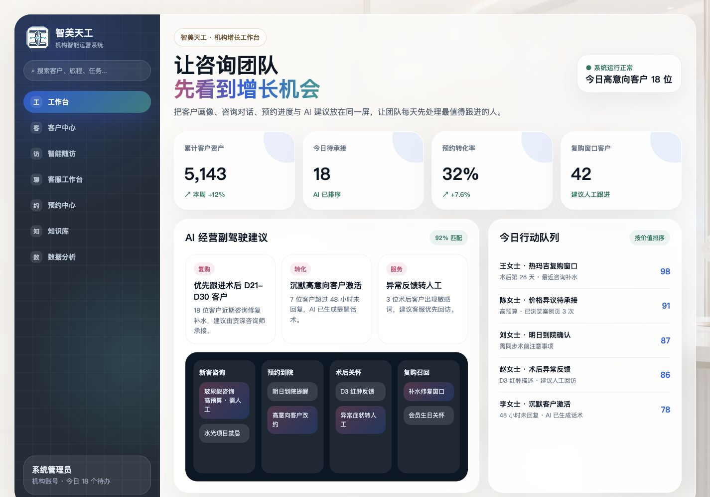
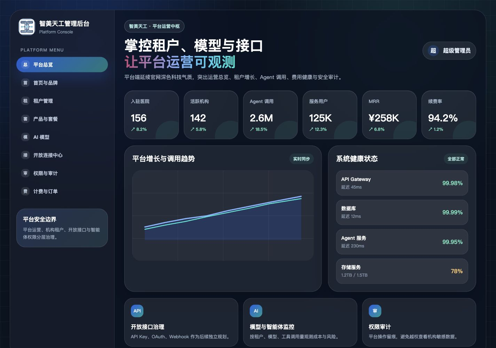

# 机构端与平台端 UI 重设计规格

> 日期：2026-05-29  
> 状态：设计方案，待确认后进入实施计划  
> 范围：机构端 `/hospital` 与平台端 `/open-platform` 的视觉方向、布局层级和组件改造方案。  
> 不包含：真实业务数据、数据库、RBAC、API Key、OAuth、Webhook、Agent 调度、知识库/RAG、计费逻辑。

## 1. 设计目标

当前机构端和平台端页面已经可用，但视觉气质仍偏普通后台模板。新的 UI 方向需要继承智美天工官网首页的品牌感，同时让机构端和平台端拥有清晰的角色差异。

本次设计目标：

- 让后台页面从“普通 SaaS 模板”升级为“智美天工品牌化运营中枢”。
- 保留当前已实现的入口、登录态、导航、指标和 demo 数据结构。
- 不改变业务行为，只重塑页面视觉和信息层级。
- 为后续客户中心、预约中心、智能随访、平台租户管理等模块提供可延展的视觉基调。

## 2. 视觉参考

本方案参考当前官网首页的以下元素：

- 浅奢医疗空间背景。
- 蓝色、青绿色、玫红、金色组成的品牌渐变。
- 玻璃拟态卡片和柔和阴影。
- 深色科技网格区块。
- “增长机会”“AI 下一步建议”“客户旅程”这类结果导向表达。

方案图已持久化到：





## 3. 总体设计策略

### 3.1 机构端：轻医疗 + 增长行动

机构端面向医美机构运营团队、咨询师、客服和管理者。页面应强调“今天先做什么”，而不是单纯堆指标。

设计关键词：

- 明亮、可信、医疗空间感。
- 玻璃卡片、柔和背景、浅色主内容区。
- 深色侧边栏作为稳定操作区。
- 重点突出高意向客户、复购窗口、术后风险、行动队列。

机构端首屏应回答：

- 今天有哪些高价值客户要优先跟进？
- 哪些客户处于复购或风险窗口？
- AI 给了哪些可执行建议？
- 当前客户旅程在哪些节点有待处理事项？

### 3.2 平台端：深科技 + 运营治理

平台端面向智美天工运营团队和超级管理员。页面应强调“平台整体是否健康、租户是否增长、接口和智能体是否可控”。

设计关键词：

- 深色科技控制台。
- 网格背景、发光线条、玻璃暗卡。
- 平台级指标密度更高。
- 突出租户、模型、调用、费用、安全审计和系统健康。

平台端首屏应回答：

- 当前平台租户和活跃情况如何？
- Agent 调用量、服务用户数、MRR 和续费率是否健康？
- 系统服务、API、数据库、Agent 服务是否稳定？
- 哪些治理能力后续需要平台运营重点关注？

## 4. 机构端页面设计

### 4.1 页面结构

机构端采用两栏结构：

- 左侧深色科技导航栏，宽度约 292px。
- 右侧浅色玻璃主工作区，承载增长概览、AI 建议、客户旅程和行动队列。

主内容区结构：

1. 顶部品牌化标题区。
2. 四个关键经营指标。
3. AI 经营副驾驶建议。
4. 客户旅程看板。
5. 今日行动队列。

### 4.2 左侧导航

左侧导航从当前功能中保留核心入口：

- 工作台
- 客户中心
- 智能随访
- 客服工作台
- 预约中心
- 知识库
- 数据分析

暂时弱化或后置：

- 智能体中心
- 客户接入中心
- 员工绩效
- 系统设置

原因：机构端首屏需要更聚焦咨询、客户、随访和预约，不应把所有未来能力平铺在第一层导航里。后置项可以在实施时保留在二级入口或继续出现在完整菜单中，但视觉上降低权重。

### 4.3 顶部标题区

标题建议：

```text
让咨询团队
先看到增长机会
```

副标题：

```text
把客户画像、咨询对话、预约进度与 AI 建议放在同一屏，让团队每天先处理最值得跟进的人。
```

右侧状态卡：

```text
系统运行正常
今日高意向客户 18 位
```

### 4.4 关键指标

机构端首屏指标建议调整为结果导向：

- 累计客户资产：`5,143`
- 今日待承接：`18`
- 预约转化率：`32%`
- 复购窗口客户：`42`

说明：

- 旧版 `累计客户数` 可以升级为 `累计客户资产`，更贴合经营中台定位。
- `今日待承接` 比 `待处理随访` 更能指导咨询团队行动。
- `复购窗口客户` 比普通分层图更有业务动作感。

### 4.5 AI 经营副驾驶建议

建议保留三类优先建议：

- 复购：优先跟进术后 D21-D30 客户。
- 转化：沉默高意向客户激活。
- 服务：异常反馈转人工。

每张建议卡包含：

- 类型标签。
- 建议标题。
- 简短原因。
- 可选行动按钮，例如 `查看客户`、`生成话术`、`分配咨询师`。

实施第一版可以只保留静态按钮，不接真实动作。

### 4.6 客户旅程看板

采用深色小看板，承接官网首页里的“客户旅程”表达。

四列：

- 新客咨询
- 预约到院
- 术后关怀
- 复购召回

每列展示 2-3 个高价值待处理卡片。高优先级卡片使用玫红到蓝色的渐变背景。

### 4.7 今日行动队列

右侧独立行动队列，比当前 `用户分层` 更适合作为首屏核心。

每条行动包含：

- 客户名或匿名展示。
- 触发原因。
- AI 优先级分数。

第一版示例：

- 王女士 · 热玛吉复购窗口，分数 98。
- 陈女士 · 价格异议待承接，分数 91。
- 刘女士 · 明日到院确认，分数 87。
- 赵女士 · 术后异常反馈，分数 86。
- 李女士 · 沉默客户激活，分数 78。

## 5. 平台端页面设计

### 5.1 页面结构

平台端采用深色控制台结构：

- 左侧深色平台菜单。
- 右侧深色玻璃主内容区。
- 背景使用科技网格和蓝青光晕。

主内容区结构：

1. 顶部平台运营标题区。
2. 六个核心平台指标。
3. 平台增长与调用趋势。
4. 系统健康状态。
5. 三个治理能力卡片。

### 5.2 左侧导航

平台端首层导航建议更偏治理：

- 平台总览
- 首页与品牌
- 租户管理
- 产品与套餐
- AI 模型
- 开放连接中心
- 权限与审计
- 计费与订单

说明：

- 将 `首页编辑` 改为 `首页与品牌`，更适合商业化维护。
- 将 `权限与组织` 升级为 `权限与审计`，强调平台风险边界。
- `知识库管理`、`智能体运行监控`、`平台数据分析` 可以在后续平台模块中保留，但首屏导航第一版不需要全部展开。

### 5.3 顶部标题区

标题建议：

```text
掌控租户、模型与接口
让平台运营可观测
```

副标题：

```text
平台端延续官网深色科技气质，突出运营总览、租户增长、Agent 调用、费用健康与安全审计。
```

右侧保留超级管理员身份入口。

### 5.4 核心指标

平台端保留当前六个指标，但视觉改为深色玻璃卡：

- 入驻医院：`156`
- 活跃机构：`142`
- Agent 调用：`2.6M`
- 服务用户：`125K`
- MRR：`¥258K`
- 续费率：`94.2%`

### 5.5 趋势图

平台端主趋势图合并表达：

- 租户增长趋势。
- Agent 调用趋势。

第一版不需要引入图表库，仍可用 SVG 或 CSS 绘制静态折线，保持依赖轻量。

### 5.6 系统健康状态

保留四项：

- API Gateway
- 数据库
- Agent 服务
- 存储服务

视觉上放在右侧面板，突出平台运维感。

### 5.7 治理能力卡片

底部三张卡：

- 开放接口治理：API Key、OAuth、Webhook 后续独立规划。
- 模型与智能体监控：按租户、模型、工具调用量观测成本与风险。
- 权限审计：平台操作留痕，避免越权查看机构敏感数据。

这些卡片只作为能力入口和产品定位说明，不在本阶段实现真实功能。

## 6. 响应式策略

### 6.1 桌面端

目标宽度：

- 主要优化 1440px 以上桌面端。
- 最大内容宽度可保持 `1840px`，但主卡片间距需要更克制。

机构端：

- 四指标一行。
- 下方两列：左侧 AI 建议 + 旅程看板，右侧行动队列。

平台端：

- 六指标一行。
- 下方两列：趋势图 + 系统健康。
- 底部三张治理卡。

### 6.2 移动端

移动端不追求复杂控制台密度，应保证可读：

- 左侧导航收起为顶部品牌栏或后续抽屉。
- 指标改为两列或单列。
- 客户旅程看板改为横向滚动或垂直分组。
- 平台端六指标改为两列。

第一版实施可以先保证无横向溢出，不必实现完整移动抽屉交互。

## 7. 影响文件

预计修改：

- `src/modules/workspace/components/InstitutionWorkspace.tsx`
  - 重写机构端布局和卡片样式。
- `src/modules/workspace/components/PlatformConsole.tsx`
  - 重写平台端布局和卡片样式。
- `src/modules/workspace/domain/institution-dashboard.ts`
  - 调整机构端指标、建议、旅程和行动队列数据。
- `src/modules/workspace/domain/platform-dashboard.ts`
  - 调整平台端导航命名、能力卡文案和指标短标题。
- `src/modules/workspace/tests/WorkspaceDashboardDomain.test.ts`
  - 更新测试断言，覆盖新导航、指标和关键入口。
- `src/modules/workspace/tests/WorkspaceEntryPages.test.tsx`
  - 更新入口页关键文案断言。
- `docs/devlog/2026-05-29.md`
  - 记录 UI 重设计阶段。

可能新增：

- `src/modules/workspace/domain/institution-action-queue.ts`
  - 如果行动队列数据较长，可独立拆分。
- `src/modules/workspace/components/WorkspaceMetricCard.tsx`
  - 如果机构端和平台端指标卡出现明显重复，可抽一个轻量共享组件。

第一版建议不新增过多组件，避免为了视觉稿过早抽象。

## 8. 验证计划

实施后必须验证：

- `./node_modules/.bin/eslint .`
- `node scripts/run-vitest.mjs run`
- `./node_modules/.bin/tsc --noEmit`
- `node scripts/run-next.mjs build --webpack`
- 浏览器打开 `/hospital`
- 浏览器打开 `/open-platform`
- 浏览器验证机构端登录/退出链路。
- 浏览器验证平台端登录/退出链路。
- 桌面端截图检查：
  - 文字不溢出。
  - 卡片不重叠。
  - 侧边栏不挤压主内容。
  - 首屏信息重心清晰。
- 移动端基础检查：
  - 无横向滚动。
  - 指标和卡片能自然换行。

## 9. 风险与边界

本阶段主要风险：

- 视觉升级可能让后台过于“展示化”，影响真实工作效率。
- 深色平台端需要注意对比度，避免小字可读性下降。
- 机构端背景图和玻璃卡片如果过重，可能影响内容扫描效率。
- 当前方案图是静态视觉方向，不代表最终像素级实现。

控制方式：

- 第一版只改首屏和当前已有模块，不扩展真实功能。
- 保留现有路由、session gate 和 logout 行为。
- 继续使用当前静态 domain 数据，不接真实数据服务。
- 卡片圆角和阴影控制在商业后台可接受范围内，避免过度装饰。

## 10. 结论

推荐采用本方案：

- 机构端采用“浅奢医疗 + 增长行动”。
- 平台端采用“深色科技 + 运营治理”。

这个方向能让两个后台页面与官网首页形成统一品牌体系，同时让机构用户和平台管理员进入系统时感受到不同角色定位。若方案确认，下一步应编写实施计划，再分步骤改造组件、domain 数据和测试。
