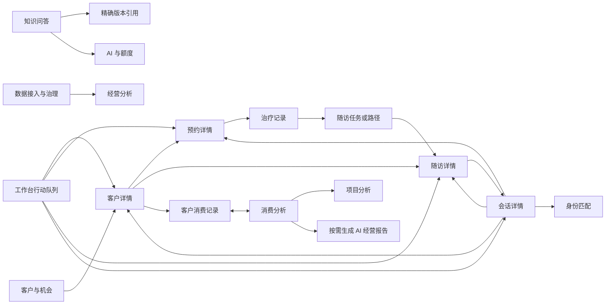

# 机构端导航与页面体系产品设计规格（产品方向已确认）

## 文档状态

| 项目 | 内容 |
|---|---|
| 日期 | 2026-07-17 |
| 状态 | 已确认（产品方向），不构成开发授权或开发基线 |
| 适用入口 | 机构端 `/hospital` |
| 本文范围 | 信息架构、页面排版、页面链接、经营分析产品口径、抽屉、弹窗、表单、状态、权限、响应式与异常反馈 |
| 本文不包含 | 源码修改、接口实现、数据库变更、真实企微/HIS/ERP/POS/AI 接入、发送能力、部署与发布 |

本文是机构端下一版页面体系的产品方向依据，不代表这些页面、路由或操作已经实现。产品方向已于 2026-07-16 至 2026-07-17 逐项确认，但进入开发前仍需另行完成技术设计、任务边界、数据与权限影响、验收标准和明确开发授权。

本轮参考图片只用于确认一级栏目名称和上下顺序，不嵌入本文；图片中的配色、线条和布局比例不构成视觉规范。

本文与 `2026-05-29-institution-business-shell-design.md` 的关系如下：

- 旧文档描述的是第一阶段单页 `activeView` 业务壳。
- 本文提出的是目标信息架构和深链接方案。
- 在本文被确认并完成开发前，当前实现仍以旧业务壳和现有接口能力为准。
- 本文不覆盖现有安全、租户隔离、审计和真实通道限制。

## 一、设计结论

### 1.1 一级栏目收敛为 7 个

机构端左侧导航由当前较长的平铺列表收敛为：

1. 工作台
2. 客户中心
3. 会话工作台
4. 预约与随访
5. 知识库
6. 经营分析
7. 管理中心

栏目归并关系：

| 当前栏目 | 目标归属 | 处理方式 |
|---|---|---|
| 工作台 | 工作台 | 保留 |
| 客户中心 | 客户中心 | 保留 |
| 治疗摘要管理 | 客户中心 > 治疗记录 | 从一级导航移入客户中心 |
| 客服工作台 | 会话工作台 | 更名；没有生产会话来源前不正式发布 |
| 预约中心 | 预约与随访 > 预约管理 | 与随访合并 |
| 智能随访 | 预约与随访 > 随访任务、路径管理 | 与预约合并 |
| 知识库 | 知识库 | 保留并拆成 4 个页签 |
| 机会池 | 经营分析 > 客户与机会 | 保持派生只读定位，不新增 CRM 状态 |
| 数据分析 | 经营分析 | 升级为目标栏目；消费金额、项目分析和 AI 报告达到数据与安全门禁后才发布 |
| AI 服务使用 | 管理中心 > AI 与额度 | 从一级导航移入管理栏目；只展示机构级使用与额度，不展示模型、Token、厂商或成本 |
| 企微外部联系人 | 管理中心 > 渠道接入 | 与身份匹配合并；渠道类型与接入服务商分离 |
| 企微匹配复核 | 管理中心 > 渠道接入 | 迁入身份匹配；旧链接只保留兼容跳转 |
| HIS 连接配置 | 管理中心 > 数据接入与治理 | HIS 与 ERP、POS、受控文件导入统一归入业务数据接入 |
| 审计日志 | 管理中心 > 审计与安全 | 与安全状态、急停和权限审计合并 |

### 1.2 删除导航中的研发状态文字

导航项右侧的“开发主线”“后续”等字段全部删除，原因是它们属于研发计划状态，不属于机构用户的业务信息。

导航右侧只允许出现业务待办数字，例如：

- 预约与随访：`5`，表示待确认预约与到期随访合计。
- 会话工作台：`2`，表示待人工接管或风险会话。
- 管理中心：`1`，表示当前角色有权处理的系统异常。

规则：

- 数字为 `0` 时不显示。
- 最大显示 `99+`。
- 不显示“开发中”“后续”“测试版”等研发标签。
- `MOCK`、`DEMO`、`不发送` 只出现在相关功能页的安全提示中，不污染所有导航项。
- 页面中的“当前为 API 数据”改为数据状态说明，放在刷新时间附近；生产环境不作为主标题标签长期展示。

七个栏目是目标信息架构，不是首期必须全部显示。正式导航中的栏目必须同时满足：功能已完成；数据真实、持久化且可解释；按 `institutionId` 隔离；当前角色和数据范围由服务端验证；关键写操作有可靠审计；能力级验收通过。未发布能力不显示空壳，也不显示“开发中”。

### 1.3 一级导航不继续嵌套树形菜单

左侧导航的目标信息架构最多包含上述 7 个一级栏目；各阶段只展示已正式发布且当前角色有权访问的子集。一级栏目内部的二级能力使用页面顶部页签，不在左侧展开多层树，避免导航过长、折叠状态难理解和移动端无法复用。

### 1.4 目标方案支持深链接

当前页面主要通过内存状态切换，刷新后不能保留具体栏目和对象。目标方案采用真实页面链接：

- 每个一级栏目和二级页签拥有稳定链接。
- 详情对象拥有可复制、可刷新、可前进后退的链接。
- 桌面端可将详情链接呈现为覆盖在列表上的抽屉。
- 移动端同一链接呈现为全屏详情页。
- 所有权限必须同时在页面入口和服务端验证，不能只隐藏按钮。

## 二、整体信息架构

```text
机构端 /hospital
├── 工作台
├── 客户中心
│   ├── 客户列表
│   ├── 治疗记录
│   └── 客户详情
│       ├── 概览
│       ├── 服务时间线
│       ├── 预约
│       ├── 随访
│       ├── 治疗记录
│       ├── 消费记录
│       └── 操作记录
├── 会话工作台
│   ├── 会话队列
│   ├── 自动触达
│   └── 会话详情
├── 预约与随访
│   ├── 今日队列
│   ├── 预约管理
│   ├── 随访任务
│   └── 路径管理
├── 知识库
│   ├── 资料库
│   ├── 检索测试
│   ├── 问答与引用
│   │   ├── 即时问答
│   │   └── 问答审计
│   ├── 任务记录
│   └── 知识详情
├── 经营分析
│   ├── 经营总览
│   ├── 消费分析
│   ├── 项目分析
│   │   └── 项目详情（只读）
│   ├── 客户与机会
│   │   └── 经营机会详情（只读）
│   └── AI 经营报告
│       └── 报告详情（只读）
└── 管理中心
    ├── 系统概览
    ├── 机构与成员
    │   ├── 机构资料
    │   ├── 成员
    │   └── 固定角色权限
    ├── 渠道接入
    │   ├── 渠道连接
    │   └── 身份匹配
    ├── 数据接入与治理
    │   ├── 数据源
    │   ├── 导入批次
    │   └── 数据治理
    ├── AI 与额度
    ├── 数据与隐私
    └── 审计与安全
        ├── 安全状态
        └── 审计日志
```

## 三、页面链接与浏览器交互

### 3.1 目标链接表

| 栏目/页面 | 目标链接 | 详情表现 |
|---|---|---|
| 工作台 | `/hospital` | 完整页面 |
| 客户列表 | `/hospital/customers` | 完整页面 |
| 治疗记录 | `/hospital/customers/treatments` | 完整页面 |
| 治疗记录详情 | `/hospital/customers/treatments/:summaryId` | 桌面宽抽屉，移动端全屏页 |
| 客户详情 | `/hospital/customers/:customerId` | 桌面抽屉，移动端全屏页 |
| 客户消费记录 | `/hospital/customers/:customerId?view=consumption` | 客户详情内受控页签，仅机构管理员和机构运营可见 |
| 会话队列 | `/hospital/conversations` | 完整页面；没有生产会话来源前不正式发布 |
| 会话详情 | `/hospital/conversations/:conversationId` | 桌面三栏中的中间主区域，移动端全屏页 |
| 自动触达 | `/hospital/conversations/automations` | 受控旅程列表与版本管理 |
| 自动触达详情 | `/hospital/conversations/automations/:journeyId` | 桌面完整页面，移动端只读详情与暂停入口 |
| 旧客服工作台 | `/hospital/service` | 兼容跳转至 `/hospital/conversations`，不保留第二套实现 |
| 今日队列 | `/hospital/care` | 完整页面 |
| 预约管理 | `/hospital/care/appointments` | 完整页面 |
| 预约详情 | `/hospital/care/appointments/:appointmentId` | 桌面抽屉，移动端全屏页 |
| 随访任务 | `/hospital/care/followups` | 完整页面 |
| 随访详情 | `/hospital/care/followups/:taskId` | 桌面宽抽屉，移动端全屏页 |
| 路径管理 | `/hospital/care/paths` | 完整页面 |
| 路径详情 | `/hospital/care/paths/:enrollmentId` | 桌面宽抽屉，移动端全屏页 |
| 知识库资料库 | `/hospital/knowledge` | 完整页面 |
| 检索测试 | `/hospital/knowledge/search` | 完整页面 |
| 问答与引用 | `/hospital/knowledge/qa` | 完整页面 |
| 问答审计详情 | `/hospital/knowledge/qa/audits/:auditId` | 桌面抽屉，移动端全屏页 |
| 任务记录 | `/hospital/knowledge/jobs` | 完整页面 |
| 知识详情 | `/hospital/knowledge/items/:knowledgeId` | 桌面抽屉，移动端全屏页 |
| 经营总览 | `/hospital/analytics` | 完整页面 |
| 消费分析 | `/hospital/analytics/consumption` | 完整页面，支持周期和自定义日期范围 |
| 消费记录详情 | `/hospital/analytics/consumption/:recordId` | 桌面只读抽屉，移动端全屏页 |
| 项目分析 | `/hospital/analytics/projects` | 完整页面 |
| 项目详情 | `/hospital/analytics/projects/:projectId` | 桌面 `720px` 只读抽屉，移动端全屏页 |
| 客户与机会 | `/hospital/analytics/opportunities` | 完整页面；经营机会保持派生只读 |
| 派生机会详情 | `/hospital/analytics/opportunities/:customerId?kind=:opportunityKind` | 由客户 ID 与机会类型定位的只读抽屉，移动端全屏页 |
| AI 经营报告 | `/hospital/analytics/reports` | 按需生成与报告历史列表 |
| AI 经营报告详情 | `/hospital/analytics/reports/:reportId` | 桌面只读抽屉，移动端全屏页 |
| 经营机会兼容入口 | `/hospital/opportunities` | 站内兼容跳转至 `/hospital/analytics/opportunities`，保留结构化筛选 |
| 经营机会详情兼容入口 | `/hospital/opportunities/:customerId?kind=:opportunityKind` | 站内兼容跳转至对应的派生机会详情，不保留第二套详情实现 |
| 管理中心 | `/hospital/system` | 完整页面 |
| 机构与成员 | `/hospital/system/organization` | 机构资料、成员和固定角色权限 |
| 成员详情 | `/hospital/system/organization/members/:memberId` | 桌面详情抽屉，移动端全屏页 |
| 渠道接入 | `/hospital/system/channels` | 渠道连接与身份匹配 |
| 渠道连接详情 | `/hospital/system/channels/connections/:connectionId` | 桌面详情抽屉，移动端全屏页 |
| 身份匹配 | `/hospital/system/channels/mappings` | 受控复核列表 |
| 身份匹配详情 | `/hospital/system/channels/mappings/:mappingId` | 桌面复核弹窗或全屏页 |
| 数据接入与治理 | `/hospital/system/data` | 数据源、导入批次和治理异常 |
| 数据源详情 | `/hospital/system/data/sources/:sourceId` | 桌面只读详情抽屉，移动端全屏页 |
| 导入批次详情 | `/hospital/system/data/imports/:batchId` | 桌面详情抽屉，移动端全屏页 |
| AI 与额度 | `/hospital/system/ai-usage` | 完整页面 |
| AI 服务项目详情 | `/hospital/system/ai-usage/services/:serviceKey` | 桌面只读抽屉，移动端全屏页 |
| 数据与隐私 | `/hospital/system/privacy` | 授权、退订、留存及异常摘要 |
| 审计与安全 | `/hospital/system/audit` | 安全状态与审计日志 |
| 审计详情 | `/hospital/system/audit/:eventId` | 桌面抽屉，移动端全屏页 |
| 旧企微管理入口 | `/hospital/system/wecom/**` | 仅在对应正式能力上线后兼容跳转至渠道接入；mock 演示不跳转到正式页 |
| 旧 HIS 管理入口 | `/hospital/system/his/**` | 兼容跳转至 `/hospital/system/data?sourceType=his`，保留安全结构化筛选 |

`/hospital` 继续作为工作台正式入口，不新增 `/hospital/dashboard`，从而保留当前入口语义并减少无意义重定向。

对象详情内部页签使用稳定查询参数：

- 客户：`?view=overview|timeline|appointments|followups|treatments|consumption|audit`；`consumption` 仅对机构管理员和机构运营开放。
- 知识：`?view=overview|versions|files|chunks|references|dependencies`。
- 会话右侧面板：`?panel=assistant|profile|history`。
- 管理中心：`?view=` 只用于页面内受控分段；七个二级页面各自使用稳定路径。
- 新建表单：`?create=1`；关闭表单后通过 `replace` 移除。
- 详情编辑：`?mode=edit`；无编辑权限时回退为只读详情并显示权限说明。

跨页面预填只传不敏感的对象 ID，例如：

- `/hospital/care/appointments?create=1&customerId=:customerId`
- `/hospital/care/followups?create=1&customerId=:customerId`
- `/hospital/customers/treatments?create=1&customerId=:customerId&appointmentId=:appointmentId`
- `/hospital/analytics/consumption?customerId=:customerId&from=:from&to=:to`

目标页必须重新查询，并校验当前 `institutionId`、角色、数据范围和对象归属，不能信任链接中的显示名称或业务字段。

### 3.2 链接中允许保存的状态

允许写入查询参数：

- 稳定枚举筛选，例如 `status=due`、`risk=urgent`。
- 日期范围，例如 `from=2026-07-01&to=2026-07-15`。
- 经营分析周期和粒度，例如 `preset=month`、`grain=day`、`analysis=project_structure`。
- 排序、分页、页签，例如 `sort=dueAt&direction=asc&page=2`。
- 非敏感的界面状态，例如 `view=timeline`、`create=1`。

不允许写入链接：

- 客户姓名、手机号、病历号、聊天内容或搜索原文。
- 提示词、回答、知识片段全文、外部联系人原始标识。
- 消费金额、客户名称、原始订单号、支付单号、导入文件名或 AI 报告正文。
- token、secret、供应商错误、原始 payload。
- 任意未经校验的 `returnTo` 外链。

自由文本搜索只保存在当前页面内存中；刷新后清空。结构化筛选可保存在链接中。

### 3.3 前进、后退和详情恢复

- 从列表点击对象时，浏览器历史记录执行 `push`。
- 在详情内切换页签、筛选、排序或分页时执行 `replace`，避免历史记录被细碎操作淹没。
- 从客户详情跳转到预约、随访、治疗记录等另一模块时关闭当前抽屉并进入目标完整页面。
- 返回时恢复列表筛选、分页和滚动位置。
- 直接打开详情链接时，桌面端加载默认列表背景并打开详情；移动端直接显示全屏详情。
- 详情对象不存在时显示“记录不存在或已不可用”，不暴露其是否属于其他机构。
- 登录失效时跳转登录页，只允许携带通过白名单校验的站内返回链接。

## 四、全局页面与组件规范

### 4.1 桌面端壳层

- 左侧栏展开宽度：`276px`。
- 左侧栏折叠宽度：`64px`。
- 顶部保留品牌标识；单一导航组不再显示可见的“机构菜单”标题，只保留无障碍名称。
- 底部固定当前用户、角色和退出入口。
- 主内容区最大宽度建议 `1740px`，在超宽屏居中；页面横向内边距为 `24–32px`。
- 页面背景使用现有浅灰蓝；卡片使用白色；沿用当前蓝色到青色的主色方向。
- 圆角建议：输入控件 `12px`，普通容器 `16px`，大型卡片 `20–24px`。

### 4.2 左侧导航

每个导航项由图标、文字和可选待办数字组成：

- 默认高度 `48–52px`。
- 激活项使用明确底色、左侧或内侧高亮和高对比文字。
- 折叠时只保留图标，悬停和键盘聚焦显示文字提示。
- 不使用仅靠颜色区分激活状态。
- 无权限栏目直接隐藏；通过链接直达时仍需展示权限错误页。
- 侧栏折叠偏好可以保存在本地界面偏好中，但不得保存业务数据。

### 4.3 页面头部

统一顺序：

1. 可选面包屑，仅二级页面显示。
2. 页面标题和一句业务说明。
3. 数据更新时间、局部状态或安全提示。
4. 右侧一个主操作和最多两个次操作。
5. 页面级页签。

规则：

- 一级页不重复显示面包屑。
- 同一页面只保留一个视觉主按钮。
- 超过两个次操作的内容收入“更多”菜单。
- 刷新只刷新当前模块，不整页重载。
- 页签在长页面滚动后可吸顶，但不能遮挡标题和浏览器焦点。

### 4.4 指标卡

- 指标卡必须说明数字的口径和时间范围。
- 可跳转的指标卡显示箭头或“查看”提示，并支持键盘操作。
- 请求失败显示 `--` 和“暂不可用”，不能用 `0` 冒充成功结果。
- 指标为当前已加载记录时，必须写“当前已加载记录”，不能暗示全量聚合。
- 颜色只表达风险或状态，不作为唯一说明。

### 4.5 搜索与筛选

- 关键词输入后 `300–500ms` 防抖查询，按 `Enter` 可立即查询。
- 下拉枚举选择后立即生效；日期范围和高级组合筛选点击“应用筛选”后生效。
- 已应用条件显示为可逐个移除的筛选标签。
- 提供“重置”恢复当前页默认条件。
- 搜索结果变化后回到第一页。
- 筛选区在桌面端为一行或两行，移动端收进底部 Sheet。
- 筛选为空和数据本身为空必须使用不同空态文案。

各页面自由文本搜索白名单：

| 页面 | 允许检索 | 明确不检索 |
|---|---|---|
| 客户列表 | 客户低敏显示名、脱敏手机号、脱敏病历引用 | 原始手机号、身份证号、病历正文、备注全文 |
| 预约管理 | 客户低敏显示名、项目、咨询师低敏名称 | 预约备注全文、联系方式、病历正文 |
| 随访任务 | 客户低敏显示名、脱敏引用、受控阶段名称 | 草稿全文、人工反馈全文、聊天内容 |
| 经营分析：客户与机会 | 客户低敏显示名、项目、负责人低敏名称 | 原始联系方式、未受控自由文本 |
| 经营分析：消费明细 | 客户低敏显示名、标准项目名称、数据来源类型 | 原始订单号、支付单号、导入文件名、原始备注或支付信息 |
| 会话工作台 | 客户低敏显示名、脱敏引用、负责人 | 消息正文、聊天原文、AI 回答全文 |
| 知识资料库 | 知识标题、分类、低敏摘要 | 文件原文、知识片段全文、问答原文 |
| 渠道身份匹配 | 低敏显示名、脱敏引用、归属员工低敏名称 | 手机号、外部原始账号 ID、备注原文、聊天原文 |
| 审计日志 | 不提供自由文本搜索，只使用结构化筛选 | 请求体、错误原文、资源正文 |

“检索测试”和“问答与引用”中的查询内容属于该功能的受控输入，不等同于列表搜索；它们同样不得写入 URL 或浏览器持久化存储。

### 4.6 表格与卡片列表

- 桌面端默认使用表格；移动端改为信息卡片，不强行横向滚动完整表格。
- 点击行的非控件区域打开详情；复选框、链接和操作按钮各自独立。
- 固定首列只用于确有横向宽表的页面，不默认滥用。
- 状态列使用图标/文字/色彩共同表达。
- 一行最多显示两个直接操作，其余收入“更多”。
- 没有明确业务闭环的批量操作不设计，避免误操作。
- 分页后保留筛选；跨页不保留选择状态。
- 治疗记录等现有游标接口使用“加载更多”；普通稳定列表使用页码分页。

### 4.7 抽屉

尺寸分为：

| 类型 | 桌面宽度 | 使用场景 |
|---|---:|---|
| 紧凑详情 | `480–520px` | 审计、联系人、安全摘要 |
| 标准详情 | `560px` | 预约、知识、机会、渠道连接、安全摘要 |
| 复杂详情 | `720px` | 客户、随访、路径、治疗记录、消费记录、经营项目、经营报告 |

交互规则：

- 抽屉标题固定，内容区滚动，主要操作固定底部。
- `Esc` 可关闭只读抽屉；表单有未保存内容时先提示确认。
- 打开后焦点进入抽屉，关闭后回到触发元素。
- 同一时刻只允许一个基础业务浮层；不允许“抽屉上再开抽屉”或“业务弹窗上再开业务弹窗”。
- 允许一个仅用于确认当前动作的瞬时确认弹窗覆盖当前抽屉，例如作废、取消或放弃未保存内容。确认弹窗关闭后焦点必须回到原抽屉；它不能承载新的业务对象或长表单。
- 详情进入编辑时在当前抽屉内切换为编辑状态。
- 跨模块操作关闭抽屉并进入目标页面。
- 移动端抽屉统一转换为全屏页面，保留返回按钮和底部操作栏。

### 4.8 弹窗与底部 Sheet

| 类型 | 建议宽度 | 适用 |
|---|---:|---|
| 简单确认 | `440–480px` | 取消、结束、作废、归档 |
| 短表单 | `600–640px` | 低敏反馈、复核说明、短选择 |
| 多步骤 | `640–720px` | 客户导入、文件上传、匹配复核 |

规则：

- 标题使用具体动作，如“作废治疗记录”，不使用“提示”。
- 高风险动作按钮写清结果，如“确认作废”，不使用泛化“确定”。
- 危险操作说明影响范围、是否可恢复、是否影响关联对象。
- 移动端筛选和轻量操作使用底部 Sheet；需要长表单时进入全屏页。
- 无法继续的安全阻断只提供“返回修改”，不提供强制绕过。
- 普通 AI 建议需要人工确认；医疗风险、高风险内容和来源校验失败必须硬阻断，人工确认也不能解除。
- 作废、取消等合法业务动作仍可在权限校验后明确确认，但不能绕过安全阻断。

硬阻断的对象是被判定不安全或无法验证的内容及其下游执行，包括把该内容展示为可采用建议、据此创建或修改业务事实、批准/记录发送以及写入结果指标。阻断后只允许显示低敏原因码、写入审计、返回修改，或创建不携带被阻断内容和医疗结论的中性人工复核任务；人工确认不能把同一被阻断结果重新变为可执行。用户仍可基于独立、已验证来源，在正常权限流程中重新创建业务记录，这不等于解除原阻断。

### 4.9 表单

- 必填字段同时使用文字和 `*` 标识。
- 输入校验在离开字段和提交时执行；首次聚焦时不提前报错。
- 服务端字段错误显示在对应字段下；全局错误显示在表单顶部。
- 提交过程中只禁用提交和会造成重复请求的控件，不清空用户输入。
- 成功后关闭表单、刷新受影响区域并显示成功 Toast。
- 失败后保留所有合法输入。
- 版本冲突或数据已变化时要求刷新后重新确认，不自动覆盖。
- 关闭有修改的表单时显示“放弃未保存内容？”确认。
- 不在客户端表单中提供租户、机构、外部 provider 或敏感归属选择。

### 4.10 Toast、行内提示和系统状态

- 桌面 Toast 位于右上角，移动端位于底部导航上方。
- 成功 Toast 默认 `4s` 后消失；同屏最多 3 条。
- 错误不能只显示 Toast，必须在对应表单、列表或卡片中保留可恢复提示。
- 业务警告使用页面或卡片行内提示，不反复弹 Toast。
- 离线或网络波动时保留最后一次安全加载的数据，并明确“数据可能不是最新”。
- 涉及机构边界、来源校验、敏感字段或权限失败时采用 fail-closed：隐藏相关数据，不使用旧缓存兜底。

### 4.11 通用页面状态

每个页面必须设计以下状态：

| 状态 | 表现 |
|---|---|
| 首次加载 | 与最终排版一致的骨架屏，不使用全页转圈 |
| 局部刷新 | 保留现有内容，在刷新控件附近显示进度 |
| 数据为空 | 说明为什么为空，并提供当前角色可执行的下一步 |
| 筛选为空 | 显示“当前条件下没有结果”和“重置筛选” |
| 部分可用/部分失败 | 成功区域继续展示，失败区域显示受影响来源、范围和重试入口 |
| 数据过期 | 保留已核验数据并明确数据截止时间、过期来源和刷新/治理入口；未知区间不显示为 `0` |
| 外部能力不可用 | 说明受影响动作；仍可靠的人工流程、已持久化事实和基础只读分析继续可用 |
| 整页失败 | 错误说明、刷新按钮和安全边界，不显示内部错误 |
| 无权限 | 说明当前角色无权访问，提供返回工作台 |
| 能力未发布 | 正式导航和普通入口隐藏；安全直达显示“该能力尚未开放”，不提供可点击空壳 |
| 记录不存在 | 不区分不存在、已归档或属于其他机构 |
| 会话过期 | 前往登录并保留安全的站内返回链接 |
| 冲突 | 提示数据已更新，刷新后重新操作 |

不得向机构用户展示数据库错误、堆栈、原始请求体、provider 响应或内部安全策略细节。

### 4.12 用户区、退出和时间格式

- 侧栏底部显示当前用户低敏名称和机构角色；没有机构切换能力时不显示虚构切换器。
- 点击用户区打开轻量菜单：账户摘要、退出。没有真实设置页时不显示“账户设置”。
- 退出通常不二次确认；若当前存在未保存表单，先处理“放弃未保存内容”确认。
- 日期时间使用机构时区；当前无独立机构时区时按 `Asia/Shanghai` 展示。
- 列表默认显示 `YYYY-MM-DD HH:mm`；临近待办可同时显示“2 小时后”等相对时间。
- 空值统一显示 `--`，不得用 `0`、当前时间或假数据替代。

## 五、工作台

### 5.1 页面目标

工作台只回答三件事：今天最需要处理什么、当前服务链路是否存在业务异常、下一步去哪里完成操作。它不是经营分析首页，也不重复承载各模块的完整列表、表单和详情。

### 5.2 桌面排版

从上到下：

1. 紧凑页面头部：标题“工作台”、业务说明、最后更新时间、刷新。
2. 异常提示条：仅在部分数据不可用、真实可计算风险或权限异常时出现。
3. 四张固定行动卡与最多两张角色动态卡，桌面最多 3 列。
4. 当前行动队列，作为页面主区域。
5. 紧凑客户旅程条、快捷创建和可解释的局部业务摘要。

不放置近期业绩、转化率或宣传式趋势。经营金额、项目贡献和 AI 经营解读统一进入“经营分析”。

### 5.3 指标卡与链接

四张固定卡始终按以下顺序呈现：

| 指标 | 点击后的目标 | 口径 |
|---|---|---|
| 待确认预约 | `/hospital/care/appointments?status=pending_confirmation` | 当前角色有权处理且仍待客户确认的真实预约 |
| 改约申请 | `/hospital/care/appointments?status=reschedule_requested` | 尚未由 HIS 原子接受新时段的改约请求 |
| 逾期随访 | `/hospital/care/followups?bucket=overdue` | 按机构时区计算，仍未完成或取消的已逾期任务 |
| 今日到期随访 | `/hospital/care/followups?bucket=today` | 按机构时区计算的今日到期任务 |

在服务端数据范围可靠时，可按当前角色增加最多两张动态卡，例如待人工接管会话、紧急风险随访或待认领任务。动态卡没有真实数据、权限或稳定口径时直接不显示，不用客户总数、高优先级客户、静态趋势或假零值补位。

卡片请求失败时显示 `--` 和局部错误，并保留其他成功卡片；不将失败解释为零。卡片数字和导航 badge 都按唯一可行动对象去重，同一对象具有多个标签时只计一次。

### 5.4 当前行动队列

队列只混合显示真实预约、随访和生产会话待办，不使用客户 `nextAction`、低敏人工反馈或自由文本备注生成伪任务。每项显示：

- 类型图标和文字。
- 客户低敏名称。
- 待办摘要。
- 到期时间或预约时间。
- 风险和优先级。
- 负责人。
- `查看详情`。

排序规则：未解决紧急风险 > 已逾期 > 即将违反 SLA > 今日到期或今日预约 > 高优先级 > 普通任务；同级按业务时间升序和稳定对象 ID 排序。

桌面最多显示 6 条，移动端最多显示 4 条；更多内容跳转来源模块并保留结构化筛选。点击行进入来源对象详情，不在工作台复制编辑表单。队列顶部只提供“全部、预约、随访、会话”四类筛选；当前角色无会话权限时隐藏会话筛选。

同一对象只保留一行并显示多个状态标签。例如一项随访同时“逾期”和“紧急”时只显示一次，以紧急排序并同时展示两个标签。

### 5.5 客户旅程与快捷操作

客户旅程使用紧凑分布条显示咨询中、已预约、术后关怀、复购窗口，不使用四张大型指标卡。沉默唤醒归入“经营分析 > 客户与机会”，不和主旅程重复；点击分段进入客户列表并携带生命周期筛选。

有权限时提供一个“新建”菜单：

- 新建客户：前往客户中心并打开新建表单。
- 新建预约：前往预约管理并打开新建表单。
- 新建随访：前往随访任务并打开新建表单。

没有对应创建权限时不显示该项。

异常提示条只展示业务用户可以理解并能采取行动的状态，例如预约数据部分不可用、随访同步过期或生产会话队列异常；具体连接、provider、凭证和错误诊断跳转管理中心。

### 5.6 不应再放在工作台的内容

- API、mock、provider、通道和凭证技术说明。
- 完整客户、预约、随访编辑界面。
- 静态宣传式大首屏。
- 不能从真实数据计算的“成功率”“转化率”。
- 客户 `nextAction` 或运营备注推导出的伪待办。
- 经营金额、项目排名、AI 经营报告和技术健康详情。

技术和连接状态统一进入“管理中心”。

### 5.7 首期角色化呈现

- 机构管理员突出业务异常、风险和管理入口。
- 机构运营突出全局待办、客户经营、预约和随访。
- 咨询师突出当前权限内的客户、预约和随访内容。
- 客服突出当前权限内的会话、客户摘要和随访内容。

首期角色化只改变导航和内容优先级，不扩大第十三章定义的服务端权限与数据范围。没有可靠负责人、分配关系和服务端授权时，不显示“我的客户”“我的任务”“我的会话”等筛选。

移动端采用两列紧凑行动卡，随后立即展示行动队列，再展示客户旅程和快捷入口。不得把桌面卡片全部纵向堆叠为超长首屏。

首期以页面读取为事实来源；后续若引入实时更新，采用服务端事件通知当前页面失效，再通过现有授权 REST 读取重新获取规范数据。实时事件只携带对象类型和安全引用，不携带客户名称、消息正文或业务敏感内容，也不直接用事件 payload 覆盖页面事实。

## 六、客户中心

### 6.1 页面结构

顶部两个页签：

- 客户列表
- 治疗记录

治疗记录页签只对具备对应权限的角色显示。客户列表可用不代表治疗记录自动可用。

### 6.2 客户列表排版

从上到下：

1. 标题、说明、刷新、主操作“新建客户”。
2. 紧凑生命周期分布条：咨询中、已预约、术后关怀、复购窗口、沉默唤醒；点击分段应用筛选，不使用四张大型指标卡。
3. 搜索与筛选。
4. 客户表格。
5. 分页。

筛选：

- 低敏关键词。
- 生命周期。
- 优先级。
- 负责人。
- 项目兴趣。
- 标签。
- 最近跟进时间范围。

表格字段：

- 客户低敏名称与脱敏引用。
- 项目兴趣、负责人。
- 生命周期、优先级。
- 标签，最多显示 3 个，多余显示 `+N`。
- 最近跟进摘要。
- 下一步动作。
- 更新时间。
- 操作：查看、编辑或更多。

不提供客户物理删除。机构管理员可执行可逆归档与受控合并；合并后保留规范客户、来源客户、字段取值依据和完整审计，原客户作为别名/来源成员可追溯。撤销合并只能恢复关系，不能静默回滚合并后已经产生的业务事实。机构运营、咨询师和客服不执行归档或合并。

### 6.3 新建和编辑客户

使用复杂详情抽屉。客户创建只采集完成业务识别和分配所需的低敏字段：

| 字段 | 规则 |
|---|---|
| 客户显示名称 | 必填，只允许当前业务定义的低敏显示名 |
| 稳定客户引用 | 必填，使用来源系统稳定外部引用或机构内脱敏引用；不在界面展示原始外部 ID |
| 负责人 | 必填，使用当前机构成员；HIS 已绑定客户时以 HIS 负责人为唯一责任归属 |
| 来源 | 必填，使用受控来源枚举 |
| 项目兴趣 | 可多选受控项目或分类，必须指定一个主项目；不使用自由文本拼接多个项目 |
| 优先级 | 必填：高、中、观察；必须有受控人工或确定性规则来源 |
| 下一步行动 | 必填，使用受控行动类型、计划时间和可选低敏说明；不是工作台任务，除非目标模块创建了真实预约或随访 |
| 标签 | 使用机构可用的受控标签，禁止敏感标识和任意自由创建 |
| 性别 | 可选受控值，并允许“未指定” |
| 出生年份 | 可选，不采集完整出生日期；可由出生年份派生年龄段但不得持久化动态年龄 |
| 低敏摘要 | 可选，不粘贴聊天原文、完整病历、联系方式或治疗正文 |

生命周期只读展示，由预约、治疗、随访等确定性业务事实计算；管理员和运营只能提交带原因和审计的受控纠正。新确定性事实到达后重新计算并覆盖纠正结果，不允许在普通客户编辑表单中任意选择生命周期。字段名、接口映射、存量兼容和数据迁移仍属于后续技术设计，本文不批准 schema 或 migration。

机构管理员和机构运营可新建、编辑和导入客户；咨询师和客服只读。系统角色权限是能力上限，机构后续只能隐藏被允许的操作，不能通过自定义配置扩大系统上限。

保存成功后：

- 新建：关闭抽屉，客户置于列表合理位置，Toast“客户已创建”。
- 编辑：保持客户详情打开，刷新概览和列表行，Toast“客户信息已更新”。
- 冲突：提示记录已被更新，用户刷新后重新编辑。

### 6.4 客户低敏导入

使用三步骤弹窗：

1. 输入数据。
2. 预检结果。
3. 导入结果。

正式目标支持 CSV 和 XLSX；JSON 仅保留为内部系统交换格式，不在机构界面作为主要导入方式。任一格式只有在解析、预检、逐行结果、权限和审计真实持久化后才显示。流程：

```text
选择 CSV/XLSX → 本地格式检查 → 服务端预检 → 显示合法/重复/待复核/拒绝行 → 确认导入合法行 → 逐行结果
```

规则：

- 输入内容变化后，原预检结果立即失效。
- 只有通过预检的记录可执行导入。
- 稳定客户引用完全一致时阻断重复创建并建议复用现有客户。
- 名称、脱敏引用或项目组合相似时进入人工重复复核，不自动合并。
- 失败行保留行号和安全原因，不回显敏感原文。
- 不允许导入真实聊天、原始手机号、身份证号、完整病历、HIS payload 或外部凭证。
- 当前实现只有低敏 JSON 时，正式页面继续隐藏 CSV/XLSX 入口，不能通过界面占位制造已支持的印象。

### 6.5 客户详情抽屉

抽屉宽 `720px`，顶部显示客户低敏名称、生命周期、优先级、负责人和允许的快捷操作。

页签：

| 页签 | 内容 |
|---|---|
| 概览 | 基础摘要、主项目与项目兴趣、优先级、下一步行动、标签和生命周期依据 |
| 服务时间线 | 预约、随访、治疗、人工反馈和安全业务事件的时间序列 |
| 预约 | 该客户预约摘要与“新建预约” |
| 随访 | 随访任务、风险、到期时间与“新建随访” |
| 治疗记录 | 有权限时显示治疗摘要与新增入口 |
| 消费记录 | 机构管理员和机构运营查看该客户的受控消费事实与经营分析入口 |
| 操作记录 | 有审计权限时显示白名单操作记录 |

快捷操作遵守目标页面权限：

- 新建预约：关闭客户抽屉，进入预约表单并预填客户引用。
- 新建随访：关闭客户抽屉，进入随访表单并预填客户引用。
- 新增治疗记录：关闭客户抽屉，进入治疗记录表单。
- 查看消费分析：关闭客户抽屉，进入 `/hospital/analytics/consumption?customerId=:customerId`；目标页重新校验机构归属和经营分析权限。
- 编辑客户：在当前抽屉切换编辑态，不叠加第二层抽屉。

### 6.6 客户消费记录

消费记录是受控只读页签，只对机构管理员和机构运营开放。咨询师和客服不显示页签；通过链接直达时返回统一无权限状态，不能泄露该客户是否存在消费记录。

页签顶部显示当前筛选周期内的实付总额、退款额、净消费额；只有存在稳定且已去重的业务消费单引用时才显示消费单数，字段口径与“经营分析 > 消费分析”一致。记录列表一行代表稳定业务消费单，并只展示：

- 消费发生时间。
- 标准项目名称与项目分类。
- 成功实付、已确认退款和实付净额。
- 币种；不同币种不合并计算。
- 记录状态、来源系统或导入来源、最近更新时间。
- 受控数据质量状态，例如待映射、重复已排除、来源已修正。

不展示原始订单号、支付单号、银行卡、票据、合同、导入文件名、外部 payload 或自由文本备注。消费记录不能在客户详情中直接编辑；需要纠错时回到来源系统或后续经批准的受控纠错流程。点击“查看机构消费分析”进入带客户 ID 和日期范围的消费分析页，分析页不得信任客户端传入的客户名称或金额。

当前系统尚无真实客户交易、支付和退款持久化数据；在交易数据基础、机构隔离、去重纠错和权限门禁完成前，该页签必须隐藏，不能用治疗摘要、平台商业记录或 fixture 代替。

### 6.7 治疗记录页

机构管理员可新建、编辑和作废治疗记录；机构运营和咨询师只读；客服不显示治疗记录页签和详情入口。服务端必须在列表、详情和写接口分别校验，不能以客户读取权限推导治疗权限。

筛选：

- 客户。
- 治疗项目。
- 风险：正常、关注、紧急。
- 治疗时间范围。
- 有效/已作废。

列表字段：

- 客户低敏名称。
- 治疗项目和类别。
- 治疗时间。
- 治疗阶段、恢复阶段。
- 风险等级。
- 有效/已作废。
- 是否编辑过。
- 负责人。
- 结构化摘要、下一步关怀动作。
- 标签、更新时间。
- 查看详情。

使用游标“加载更多”，避免将现有接口错误表现为页码总数。

点击记录进入 `/hospital/customers/treatments/:summaryId`；桌面打开 `720px` 详情抽屉，移动端显示全屏详情。链接刷新后必须恢复同一治疗记录。

### 6.8 新建和编辑治疗记录

复杂详情抽屉字段：

- 客户，必填。
- 治疗时间，必填。
- 治疗项目、类别。
- 治疗阶段、恢复阶段。
- 风险等级。
- 负责人。
- 可选关联预约。
- 结构化低敏摘要。
- 下一步关怀动作。
- 标签。

禁止填写完整病历、咨询原文、PII、文件 URL、供应商 payload、凭证或真实医疗判断。

编辑治疗记录不会自动修改已有随访任务，也不会自动重新生成建议。任何影响关联随访的动作必须由用户明确执行。

### 6.9 作废治疗记录

不提供删除，只提供“作废”。确认弹窗包含：

- 治疗记录对象。
- 作废原因分类。
- 低敏原因说明，最多 120 字。
- 影响提示：记录保留在历史中；手工或其他来源的随访任务不会自动取消；由该记录生成的路径、未完成路径任务和未发送触达按第 8.10 节取消；本操作本身不会触达客户。
- `取消`、`确认作废`。

作废成功后详情切为只读，并显示作废时间、操作者和安全原因。

### 6.10 治疗后的随访建议

治疗详情可展示系统生成的随访建议，但必须人工确认：

- 建议内容、建议时间、风险、来源字段。
- `创建随访任务`。
- 已有同源有效任务时按钮禁用，并提供“查看随访任务”。
- 创建只生成机构内部任务，不发送任何消息。
- 现有手工或单次随访任务不会因治疗记录后续编辑或作废而自动取消；由治疗记录作为来源生成的路径、未完成路径任务和未发送触达按第 8.10 节处理。
- 建议若命中医疗风险、高风险内容或来源校验失败，只显示低敏阻断状态和原因码，不展示为可采用建议，也不提供“创建随访任务”；可另建不携带建议内容的中性人工复核任务，但不能用人工确认解除原阻断。

## 七、会话工作台

### 7.1 页面目标、页签与发布边界

会话工作台完成“接收客户消息—AI 或人工服务—风险转交—业务确认—结束并留痕”的生产闭环。顶部固定两个页签：

1. 会话队列：`/hospital/conversations`。
2. 自动触达：`/hospital/conversations/automations`。

会话来源、原始消息、状态、分配、发送结果和已开放操作必须真实、持久化、可解释，并具备 `institutionId` 隔离、服务端权限和审计。fixture、mock、`mock_sent`、进程内状态或 dry-run 只能留在明确分离的内部演示入口，不能进入正式会话指标、队列或成功结果。

AI 建议、风险识别、多模态理解和自动触达按能力独立发布；任一子能力未满足门禁时直接隐藏，不阻断已经可靠的人工查看、接管和回复。

### 7.2 会话队列与桌面三栏

顶部四项行动指标固定为：待人工接管、即将超时、未解决风险、人工处理中。指标只统计当前角色有权处理的唯一会话；请求失败显示 `--`，不显示假零值。

| 区域 | 宽度 | 内容 |
|---|---:|---|
| 会话队列 | 约 `320px` | 状态、未读、风险、渠道、SLA、负责人角色筛选和会话列表 |
| 会话主区 | 自适应 | 原始消息授权视图、会话状态、人工输入和业务确认 |
| 档案与辅助 | `360–400px` | 客户档案、AI 助手、历史会话 |

默认排除已结束会话，按最后一条客户入站消息时间倒序排列；AI 回复、人工回复、系统事件或内部操作不得把没有新客户消息的会话虚假顶到队首。实时更新可以调整排序，但不得自动切换用户正在查看的会话。

队列自由搜索仅匹配客户低敏名称和脱敏引用，不检索消息正文；搜索保留在页面内存。每项显示渠道、客户或待匹配身份摘要、最后客户消息低敏摘要、未读数、SLA、风险、当前处理人和状态。

### 7.3 会话状态、风险与结束规则

会话主状态固定为：

```text
AI 接待中 → 待人工接管 → 人工处理中 ⇄ 等待客户 → 已结束
      └────────────────→ 人工处理中
```

风险状态独立为未确认、已确认、已解决，不把风险混入会话主状态。AI 专属会话可按机构配置在满足等待时间、无风险和渠道规则后自动结束；人工接管过的会话必须由人工结束。

只有当前处理人可以把会话交回 AI。已结束会话不可编辑、接管或继续发送；客户再次入站时创建与原会话关联的新分段，不重新打开并篡改旧分段。

结束必须选择受控结果和可选低敏说明。未解决高风险阻断普通结束；管理员或运营只有在填写受控强制结束原因并完成审计后才可结束，且不能把未解决风险标记为已解决。

### 7.4 AI 接待、身份披露和人工回复

AI 可以回答已批准知识范围内的一般咨询。以下内容必须暂停 AI 并转人工：诊断或治疗建议、药物或疗效判断、价格或结果承诺、投诉退款、隐私请求、退订、低置信度、知识冲突、来源失败和任何高风险内容。高风险场景只允许谨慎确认已收到并说明人工将接手，不进行诊断或推断。

AI 身份在界面持续标识；首次接待、会话恢复和媒体消息回复时进行明确披露，并始终提供“转人工”。所有人工文本也经过分级风险校验；诊疗结论、误导性术后建议、疗效承诺和隐私泄露执行硬阻断。

图片和语音可以在获准能力下进行 OCR、ASR 或视觉理解；临床、身体或面部图片只升级人工，不由 AI 输出医疗判断。人工可以发送文字和知识库中逐文件批准的素材，不开放任意本地文件上传。

AI 上下文只包括当前原始会话、已批准知识和当前处理人有权读取的受控客户事实。AI 可见字段不得超过当前处理人权限；分配前使用参与角色最低共同权限。内部摘要、客户画像和经营信息默认不向客户披露，读取权限和对外披露权限分别校验。

### 7.5 渠道类型与接入服务商

产品模型分为三层：

- 渠道类型：个人微信、企业微信客户联系/会话存档、微信客服，以及未来获准渠道。
- 接入服务商：官方接口、AIBOTK、未来适配器。
- 连接实例：当前机构绑定的具体账号、授权范围、能力矩阵和健康状态。

微信客服可作为正式生产渠道，但回复必须遵守官方可发送窗口和消息数量等约束；页面基于连接能力展示当前是否可回复，不允许用另一个渠道盲目绕过限制。[微信客服发送消息规则](https://developer.work.weixin.qq.com/document/path/94677)

AIBOTK 仅作为获准机构的候选服务商和受控试点：使用非核心账号、人工始终可接管、禁止自动营销、禁止跨渠道盲目补发，并在 PoC、安全和稳定性验证通过前不得生产放行。其公开文档显示客户端需扫码登录并使用 API 凭据，支持自定义回调，部分企业微信能力需要定制开通，因此个人微信与企业微信能力必须分别验证。[功能说明](https://help.aibotk.com/?plugin=czw_emDoc&post=31) [回调说明](https://help.aibotk.com/?plugin=czw_emDoc&post=7) [部署说明](https://help.aibotk.com/?plugin=czw_emDoc&post=20)

任何渠道故障都暂停该连接的自动出站；保留历史和人工接管入口，不自动切换服务商或跨渠道重发。连接、授权、生产放行和实际消息送达是不同事实。

### 7.6 角色、分配与联系人匹配

- 管理员和运营可查看当前机构会话；咨询师和客服只查看分配给自己的会话。
- 会话按角色、在线状态和当前负载分配到具体员工；允许接受、拒绝、改派和兜底，所有动作审计。
- 未知联系人保持待匹配，不允许创建预约、随访或其他业务事实。
- 咨询师和客服可以提交匹配复核；管理员和运营才能确认匹配现有客户或创建新客户。
- HIS 客户负责人是持续业务责任人；会话临时处理人可以代办，但不会改变客户责任归属。

敏感客户数据的 AI 使用必须存在独立、有效、未过期且未撤销的授权；一般渠道授权不能替代敏感 AI 授权。授权缺失或撤销后，AI 不得读取相应敏感数据。[个人信息保护法](https://www.samr.gov.cn/wljys/gzzd/art/2023/art_3ef1e889c1e644d4b65b5f5c7f432386.html)

### 7.7 业务转交与受控业务动作

只有当前角色已被分配该会话且会话已匹配到可访问客户时，才提供来源限定的业务入口：

- 查看客户：`/hospital/customers/:customerId`。
- 新建预约：`/hospital/care/appointments?create=1&customerId=:customerId&sourceConversationId=:conversationId`。
- 新建随访：`/hospital/care/followups?create=1&customerId=:customerId&sourceConversationId=:conversationId`。
- 查看经营机会：仅管理员和运营进入 `/hospital/analytics/opportunities?customerId=:customerId`。

四种机构角色都可以在“本人已分配且客户已确认匹配”的会话中获得预约/随访来源限定权限；目标模块仍重新校验对象、机构、角色和 HIS 负责人。打开页面不等于创建成功，只有规范业务服务成功后才写时间线和审计。

AI 仅可对创建、改约、取消预约和关闭普通随访等常见动作进行结构化辅助：先生成结构化预览，再获得客户第二次明确确认，最后由预约或随访规范服务执行。预约必须实时校验 HIS 可用时段；临床、财务、高风险或客户未匹配场景一律转人工。写入结果只保存受控结果和对象链接，不保存原始会话文本，也不直接修改客户生命周期。

### 7.8 自动触达

自动触达采用受控可视化旅程，不开放 SQL、代码、自由图或任意 AI 营销。管理员和运营可查看；运营可在系统校验、渠道校验、同意和安静时段校验全部通过后发布模板与旅程。管理员和运营均可暂停旅程或执行获准的紧急停止，只有管理员可以重新启用；所有动作写入审计。

旅程至少包含：受控触发条件、线性或批准的有限节点、固定模板版本、渠道和发送窗口、收件人逐项状态、去重键、有限幂等重试、退出条件、同意与退订校验。单个收件人的失败、跳过、退订、暂停和完成必须分别记录，provider 接受不等于送达。

营销回复进入会话队列并进行简单确认、实质咨询、风险、投诉/退订等分类；预约提醒、治疗后服务和随访通知仍由“预约与随访”模块负责，不复制成营销旅程。营销退订、渠道授权撤销和必要服务通知采用不同受控依据，退订后不得用“服务通知”名义继续营销。

移动端只查看旅程状态、收件人异常并执行暂停，不编辑模板或旅程。

### 7.9 数据留存、审计与移动端

授权消息视图可在权限范围内读取完成服务所需的原始内容；列表、工作台、客户时间线和跨模块链接只使用低敏摘要。原始会话保留期允许在 `90–365` 天内配置，默认 `180` 天；附件、OCR/ASR 和可逆 AI 派生内容随原始消息一并清理，必要安全审计和低敏业务结果采用独立生命周期。

移动端默认显示会话列表，点击进入全屏会话；客户档案、AI 助手和历史会话使用顶部页签或底部 Sheet，输入区固定在安全区上方。不得把桌面三栏简单纵向堆叠。

## 八、预约与随访

### 8.1 页面结构

顶部 4 个页签：

1. 今日队列
2. 预约管理
3. 随访任务
4. 路径管理

页签始终保持在同一一级栏目中，切换时更新链接和页面标题。运营概览并入“今日队列”和“随访任务”的指标区，不再增加第五个页签。

预约事实以 HIS 为唯一来源；随访事实由智美天工的规范随访服务持有。预约通知、随访通知和会话消息可共享渠道适配器，但各自保留独立业务状态、送达事实和审计。

### 8.2 今日队列

顶部固定六个紧凑计数筛选：今日预约、待客户确认、改约申请、今日到期、已逾期、紧急风险。页面按以下顺序分区：

1. 预约区在上，最多显示 10 条并提供“查看全部预约”。
2. 随访区在下，最多显示 10 条并提供“查看全部随访”。

同一对象在所属分区只出现一次，可同时显示多个状态徽标。两区按风险、逾期、最早行动时间排序。唯一允许的行内写操作是“认领随访”；预约更新、随访流转和其他写操作都进入详情。

### 8.3 预约管理

顶部指标为今日预约、待客户确认、改约申请、异常待处理。默认使用日期议程和月度概览，不使用房间、设备或人员资源周视图；智美天工只校验 HIS 时段，不虚构房间、设备或容量调度。

筛选：

- 低敏客户关键词。
- 状态。
- 预约日期范围。
- HIS 客户负责人。
- 项目。

列表字段：

- 客户低敏名称。
- 项目。
- 预约时间。
- HIS 客户负责人。
- 状态。
- 通知状态摘要。
- 更新时间。
- 查看详情。

### 8.4 新建预约

新建预约采用“选择客户—读取可用时段—结构化预览—重新校验—提交 HIS”的流程。字段：

- 客户，必填。
- 一个 HIS 标准项目或 HIS 定义套餐，必填。
- HIS 可用日期和时段，必填。
- 服务人员只读带出，必须等于 HIS 客户负责人。
- 来源会话或来源随访的安全对象引用，可选。
- 低敏预约说明，可选。

提交前再次向 HIS 规范服务校验时段，并由 HIS 原子占位；只有 HIS 接受后才产生预约事实。无 HIS 负责人时必须先在 HIS 完成负责人分配，智美天工只能保留待提交请求。

HIS 不可用、超时或时段无法确认时，只能保存低敏“待提交预约请求”，不得生成预约、占用时段或显示“已确认”。请求由员工在服务恢复后人工复核并重新提交；已过期或不再可用的时段自动使请求失效并要求重新选择，不自动换时段。

管理员和运营可以处理当前机构预约；咨询师和客服只管理其为 HIS 客户负责人的客户。从本人已分配且已匹配客户的会话发起预约属于来源限定例外，但预约事实和后续责任仍归 HIS 客户负责人。

### 8.5 预约详情与状态更新

预约详情分为预约信息、变更与通知、操作记录，并链接客户、来源会话和关联随访。状态分为三层：

- 本地请求：待提交、已失效；它们不是预约。
- HIS 预约事实：待客户确认、已确认、已到院、已完成，以及分支已取消、爽约。
- 派生异常：历史预约仍未解决、同步延迟、通知失败；它们不是 HIS 事实状态。

HIS 接受预约只产生“待客户确认”；“已确认”必须具备客户确认事实。改约作为独立请求保留，原预约在 HIS 原子接受新时段前继续有效；新时段被接受后再替换当前预约时间，并保留完整变更历史。

取消必须选择受控原因和可选低敏说明，并提交 HIS。爽约只能在机构配置的宽限期后由人工确认并提交 HIS，不能自动判定。

确认、改约和取消通知在业务事实形成后即时触发；预约前 `24` 小时和 `2` 小时触发提醒。通知状态单独记录为待发送、服务商已接受、已送达、发送失败、已跳过等，不把服务商接受写成客户送达，也不因通知失败回滚 HIS 预约。

### 8.6 随访任务

顶部指标固定为今日到期、已逾期、紧急风险、待认领。

筛选：

- 来源：手动、治疗记录、HIS 已完成预约、路径。
- 状态。
- 风险。
- 时间桶：未到期、今日到期、已逾期。
- 客户。
- 路径实例。
- 分配：本人、具体员工、固定角色池、未认领。

列表字段：

- 客户低敏名称。
- 阶段。
- 状态。
- 风险。
- 到期时间。
- 建议动作。
- 来源。
- 当前处理人或角色池。
- 消息和送达状态摘要。
- 更新时间。

未到期、今日到期、已逾期由任务计划时间与机构时区实时派生，不持久化为工作流状态。默认按紧急风险、逾期、计划时间升序排列。

### 8.7 新建随访任务

任务可以分配给具体员工或管理员、运营、咨询师、客服四种固定角色池，不增加技能组。默认分工：客服处理常规提醒和反馈，咨询师处理项目及预约随访，运营处理异常和未认领兜底，管理员负责配置、审计和强制处理。

新建表单字段：

- 客户，必填。
- 随访阶段，必填。
- 计划时间，必填。
- 受控建议动作。
- 风险：正常、关注、紧急。
- 分配员工或固定角色池。
- 可选来源对象。

角色池任务必须先被具体员工认领；只有当前处理人可执行普通流转。管理员和运营可改派或强制处理并写审计。治疗记录可选择创建单个任务或按确定性映射进入路径；同一来源使用稳定去重键，避免重复任务。

### 8.8 随访详情与状态机

工作流固定为：

```text
待处理 → 处理中 ⇄ 等待客户 → 已完成
   ├──────────────→ 已取消
   └──────────────→ 已升级
```

紧急风险自动进入已升级，并在风险解决或正式转交前阻断普通完成。风险升级是工作流状态，不是完成结果。

完成必须选择结构化结果，例如：已完成沟通、无响应关闭、已关联真实 HIS 预约、客户拒绝、无效或重复。继续随访必须创建关联任务，不能以自由文本表示未来仍需处理。

回复分类固定为简单确认、实质咨询、风险、含糊，判断优先级为风险 > 实质咨询 > 含糊 > 简单确认。纯“收到”“好的”“谢谢”可自动完成当前任务；“收到，但是很痛”等同时包含风险信息的回复必须按风险处理。

实质咨询和含糊回复进入会话工作台。风险回复必须同时升级至机构既有的外部临床流程；会话工作台只负责协调、人工接管和留痕，不在本系统内替代临床处置。只有外部临床流程回流受控结构化结果并完成风险关闭后，后续业务才可由人工重新评估。实质咨询暂停关联路径；人工标记会话问题已解决且之后连续 `60` 分钟没有新消息时恢复，计时点取“解决时间”和“最后消息时间”中较晚者，任何新消息都会重置计时。风险、投诉、退订或未解决会话永不自动恢复。

### 8.9 草稿、人工确认和受控触达

低风险固定结构通知可以在同意、安静时段、渠道能力和模板版本校验通过后自动发送。AI 个性化内容、敏感内容和高风险内容必须人工确认或直接转人工。

```text
生成草稿 → 人工编辑 → 风险校验 → 人工批准 → 提交渠道 → 记录送达事实
```

规则：

- “生成草稿”只创建内部草稿，不发送。
- “一键使用建议”只填入编辑区。
- “人工批准”只表示内容审核通过，不代表服务商接受或客户送达。
- 服务商已接受、渠道已送达、客户已回复和任务已完成是四种不同事实。
- 渠道能力未正式发布时，只保留内部草稿和人工外部执行记录，不显示系统发送成功。
- 高风险或来源校验失败时直接阻断，不允许绕过。

低敏人工反馈最多 240 字，提交后进入客户时间线和审计；不得包含聊天原文、手机号或病历全文。自由文本不直接生成回复、未响应、意向或复购等结果指标，结果只来自上述结构化完成结果或真实渠道事实。

### 8.10 路径管理

路径管理内部分为“运行实例、受控模板”。管理员和运营可以创建、编辑和发布版本化模板；咨询师和客服不显示路径管理导航，只能从任务或客户详情只读查看关联路径。

模板只支持线性阶段和受控停止条件，不设计自由图或任意分支。阶段按来源事件 `D+n` 定义，来源只能是真实治疗记录或 HIS 已完成预约。若预约完成后治疗记录仍在合理等待窗口内可能到达，先保留待匹配状态；匹配成功后使用治疗记录作为来源，否则使用已完成预约。

系统按标准项目确定性映射自动入组；无映射时进入异常，不套用通用模板。同一来源和模板族使用稳定幂等键。入组时创建全部未来任务，但到期前不得发送消息。

取消路径停止未来自动发送，并将仍开放的任务标记为人工复核；已完成任务和历史保留。暂停保持原计划日期，恢复时对已经逾期的阶段逐项人工复核，禁止集中补发。

来源治疗记录被作废时，自动取消由该来源生成的路径、未完成路径任务和未发送触达，保留历史和审计；不得取消其他手工随访或不同来源任务。

AI 文案采用机构级“受控自动发布/人工发布”模式。只有低风险固定结构、批准知识和受控变量可自动发布；每个版本必须通过用途、知识依据、禁用内容、变量隐私、渠道限制和语义漂移校验。验证失败时使用最后一个兼容有效版本，否则阻断。AIBOTK 只可能作为未来渠道服务商适配器，不因此获得自动营销权限。

## 九、知识库

### 9.1 页面结构、权限与发布边界

顶部固定四个页签：资料库、检索测试、问答与引用、任务记录。机构全局 AI 使用统一跳转“管理中心 > AI 与额度”。

知识库一级入口只向机构管理员和机构运营显示；咨询师和客服不显示入口，深链接返回统一无权限状态。咨询师和客服只能在客户中心按负责人或分配范围查看被允许的客户附件，不能通过知识库旁路检索其他客户资料。

资料库可以在真实持久化基础上独立发布；“检索测试”和“即时问答”必须依赖真实混合检索、相关性阈值和质量验证，不能以关键词-only、模拟向量或内存余弦结果作为正式能力。OCR、索引、问答和任务记录按能力独立发布，不显示“开发中”空壳。

移动端允许管理员和运营浏览、检索、内部问答及查看引用；上传、编辑、发布、回滚、重建索引和任务重试只在桌面端提供。

### 9.2 资料模型与资料库排版

知识条目是“结构化正文 + 附件”的容器，按 FAQ、咨询话术、项目资料、术后护理、活动政策和培训资料使用受控模板。公共字段包括标题、固定分类、受控标签、低敏摘要、来源、用途范围、风险级别，以及可选的有效期和复核时间。

有效期和复核时间均可不设置；未设置或久未复核只显示治理提醒，不自动使知识失效。机构承担已发布内容的准确性责任，尤其是管理员或运营直接发布的医疗相关知识；发布权限不代表 AI 可以对外披露诊断、用药或高风险建议。

桌面采用左侧固定分类、中间条目列表、右侧运营提示和额度摘要。顶部指标固定为已发布、草稿、需关注、平台授权。条目显示标题、类型、分类、标签、来源、当前版本、发布状态、用途、更新时间和治理异常。

不提供任意文件夹树。平台授权知识只读，优先级固定为平台强制安全规则 > 机构已发布事实 > 平台一般知识；机构事实与平台内容存在实质冲突时阻断 AI。平台新版本静默生效并在后台保留版本审计，不要求机构逐次确认，也不以营销通知打扰机构用户。

### 9.3 不可变版本与发布流程

编辑已发布知识会创建新草稿版本，不修改当前发布版本。流程固定为：

```text
草稿 → 提交发布 → 解析/真实混合索引/验证 → 原子切换为当前发布版本
                                      └→ 失败：保留旧发布版本
```

管理员和运营均可新建、编辑、发布、回滚和退役本机构知识，不要求互相审批；所有版本和动作审计。回滚是将历史不可变版本重新设为当前发布版本，不修改历史内容。

每个发布版本分别设置“仅内部使用”和“可供 AI 客户回复”用途；每个附件另外显式设置“可发送批准素材”。AI 可读取不等于可以把附件发送给客户。可发送素材必须同时满足当前发布版本、逐文件批准、安全校验和渠道兼容。

退役或归档后立即从生产检索和素材库移除，并暂停未来依赖该知识的 AI 生成或自动化；历史引用、问答快照和已经发送的内容保留。平台授权知识不能由机构归档或禁用。

### 9.4 文件上传与受限客户资料

上传可以附加到现有草稿或创建新草稿。流程包含文件校验、哈希去重、安全检查、解析/OCR、分块和索引状态；精确文件哈希重复时阻断重复存储并建议复用现有文件。

支持格式、单文件上限和 OCR 能力以真实发布能力为准。TXT、MD、CSV、可复制 PDF、DOCX 和 XLSX 可以按真实解析能力展示；图片或扫描 PDF 只有生产 OCR 完成后才显示已识别。不得把 `OCR-ready`、dry-run 或待接 provider 写成处理成功，也不展示存储路径、临时 URL、完整 OCR 文本、模型或服务商。

客户个体内容允许作为“受限客户资料”保存，但必须绑定已经确认的客户，并与普通发布知识使用隔离的存储域、索引和查询入口：

- 管理员和运营可按当前机构范围查看。
- 咨询师和客服只在客户中心按客户负责人或会话/任务分配范围查看。
- 任何 AI 使用，包括内部问答，都必须明确选择恰好一个客户，同时校验数据范围和独立、有效的敏感 AI 授权。
- 禁止跨客户召回、混入普通知识检索或发布为机构通用知识。

### 9.5 知识详情

详情使用概览、版本、文件、片段、引用与依赖页签，显示业务状态和低敏失败原因。文件和片段显示精确版本、文件、序号、字符数、解析状态、索引状态和安全状态；不显示 embedding 向量、模型参数、provider 原始错误或内部路径。

有权限且对应能力正式发布时，才显示下载、重新解析、执行 OCR、生成/重建索引、发布、回滚和退役。额度不足或能力不可用时说明受影响动作；已经发布的安全只读内容仍可浏览。

### 9.6 检索测试

检索测试默认针对生产已发布集合。用户可显式选择一个草稿版本进行预览，草稿预览不进入生产召回，也不影响当前发布版本。

正式能力必须使用真实混合检索并具备相关性阈值和质量评估。结果展示：知识标题、精确版本、文件和片段、低敏预览、业务化匹配原因和高/中/低相关性；不展示 keyword/vector/rerank 原始分数、向量、模型或参数。

除单次测试外，支持保存回归测试集：问题、期望来源和应无答案用例。回归结果由人工基线判断，不能让同一 AI 自行给自己评估并作为发布依据。

### 9.7 问答与引用

页面内使用“即时问答、问答审计”受控分段。即时问答仅用于机构内部验证，不提供复制、发送客户、转会话或自动创建业务对象。

回答必须绑定唯一审计 ID、不可变回答快照及精确知识版本/文件/片段。无引用、存在实质冲突、相关性不足或安全校验失败时统一返回 `no_answer` 或受控阻断状态，不展示未经校验的部分答案。

回答显示低敏问题、回答、引用、状态和“仅供内部验证，需人工判断”。机构端不能选择模型、provider、Token 或供应商。人工质量复核固定为可接受、需修正、无法判断，并选择受控原因；复核只标注质量，不自动修改知识。

问答审计支持时间、状态、引用、人工复核状态和有权限时的发起人筛选。列表和 `560px` 详情抽屉只显示白名单低敏字段；检测到个人信息时隐藏问题和回答预览。不得展示提示词、完整原文、模型、Token、请求体、内部响应或原始错误。

问答低敏预览和普通运行审计保留期允许在 `90–365` 天内配置，默认 `180` 天；精确引用、知识版本和必要安全审计采用独立生命周期，不能因预览到期而破坏历史可解释性。

### 9.8 任务记录与知识额度

任务记录只显示真实持久化且可解释的文件解析、OCR、索引生成和重建任务，使用等待中、执行中、已完成、失败、已取消等业务状态，不展示 provider/runtime 术语。

瞬时故障允许有限、幂等的自动重试；超过上限后进入失败并由管理员或运营人工重试。只允许取消尚未执行的任务。当前请求内执行的最小 job 流程不能描述为生产级队列、worker、scheduler 或 cron，也不能进入正式任务记录。

知识库内展示知识专属额度：存储、单文件上传、OCR、索引和问答；不显示模型、provider、Token 或成本。机构全局 AI 使用和额度仍进入“管理中心 > AI 与额度”。知识库导航 badge 只统计发布/索引失败、内容冲突和受限资料异常等唯一治理事项，不统计所有草稿。

## 十、经营分析

### 10.1 定位与页面结构

经营分析面向机构管理员和机构运营，回答四个问题：当前经营结果如何、变化发生在哪里、哪些客户或项目值得关注、下一步可以优先改善什么。它不是简单恢复当前“数据分析”占位页，也不是把“经营机会（只读）”改一个更宽泛的名称。

首期只统计当前 `institutionId`，不做同一租户多机构合并或跨门店汇总。所有页面、详情、聚合和报告都重新校验当前机构。

顶部固定 5 个页签，顺序为：

1. 经营总览。
2. 消费分析。
3. 项目分析。
4. 客户与机会。
5. AI 经营报告。

基础金额、趋势、项目分布和机会规则必须由服务端基于真实结构化数据确定性计算。AI 只负责解释已经计算完成的低敏指标并提出改善建议；AI 不参与核心数字计算，也不能补齐缺失数据。

经营分析只有同时满足以下条件时才进入正式导航：

1. 消费事实真实、持久化且可追溯，不能来自 fixture、页面常量或推测。
2. 每条记录经过机构隔离校验，并具有可靠业务消费单或事实引用、时间、项目和金额语义；客户可以暂未匹配，但必须显式记录匹配状态并进入隔离治理。
3. 成功实付、退款、失败、取消、重复和修正的统计规则已经固定并由服务端执行。
4. 同步与导入具备来源、批次、去重、修正、完整性和更新时间说明。
5. 机构管理员、机构运营的服务端权限可验证；咨询师和客服无法旁路访问。
6. AI 报告具备用量治理、留档、审计、结构化输出校验和低敏输出检查。

已有只读经营机会能力不代表整个经营分析栏目满足发布条件。条件未满足时，不发布空壳栏目，也不使用治疗摘要、平台商业记录或演示数据冒充消费和收入。

### 10.2 消费数据来源与金额口径

目标数据来源同时包括：

- 机构授权的 HIS、ERP、POS 或其他业务系统同步。
- 经过预检、去重和权限校验的受控文件导入。

两类来源进入同一受控消费事实口径。每条记录至少需要具备可审计的来源类型、外部标识或等价去重引用、同步或导入批次、可空客户引用及匹配状态、稳定业务消费单引用或明确缺失状态、支付成功时间、退款确认时间、来源项目引用、可空的标准项目映射及映射状态、币种、成功实付、已确认退款、状态、最近更新时间和数据完整性状态。具体字段名、存储结构、文件格式和 adapter 契约由后续技术设计决定，本文不批准 schema、migration 或外部接入。

经营分析页面的“刷新”只重新读取本系统内已持久化的数据和聚合结果，不得因页面刷新直接调用 HIS、ERP 或 POS。外部同步、受控导入、失败重试和补偿机制必须单独设计并获得授权。

金额统一使用以下产品口径：

```text
实付净额 = 成功实付总额 - 已确认退款额
客单价 = 已匹配客户净消费额 ÷ 已匹配付费客户数
```

- 主指标名称为“净消费额”，同时展示“实付总额”和“退款额”。
- 只有成功实付进入实付总额；待支付、失败、取消和已排除重复记录不进入金额。
- 只有已确认退款进入退款额；退款申请中或失败不提前冲减。
- 支付按支付成功时间进入统计周期；退款按退款确认时间进入统计周期，不回溯改写原支付周期，因此单个周期净消费额允许为负且不得截断为 `0`。
- 付费客户数按当前机构、当前筛选周期内至少存在一条有效成功实付的去重客户计算。
- 付费客户数为 `0` 时，客单价显示 `--`，不能用 `0` 冒充有效计算结果。
- 暂未匹配客户的有效支付与退款计入当前机构实付、退款和净消费额，并单列未匹配金额和记录数；它们不进入付费客户数、客单价、新老客户结构或客户分析。
- 消费分析一行代表稳定业务消费单，支付和退款事实归集在该消费单下；无法可靠获得稳定消费单引用时隐藏消费单数/消费次数，不以支付笔数、项目行数或数据库行数代替。
- 默认币种为人民币；不同币种分别展示，不直接相加，也不由前端临时换算。
- 统计按机构配置时区切分自然日；当前无独立机构时区时使用 `Asia/Shanghai`。
- 来源记录后续被合法修正或冲正时，聚合结果按最新有效事实重新计算，但历史 AI 报告不被静默改写。

### 10.3 日期筛选、比较与数据质量

经营总览、消费分析和项目分析共用日期筛选：今日、本周、本月、本季度、本年度和自定义日期范围。默认“本月截至今日”，显示实际起止日期，并与上一等长周期比较；日期选择使用日历组件，快捷周期仍必须显示实际起止日期。

粒度规则：

- 今日默认按小时或受控时间段展示；数据不足时只显示日汇总。
- 本周、本月和自定义短周期默认按日。
- 本季度默认按周，可切换按日。
- 本年度默认按月，可切换按周。
- 与上一等长周期比较；本年度可同时提供上年度同期比较。

页面必须显示：统计时区、起止时间、数据来源、最近更新时间、来源覆盖率或可解释的完整性状态、未匹配客户金额与记录数、未映射项目数量、已排除重复数量和同步/导入异常摘要。部分来源失败时保留已核验的数据并显示“部分可用”，不得将缺失来源解释为零增长或隐藏已经验证的全部金额。

状态必须区分：

- 无消费记录。
- 当前筛选条件无结果。
- 数据部分可用。
- 同步或导入已过期。
- 项目待映射。
- 聚合失败。
- 无权限。
- AI 解读不可用但基础分析可用。

### 10.4 经营总览

页面从上到下：

1. 标题、数据范围、最近更新时间、刷新和数据质量状态。
2. 核心指标：净消费额、实付总额、退款额、付费客户数、客单价。
3. 净消费趋势和上一等长周期比较。
4. 项目结构摘要：默认按净消费额展示前列项目；只有稳定业务消费单引用可靠时才补充消费单数。
5. 客户与机会摘要：客户生命周期分布、复诊/复购/召回机会数量。
6. 预约与随访效能摘要：仅展示已有可靠结构化来源的预约、到院、治疗摘要记录、随访完成与逾期数量。
7. 最新 AI 经营报告入口；无已生成报告时显示“尚未生成”，不自动触发 AI。

不得在没有成本、渠道归因或支付事实时展示利润、ROI、成交率、收入归因或复购成功率。治疗相关数量必须按真实来源命名，例如“治疗摘要记录数”，不能把摘要条数写成治疗人次或消费次数。

### 10.5 消费分析

顶部沿用公共日期范围，并支持来源类型、消费状态、标准项目分类和客户低敏筛选。结构化筛选可以进入 URL；客户名称、金额、原始订单号、支付单号和自由文本不得进入 URL。

页面包含：

- 实付总额、退款额、净消费额、付费客户数和客单价。
- 按选择粒度展示的实付、退款和净消费趋势。
- 新付费与存量付费客户结构：客户在当前机构历史中的首次成功实付发生于所选周期内时为新付费客户；历史数据不完整时整项隐藏并提示原因。
- 消费明细列表一行代表稳定业务消费单：客户低敏名称或“待匹配”、发生时间、标准项目、实付、退款、净额、币种、状态、来源类型、更新时间和数据质量状态。
- 客户详情入口和带当前日期范围的“查看该客户消费记录”。

列表分页和聚合必须使用服务端结果，不能在前端把当前页金额相加冒充全量。本轮不新增消费明细导出能力；后续若需要导出，必须另行设计权限、脱敏、水印和审计。记录详情只展示白名单字段，不展示原始订单号、支付单号、银行卡、发票、合同、外部 payload、导入文件名或自由文本备注。

消费记录为来源事实的受控只读呈现。首期不提供页面内改金额、补支付、确认退款、删除或覆盖来源记录的能力；纠错、冲正和重放需要后续单独设计的服务端流程与审计。

### 10.6 项目分析

项目分析以当前机构 HIS 标准项目目录为唯一规范目录。尚未具备真实、机构隔离且可审计的 HIS 标准项目目录时，项目分析不得正式发布；是否支持非 HIS 机构目录属于后续独立产品与技术决策，本文不预设例外。来源项目别名必须映射到规范项目，不能把治疗摘要自由文本、同名、别名或错别字直接合并。

未映射的有效支付和退款继续计入机构总金额，并作为“待映射项目”单列；它们不进入标准项目排行、分类占比或单个项目详情。经营分析只读展示异常并跳转管理中心治理，不在分析页直接修改映射。

页面包含：

- 项目净消费额、实付总额、退款额和付费客户数排行；只有稳定业务消费单引用可靠时才展示消费单数。
- 项目金额占比与上一等长周期变化。
- 标准项目分类结构。
- 待映射项目数量、来源分布和最近更新时间。
- 项目详情 `/hospital/analytics/projects/:projectId`：使用 `720px` 只读抽屉展示趋势、客户结构、退款情况、来源覆盖与数据质量；移动端为全屏页。

没有项目成本时不得显示毛利、利润或 ROI；没有可靠客户结果时不得显示项目复购成功率。不同币种项目不合并排行。

### 10.7 客户与机会

本页使用“经营机会、客户结构”两个分段，默认进入经营机会。客户结构受当前日期范围影响；经营机会是截至当前更新时间的生命周期快照，必须分别标注时间语义。消费分层只有在客户交易事实和历史完整性满足后显示，不引入 RFM、高价值等级或 AI 成交预测。

经营机会包括：

- 术后关怀 → 复诊机会。
- 复购窗口 → 复购机会。
- 沉默唤醒 → 召回机会。

当前没有独立的机会状态、负责人变更、关闭、转化、处理时间或批量触达记录。派生机会没有独立主键，使用“客户 ID + 机会类型”定位；新产品枚举限定为 `revisit`、`repurchase`、`reactivation`，旧 `dormant_reactivation` 或 `dormant_customer` 只在兼容层转换。客户生命周期变化后若组合不再成立，详情显示“该机会已不再满足派生条件”，并提供返回列表和查看客户，不保留虚构的历史机会实体。

机会区显示复诊、复购、召回三张指标和只读列表。筛选：机会类型、客户优先级、客户负责人、项目兴趣和低敏关键词。字段：客户低敏名称、机会类型、生命周期、优先级、负责人、项目兴趣、最近跟进摘要、下一步动作，以及仅在来源可靠时显示的生成时间。

机会详情允许查看客户，以及在具备权限时前往新建预约或随访；不允许标记已处理、忽略、关闭、分配、转化、批量营销、自动触达或自动修改客户生命周期。新建预约或随访不会自动移除机会，只有客户生命周期数据变化并重新计算后，机会才可能消失。

机会负责人统一使用 HIS 客户负责人。自动触达中的“机会信号”只作为触达证据，不进入三类经营机会，也不修改客户生命周期。

### 10.8 AI 经营报告

AI 经营报告采用“选择日期范围和固定分析方向 → 查看数据预检 → 人工发起生成 → 留档查看”的流程。首期固定方向为：

- 综合经营。
- 消费趋势。
- 项目结构。
- 客户复购。
- 预约随访效能。

首期不开放任意自由提示词，不提供自动日/周/月/季/年定时生成，也不因打开页面或刷新页面触发生成。

数据链路固定为：

```text
真实结构化业务事实
→ 服务端确定性聚合
→ 机构级低敏经营指标
→ 数据完整性预检
→ AI 文字解读
→ 结构化响应与低敏输出检查
→ 报告留档和审计
```

AI 可接收的业务数据只能是机构级聚合指标、指标键、数值、比较周期、来源覆盖和数据质量警告。不得读取客户姓名、客户级消费明细、原始订单或支付记录、治疗正文、会话原文、自由文本备注、导入文件内容、用户自由提示词、未经审查的动态提示内容、凭证或 provider 原始响应。生成时只允许附带服务端版本化的受控固定模板指令；核心指标必须在调用 AI 前由服务端计算完成，AI 不得重新计算、修改或补全数字。

报告固定展示：

- 报告方向、统计时区、日期范围、比较周期、生成时间和发起人低敏引用。
- 数据来源、最近更新时间、完整性和待映射/排除项说明。
- 关键指标与 `metricKey + 数值 + 时间窗口` 形式的证据引用。
- 关键变化、异常提示和明确的“数据不足”结论。
- 改善建议、优先级、预期改善方向、风险和不确定性。
- “仅供内部经营决策参考，需人工判断”的固定提示。

报告按需生成并留档，当前机构管理员和运营共享同一历史。每份报告绑定生成时的指标快照、数据范围、来源与完整性，不可编辑、覆盖或硬删除；不再需要时只能归档。后续底层数据变化时标记“来源数据已变化”，不得静默改写历史报告，需要更新时重新生成新版本。

预检将缺失分为关键和非关键：机构边界、金额口径、指标快照或关键来源校验失败时硬阻断；非关键完整性问题可以在明确展示覆盖范围并由人工确认后生成，缺失和不确定性必须写入报告。

AI provider 不可用、超时、额度不足、输出校验失败或低敏检查不通过时，保留基础经营分析和已有历史报告，当前生成显示可恢复失败；不得展示未经校验的部分回答，也不得将失败写成空白成功报告。

### 10.9 权限与跨页面边界

- 机构管理员和机构运营可查看完整经营分析、客户消费记录并发起 AI 报告。
- 咨询师和客服不显示经营分析一级栏目、客户消费页签、消费金额或 AI 经营报告入口。
- 无权角色通过深链接访问时返回统一无权限状态，不回退展示部分金额，也不泄露记录是否存在。
- 从经营分析进入客户详情时只传客户 ID 和安全返回链接；客户详情重新校验机构归属与消费查看权限。
- 从客户详情进入消费分析时只传客户 ID、日期范围和结构化筛选；不得把客户名称或金额放入 URL。
- AI 报告生成权限不能由“可查看基础指标”自动推导，服务端必须单独校验当前角色、机构范围、AI 服务可用状态与额度。
- AI 服务调用次数和额度仍在“管理中心 > AI 与额度”查看；经营分析不重复暴露模型、provider、Token 或成本。

## 十一、管理中心

管理中心只向机构管理员和机构运营显示；咨询师和客服不显示入口，深链接返回统一无权限状态且不泄露对象是否存在。桌面顶部固定七个吸附页签，移动端使用全宽栏目选择器：

1. 系统概览。
2. 机构与成员。
3. 渠道接入。
4. 数据接入与治理。
5. AI 与额度。
6. 数据与隐私。
7. 审计与安全。

每个子页和动作独立满足真实数据、持久化、`institutionId` 隔离、服务端权限和审计后发布。fixture、mock、进程内状态和静态健康值不进入正式导航或概览聚合。移动端除当前角色有权执行的紧急暂停外以只读为主；成员管理、身份匹配、导入、项目映射和策略修改只在桌面端提供。

### 11.1 系统概览

首页按当前角色和已发布能力自适应显示机构与成员、渠道、数据源、AI 额度、隐私授权、审计与安全状态卡，不固定凑成 `2×2` 或任何数量。每张卡只显示状态、2–3 个真实低敏指标、最近更新时间和“查看详情”。

“需要处理”只显示当前角色可行动的唯一对象，例如成员责任未转交、渠道需重授权、身份匹配冲突、数据同步过期、导入失败、项目待映射、额度预警、隐私授权异常或高风险安全事件。同一底层对象跨卡片去重，导航 badge 使用同一去重口径。

单张卡读取失败时局部降级，不让整个管理中心白屏；未知、未接入和请求失败显示 `--` 或“暂时无法读取”，不显示 `0`。没有全量聚合接口时不得用当前页记录数冒充全机构指标。

### 11.2 机构与成员

路由 `/hospital/system/organization` 内包含机构资料、成员和固定角色权限分段。

机构资料展示正式机构名称、低敏显示名称、联系人摘要、时区和默认币种。默认时区为 `Asia/Shanghai`、默认币种为 CNY；管理员可以受控修改，修改前显示对预约、随访和经营统计的影响。已有经营数据时从新统计周期生效，不回写历史周期和历史报告。运营只读机构资料。

成员固定使用机构管理员、机构运营、咨询师、客服四种角色，每位成员首期只有一个主角色，不提供自定义角色或逐人权限复选框。角色页只展示系统能力上限和机构当前隐藏项，机构不能扩大系统上限。

管理员可以创建成员、修改低敏显示名和角色、停用或恢复账号。新成员采用一次性初始密码，首次登录强制修改。运营只读成员和权限矩阵。

停用或降权前必须预检客户责任、活动会话、未完成预约和随访等归属；存在未完成对象时，管理员必须选择同机构接替人并原子转交后才能继续。最后一名有效管理员不得停用或降权，也不能修改平台角色或跨机构绑定。

### 11.3 渠道接入

路由 `/hospital/system/channels` 内包含渠道连接和身份匹配。产品模型固定区分：

- 渠道类型：个人微信、企业微信客户联系/会话存档、微信客服和未来获准渠道。
- 接入服务商：官方接口、AIBOTK 和未来适配器。
- 连接实例：当前机构绑定的具体账号及能力。

连接卡显示低敏账号别名、渠道、服务商、正式/受控试点模式、能力矩阵、最近心跳或回调、低敏错误和负责人。授权状态、连接可用状态、生产放行状态分别展示；连接成功不等于可以生产发送。只显示“凭证已配置/未配置”，绝不回显 token、secret、外部原始账号 ID 或 payload。

管理员可以执行授权、重连、撤销和重新启用；运营可以查看、处理身份匹配并执行只会使系统更安全的紧急暂停，不能重新启用或接触凭证。任何急停必须持久化并写审计；审计写入失败时高风险写操作 fail-closed。

AIBOTK 只向平台批准的试点机构显示，使用非核心账号、人工始终可接管、禁止自动营销和跨渠道盲目补发。试点必须通过 PoC、安全、稳定性、急停和生产放行门禁；普通机构不显示“开发中”或申请卡片。

未知外部身份保持待匹配。咨询师和客服只能从会话提交复核；管理员和运营在此确认匹配现有客户或创建新客户。页面显示两侧低敏摘要、候选依据、冲突、版本和复核原因；版本冲突时刷新后重新确认。来源或机构边界失败时隐藏候选并 fail-closed。

旧 `/hospital/system/wecom/contacts` 在真实对应能力上线后跳转 `/hospital/system/channels/mappings?channelType=wecom_customer_contact`；旧 `/hospital/system/wecom/mapping` 及详情跳转新身份匹配路由。mock 旧页不跳入正式页面。

### 11.4 数据接入与治理

路由 `/hospital/system/data` 统一承载 HIS、ERP、POS 和受控文件导入，内部包含数据源、导入批次、治理异常与项目映射。

数据源显示来源类型、覆盖业务、连接与同步状态、最近成功同步、数据截止时间、完整性、待映射、重复和失败数量。首期只展示真实、持久化的安全摘要；页面刷新只重新读取本系统摘要，不直接调用外部系统、测试连接或触发同步。

凭证填写、外部健康探测、测试连接、启停、定时同步、失败重试和补偿均需另行技术设计与授权。现有 fake provider、进程内凭证或测试状态不得进入正式页面。

导入批次只有在来源、批次、文件契约、行级结果、去重、修正和审计真实持久化后发布。运营可以在服务端预检后确认受控导入和处理项目映射；管理员拥有相同能力。导入失败行显示安全原因，不回显敏感原文。

HIS/ERP/POS 事实错误优先回来源系统纠正并重新同步。没有回源能力的受控导入只允许追加纠正记录，禁止覆盖、删除或静默改写历史事实。未匹配客户、待映射项目、重复/冲突、缺失字段、同步过期和多币种异常分别治理。

经营分析页面只读展示数据质量并跳转具体数据源、批次或治理项；管理中心可以反向进入带结构化筛选的消费和项目分析。旧 `/hospital/system/his/**` 只兼容跳转 `/hospital/system/data?sourceType=his` 或经安全映射后的数据源详情。

### 11.5 AI 与额度

`/hospital/system/ai-usage` 是当前机构只读使用与额度视图。管理员和运营可查看本月、近 7 天、上月和自定义受控周期内的使用次数、成功率、失败/拒绝、未完成调用、服务额度已用/剩余、周期和预警。

按业务服务项目显示会话 AI、知识问答、经营报告等使用摘要；知识专属存储、上传、OCR、索引和 QA 额度仍在知识库展示。详情不展示提示词、回答、模型、Token、接入服务商、价格或成本。

本页不是财务账单，不执行扣费、不提供套餐变更，也不直接触发服务阻断。套餐或额度来源未真实接入时显示说明，不混用 fixture 额度，不伪造剩余值。额度用尽只影响对应 AI 动作，不阻断人工会话、基础经营分析或已有报告查看。

### 11.6 数据与隐私

`/hospital/system/privacy` 集中展示渠道授权、营销退订、敏感 AI 授权、原始会话与问答预览留存、授权异常和即将到期状态。

每位客户分别保存授权类型、范围、依据、状态、生效时间、到期时间和撤销时间；不得批量“视为同意”，也不得用一般渠道授权替代敏感 AI 授权。客户级授权的实际获取和撤销仍在相应客户或会话流程完成，本页提供治理摘要、结构化筛选和异常入口。

管理员可以在系统批准范围内修改原始数据保留期和有限机构策略；运营只读并处理被授权的数据质量异常。原始会话和问答预览保留期允许在 `90–365` 天内配置，默认 `180` 天；必要业务事实、知识引用和安全审计使用独立生命周期。来源、权限或机构边界异常时 fail-closed。

### 11.7 审计与安全

`/hospital/system/audit` 包含安全状态和审计日志。管理员查看当前机构全量白名单审计；运营只查看其被授权模块及本人操作的低敏审计。所有查询、详情和聚合都必须按 `institutionId` 隔离，现有仅 `tenantId` 范围不能直接发布。

安全状态展示账号锁定或异常登录摘要、成员权限变更、渠道急停、连接与数据高风险状态、隐私授权异常和留存策略摘要。运营可执行获准渠道急停，但不能恢复、修改全局策略或查看完整安全事件。

审计筛选包含时间、资源类型、操作、结果、低敏操作者引用和受控原因；详情只显示审计 ID、资源安全引用、操作、结果、原因、操作者角色和时间。支持复制审计 ID，不提供编辑、删除、全文搜索或导出，不展示请求体、消息原文、凭证、堆栈、provider 响应或原始错误。

## 十二、跨页面业务流



### 12.1 链接上下文

- 从客户进入新建预约/随访时，只传不敏感的客户 ID；页面重新查询并校验机构归属。
- 从预约进入治疗记录时，只传预约 ID；表单重新读取可关联的客户和预约摘要。
- 从治疗记录进入随访任务或路径时只传来源对象 ID 和安全建议键，目标服务重新读取并做幂等校验。
- 从会话工作台进入客户详情时关闭会话侧 Sheet 或面板，并保留返回当前会话的安全站内链接。
- 从渠道身份进入匹配复核时只传映射 ID，不传外部原始标识。
- 从经营分析的数据质量提示进入治理页时只传数据源、批次、匹配/映射状态等安全结构化筛选。
- 从经营分析进入客户消费记录时只传客户 ID、日期范围和结构化筛选；客户详情重新校验机构归属和消费查看权限。
- 从客户消费记录进入机构消费分析时可复用日期范围，并以结构化客户 ID 预筛选；客户名称、金额、订单号和支付标识不得进入 URL。
- 从客户与机会进入客户详情时只传客户 ID 和机会类型；旧 `/hospital/opportunities` 只作为兼容入口跳转，不作为第二套页面实现。

### 12.2 操作后的局部刷新

| 操作 | 必须刷新的区域 |
|---|---|
| 新建/编辑/归档/合并客户 | 客户列表、详情、重复复核、相关会话匹配摘要和审计；确定性生命周期变化时同时失效经营机会 |
| 提交预约请求/HIS 接受或拒绝 | 预约请求、预约列表、今日队列、工作台卡片、客户详情和审计 |
| 预约确认/改约/取消/爽约 | 预约详情、列表、今日队列、通知状态、客户时间线、审计和工作台卡片 |
| 新建/认领/改派/流转随访 | 随访列表、今日队列、客户时间线、路径、审计及工作台卡片 |
| 记录低敏人工反馈 | 随访详情、客户时间线、审计、任务列表及“已记录反馈”等操作性指标；不得据自由文本推导回复、意向或复购指标 |
| 新建/作废治疗记录 | 治疗列表、客户时间线、由该治疗记录生成的路径、未完成路径任务和未发送触达；不影响手工或其他来源随访 |
| 会话分配/接管/交回 AI/结束 | 会话队列、当前会话、工作台动态卡、客户会话摘要和审计 |
| 真实消息发送/送达/回复 | 会话或随访详情、渠道状态、客户时间线和审计；各事实不得互相替代 |
| 知识发布/回滚/退役 | 资料库、生产检索集、素材库、依赖自动化、任务记录和审计 |
| 身份匹配复核 | 映射详情、会话客户摘要、渠道待办和审计 |
| 渠道急停 | 连接状态、会话/自动触达可用操作、管理概览和审计 |
| 数据导入/项目映射/追加纠正 | 批次、治理异常、经营分析、客户消费记录、数据质量状态和审计 |
| 外部同步或受控导入形成新的消费事实 | 经营总览、消费分析、项目分析、客户消费记录、数据质量状态；需要时使后续新生成报告使用新快照 |
| 客户生命周期字段变化 | 客户与机会列表、指标和已打开的派生机会详情 |
| 生成/归档 AI 经营报告 | 机构共享报告历史、当前报告详情、AI 与额度、审计；不得改写既有报告 |

目标是局部更新，不强制整页刷新。第一阶段核心闭环不允许降级为“其他页面刷新后可见”：客户时间线、审计、关联列表和工作台指标必须自动失效并刷新，否则不满足验收。仅对未纳入当前阶段验收的非核心关联模块，才可在缺少可靠失效机制时给出诚实提示。

任何成功业务动作若形成新的确定性生命周期事实，还必须使经营机会列表与指标失效刷新；仅打开转交链接或创建不构成生命周期事实的请求，不自动改变生命周期。

经营分析页面刷新只重新读取本系统内已持久化的数据和聚合结果，不得直接触发 HIS、ERP 或 POS 调用。同步、导入、重试和补偿属于独立受控流程。历史 AI 报告绑定生成时的指标快照，底层数据后来修正时标记“来源数据已变化”，不做静默刷新或覆盖。

## 十三、权限设计

### 13.1 目标角色与数据范围

| 角色 | 客户与治疗 | 会话、预约与随访 | 知识与经营 | 管理中心 |
|---|---|---|---|---|
| 机构管理员 | 客户创建/编辑/导入/归档/合并；治疗新建/编辑/作废 | 当前机构会话、预约、随访、路径及强制处理 | 知识全功能；经营分析、消费记录和报告生成 | 全部页面；成员、授权、恢复、策略和全机构审计 |
| 机构运营 | 客户创建/编辑/导入；治疗只读 | 当前机构会话、预约、随访和路径运营 | 知识全功能；经营分析、消费记录和报告生成 | 日常状态、身份匹配、导入、项目映射、急停、AI 额度；不管理成员/凭证/重新启用/全局安全审计 |
| 咨询师 | 客户只读；治疗只读 | 仅分配会话、HIS 负责人客户预约、本人或角色池认领随访 | 不显示知识库、经营分析或消费记录 | 不显示 |
| 客服 | 客户只读；治疗隐藏 | 仅分配会话、HIS 负责人客户预约、本人或角色池认领随访 | 不显示知识库、经营分析或消费记录 | 不显示 |

四种角色都可以从“本人已分配且已经匹配客户”的会话中获得来源限定的预约/随访创建权限；目标模块仍执行角色、机构、客户和 HIS 负责人校验。临时处理会话不改变客户责任归属。

所有机构列表、详情、聚合、用量、连接、批次、授权和审计都必须以 `institutionId` 隔离。只有 `tenantId` 或前端筛选不能作为正式机构范围。范围外对象统一返回不可用，不泄露其是否存在。

### 13.2 当前能力事实

| 能力 | 当前实现事实 |
|---|---|
| 客户/预约/随访写操作 | 当前主要由机构管理员执行，尚未实现本章目标角色矩阵和完整机构范围 |
| 会话工作台 | 当前主要动作包含 fixture、mock 或内存行为，尚未形成生产分配、渠道消息和逐按钮服务端授权 |
| 知识库 | 当前主要检查 tenant/institution，读写尚未完整按机构角色细分 |
| 知识检索与问答 | 当前向量和问答存在模拟或最小实现，未达到真实混合检索和隔离受限资料门禁 |
| AI 与额度 | AI 调用有持久化记录，但部分额度仍可能来自 fixture；目标导航还需按角色和真实来源收敛 |
| 经营分析与客户消费记录 | 当前没有真实客户交易、支付、退款、标准项目目录和报告留档能力；必须新建服务端权限、机构隔离和审计后才能发布 |
| 渠道与匹配 | 当前企微联系人和候选含 mock/进程内路径，AIBOTK 未接入，不能作为正式渠道状态 |
| 数据接入 | HIS 元数据主要按租户范围，真实适配器、ERP/POS、持久化导入批次和治理后台尚不存在 |
| 成员管理 | 有成员、账号和角色基础表，但没有机构端成员管理 API/UI |
| 审计 | 当前机构审计主要按租户范围且仅管理员可读，尚未满足机构隔离和运营授权模块范围 |

### 13.3 权限交互规则

- 无页面权限：导航隐藏，直达显示权限页。
- 有页面权限但无操作权限：页面正常显示，操作隐藏或明确禁用并说明原因。
- 分配会话、HIS 负责人、随访认领等本人范围必须来自服务端关系；前端过滤不能创造权限。
- 任何客户端按钮状态都不能替代服务端授权。
- 权限变化后刷新会话和菜单，不长期使用旧权限缓存。
- 咨询师和客服直接访问经营分析、客户消费记录或 AI 经营报告时统一返回无权限状态；列表数量、金额、报告是否存在等信息也不得泄露。
- 客户消费查看与 AI 报告生成分别进行服务端授权，不能仅凭客户详情读取权限或基础指标查看权限推导。
- 管理员和运营的管理中心动作分别授权；进入管理中心不能自动获得成员、凭证、恢复渠道或完整审计权限。
- 高风险写操作要求审计可用；审计写入失败时 fail-closed。

## 十四、响应式设计

### 14.1 断点

| 宽度 | 导航 | 内容布局 | 详情 |
|---|---|---|---|
| `≥1440px` | 默认展开 `276px` | 2–3 列 | 抽屉 |
| `1200–1439px` | 可展开或折叠 | 2 列为主 | 抽屉 |
| `768–1199px` | 默认折叠 `64px`，需要时覆盖展开 | 1–2 列 | 最大约 `80vw` 抽屉 |
| `<768px` | 顶部应用栏 + 底部导航 | 单列 | 全屏详情/底部 Sheet |

### 14.2 移动端一级导航

底部固定 5 项：

1. 工作台
2. 客户
3. 会话
4. 待办
5. 更多

“会话”是“会话工作台”的移动端短标签，不代表旧栏目名称“客服工作台”。

“待办”对应预约与随访。“更多”根据权限按一级信息架构的相对顺序展示知识库、经营分析和管理中心。进入“更多”中的页面时，“更多”保持激活。

这取代当前长横向导航，避免用户需要横向滑动才能发现栏目。

### 14.3 页面级移动规则

- 工作台行动卡 2 列，行动队列最多 4 条并优先展示。
- 客户、预约、随访、机会、消费明细、知识和审计表格改为摘要卡片。
- 预约与随访的 4 个二级页签可横向滚动并保持吸顶。
- 今日队列保持预约在上、随访在下；除认领随访外不提供行内写操作。
- 会话工作台先列表后会话，不堆叠三栏。
- 自动触达只查看状态、异常和执行暂停，不编辑旅程。
- 知识目录改为下拉选择，引用和检索结果使用卡片。
- 经营分析的 5 个页签可横向滚动并保持吸顶；指标卡单列或双列，图表提供可读摘要，明细和 AI 报告详情使用全屏页。
- 咨询师和客服的移动端“更多”和客户详情同样不显示经营分析、消费记录和 AI 经营报告入口。
- 管理中心使用全宽栏目选择器而非七个横向长页签；状态卡单列，除获准紧急暂停外只读。
- 主要操作栏避开 iOS/Android 安全区和底部导航。
- 页面不允许整体横向溢出；只有确需对比的局部组件可横向滚动。

## 十五、无障碍、文案和视觉状态

### 15.1 无障碍

- 目标为 WCAG 2.2 AA。
- 所有交互支持键盘；焦点状态清晰。
- 抽屉和弹窗建立焦点陷阱并在关闭后恢复焦点。
- 页签使用正确语义，当前导航使用 `aria-current`。
- 状态不能只依赖颜色；图表和指标提供文字口径。
- 点击目标最小 `44×44px`。
- 支持减少动态效果偏好；动画不承载关键信息。

### 15.2 文案

- 使用业务语言，不向机构用户展示研发术语。
- “发送”必须按事实区分为草稿、人工批准、已提交服务商、服务商已接受、已送达和发送失败；这些状态不能互相替代。
- “删除”仅在确有物理删除且被批准时使用；治疗记录和知识使用“作废”“软归档”。
- 知识问答统一写“仅供内部验证，需人工判断”。
- AI 经营报告统一写“仅供内部经营决策参考，需人工判断”。
- AI 对客会话持续显示 AI 身份，首次接待、恢复会话和媒体回复加强披露，并始终提供“转人工”。
- 错误文案说明用户可采取的下一步，不暴露内部实现。

### 15.3 状态色

- 蓝色：进行中、信息。
- 绿色：成功、已完成、正常。
- 琥珀色：待处理、关注、额度预警。
- 红色：紧急、失败、阻断。
- 紫色：AI 建议或系统生成内容。
- 灰色：终态、只读、不可用。

状态色必须同时配合文字或图标，不作为唯一判断依据。

## 十六、当前能力与目标设计差距

| 项目 | 当前事实 | 本文目标 | 开发前置条件 |
|---|---|---|---|
| 页面导航 | 单页 `activeView` 为主 | 稳定深链接 | 路由和状态恢复设计 |
| 移动导航 | 横向栏目 | 5 项底部导航 | 响应式壳重构 |
| 机构隔离与角色 | 多项能力仍主要按 tenant 或单一管理员入口 | 全部对象、聚合和管理操作按 `institutionId` 与四角色矩阵授权 | 服务端权限、机构绑定和统一 403 语义 |
| 跨模块聚合 | 各业务模块以独立读取为主 | 导航 badge、工作台、今日队列、管理概览 | 唯一对象去重、权限聚合和局部失败降级 |
| 客户模型 | 当前表单允许直接编辑生命周期，低敏字段契约不一致 | 稳定引用、多项目主项目、结构化行动、确定性生命周期 | 字段、接口、兼容和审计技术设计；不因本文批准 schema/migration |
| 客户导入与治理 | 仅低敏 JSON 预检，无正式 CSV/XLSX 与持久化重复复核 | CSV/XLSX 导入、精确阻断、模糊复核、可逆归档合并 | 文件契约、批次、审计和 canonical 客户组设计 |
| 会话 | fixture、mock 或内存态为主 | 生产渠道会话、分配、人工接管、AI 边界和自动触达 | 会话事实、消息存储、服务端权限、同意、留存和发送审计 |
| 渠道与 AIBOTK | 企微能力含 mock，AIBOTK 未接入 | 渠道/服务商/连接分层，AIBOTK 受控试点 | PoC、安全、稳定性、急停、白名单和生产放行 |
| 预约 | 本地预约记录和状态更新，真实 HIS 规范服务未形成 | HIS 唯一事实源；不可用时仅待提交请求 | HIS adapter、时段读取、原子占位、负责人和通知事实 |
| 随访 | 当前状态机与派生到期口径混合 | 角色池认领、派生时间桶、结构化完成和回复分类 | 分配、状态、渠道事实、风险升级和会话联动 |
| 路径 | 运行实例能力为主，模板与自动入组有限 | 线性版本模板、确定性入组、暂停/恢复和来源作废联动 | 模板版本、项目映射、幂等和任务依赖设计 |
| 知识生命周期 | 条目编辑、文件解析和最小任务流 | 不可变版本、原子发布、用途范围、逐文件批准素材 | 版本、生产索引、依赖和退役审计 |
| 知识检索/问答 | 关键词、模拟 embedding 或最小问答能力 | 真实混合检索、阈值、回归集、不可变引用快照 | 真实索引、质量评估、权限和低敏输出校验 |
| 受限客户资料 | 无独立完整产品域 | 单客户绑定、隔离索引和敏感 AI 授权 | 隔离存储/查询、客户数据范围和授权模型 |
| 客户消费事实 | 当前没有真实客户交易、支付和退款记录；现有治疗摘要、平台商业记录和演示数据都不是消费事实 | 基于真实来源展示消费明细和确定性聚合 | 另行设计并批准交易数据模型、schema/migration、去重纠错、机构隔离、审计和聚合接口 |
| 消费数据接入 | 当前客户低敏 JSON 导入不等于消费数据导入，也没有 HIS/ERP/POS 消费同步 | 支持外部系统同步和受控文件导入 | 另行设计并批准 adapter、文件契约、批次、预检、重试、补偿和权限 |
| 标准项目目录 | 当前没有可用于经营归类的真实标准项目目录 | 以机构 HIS 目录为准，未映射金额计总额但排除排行 | 另行设计目录、别名映射、版本与审计 |
| 客户与机会 | 已有客户生命周期派生只读规则 | 在经营分析中保持只读，不增加 CRM 状态 | 兼容入口跳转；若要状态、负责人变更或转化流程，需新领域设计 |
| AI 经营报告 | 无经营指标快照、固定模板报告和留档 | 机构共享、不可变、可归档的按需报告 | 低敏指标契约、预检、输出校验、报告存储和审计 |
| 机构与成员 | 有基础表，无机构端成员管理 | 固定四角色、一次性密码、责任转交 | 成员 API、最后管理员保护、转交事务和审计 |
| 数据接入与治理 | HIS 元数据有限，ERP/POS/导入批次/治理后台缺失 | 机构级数据源、批次、映射和追加纠正 | 机构隔离、真实摘要、批次和治理服务 |
| 数据与隐私 | 授权和留存分散或缺失 | 客户级同意、退订、敏感 AI 授权和留存治理 | 授权来源、撤销、期限、留存和审计 |
| 审计与安全 | 审计主要按 tenant，安全开关部分非持久化 | 机构隔离、管理员全量、运营授权范围、持久化急停 | `institutionId`、范围策略、安全状态和可靠审计 |

## 十七、独立发布边界与分阶段建设

### 17.1 基础前置

```text
稳定路由和移动壳
→ institutionId 机构隔离与四角色授权
→ 统一页面状态、审计和局部失效刷新
→ 各栏目按真实能力独立发布
```

本节是建议建设依赖，不构成 runtime 授权。任何栏目都不能以“整体阶段已开始”为由跳过自己的真实数据、权限、机构隔离或审计门禁。

### 17.2 业务栏目发布

工作台依赖预约、随访和生产会话的可靠聚合；客户中心、会话工作台、预约与随访、知识库和管理中心的子页可在各自门禁满足后独立发布。未发布子能力直接隐藏，不用空壳、fixture 或静态 `0` 补齐页面。

会话人工能力可早于 AI 和自动触达发布；资料库可早于真实混合检索和问答发布；管理中心只要至少有一个真实、持久化且当前角色有权的子页即可显示，系统概览只聚合已发布卡片。

### 17.3 经营分析专项门禁

经营分析只有在真实消费数据、机构隔离、支付/退款时间口径、去重与追加纠正、未匹配客户处理、HIS 标准项目目录、权限、审计和 AI 输出校验完成后才进入导航。五个页签作为同一正式栏目保持口径一致；AI 暂时不可用只能阻断新报告，不能阻断基础金额、趋势、项目和历史报告。

### 17.4 外部能力与受控试点

真实个人微信、企业微信、微信客服、AIBOTK、HIS/ERP/POS、OCR 和 AI provider 必须分别立项、授权和验收。AIBOTK 只在获准机构完成 PoC、安全、稳定性、人工接管、急停和生产放行后显示；凭证、外部测试、回调和真实发送不因本文获批而自动获得开发许可。

### 17.5 正式导航通用条件

七个栏目是目标信息架构。正式导航只显示同时满足以下条件的栏目或子能力：功能已完成；数据真实、持久化且可解释；按 `institutionId` 隔离；当前角色和数据范围由服务端验证；关键写操作有可靠审计；能力级验收通过。未满足条件时隐藏，不显示“开发中”。

## 十八、验收标准

### 18.1 信息架构

- 目标信息架构固定为工作台、客户中心、会话工作台、预约与随访、知识库、经营分析、管理中心 7 个一级栏目，名称和顺序在桌面端保持一致；当前阶段只显示已正式发布且当前角色有权访问的子集。
- “开发主线”“后续”等研发状态不再出现在业务导航。
- 每项现有能力都有明确归属，没有重复入口。
- 权限不足的栏目不会在导航中出现，直达仍有安全校验。
- 移动端底部导航固定为工作台、客户、会话、待办、更多；“更多”内按权限显示知识库、经营分析和管理中心。
- “客户运营”不再作为一级栏目名称；经营机会归入“经营分析 > 客户与机会”。
- 管理中心七个二级页名称和顺序在正文、路由、权限、移动端和附录中一致。

### 18.2 链接和状态

- 一级栏目、二级页和详情均可直接打开、刷新和复制链接。
- 浏览器前进后退可恢复列表筛选、分页和滚动位置。
- 敏感搜索内容和原始标识不进入 URL。
- 桌面抽屉和移动全屏页使用同一对象链接。
- `/hospital/opportunities` 及其结构化筛选安全跳转到 `/hospital/analytics/opportunities`；旧详情 `/hospital/opportunities/:customerId?kind=:opportunityKind` 跳转到对应 canonical 详情，不形成第二套页面状态。
- `/hospital/service` 跳转 `/hospital/conversations`；旧 `/hospital/system/wecom/**` 与 `/hospital/system/his/**` 仅在目标能力正式可用时安全跳转新渠道/数据路由。
- 客户详情 `?view=consumption` 与机构消费分析可在保留安全日期范围和结构化客户 ID 的前提下互相跳转，且每次重新校验权限。

### 18.3 交互

- 每个页面都有加载、空、筛选空、失败、部分来源、数据过期、无权限、能力未发布和冲突状态。
- 表单失败保留输入；成功后局部刷新并给出反馈。
- 不出现抽屉套抽屉或业务弹窗套业务弹窗；当前抽屉上最多只允许一层瞬时确认弹窗。
- 所有危险动作说明影响范围并要求明确确认。
- 键盘、焦点、屏幕阅读语义和移动触控满足规范。
- 工作台固定四卡且行动队列只含真实预约、随访和生产会话；桌面最多 6 条、移动最多 4 条。
- 会话覆盖 AI 身份披露、转人工、分配范围、未知联系人、风险阻断、结束结果、渠道掉线和 AIBOTK 急停；AIBOTK 始终是服务商而非渠道。
- 预约覆盖 HIS 不可用只形成待提交请求、提交前重校验、原预约在改约接受前继续有效、客户确认、人工爽约和通知状态分离。
- 随访覆盖派生时间桶、角色池认领、结构化完成、纯确认自动完成、风险优先和问题解决后 60 分钟恢复规则。
- 路径覆盖模板版本、确定性入组、幂等、暂停/恢复、取消后人工复核和来源治疗记录作废。
- 知识覆盖不可变版本、原子发布、用途范围、批准素材、受限客户资料隔离、敏感 AI 授权、真实混合检索和不可变引用。
- 经营分析覆盖无数据、筛选无结果、部分可用、未匹配客户、负净额、同步过期、项目待映射、聚合失败和 AI 不可用；基础分析不因 AI 失败降级为空白页。
- 管理中心覆盖最后管理员阻断、责任转交、机构隔离、运营急停、导入预检、追加纠正、客户级授权、运营审计范围和移动端只读边界。

### 18.4 业务和安全

- 经营机会不出现虚构的处理、关闭或转化能力。
- 成功实付进入实付总额，已确认退款冲减净消费额；待支付、失败、取消、退款申请中、退款失败和已排除重复记录均按既定口径处理。
- 支付按成功日、退款按确认日进入周期，净消费额允许为负；未匹配客户金额计入机构金额但不进入客户数和客单价。
- 重复记录不会重复计入，数据缺失或同步过期明确显示完整性警告，不把缺失解释为零；不同币种不直接相加。
- 无稳定业务消费单引用时隐藏消费次数；不得按支付笔数或数据库行数猜测。
- 项目分析只合并已映射到 HIS 标准目录的数据；未映射金额计入机构总额但单列且排除排行。
- AI 只接收服务端计算完成的机构级低敏指标，不读取客户姓名、原始订单、支付明细、治疗正文或自由文本，也不自行计算核心数字。
- AI 报告按需生成并绑定指标快照留档，机构共享、不可编辑覆盖、只能归档；不自动创建任务、执行经营动作或导出。
- 机构管理员和机构运营可查看完整经营分析、客户消费记录并生成报告；咨询师和客服看不到入口，越权直达返回统一无权限状态且不泄露数据是否存在。
- 服务商接受、渠道送达、客户回复和业务完成分别记录。
- 治疗记录作废不等于删除，只取消由该来源生成的路径、未完成路径任务和未发送触达，不影响其他随访。
- 渠道接入（含 AIBOTK）、数据接入、OCR 和 AI 的当前能力边界被明确展示。
- 页面不显示原始 PII、凭证、聊天原文、provider payload 或内部错误。

## 十九、产品方向确认清单

以下项目依据 2026-07-16 至 2026-07-17 的逐项讨论同步确认。该确认只代表产品方向，不构成开发授权：

| 编号 | 已确认的产品方向 | 状态 |
|---|---|---|
| D1 | 一级栏目确定为工作台、客户中心、会话工作台、预约与随访、知识库、经营分析、管理中心，并按此顺序呈现 | 已确认（替换原 D1） |
| D2 | 删除所有“开发主线”“后续”导航标签，仅保留真实业务待办数字 | 已确认 |
| D3 | `/hospital` 保持工作台入口，经营分析使用 `/hospital/analytics/*` 深链接；`/hospital/opportunities` 仅作为兼容入口跳转到“客户与机会” | 已确认（替换原 D3） |
| D4 | 工作台固定四张行动卡，队列只聚合真实预约、随访和生产会话，最多增加两张角色动态卡 | 已确认 |
| D5 | 客户中心合并客户列表和治疗记录；使用稳定引用、多项目主项目、确定性生命周期、CSV/XLSX、重复复核和可逆归档合并 | 已确认 |
| D6 | 会话工作台使用会话队列、自动触达两个页签及 `/hospital/conversations/**` 稳定路由 | 已确认 |
| D7 | 会话状态、风险状态、AI 转人工、四角色分配、未知联系人匹配、敏感 AI 授权和原始内容留存按第七章执行 | 已确认 |
| D8 | 渠道类型与接入服务商分离；AIBOTK 仅为获准机构受控试点，不自动营销或跨渠道盲目补发 | 已确认 |
| D9 | 自动触达采用受控可视化旅程、版本模板、同意/退订、安静时段和逐收件人幂等状态 | 已确认 |
| D10 | 预约与随访使用今日队列、预约管理、随访任务、路径管理；今日队列预约在上、随访在下 | 已确认 |
| D11 | HIS 是预约唯一事实来源；不可用时只保存待提交请求，改约接受前原预约继续有效 | 已确认 |
| D12 | 随访使用派生时间桶、固定角色池认领、结构化完成和简单/实质/风险/含糊回复分类 | 已确认 |
| D13 | 路径使用版本化线性模板和确定性入组；取消停止自动发送并将开放任务转人工复核 | 已确认 |
| D14 | 知识库固定四页，仅管理员和运营进入；不可变版本原子发布，受限客户资料隔离 | 已确认 |
| D15 | 检索测试必须使用真实混合检索；问答绑定不可变引用快照，知识专属额度留在知识库 | 已确认 |
| D16 | 经营分析固定五页，仅统计当前机构，默认本月截至今日并比较上一等长周期 | 已确认 |
| D17 | 支付按成功日、退款按确认日；未匹配客户金额计机构总额但不计客户指标；无稳定消费单时隐藏次数 | 已确认 |
| D18 | 标准项目以机构 HIS 目录为准；未映射金额计总额、单列且排除项目排行 | 已确认 |
| D19 | 客户与机会保持复诊、复购、召回三类只读生命周期快照，不增加 CRM 状态 | 已确认 |
| D20 | AI 经营报告机构共享、不可编辑覆盖、只能归档；非关键缺失确认后生成，关键口径失败阻断 | 已确认 |
| D21 | 管理中心固定为系统概览、机构与成员、渠道接入、数据接入与治理、AI 与额度、数据与隐私、审计与安全 | 已确认 |
| D22 | 管理员和运营进入管理中心；运营可匹配、导入、项目映射和急停，不管理成员、凭证、恢复或全机构安全审计 | 已确认 |
| D23 | 所有渠道和数据连接按机构隔离；首期只读真实连接摘要，凭证、外部测试和启停另行设计 | 已确认 |
| D24 | 外部数据优先回源纠正；无回源导入只追加修正；客户授权不得批量视为同意 | 已确认 |
| D25 | 移动端采用工作台、客户、会话、待办、更多；管理中心移动端除紧急暂停外只读 | 已确认 |
| D26 | 默认 `Asia/Shanghai` 和 CNY，管理员受控修改并从新统计周期生效；不同币种不直接相加 | 已确认 |

## 二十、进入开发前的边界

产品方向已确认，但本文不能直接作为开发基线。后续只有在明确授权下才能选择其一：

1. 基于本文逐页制作高保真效果图和弹窗/抽屉状态图。
2. 将本文拆成可开发的路由、组件、权限、数据和验收计划。
3. 选择单个能力形成独立、可审查的 runtime 任务并重新授权。

进入开发前仍需形成技术设计、任务范围、数据与权限影响、验收标准和明确开发授权。经营分析尤其需要另行设计并批准交易数据模型、schema/migration、HIS/ERP/POS 同步适配、受控文件导入、标准项目目录、去重与追加纠正、聚合接口、报告留档、权限和审计。

真实外部调用、HIS/ERP/POS、AIBOTK、企业微信、微信客服、凭证、真实消息发送、数据库 schema、migration、队列、worker、scheduler、生产配置和计费均不因本文确认而获得实现许可。本轮仍然只是单文件 docs-only 规格修订，不修改任何源码、数据库、接口、配置或启动脚本。

## 附录 A：页面级抽屉与弹窗清单

| 栏目 | 触发动作 | 载体 | 主操作 | 关闭/成功后的结果 |
|---|---|---|---|---|
| 工作台 | 新建 | 轻量菜单 | 选择新建对象 | 进入目标页并打开对应表单 |
| 客户中心 | 查看客户 | `720px` 详情抽屉 | 按权限显示快捷操作 | 返回原列表位置 |
| 客户中心 | 新建/编辑客户 | `720px` 表单抽屉 | 创建客户/保存修改 | 刷新列表和详情 |
| 客户中心 | 低敏导入 | `640–720px` 三步骤弹窗 | 预检/确认导入 | 显示逐行结果并刷新列表 |
| 客户中心 | 放弃编辑 | `440px` 确认弹窗 | 放弃修改 | 退回只读详情或关闭 |
| 客户中心 | 归档/撤销归档客户 | `480px` 确认弹窗 | 确认归档/恢复 | 刷新列表、详情、时间线和审计 |
| 客户中心 | 合并/撤销客户合并关系 | `640–720px` 多步骤弹窗 | 预检、选择规范客户、确认 | 刷新规范客户组、重复复核、关联摘要和审计；不回滚后续业务事实 |
| 客户中心 | 查看消费记录 | 当前客户详情抽屉内页签/移动全屏页 | 查看机构消费分析 | 保留安全日期范围并进入消费分析 |
| 客户中心 | 查看/编辑治疗记录 | `720px` 抽屉 | 保存修改 | 刷新记录和客户时间线 |
| 客户中心 | 作废治疗记录 | `480px` 危险确认弹窗 | 确认作废 | 保留详情并切为只读 |
| 客户中心 | 确认治疗后的随访建议 | `480px` 确认弹窗 | 创建随访任务 | 显示任务链接，不发送消息 |
| 会话工作台 | 查看会话 | 三栏中间主区/移动全屏页 | 按当前处理人权限回复或转交 | 返回队列并保留筛选和位置 |
| 会话工作台 | 接管/改派/交回 AI | 当前会话操作区；强制处理使用 `480px` 确认弹窗 | 确认分配或模式变化 | 刷新队列、会话、工作台动态卡、客户摘要和审计 |
| 会话工作台 | 结束会话 | `480px` 确认弹窗 | 选择受控结果并确认结束 | 会话切为只读终态；未解决高风险按规则阻断或强制审计 |
| 会话工作台 | 风险阻断 | 阻断弹窗/卡片 | 返回修改 | 不发送、不改变会话状态 |
| 会话工作台 | 提交未知联系人复核 | `600–640px` 短表单 | 提交低敏复核依据 | 保持待匹配，刷新会话身份摘要和渠道待办 |
| 会话工作台 | 完成身份匹配/创建客户 | 管理中心 `640–720px` 复核弹窗 | 确认匹配或进入客户创建 | 刷新映射、会话客户摘要、渠道待办和审计 |
| 会话工作台 | 暂停自动触达 | `440–480px` 确认弹窗/移动端底部 Sheet | 确认暂停 | 停止后续收件人执行，保留逐收件人事实和审计 |
| 预约与随访 | 新建预约或待提交请求 | `640px` 右侧表单抽屉/移动全屏页 | 重校验并提交 HIS；不可用时仅保存请求 | HIS 接受后刷新预约事实；否则刷新待提交请求，不生成本地预约 |
| 预约与随访 | 查看预约 | `560px` 详情抽屉/移动全屏页 | 按权限发起变更或查看通知 | 返回原筛选位置 |
| 预约与随访 | 改约申请 | 当前详情切换为 `640px` 表单态 | 选择 HIS 时段并提交改约请求 | HIS 接受前保留原预约；接受后刷新详情、队列、时间线和审计 |
| 预约与随访 | 取消预约/确认爽约 | `440–480px` 确认弹窗 | 选择受控原因并提交 HIS | HIS 接受后刷新预约、今日队列、通知事实、时间线和审计 |
| 预约与随访 | 新建随访 | `640px` 右侧表单抽屉 | 创建任务 | 刷新任务和今日队列 |
| 预约与随访 | 认领/改派随访 | 行内认领或详情内 `480px` 确认弹窗 | 确认认领/改派 | 刷新任务、今日队列、工作台和审计 |
| 预约与随访 | 查看随访任务 | `720px` 详情抽屉/移动全屏页 | 合法状态流转 | 返回原筛选位置 |
| 预约与随访 | 随访状态流转/完成 | 当前详情内确认区 | 选择结构化结果并确认 | 刷新任务、客户时间线、路径、审计及工作台指标 |
| 预约与随访 | 编辑草稿 | 当前详情内编辑区 | 保存草稿 | 更新草稿状态 |
| 预约与随访 | 人工批准/拒绝 | `440px` 确认弹窗 | 批准/拒绝 | 不把批准写成服务商接受或客户送达 |
| 预约与随访 | 低敏人工反馈 | `600px` 短表单 | 记录反馈 | 写入客户时间线与审计，并刷新任务列表及相关操作性指标 |
| 预约与随访 | 风险阻断 | 行内阻断卡或 `440px` 弹窗 | 返回修改 | 不改变原状态 |
| 预约与随访 | 查看路径 | `720px` 详情抽屉/移动全屏页 | 查看阶段；桌面按权限暂停/恢复/取消 | 返回原列表位置 |
| 预约与随访 | 发布路径模板版本 | `640–720px` 多步骤弹窗 | 校验映射、内容和用途后发布 | 新入组使用新版本；既有实例不被静默改写 |
| 预约与随访 | 暂停/恢复路径 | `440–480px` 确认弹窗 | 确认暂停/逐项复核后恢复 | 不集中补发；刷新实例、开放任务和审计 |
| 预约与随访 | 取消路径 | `480px` 确认弹窗 | 确认取消 | 停止未来触达，开放任务转人工复核，历史和已完成任务保留 |
| 知识库 | 新建/编辑知识草稿 | `560–640px` 表单抽屉 | 创建草稿/保存新版本 | 刷新资料库和版本列表，不修改当前发布版本 |
| 知识库 | 上传文件 | `640–720px` 多步骤弹窗 | 上传并创建任务 | 显示任务链接 |
| 知识库 | 查看知识 | `560px` 详情抽屉 | 按权限显示解析操作 | 返回原列表位置 |
| 知识库 | 发布/回滚版本 | `480px` 确认弹窗 | 确认原子切换版本 | 校验成功后刷新生产检索、素材、依赖、任务和审计；失败保留旧版本 |
| 知识库 | 退役/归档 | `480px` 确认弹窗 | 确认退役/归档 | 从生产检索和素材移除，保留历史引用和审计 |
| 知识库 | 查看问答审计 | `560px` 只读抽屉 | 无写操作 | 返回审计列表位置 |
| 经营分析 | 查看消费明细 | `720px` 只读抽屉/移动全屏页 | 查看客户消费记录 | 返回原筛选位置 |
| 经营分析 | 查看项目详情 | `720px` 只读抽屉/移动全屏页 | 查看趋势与映射状态 | 返回项目分析位置 |
| 经营分析 | 查看客户与机会 | `560px` 只读抽屉 | 查看客户/去新建业务 | 进入目标模块，不写 CRM 状态 |
| 经营分析 | 生成 AI 经营报告 | `640–720px` 多步骤弹窗 | 选择固定模板、预检、确认生成 | 成功后创建新的留档报告；失败不影响基础分析 |
| 经营分析 | 查看 AI 经营报告 | `720px` 只读抽屉/移动全屏页 | 查看指标依据和不确定性 | 返回报告历史；不提供导出或任务转换 |
| 经营分析 | 归档 AI 经营报告 | `480px` 确认弹窗 | 确认归档 | 刷新机构共享历史；不覆盖或删除指标快照 |
| 管理中心 > 机构与成员 | 查看成员 | `560px` 详情抽屉/移动全屏页 | 桌面按管理员权限编辑 | 返回成员列表位置 |
| 管理中心 > 机构与成员 | 停用/降权成员 | `640–720px` 责任转交弹窗 | 预检、选择接替人、确认 | 原子转交后更新成员、责任对象和审计；最后管理员时阻断 |
| 管理中心 > 渠道接入 | 查看连接 | `560px` 详情抽屉/移动全屏页 | 首期只读；写动作独立满足发布门禁后，桌面按角色显示授权、重连、撤销或急停 | 返回连接列表，不因查看发起外部调用 |
| 管理中心 > 渠道接入 | 紧急暂停 | `480px` 确认弹窗/移动端底部 Sheet | 确认暂停 | 持久化急停，刷新连接、会话、自动触达、概览和审计 |
| 管理中心 > 渠道接入 | 执行身份匹配 | `640–720px` 复核弹窗 | 确认匹配现有客户或进入客户创建 | 刷新候选、版本、会话摘要、待办和审计 |
| 管理中心 > 数据接入与治理 | 查看数据源 | `560px` 只读抽屉/移动全屏页 | 查看安全摘要和治理入口 | 返回数据源列表，不测试连接或触发同步 |
| 管理中心 > 数据接入与治理 | 导入预检/确认 | `640–720px` 多步骤弹窗 | 预检、处理异常、确认合法行 | 刷新批次、逐行结果、治理异常、经营分析和审计 |
| 管理中心 > 数据接入与治理 | 项目映射 | `600–640px` 复核弹窗 | 选择 HIS 标准项目并确认 | 刷新待映射项、项目分析、数据质量和审计 |
| 管理中心 > AI 与额度 | 查看服务项目用量 | `560px` 只读抽屉/移动全屏页 | 无写操作 | 返回用量列表位置 |
| 管理中心 > 数据与隐私 | 查看授权与留存摘要 | `560px` 只读抽屉/移动全屏页 | 前往对应客户或会话流程 | 返回治理列表；不在本页批量视为同意 |
| 管理中心 > 审计与安全 | 高级筛选 | 右侧筛选抽屉/移动底部 Sheet | 应用筛选 | 更新链接中的安全结构化条件 |
| 管理中心 > 审计与安全 | 查看事件 | `480–520px` 只读抽屉/移动全屏页 | 复制审计 ID | 返回原列表位置 |

所有表单和确认组件都继承第四章的焦点、未保存内容、错误保留、移动端全屏和单层确认规则。

## 附录 B：本次设计依据的现有模块

- `src/modules/workspace/components/InstitutionWorkspace.tsx`
- `src/modules/workspace/domain/institution-dashboard.ts`
- `src/modules/institution/components/CustomerCenterShell.tsx`
- `src/modules/institution/components/CustomerTimelineDrawer.tsx`
- `src/modules/institution/components/TreatmentSummaryManagementShell.tsx`
- `src/modules/institution/components/AiConversationWorkbenchShell.tsx`
- `src/modules/institution/components/AppointmentCenterShell.tsx`
- `src/modules/institution/components/SmartFollowUpShell.tsx`
- `src/modules/institution/components/InstitutionKnowledgeReadonlyShell.tsx`
- `src/modules/institution/components/InstitutionKnowledgeBaseCardPanel.tsx`
- `src/modules/institution/components/OpportunityPoolShell.tsx`
- `src/modules/institution/components/InstitutionAiServiceUsageShell.tsx`
- `src/modules/institution/components/WeComExternalContactReadonlyPanel.tsx`
- `src/modules/institution/components/WeComCustomerMappingCandidatesReadonlyPanel.tsx`
- `src/modules/institution/components/HisConnectionReadOnlyPanel.tsx`
- `src/modules/institution/components/InstitutionAuditEventsShell.tsx`
- `src/modules/security/domain/access-control.ts`
